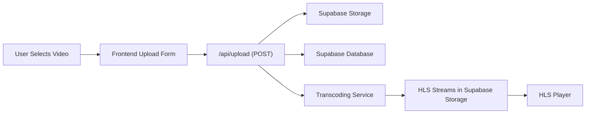
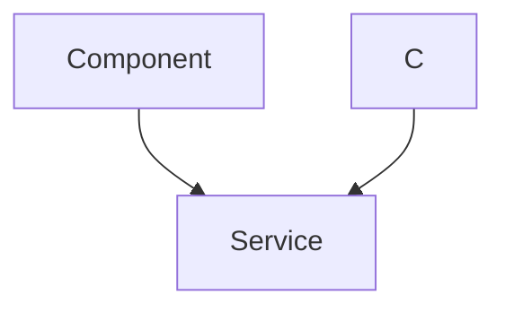

# Video Management

This section describes the video management process within Privio, encompassing video uploads, storage, transcoding, and retrieval. It outlines the workflow from the user uploading a video to its availability for streaming.

## Features

*   **Upload:** Users can upload video files through a dedicated upload page.
*   **Storage:** Uploaded videos are stored in Supabase storage.
*   **Transcoding:** Videos are transcoded into HLS format for adaptive bitrate streaming.
*   **Streaming:** HLS streams are served to users for playback.

## Stack

| Technology      | Purpose                                  |
| --------------- | ---------------------------------------- |
| Next.js         | Frontend framework, API routes           |
| React           | User interface library                   |
| Supabase        | Database and storage                     |
| HLS.js          | HLS streaming library                    |

## Video Upload Workflow

The upload process involves several steps, starting from the user selecting a video file to the video being processed and ready for streaming.

1.  **File Selection:** The user selects a video file from their device using the upload form.
2.  **Frontend Handling:** The frontend captures the file and associated metadata (title, description).
3.  **API Request:** The frontend sends a `POST` request to the `/api/upload` endpoint with the file and metadata as `FormData`.
4.  **Server-Side Processing:**
    *   The API route handles the file upload to Supabase storage.
    *   Metadata is saved to the Supabase database.
    *   A transcoding process is triggered.
5.  **Transcoding Service**: This service (external to the shown code) converts the uploaded video into multiple HLS streams (different bitrates).
6.  **HLS Packaging**: The transcoded streams and associated playlist files (.m3u8) are placed into Supabase storage.
7.  **Video Playback:**  The video can be played through HLS player.





## Code Snippets

### Upload API Route (`app/api/upload/route.ts`)

This route handles the video upload. It receives the file, stores it in Supabase storage, and saves metadata to the database.  It also triggers the transcoding process.

```typescript
import { NextResponse } from "next/server";
import { createClient } from "@supabase/supabase-js";
import { v4 as uuidv4 } from "uuid";

const supabase = createClient(
    process.env.NEXT_PUBLIC_SUPABASE_URL!,
    process.env.SUPABASE_SERVICE_ROLE_KEY!
);

export async function POST(req: Request) {
    try {
        const formData = await req.formData();
        const file = formData.get("file") as File;
        const title = formData.get("title") as string;
        const description = formData.get("description") as string;
        const userId = formData.get("userId") as string;

        if (!file) {
            return NextResponse.json({ error: "No file provided" }, { status: 400 });
        }
        const videoId = uuidv4();
        const filePath = `${videoId}.mp4`;

        const { error: uploadError } = await supabase.storage.from("raw_uploads").upload(filePath, file, {
            cacheControl: "3600",
            upsert: false
        })
        if (uploadError) {
            console.error("Upload error:", uploadError.message);
            return NextResponse.json({ error: "Failed to upload file" }, { status: 500 });
        }

        const { error: dbError } = await supabase.from("videos").insert([
            {
                id: videoId,
                title,
                description,
                uploader: userId,
                status: "uploaded",
                raw_path:filePath,
            }
        ]);
        if (dbError) {
            console.error("DB error:", dbError.message);
            return NextResponse.json({ error: "Failed to save video metadata" }, { status: 500 });
        }

        fetch(process.env.RENDER_TRANSCODE_URL!, {
            method: 'POST',
            headers: {
                'Content-Type': 'application/json',
            },
            body: JSON.stringify({ videoId: videoId }),
        }).catch(error => {
            console.error('Failed to trigger transcoding service:', error);
        });
        return NextResponse.json({ message: "Upload successful", videoId }, { status: 200 });

    } catch (e: unknown) {
    if (e instanceof Error) {
        console.log(e.message);
        return NextResponse.json({ error: e.message }, { status: 500 });
    }
    return NextResponse.json({ error: 'An unknown error occurred' }, { status: 500 });
}
}
```

[View on GitHub](https://github.com/gsgit123/privio/blob/main/app/api/upload/route.ts)

### Video Metadata Retrieval

The code below shows how video metadata is stored:
```json
{
    "id": "unique_video_id",
    "title": "My Awesome Video",
    "description": "A short summary of your video...",
    "uploader": "user_id",
    "status": "uploaded",
    "raw_path": "unique_video_id.mp4"
}
```

### HLS Playlist Route (`app/api/videos/[videoId]/route.ts`)

This route fetches the HLS playlist file (`.m3u8`) from Supabase storage and generates signed URLs for the `.ts` segments, allowing secure streaming.

```typescript
import { NextResponse, NextRequest } from "next/server";
import { createClient } from "@supabase/supabase-js";

export const dynamic = 'force-dynamic';

// Initialize Supabase admin client
const supaBaseAdmin = createClient(
  process.env.NEXT_PUBLIC_SUPABASE_URL!,
  process.env.SUPABASE_SERVICE_ROLE_KEY!
);

// eslint-disable-next-line @typescript-eslint/no-explicit-any
export async function GET(req: NextRequest, context: any) {
  // Cast params at runtime
  const { videoId } = context.params as { videoId: string };

  if (!videoId) {
    return new NextResponse('Missing videoId', { status: 400 });
  }

  const bucketName = 'hls';
  const folderPath = `${videoId}`;
  const manifestPath = `${folderPath}/playlist.m3u8`;

  const { data: playlistData, error: playlistError } = await supaBaseAdmin
    .storage
    .from(bucketName)
    .download(manifestPath);

  if (playlistError || !playlistData) {
    console.error("Error downloading playlist:", playlistError);
    return new NextResponse('Failed to download playlist', { status: 404 });
  }

  let playlistText = await playlistData.text();
  const tsFileNames = playlistText.split('\n').filter((line) => line.endsWith('.ts'));
  const tsFilePaths = tsFileNames.map(name => `${folderPath}/${name}`);

  if (tsFileNames.length === 0) {
    console.error("No .ts files found in playlist");
    return new NextResponse('No .ts files found in playlist', { status: 404 });
  }

  const { data: signedUrlsData, error: signError } = await supaBaseAdmin
    .storage
    .from(bucketName)
    .createSignedUrls(tsFilePaths, 3600);

  if (signError || !signedUrlsData) {
    console.error('Error signing URLs:', signError);
    return new NextResponse('Could not sign segment URLs', { status: 500 });
  }

  // Replace .ts filenames in playlist with signed URLs
  for (const signedUrl of signedUrlsData) {
    if(!signedUrl.path)continue;
    const fileName = signedUrl.path.split('/').pop();
    if (fileName) {
      playlistText = playlistText.replace(fileName, signedUrl.signedUrl);
    }
  }

  return new NextResponse(playlistText, {
    status: 200,
    headers: {
      'Content-Type': 'application/vnd.apple.mpegurl'
    }
  });
}
```

[View on GitHub](https://github.com/gsgit123/privio/blob/main/app/api/videos/%5BvideoId%5D/route.ts)

### Upload Page (`app/dashboard/upload/page.tsx`)

This component renders the upload form, handles file selection, and sends the upload request to the API route.

```typescript
"use client";

import { useState, FormEvent } from "react";
import { useRouter } from "next/navigation";
import Link from "next/link";
import { supabase } from "@/lib/client";

export default function UploadPage() {
  const router = useRouter();
  const [file, setFile] = useState<File | null>(null);
  const [title, setTitle] = useState("");
  const [description, setDescription] = useState("");
  const [loading, setLoading] = useState(false);
  const [statusMessage, setStatusMessage] = useState("");
  const [errorMessage, setErrorMessage] = useState("");

  const handleFileChange = (e: React.ChangeEvent<HTMLInputElement>) => {
    if (e.target.files && e.target.files.length > 0) {
      setFile(e.target.files[0]);
    }
  };

  const handleSubmit = async (e: FormEvent) => {
    e.preventDefault();
    if (!file) {
      setErrorMessage("Please select a video file to upload.");
      return;
    }
    setLoading(true);
    setStatusMessage("Uploading...");
    setErrorMessage("");
    const { data: { user } } = await supabase.auth.getUser();
    if (!user) {
        setErrorMessage("You must be logged in to upload.");
        setLoading(false);
        return;
    }

    const formData = new FormData();
    formData.append("file", file);
    formData.append("title", title);
    formData.append("description", description);
    formData .append("userId",user.id );

    try {
      const res = await fetch("/api/upload", {
        method: "POST",
        body: formData,
      });

      const data = await res.json();
      if (!res.ok) {
        throw new Error(data.error || "An unknown error occurred.");
      }
      
      setStatusMessage("Upload successful! Your video is now processing.");
      setTimeout(() => {
        router.push("/dashboard");
        router.refresh();
      }, 2000);

    } catch (err: unknown) {
      const errorMessage = err instanceof Error ? err.message : "An unknown error occurred.";
      setErrorMessage(`Upload failed: ${errorMessage}`);
      setStatusMessage("");
    } finally {
      setLoading(false);
    }
  };

  return (
    
      {/* Upload Form */}
      
    
  );
}
```

[View on GitHub](https://github.com/gsgit123/privio/blob/main/app/dashboard/upload/page.tsx)

### HLS Player Component (`components/HlsPlayer.tsx`)

This component uses the `hls.js` library to play HLS streams.  It handles adaptive bitrate streaming and provides video playback controls.

```typescript
import { useRef, useEffect } from "react";
import Hls from "hls.js";

export default function HlsPlayer({ url, onPlay, onPause, onEnded }: { 
  url: string; 
  onPlay?: () => void;
  onPause?: () => void;
  onEnded?: () => void;
}) {
  const videoRef = useRef<HTMLVideoElement>(null);

  useEffect(() => {
    const video = videoRef.current;
    if (!video) return;

    video.addEventListener('play', () => onPlay?.());
    video.addEventListener('pause', () => onPause?.());
    video.addEventListener('ended', () => onEnded?.());

    if (Hls.isSupported()) {
      const hls = new Hls();
      hls.loadSource(url);
      hls.attachMedia(video);
    } else if (video.canPlayType('application/vnd.apple.mpegurl')) {
      video.src = url;
    }
    
    return () => {
      video.removeEventListener('play', () => onPlay?.());
      video.removeEventListener('pause', () => onPause?.());
      video.removeEventListener('ended', () => onEnded?.());
    }
  }, [url, onPlay, onPause, onEnded]);
  
  return <video ref={videoRef} controls style={{ width: "100%" }} />;
}
```

[View on GitHub](https://github.com/gsgit123/privio/blob/main/components/HlsPlayer.tsx)

## Key Integration Points

*   **Supabase Integration:** Supabase is central to the video management system. It provides storage for the raw video files and HLS streams, as well as a database to store video metadata.
*   **API Routes:** Next.js API routes facilitate the communication between the frontend and backend services, handling video uploads, metadata storage, and HLS playlist retrieval.
*   **Transcoding Service:**  The transcoding service is a crucial component.  It needs to be reliable and efficient to ensure that videos are processed quickly and correctly.
*   **HLS Streaming:** HLS is used to enable adaptive bitrate streaming, providing a smooth playback experience across different network conditions and devices.  The signed URLs ensure secure video delivery.




