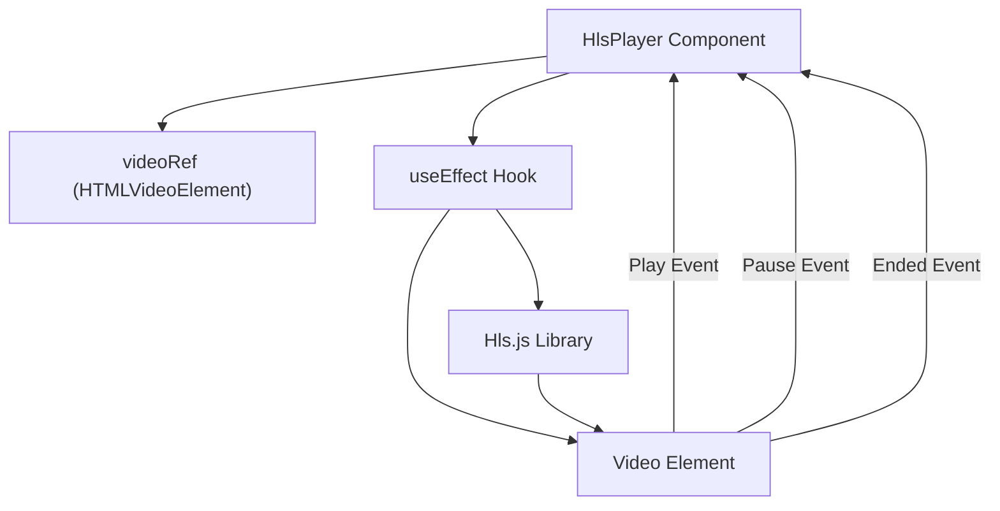
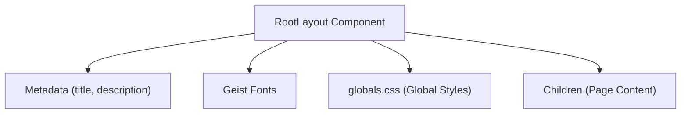

# Frontend Components

This document details the reusable frontend components and their usage within the Privio application. We focus on core elements like the `HlsPlayer` component, global styles defined in `app/globals.css`, and the root layout structure set up in `app/layout.tsx`.

## HlsPlayer Component

The `HlsPlayer` component is a React component responsible for playing video content using the HTTP Live Streaming (HLS) protocol. It leverages the `hls.js` library for browser support and provides callbacks for play, pause, and ended events.

```typescript
// components/HlsPlayer.tsx
import { useRef, useEffect } from "react";
import Hls from "hls.js";

export default function HlsPlayer({ url, onPlay, onPause, onEnded }: { 
  url: string; 
  onPlay?: () => void;
  onPause?: () => void;
  onEnded?: () => void;
}) {
  const videoRef = useRef<HTMLVideoElement>(null);

  useEffect(() => {
    const video = videoRef.current;
    if (!video) return;

    video.addEventListener('play', () => onPlay?.());
    video.addEventListener('pause', () => onPause?.());
    video.addEventListener('ended', () => onEnded?.());

    if (Hls.isSupported()) {
      const hls = new Hls();
      hls.loadSource(url);
      hls.attachMedia(video);
    } else if (video.canPlayType('application/vnd.apple.mpegurl')) {
      video.src = url;
    }
    
    return () => {
      video.removeEventListener('play', () => onPlay?.());
      video.removeEventListener('pause', () => onPause?.());
      video.removeEventListener('ended', () => onEnded?.());
    }
  }, [url, onPlay, onPause, onEnded]);
  
  return <video ref={videoRef} controls style={{ width: "100%" }} />;
}
```

This component accepts a video URL (`url`) as a prop and optional callback functions (`onPlay`, `onPause`, `onEnded`).  It uses a `ref` to access the video element and the `useEffect` hook to initialize the HLS player.  The `Hls.isSupported()` check determines whether the `hls.js` library should be used.  If not, it falls back to native HLS support if available.  Event listeners are added for play, pause, and ended events, triggering the corresponding callbacks.

[View on GitHub](https://github.com/gsgit123/privio/blob/main/components/HlsPlayer.tsx)





## Global Styles (`globals.css`)

The `app/globals.css` file defines the global styles for the Privio application using Tailwind CSS and custom CSS variables. It sets the default background and foreground colors, font families, and includes blueprint-inspired background effects.

```css
/* app/globals.css */
@import "tailwindcss";

:root {
  --background: #ffffff;
  --foreground: #171717;
}

@theme inline {
  --color-background: var(--background);
  --color-foreground: var(--foreground);
  --font-sans: var(--font-geist-sans);
  --font-mono: var(--font-geist-mono);
}

@media (prefers-color-scheme: dark) {
  :root {
    --background: #0a0a0a;
    --foreground: #ededed;
  }
}

body {
  background: var(--background);
  color: var(--foreground);
  font-family: Arial, Helvetica, sans-serif;
}

/* Blueprint Background Effects */
.blueprint-bg {
  background-color: #0a0a0a;
  overflow: hidden;
  position: relative;
}

.grid-lines {
  position: absolute;
  top: 0;
  left: 0;
  width: 100%;
  height: 100%;
  background-image:
    linear-gradient(to right, rgba(0, 128, 128, 0.2) 1px, transparent 1px),
    linear-gradient(to bottom, rgba(0, 128, 128, 0.2) 1px, transparent 1px);
  background-size: 50px 50px;
  animation: pan-grid 20s linear infinite;
}

.glow-line {
  position: absolute;
  top: 0;
  left: 0;
  width: 100%;
  height: 2px;
  background: linear-gradient(to right, transparent, teal, transparent);
  animation: scan-line 7s ease-in-out infinite;
  box-shadow: 0 0 10px teal, 0 0 20px teal;
}

@keyframes scan-line {
  0% { top: 0%; }
  50% { top: 99%; }
  100% { top: 0%; }
}

@keyframes pan-grid {
  0% { background-position: 0 0; }
  100% { background-position: 100px 100px; }
}
```

The `:root` selector defines CSS variables for background and foreground colors, allowing for easy customization and theme switching. The `@media (prefers-color-scheme: dark)` block provides a dark mode implementation.  The `blueprint-bg`, `grid-lines`, and `glow-line` classes create a visually appealing background effect with animated grid lines and a scanning glow.

[View on GitHub](https://github.com/gsgit123/privio/blob/main/app/globals.css)

```css
/* Blueprint Background Effects (Example) */
.blueprint-bg {
  background-color: #0a0a0a;
  overflow: hidden;
  position: relative;
}

.grid-lines {
  position: absolute;
  top: 0;
  left: 0;
  width: 100%;
  height: 100%;
  background-image:
    linear-gradient(to right, rgba(0, 128, 128, 0.2) 1px, transparent 1px),
    linear-gradient(to bottom, rgba(0, 128, 128, 0.2) 1px, transparent 1px);
  background-size: 50px 50px;
  animation: pan-grid 20s linear infinite;
}
```

The code snippet above highlights the blueprint background effects.  The `blueprint-bg` class sets the background color and prepares the element for absolute positioning of its children.  The `grid-lines` class creates the grid effect using a background image with linear gradients and applies a panning animation.

[View on GitHub](https://github.com/gsgit123/privio/blob/main/app/globals.css)

```css
/* Dark Mode Implementation */
@media (prefers-color-scheme: dark) {
  :root {
    --background: #0a0a0a;
    --foreground: #ededed;
  }
}
```

This code snippet shows the dark mode implementation, where the CSS variables are overridden when the user prefers a dark color scheme.

[View on GitHub](https://github.com/gsgit123/privio/blob/main/app/globals.css)

## Root Layout (`layout.tsx`)

The `app/layout.tsx` file defines the root layout for the Privio application, including the HTML structure, metadata, and font configuration. It uses Next.js's `Metadata` type to set the title and description for the application.  It also imports and configures the Geist Sans and Geist Mono fonts.

```typescript
// app/layout.tsx
import type { Metadata } from "next";
import { Geist, Geist_Mono } from "next/font/google";
import "./globals.css";


const geistSans = Geist({
  variable: "--font-geist-sans",
  subsets: ["latin"],
});

const geistMono = Geist_Mono({
  variable: "--font-geist-mono",
  subsets: ["latin"],
});

export const metadata: Metadata = {
  title: "Privio - Private Video Hosting",
  description: "Private and secure video hosting platform.",
};

export default function RootLayout({
  children,
}: Readonly<{
  children: React.ReactNode;
}>) {
  return (
    <html lang="en">
      <body
        className={`${geistSans.variable} ${geistMono.variable} antialiased`}
      >
    

        {children}
      </body>
    </html>
  );
}
```

The `RootLayout` component receives the `children` prop, which represents the content of the individual pages.  It adds the Geist Sans and Geist Mono font classes to the `body` element, ensuring that these fonts are applied to the entire application.  The `antialiased` class improves text rendering.

[View on GitHub](https://github.com/gsgit123/privio/blob/main/app/layout.tsx)

```typescript
// Font Configuration (Example)
import { Geist, Geist_Mono } from "next/font/google";

const geistSans = Geist({
  variable: "--font-geist-sans",
  subsets: ["latin"],
});

const geistMono = Geist_Mono({
  variable: "--font-geist-mono",
  subsets: ["latin"],
});
```

This snippet demonstrates the font configuration using `next/font/google`.  The `Geist` and `Geist_Mono` functions are used to import the fonts and assign CSS variables to them.

[View on GitHub](https://github.com/gsgit123/privio/blob/main/app/layout.tsx)





## Key Integration Points

*   **HlsPlayer and Video Playback:** The `HlsPlayer` component integrates with the video element and `hls.js` to handle video playback. The `url` prop dynamically provides the video source, and the callbacks allow for custom behavior on play, pause, and ended events.
*   **Theming and Styling:** The `globals.css` file provides global styles, including dark mode support. This file is imported into `layout.tsx`, ensuring styles are applied across the entire application.  Custom CSS variables enable centralized management of the application's theme.
*   **Layout and Structure:**  The `layout.tsx` file sets the foundational HTML structure for all pages. It handles font loading, metadata, and injecting the page content, providing a consistent user experience across the application.

Best practices: When using the `HlsPlayer` ensure that the video URL is correctly formatted and accessible. Use the `onPlay`, `onPause`, and `onEnded` callbacks to implement custom logic for tracking video interactions. For `globals.css`, leverage CSS variables for consistent styling and theming, and use meaningful class names for maintainability. Finally, ensure that all pages are correctly rendered within the `RootLayout` component to maintain a consistent layout and structure throughout the application.
```