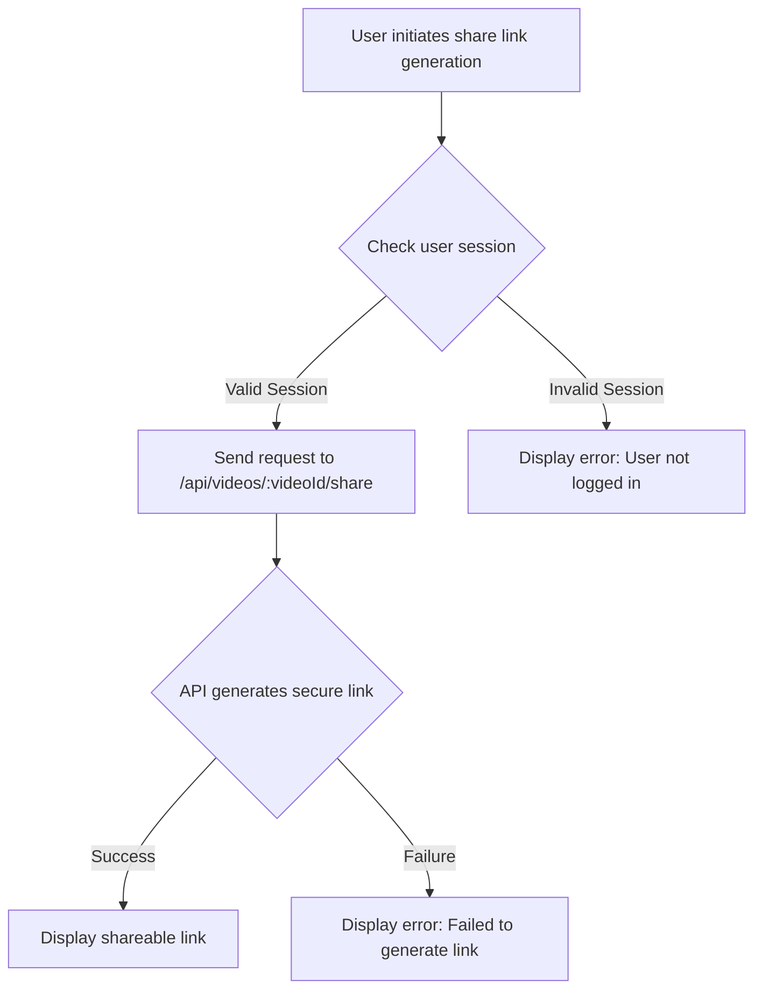
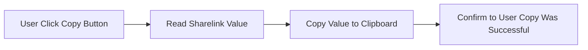

# Dashboard Functionality

This document details the various features available in the user dashboard of Privio, a private video sharing platform. The dashboard provides tools for video management, sharing, and analytics, empowering users to control their content and track its performance.

## Features

*   **Video Upload:** Users can upload new videos directly from their dashboard.
*   **Video Management:** Users can manage their uploaded videos, including options to share and view analytics.
*   **Secure Sharing:** Generate secure, time-limited share links for specific recipients.
*   **Analytics:** Track video views and unique viewers for uploaded content.

## Video Upload

The video upload feature allows users to easily add new content to their library. Here's the relevant code snippet from `app/dashboard/upload/page.tsx`:

```typescript
// File: app/dashboard/upload/page.tsx
const handleSubmit = async (e: FormEvent) => {
    e.preventDefault();
    if (!file) {
      setErrorMessage("Please select a video file to upload.");
      return;
    }
    setLoading(true);
    setStatusMessage("Uploading...");
    setErrorMessage("");
    const { data: { user } } = await supabase.auth.getUser();
    if (!user) {
        setErrorMessage("You must be logged in to upload.");
        setLoading(false);
        return;
    }

    const formData = new FormData();
    formData.append("file", file);
    formData.append("title", title);
    formData.append("description", description);
    formData .append("userId",user.id );

    try {
      const res = await fetch("/api/upload", {
        method: "POST",
        body: formData,
      });

      const data = await res.json();
      if (!res.ok) {
        throw new Error(data.error || "An unknown error occurred.");
      }
      
      setStatusMessage("Upload successful! Your video is now processing.");
      setTimeout(() => {
        router.push("/dashboard");
        router.refresh();
      }, 2000);

    } catch (err: unknown) {
      const errorMessage = err instanceof Error ? err.message : "An unknown error occurred.";
      setErrorMessage(`Upload failed: ${errorMessage}`);
      setStatusMessage("");
    } finally {
      setLoading(false);
    }
  };
```

This function handles the form submission, ensuring a file is selected, authenticating the user, and sending the file data to the `/api/upload` endpoint.  [View on GitHub](https://github.com/gsgit123/privio/blob/main/app/dashboard/upload/page.tsx)

## Video Management and Secure Sharing

The `app/dashboard/manage/[videoId]/page.tsx` file handles the secure sharing functionality. Users can generate unique, time-limited links to share their videos with specific individuals.

```typescript
// File: app/dashboard/manage/[videoId]/page.tsx
const handleGenerateLink = async () => {
    setLoading(true);
    setError("");
    setShareLink("");

    const { data: { session }, error: sessionError } = await supabase.auth.getSession();

    if (sessionError || !session) {
      setError("You must be logged in to share.");
      setLoading(false);
      return;
    }

    const response = await fetch(`/api/videos/${videoId}/share`, {
      method: 'POST',
      headers: {
        'Content-Type': 'application/json',
        'Authorization': `Bearer ${session.access_token}`
      },
      body: JSON.stringify({
        sharedWithEmail: email,
        expiresInMinutes: expiresInMinutes
      })
    });

    const data = await response.json();
    setLoading(false);

    if (!response.ok) {
      setError(data.error || "Failed to generate link.");
    } else {
      setShareLink(data.shareLink);
    }
  };
```

This function is responsible for generating a unique shareable link for a video. It authenticates the user via Supabase, then makes a POST request to the `/api/videos/${videoId}/share` endpoint to create a temporary, secured link for the video.  [View on GitHub](https://github.com/gsgit123/privio/blob/main/app/dashboard/manage/[videoId]/page.tsx)

The following Mermaid diagram illustrates the process of generating a shareable link:





## Video Analytics

The analytics feature provides insights into video performance, including total views and unique viewers. The `app/dashboard/analytics/[videoId]/page.tsx` file fetches and displays this data.

```typescript
// File: app/dashboard/analytics/[videoId]/page.tsx
useEffect(() => {
        if (!videoId) return;

        async function fetchAnalytics() {
            const { data: { session } } = await supabase.auth.getSession();
            if (!session) {
                setError("You must be logged in to view analytics.");
                setLoading(false);
                return;
            }

            try {
                const res = await fetch(`/api/analytics/${videoId}`, {
                    headers: {
                        'Authorization': `Bearer ${session.access_token}`
                    }
                });

                if (!res.ok) {
                    throw new Error("Failed to fetch analytics. You may not be the owner.");
                }

                const data = await res.json();
                setAnalytics(data.analytics);

            } catch (err: unknown) {
                if (err instanceof Error) {
                    setError(err.message);
                } else {
                    setError('An unknown error occurred');
                }
            } finally {
                setLoading(false);
            }
        }

        fetchAnalytics();
    }, [videoId]);
```

This `useEffect` hook fetches the analytics data for a specific video. It validates the user session via Supabase and retrieves analytics from the `/api/analytics/${videoId}` endpoint.  [View on GitHub](https://github.com/gsgit123/privio/blob/main/app/dashboard/analytics/[videoId]/page.tsx)

The code snippet below displays the analytics information in the UI.

```typescript
// File: app/dashboard/analytics/[videoId]/page.tsx
 <div className="grid grid-cols-1 md:grid-cols-2 gap-6 mb-8">
    <div className="bg-gray-900/50 border border-teal-900/30 rounded-lg p-6 backdrop-blur-sm">
        <div className="flex items-center gap-3">
            <div className="w-10 h-10 rounded-lg bg-teal-500/10 border border-teal-500/50 flex items-center justify-center">
                <Eye className="w-5 h-5 text-teal-400" />
            </div>
            <div>
                <p className="text-sm text-gray-400">Total Views</p>
                <p className="text-2xl font-bold text-teal-400">{totalViews}</p>
            </div>
        </div>
    </div>
    <div className="bg-gray-900/50 border border-purple-900/30 rounded-lg p-6 backdrop-blur-sm">
        <div className="flex items-center gap-3">
            <div className="w-10 h-10 rounded-lg bg-purple-500/10 border border-purple-500/50 flex items-center justify-center">
                <User className="w-5 h-5 text-purple-400" />
            </div>
            <div>
                <p className="text-sm text-gray-400">Unique Viewers</p>
                <p className="text-2xl font-bold text-purple-400">{uniqueViewers}</p>
            </div>
        </div>
    </div>
</div>
```

This code displays the total views and unique viewers in a grid layout with a nice UI/UX design.

## Dashboard Display

The main dashboard (`app/dashboard/page.tsx`) displays the user's uploaded videos, each with a thumbnail and links to manage and view analytics.

```typescript
// File: app/dashboard/page.tsx
return (
    <div className="min-h-screen bg-black text-white">
      {/* Animated Background */}
      {/* Navigation */}
      {/* Main Content */}
      <div className="relative p-8">
        <h2 className="text-2xl font-bold mb-6 bg-gradient-to-r from-teal-400 to-cyan-400 bg-clip-text text-transparent">
          Your Library
        </h2>

        {loading ? (
          <div className="flex items-center justify-center py-20">
            <div className="animate-spin rounded-full h-12 w-12 border-4 border-teal-500 border-t-transparent"></div>
          </div>
        ) : videos.length > 0 ? (
          <div className="grid grid-cols-1 sm:grid-cols-2 md:grid-cols-3 lg:grid-cols-4 gap-6">
            {videos.map((video) => {
              const thumbnailUrl = getThumbnailUrl(video.thumbnail_path);
              const isReady = video.status === 'ready';

              const handleCardClick = () => {
                if (isReady) {
                  router.push(`/dashboard/watch/${video.id}`);
                } else {
                  alert('This video is still processing. Please wait until the status is "ready".');
                }
              };
             return (
                <div
                  key={video.id}
                  onClick={handleCardClick}
                  className={`rounded-lg border overflow-hidden transition-all duration-300 ${
                    isReady 
                      ? 'border-teal-900/50 bg-gray-900/50 hover:border-teal-500/50 hover:shadow-lg hover:shadow-teal-500/20 cursor-pointer' 
                      : 'border-yellow-900/30 bg-gray-900/30 opacity-60 cursor-not-allowed'
                  }`}
                >
                  {/* Thumbnail */}
                 {/* Status Badge */}

                  {/* Content */}

                    <Link
                        href={`/dashboard/manage/${video.id}`}
                        className="text-cyan-400 hover:underline"
                        onClick={(e) => e.stopPropagation()}
                      >
                        Manage & Share
                      </Link>
                      <span className="text-gray-600">•</span>
                      <Link
                        href={`/dashboard/analytics/${video.id}`}
                        className="text-purple-400 hover:underline"
                        onClick={(e) => e.stopPropagation()}
                      >
                        Analytics
                      </Link>

                  </div>
                </div>
              );
            })}
          </div>
        ) : (
          <div className="text-center py-20">
            <p className="text-gray-400 mb-4">
              You haven&apos;t uploaded any videos yet.
            </p>
            <Link 
              href="/dashboard/upload"
              className="inline-block rounded-lg bg-gradient-to-r from-teal-500 to-cyan-500 px-6 py-3 font-semibold text-white hover:shadow-lg hover:shadow-teal-500/30"
            >
              Upload Your First Video
            </Link>
          </div>
        )}
      </div>
    </div>
  );
```

This code renders a grid of video cards, each displaying a video's thumbnail, title, and status, along with links to manage the video and view its analytics.  [View on GitHub](https://github.com/gsgit123/privio/blob/main/app/dashboard/page.tsx)

## Authentication and Redirection

```typescript
// File: app/dashboard/page.tsx
useEffect(() => {
    const getUserAndVideos = async () => {
      const { data: { user } } = await supabase.auth.getUser();
      if (!user) {
        router.push("/");
      } else {
        setUser(user);
        const { data: userVideos, error } = await supabase
          .from("videos")
          .select("id, title, status, thumbnail_path")
          .eq("uploader", user.id)
          .order("created_at", { ascending: false });

        if (error) {
          console.error("Error fetching videos:", error);
        } else {
          setVideos(userVideos);
        }
        setLoading(false);
      }
    };
    getUserAndVideos();
  }, [router]);
```

This `useEffect` hook ensures that only authenticated users can access the dashboard. If no user is found, the hook redirects them to the login page. Otherwise, it fetches the user's videos.

## Key Integration Points

*   **Supabase Authentication:**  Supabase is used throughout the dashboard for user authentication and data storage. All API requests require a valid user session.
*   **API Endpoints:** The dashboard interacts with several API endpoints, including `/api/upload`, `/api/videos/:videoId/share`, and `/api/analytics/:videoId`. These endpoints handle video uploads, secure link generation, and analytics data retrieval.
*   **Next.js Routing:** Next.js is used for routing and navigation within the dashboard. The `useRouter` hook is used to redirect users to different pages.

## Best Practices

*   **Secure Authentication:** Always validate user sessions before granting access to dashboard features. This ensures that only authorized users can upload, manage, and share videos.
*   **Error Handling:** Implement comprehensive error handling to gracefully handle potential issues such as network errors, invalid user input, and server-side exceptions.
*   **Asynchronous Operations:** Use asynchronous functions and loading indicators to prevent the UI from freezing during long-running operations such as file uploads and data fetching.
*   **Data Validation:** Validate all user input to prevent security vulnerabilities and ensure data integrity.

## Additional Code Snippet
```typescript
// File: app/dashboard/upload/page.tsx
 <input
    id="file-upload" 
    name="file-upload" 
    type="file" 
    className="sr-only" 
    onChange={handleFileChange} 
    accept="video/mp4,video/webm,video/quicktime" 
/>
```

This code renders the file selection input within the upload form. The `accept` attribute restricts the file types to video files. [View on GitHub](https://github.com/gsgit123/privio/blob/main/app/dashboard/upload/page.tsx)

## Additional Code Snippet

```typescript
// File: app/dashboard/manage/[videoId]/page.tsx
  const handleCopy = () => {
    navigator.clipboard.writeText(shareLink);
    setCopied(true);
    setTimeout(() => setCopied(false), 2000);
  };
```
This function allows you to copy the generate sharelink to your clipboard. [View on GitHub](https://github.com/gsgit123/privio/blob/main/app/dashboard/manage/[videoId]/page.tsx)




