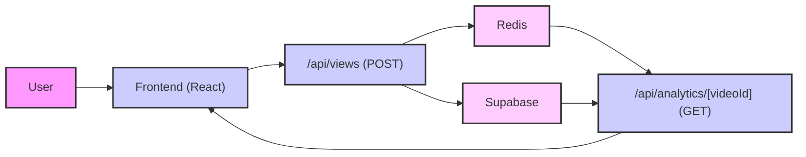

# Analytics and Reporting

This section describes the analytics data tracked by Privio and the reporting features available to users. Privio provides insights into video viewership, allowing content creators to understand their audience better and optimize their content strategy.

## Features

*   **Real-time View Tracking:** Privio tracks video views in real-time using Redis to store and update view counts.
*   **Unique Viewer Identification:** The system identifies unique viewers based on their email addresses, providing a more accurate understanding of audience engagement.
*   **Last Viewed Timestamp:** Privio records the timestamp of the last view for each user, enabling creators to understand when their content is most engaging.
*   **Comprehensive Dashboard:** A user-friendly dashboard displays analytics data, including total views, unique viewers, and a detailed breakdown of viewer activity.

## Data Tracking

Privio uses a combination of Redis and Supabase to track and store analytics data. Redis provides fast, in-memory data storage for real-time view counts, while Supabase stores user and video information.

### Redis Keys

*   `views:count:{videoId}`: A Redis hash that stores the number of views for a given video, keyed by the viewer's email address.
*   `views:lastView:{videoId}`: A Redis sorted set that stores the timestamp of the last view for each viewer, allowing for sorting by most recent activity.

## Code Snippets

### Incrementing View Count

This code snippet demonstrates how Privio increments the view count for a video when a user views it. It uses Redis to store and update the view count in real-time.

```typescript filename="app/api/views/route.ts"
import { NextResponse } from 'next/server';
import { createClient } from '@supabase/supabase-js';
import { Redis } from '@upstash/redis';

export const dynamic = 'force-dynamic';

const redis = new Redis({
  url: process.env.UPSTASH_REDIS_REST_URL!,
  token: process.env.UPSTASH_REDIS_REST_TOKEN!,
});


export async function POST(req:Request){
    const {videoId}=await req.json();


    const authHeader = req.headers.get('Authorization');
    const accessToken = authHeader?.split(' ')[1];

    if (!accessToken) {
        return new NextResponse('Unauthorized', { status: 401 });
    }

    const supabase = createClient(
        process.env.NEXT_PUBLIC_SUPABASE_URL!,
        process.env.NEXT_PUBLIC_SUPABASE_ANON_KEY!
    );

    const { data: { user } } = await supabase.auth.getUser(accessToken);
    if (!user) {
        return new NextResponse('Unauthorized', { status: 401 });
    }

    if (!videoId) {
        return new NextResponse('videoId is required', { status: 400 });
    }

    console.log(user);

    const timestamp = Date.now();

    const userViewCountKey=`views:count:${videoId}`;
    const lastViewTimestampKey =`views:lastView:${videoId}`;

    const multi =redis.multi();
    multi.hincrby(userViewCountKey, user.email!, 1);
    multi.zadd(lastViewTimestampKey, { score: timestamp, member: user.email! })
    await multi.exec();


    return NextResponse.json({ success:true,message: 'View count incremented' });

    
}
```

[View on GitHub](https://github.com/gsgit123/privio/blob/main/app/api/views/route.ts)

### Fetching Analytics Data

This code snippet shows how Privio fetches analytics data for a specific video. It retrieves the view counts and last viewed timestamps from Redis and returns them as a JSON response.

```typescript filename="app/api/analytics/[videoId]/route.ts"
import { NextRequest, NextResponse } from "next/server";
import { createClient } from "@supabase/supabase-js";
import { Redis } from "@upstash/redis";

export const dynamic = "force-dynamic";

const redis = new Redis({
  url: process.env.UPSTASH_REDIS_REST_URL!,
  token: process.env.UPSTASH_REDIS_REST_TOKEN!,
});

// eslint-disable-next-line @typescript-eslint/no-explicit-any
export async function GET(req: NextRequest, context: any) {
  // cast params to the expected type
  const { videoId } = context.params as { videoId: string };

  const authHeader = req.headers.get("Authorization");
  const accessToken = authHeader?.split(" ")[1];
  if (!accessToken) return new NextResponse("Unauthorized", { status: 401 });

  const supabase = createClient(
    process.env.NEXT_PUBLIC_SUPABASE_URL!,
    process.env.NEXT_PUBLIC_SUPABASE_ANON_KEY!,
    {
      global: {
        headers: { Authorization: `Bearer ${accessToken}` },
      },
    }
  );

  const { data: { user } } = await supabase.auth.getUser(accessToken);
  if (!user) return new NextResponse("Unauthorized", { status: 401 });

  const { data: video } = await supabase
    .from("videos")
    .select("id")
    .eq("id", videoId)
    .eq("uploader", user.id)
    .single();

  if (!video) return new NextResponse("Forbidden", { status: 403 });

  const userViewCountKey = `views:count:${videoId}`;
  const lastViewTimestampKey = `views:lastView:${videoId}`;

  const userViewCounts = await redis.hgetall(userViewCountKey);

  const analyticsData: { viewer: string; totalViews: number; lastViewed: string }[] = [];

  if (userViewCounts) {
    for (const [email, count] of Object.entries(userViewCounts)) {
      const lastViewScore = await redis.zscore(lastViewTimestampKey, email);
      analyticsData.push({
        viewer: email,
        totalViews: Number(count),
        lastViewed: lastViewScore ? new Date(Number(lastViewScore)).toLocaleString() : "N/A",
      });
    }
  }

  analyticsData.sort(
    (a, b) => new Date(b.lastViewed).getTime() - new Date(a.lastViewed).getTime()
  );

  return NextResponse.json({ analytics: analyticsData });
}
```

[View on GitHub](https://github.com/gsgit123/privio/blob/main/app/api/analytics/%5BvideoId%5D/route.ts)

### Analytics Dashboard Page

This code snippet displays the analytics data in a user-friendly format. It fetches the analytics data from the API and displays it in a table with total views and unique viewers.

```typescript filename="app/dashboard/analytics/[videoId]/page.tsx"
"use client";

import { useParams } from "next/navigation";
import { useEffect, useState } from "react";
import { supabase } from "@/lib/client";
import Link from "next/link";
import { BarChart3, Eye, Clock, User } from "lucide-react";

type AnalyticsData = {
    viewer: string;
    totalViews: number;
    lastViewed: string;
};

export default function AnalyticsPage() {
    const params = useParams();
    const videoId = params.videoId as string;

    const [analytics, setAnalytics] = useState<AnalyticsData[]>([]);
    const [loading, setLoading] = useState(true);
    const [error, setError] = useState<string | null>(null);

    useEffect(() => {
        if (!videoId) return;

        async function fetchAnalytics() {
            const { data: { session } } = await supabase.auth.getSession();
            if (!session) {
                setError("You must be logged in to view analytics.");
                setLoading(false);
                return;
            }

            try {
                const res = await fetch(`/api/analytics/${videoId}`, {
                    headers: {
                        'Authorization': `Bearer ${session.access_token}`
                    }
                });

                if (!res.ok) {
                    throw new Error("Failed to fetch analytics. You may not be the owner.");
                }

                const data = await res.json();
                setAnalytics(data.analytics);

            } catch (err: unknown) {
                if (err instanceof Error) {
                    setError(err.message);
                } else {
                    setError('An unknown error occurred');
                }
            } finally {
                setLoading(false);
            }
        }

        fetchAnalytics();
    }, [videoId]);

    const totalViews = analytics.reduce((sum, data) => sum + data.totalViews, 0);
    const uniqueViewers = analytics.length;

    return (
        <div className="min-h-screen bg-black text-white">
            {/* Background Grid */}
            <div className="fixed inset-0 opacity-10">
                <div 
                    className="absolute inset-0"
                    style={{
                        backgroundImage: 'linear-gradient(to right, rgba(0, 128, 128, 0.3) 1px, transparent 1px), linear-gradient(to bottom, rgba(0, 128, 128, 0.3) 1px, transparent 1px)',
                        backgroundSize: '50px 50px'
                    }}
                />
            </div>

            {/* Navigation */}
            <nav className="relative border-b border-teal-900/30 bg-gray-900 backdrop-blur-sm">
                <div className="flex items-center justify-between px-6 py-4">
                    <Link href="/dashboard" className="text-xl font-bold tracking-wider text-teal-400 uppercase">
                        Privio
                    </Link>
                    <Link 
                        href="/dashboard" 
                        className="text-sm text-gray-400 hover:text-teal-400"
                    >
                        ← Back to Dashboard
                    </Link>
                </div>
            </nav>

            {/* Main Content */}
            <div className="relative p-8">
                <div className="max-w-6xl mx-auto">
                    {/* Header */}
                    <div className="flex items-center gap-3 mb-8">
                    
                        <h1 className="text-3xl font-bold text-purple-400">Video Analytics</h1>
                    </div>

                    {loading ? (
                        <div className="flex items-center justify-center py-20">
                            <div className="text-center">
                                <div className="animate-spin rounded-full h-12 w-12 border-4 border-teal-500 border-t-transparent mx-auto mb-4"></div>
                                <p className="text-gray-400">Loading analytics...</p>
                            </div>
                        </div>
                    ) : error ? (
                        <div className="text-center py-20">
                            <div className="mb-4 inline-block p-4 rounded-full bg-red-500/10 border border-red-500/50">
                                <svg className="w-12 h-12 text-red-400" fill="none" viewBox="0 0 24 24" stroke="currentColor">
                                    <path strokeLinecap="round" strokeLinejoin="round" strokeWidth={2} d="M12 9v2m0 4h.01m-6.938 4h13.856c1.54 0 2.502-1.667 1.732-3L13.732 4c-.77-1.333-2.694-1.333-3.464 0L3.34 16c-.77 1.333.192 3 1.732 3z" />
                                </svg>
                            </div>
                            <p className="text-red-400 text-lg">{error}</p>
                        </div>
                    ) : (
                        <>
                            {/* Stats Cards */}
                            <div className="grid grid-cols-1 md:grid-cols-2 gap-6 mb-8">
                                <div className="bg-gray-900/50 border border-teal-900/30 rounded-lg p-6 backdrop-blur-sm">
                                    <div className="flex items-center gap-3">
                                        <div className="w-10 h-10 rounded-lg bg-teal-500/10 border border-teal-500/50 flex items-center justify-center">
                                            <Eye className="w-5 h-5 text-teal-400" />
                                        </div>
                                        <div>
                                            <p className="text-sm text-gray-400">Total Views</p>
                                            <p className="text-2xl font-bold text-teal-400">{totalViews}</p>
                                        </div>
                                    </div>
                                </div>
                                <div className="bg-gray-900/50 border border-purple-900/30 rounded-lg p-6 backdrop-blur-sm">
                                    <div className="flex items-center gap-3">
                                        <div className="w-10 h-10 rounded-lg bg-purple-500/10 border border-purple-500/50 flex items-center justify-center">
                                            <User className="w-5 h-5 text-purple-400" />
                                        </div>
                                        <div>
                                            <p className="text-sm text-gray-400">Unique Viewers</p>
                                            <p className="text-2xl font-bold text-purple-400">{uniqueViewers}</p>
                                        </div>
                                    </div>
                                </div>
                            </div>

                            {/* Table */}
                            <div className="bg-gray-900/50 border border-teal-900/30 rounded-lg overflow-hidden backdrop-blur-sm">
                                <table className="w-full text-left">
                                    <thead className="bg-gray-950/50 border-b border-teal-900/30">
                                        <tr>
                                            <th className="p-4 font-semibold text-gray-300">
                                                <div className="flex items-center gap-2">
                                                    <User className="w-4 h-4" />
                                                    Viewer
                                                </div>
                                            </th>
                                            <th className="p-4 font-semibold text-gray-300 text-center">
                                                <div className="flex items-center justify-center gap-2">
                                                    <Eye className="w-4 h-4" />
                                                    Total Views
                                                </div>
                                            </th>
                                            <th className="p-4 font-semibold text-gray-300">
                                                <div className="flex items-center gap-2">
                                                    <Clock className="w-4 h-4" />
                                                    Last Viewed
                                                </div>
                                            </th>
                                        </tr>
                                    </thead>
                                    <tbody>
                                        {analytics.length > 0 ? (
                                            analytics.map((data) => (
                                                <tr key={data.viewer} className="border-t border-teal-900/20 hover:bg-gray-950/30">
                                                    <td className="p-4 text-gray-300">{data.viewer}</td>
                                                    <td className="p-4 text-center">
                                                        <span className="inline-block px-3 py-1 rounded-full bg-teal-500/10 border border-teal-500/50 text-teal-400 font-semibold">
                                                            {data.totalViews}
                                                        </span>
                                                    </td>
                                                    <td className="p-4 text-gray-400">{data.lastViewed}</td>
                                                </tr>
                                            ))
                                        ) : (
                                            <tr>
                                                <td colSpan={3} className="text-center p-12">
                                                    <div className="text-gray-500">
                                                        <Eye className="w-12 h-12 mx-auto mb-3 opacity-50" />
                                                        <p>No views recorded for this video yet.</p>
                                                    </div>
                                                </td>
                                            </tr>
                                        )}
                                    </tbody>
                                </table>
                            </div>
                        </>
                    )}
                </div>
            </div>
        </div>
    );
}
```

[View on GitHub](https://github.com/gsgit123/privio/blob/main/app/dashboard/analytics/%5BvideoId%5D/page.tsx)

### Supabase Authentication

This code snippet shows how Privio authenticates users using Supabase. It retrieves the user's session from Supabase and uses it to authorize access to the analytics data.

```typescript filename="app/api/analytics/[videoId]/route.ts"
import { NextRequest, NextResponse } from "next/server";
import { createClient } from "@supabase/supabase-js";
import { Redis } from "@upstash/redis";

export const dynamic = "force-dynamic";

const redis = new Redis({
  url: process.env.UPSTASH_REDIS_REST_URL!,
  token: process.env.UPSTASH_REDIS_REST_TOKEN!,
});

// eslint-disable-next-line @typescript-eslint/no-explicit-any
export async function GET(req: NextRequest, context: any) {
  // cast params to the expected type
  const { videoId } = context.params as { videoId: string };

  const authHeader = req.headers.get("Authorization");
  const accessToken = authHeader?.split(" ")[1];
  if (!accessToken) return new NextResponse("Unauthorized", { status: 401 });

  const supabase = createClient(
    process.env.NEXT_PUBLIC_SUPABASE_URL!,
    process.env.NEXT_PUBLIC_SUPABASE_ANON_KEY!,
    {
      global: {
        headers: { Authorization: `Bearer ${accessToken}` },
      },
    }
  );

  const { data: { user } } = await supabase.auth.getUser(accessToken);
  if (!user) return new NextResponse("Unauthorized", { status: 401 });

  const { data: video } = await supabase
    .from("videos")
    .select("id")
    .eq("id", videoId)
    .eq("uploader", user.id)
    .single();

  if (!video) return new NextResponse("Forbidden", { status: 403 });

  const userViewCountKey = `views:count:${videoId}`;
  const lastViewTimestampKey = `views:lastView:${videoId}`;

  const userViewCounts = await redis.hgetall(userViewCountKey);

  const analyticsData: { viewer: string; totalViews: number; lastViewed: string }[] = [];

  if (userViewCounts) {
    for (const [email, count] of Object.entries(userViewCounts)) {
      const lastViewScore = await redis.zscore(lastViewTimestampKey, email);
      analyticsData.push({
        viewer: email,
        totalViews: Number(count),
        lastViewed: lastViewScore ? new Date(Number(lastViewScore)).toLocaleString() : "N/A",
      });
    }
  }

  analyticsData.sort(
    (a, b) => new Date(b.lastViewed).getTime() - new Date(a.lastViewed).getTime()
  );

  return NextResponse.json({ analytics: analyticsData });
}
```

[View on GitHub](https://github.com/gsgit123/privio/blob/main/app/api/analytics/%5BvideoId%5D/route.ts)

### Redis Configuration

This code snippet shows how Privio configures the Redis client. It uses environment variables to store the Redis URL and token.

```typescript filename="app/api/views/route.ts"
import { NextResponse } from 'next/server';
import { createClient } from '@supabase/supabase-js';
import { Redis } from '@upstash/redis';

export const dynamic = 'force-dynamic';

const redis = new Redis({
  url: process.env.UPSTASH_REDIS_REST_URL!,
  token: process.env.UPSTASH_REDIS_REST_TOKEN!,
});


export async function POST(req:Request){
    const {videoId}=await req.json();


    const authHeader = req.headers.get('Authorization');
    const accessToken = authHeader?.split(' ')[1];

    if (!accessToken) {
        return new NextResponse('Unauthorized', { status: 401 });
    }

    const supabase = createClient(
        process.env.NEXT_PUBLIC_SUPABASE_URL!,
        process.env.NEXT_PUBLIC_SUPABASE_ANON_KEY!
    );

    const { data: { user } } = await supabase.auth.getUser(accessToken);
    if (!user) {
        return new NextResponse('Unauthorized', { status: 401 });
    }

    if (!videoId) {
        return new NextResponse('videoId is required', { status: 400 });
    }

    console.log(user);

    const timestamp = Date.now();

    const userViewCountKey=`views:count:${videoId}`;
    const lastViewTimestampKey =`views:lastView:${videoId}`;

    const multi =redis.multi();
    multi.hincrby(userViewCountKey, user.email!, 1);
    multi.zadd(lastViewTimestampKey, { score: timestamp, member: user.email! })
    await multi.exec();


    return NextResponse.json({ success:true,message: 'View count incremented' });

    
}
```

[View on GitHub](https://github.com/gsgit123/privio/blob/main/app/api/views/route.ts)

## Data Flow





## Key Integration Points

*   **Real-time updates:**  The use of Redis ensures that view counts are updated in real-time, providing creators with the most up-to-date information about their content's performance.
*   **User authentication:** Supabase is used to authenticate users and ensure that only authorized users can access analytics data. This protects user privacy and prevents unauthorized access to sensitive information.
*   **API endpoints:**  The `/api/views` and `/api/analytics/[videoId]` API endpoints provide a clean and consistent interface for accessing and updating analytics data. This makes it easy to integrate the analytics features into other parts of the application.

## Best Practices

*   **Secure API endpoints:** Protect API endpoints with authentication and authorization to prevent unauthorized access to analytics data.
*   **Optimize Redis queries:** Use efficient Redis queries to minimize latency and ensure that analytics data is retrieved quickly.
*   **Handle errors gracefully:** Implement error handling to prevent the application from crashing when errors occur. Display user-friendly error messages to help users troubleshoot problems.
```