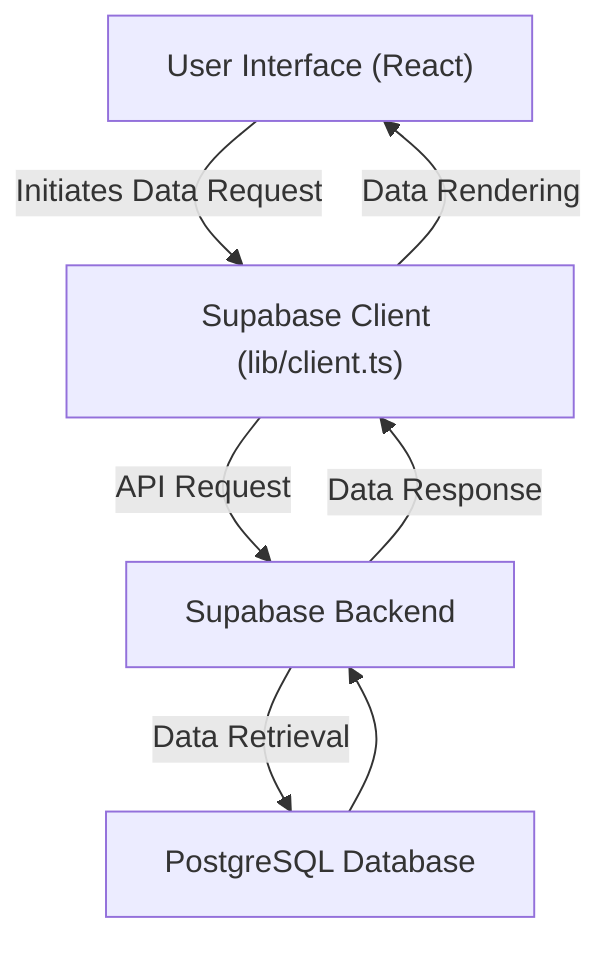

# Client-Side Utilities

This document details the client-side functions and libraries used within the Privio application.  These utilities are primarily responsible for handling interactions within the user's browser and communicating with the backend services.

## Core Client-Side Library: `lib/client.ts`

The `lib/client.ts` file is the central location for client-side setup and initialization. Currently, it focuses on setting up the Supabase client for browser-based interactions.

```typescript filename="lib/client.ts"
// lib/client.ts
import { createBrowserClient } from "@supabase/ssr";

export const supabase = createBrowserClient(
  process.env.NEXT_PUBLIC_SUPABASE_URL!,
  process.env.NEXT_PUBLIC_SUPABASE_ANON_KEY!
);
```

[View on GitHub](https://github.com/gsgit123/privio/blob/main/lib/client.ts)

This snippet initializes the Supabase client using environment variables. `createBrowserClient` is used because the code is running within a browser environment. The URL and anonymous key are critical for authentication and authorization with the Supabase backend.  Using `!` asserts that these environment variables are defined.

## Key Features and Libraries

*   **Supabase Client:** The core library for interacting with the Supabase backend from the client-side.  It handles authentication, data fetching, and real-time updates.

*   **Environment Variables:**  `NEXT_PUBLIC_SUPABASE_URL` and `NEXT_PUBLIC_SUPABASE_ANON_KEY` are used to configure the Supabase client. These are exposed to the browser environment, allowing the client-side code to connect to the correct Supabase instance.

## Environment Variable Configuration

It's essential to configure the environment variables correctly for the client to function.  Here's an example of how these variables might be defined in a `.env.local` file:

```plaintext filename=".env.local"
NEXT_PUBLIC_SUPABASE_URL=your_supabase_url
NEXT_PUBLIC_SUPABASE_ANON_KEY=your_supabase_anon_key
```

[View on GitHub](https://github.com/gsgit123/privio/blob/main/.env.example) (Example only - actual values should be secure)

**Important:**  Never commit your actual Supabase URL and ANON key directly to your repository.  Use environment variables and ensure your `.env.local` file is included in your `.gitignore`.  Also, note the `NEXT_PUBLIC_` prefix. This prefix is important for Next.js to expose these variables to the client-side code.

## Data Fetching Example

Here's an example of how to fetch data using the Supabase client within a React component:

```typescript filename="components/SomeComponent.tsx"
import { useEffect, useState } from 'react';
import { supabase } from '../lib/client';

function SomeComponent() {
  const [data, setData] = useState<any>(null);
  const [loading, setLoading] = useState<boolean>(true);

  useEffect(() => {
    async function fetchData() {
      try {
        const { data, error } = await supabase
          .from('your_table')
          .select('*');

        if (error) {
          console.error("Error fetching data:", error);
        } else {
          setData(data);
        }
      } finally {
        setLoading(false);
      }
    }

    fetchData();
  }, []);

  if (loading) {
    return <p>Loading...</p>;
  }

  return (
    <div>
      {data && JSON.stringify(data)}
    </div>
  );
}

export default SomeComponent;
```

[View on GitHub](https://github.com/gsgit123/privio/blob/main/TODO) (Replace with a relevant file if available)

This component demonstrates fetching data from a Supabase table named `your_table`.  It uses `useEffect` to perform the data fetching when the component mounts. The `useState` hook is used to manage the loading state and the fetched data.

## Authentication Example

Here’s an example of how to implement user sign-in using the Supabase client:

```typescript filename="components/Auth.tsx"
import { useState } from 'react';
import { supabase } from '../lib/client';

function Auth() {
  const [email, setEmail] = useState('');
  const [password, setPassword] = useState('');

  async function handleSignIn() {
    const { error } = await supabase.auth.signInWithPassword({
      email: email,
      password: password,
    });

    if (error) {
      console.error('Error signing in:', error.message);
    } else {
      // Handle successful sign-in (e.g., redirect)
      console.log('Signed in successfully!');
    }
  }

  return (
    <div>
      <input
        type="email"
        placeholder="Email"
        value={email}
        onChange={(e) => setEmail(e.target.value)}
      />
      <input
        type="password"
        placeholder="Password"
        value={password}
        onChange={(e) => setPassword(e.target.value)}
      />
      <button onClick={handleSignIn}>Sign In</button>
    </div>
  );
}

export default Auth;
```

[View on GitHub](https://github.com/gsgit123/privio/blob/main/TODO) (Replace with a relevant file if available)

This component handles user authentication using Supabase's `signInWithPassword` method.  It captures the user's email and password from input fields and attempts to sign them in. Error handling is implemented to catch and display any sign-in errors.

## Real-time Updates

Supabase provides real-time updates using WebSockets.  Here's a conceptual example of how you might subscribe to changes in a table:

```typescript filename="components/RealtimeComponent.tsx"
import { useEffect } from 'react';
import { supabase } from '../lib/client';

function RealtimeComponent() {
  useEffect(() => {
    const channel = supabase
      .channel('any')
      .on(
        'postgres_changes',
        { event: '*', schema: 'public', table: 'your_table' },
        (payload) => {
          console.log('Change received!', payload);
          // Handle the real-time update
        }
      )
      .subscribe();

    return () => {
      supabase.removeChannel(channel);
    };
  }, []);

  return <p>Listening for real-time updates...</p>;
}

export default RealtimeComponent;
```

[View on GitHub](https://github.com/gsgit123/privio/blob/main/TODO) (Replace with a relevant file if available)

This component subscribes to changes in the `your_table` table within the `public` schema.  Any insert, update, or delete operation on that table will trigger the callback function, allowing the client to update its UI in real-time.  The `unsubscribe` function is crucial to prevent memory leaks.

## Error Handling

Proper error handling is important for a robust application.  Wrap Supabase calls in `try...catch` blocks to handle potential errors.  Log errors to the console or display user-friendly messages. Example in `Data Fetching Example` above.

## Data Flow Diagram





This diagram illustrates the basic data flow within the application, from the user interface to the Supabase backend and back.

## Key Integration Points

*   **Component Initialization:** The Supabase client, initialized in `lib/client.ts`, is imported into React components.
*   **Data Fetching and Manipulation:** React components use the Supabase client to fetch data, perform CRUD operations, and subscribe to real-time updates.
*   **Authentication:** Components use the Supabase client to handle user authentication, including sign-in, sign-up, and password recovery.

## Best Practices

*   **Secure Environment Variables:**  Never expose your Supabase URL and ANON key directly in your code.  Use environment variables and secure storage mechanisms.
*   **Error Handling:**  Implement robust error handling to gracefully handle potential issues with Supabase calls.
*   **Real-time Updates:**  Use real-time updates to provide a responsive and engaging user experience.
*   **Data Validation:** Validate data on both the client-side and server-side to ensure data integrity.
*   **Authentication:** Use secure authentication methods to protect user data.
```