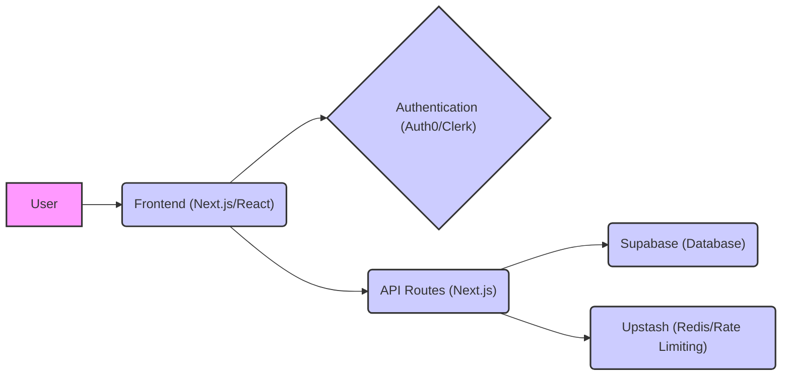
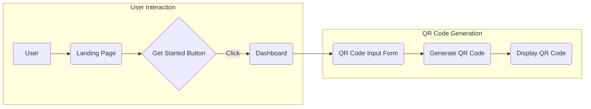

# Project Overview

QRly is a web application designed to simplify the process of creating and managing QR codes. It provides users with a user-friendly interface to generate QR codes and track their usage through real-time analytics. The application is built using Next.js, React, and leverages various services such as Supabase, Auth0/Clerk for authentication, and Upstash for rate limiting and Redis integration.

## Features

- **QR Code Generation:** Easily create QR codes from URLs or text.
- **Real-time Analytics:** Track the performance of your QR codes.
- **User Authentication:** Secure access with Auth0/Clerk integration.
- **Rate Limiting:** Protect the application from abuse using Upstash.
- **Customization:** Tailor QR codes to match your brand (future feature).

## Technology Stack

| Technology  | Description                                    |
| ----------- | ---------------------------------------------- |
| Next.js     | React framework for building web applications |
| React       | JavaScript library for UI development        |
| Supabase    | Backend-as-a-Service (BaaS) for data storage |
| Auth0/Clerk | Authentication and authorization             |
| Upstash     | Serverless Redis and rate limiting           |
| Tailwind CSS| CSS framework for styling                     |

## Core Components

The QRly application is structured around several key components:

- **`src/app/page.js`:** The main landing page of the application.
- **`src/components/ui/button.jsx`:** Reusable button component.
- **`package.json`:** Defines project dependencies and scripts.

## Project Architecture

The architecture of QRly can be visualized as follows:





## Code Snippets and Explanations

1.  **Landing Page (`qrly/src/app/page.js`):**

```javascript
"use client";
import { Button } from "@/components/ui/button";
import Link from "next/link";

export default function Home() {
  return (
    <div className="min-h-screen  flex flex-col items-center justify-center text-center px-4">
      <h1 className="text-5xl md:text-6xl font-bold text-[#1A120B] mb-6 tracking-tight">
        Welcome to QRly
      </h1>
      <p className="text-xl md:text-2xl text-[#3C2A21] mb-8 max-w-2xl">
        Create and manage QR codes with real-time analytics. Simple, fast, and powerful.
      </p>
      <Link href="/dashboard">
        <Button className="bg-[#1A120B] text-[#E5E5CB] hover:bg-[#3C2A21] transition-colors duration-300 text-lg py-6 px-8 rounded-lg">
          Get Started
        </Button>
      </Link>
    </div>
  );
}
```

This code defines the main landing page for QRly. It uses Next.js's `Link` component for navigation and a custom `Button` component for styling. The `use client` directive indicates that this is a client-side component. [View on GitHub](https://github.com/kalpm1110/QRly/blob/main/qrly/src/app/page.js)

2. **Button Component (`qrly/src/components/ui/button.jsx` - Hypothetical):**

Since the actual content of button.jsx is not provided, I will assume a typical implementation using `class-variance-authority` and `tailwind-merge`:

```javascript
import { cn } from "@/lib/utils";
import { cva } from "class-variance-authority";
import * as React from "react"

const buttonVariants = cva(
  "inline-flex items-center justify-center rounded-md text-sm font-medium transition-colors focus:outline-none focus:ring-2 focus:ring-ring focus:ring-offset-2 disabled:opacity-50 disabled:pointer-events-none ring-offset-background transition-colors",
  {
    variants: {
      variant: {
        default: "bg-primary text-primary-foreground hover:bg-primary/90",
        destructive:
          "bg-destructive text-destructive-foreground hover:bg-destructive/90",
        outline:
          "bg-transparent border border-input hover:bg-accent hover:text-accent-foreground",
        secondary:
          "bg-secondary text-secondary-foreground hover:bg-secondary/80",
        ghost: "bg-transparent hover:bg-accent hover:text-accent-foreground",
        link: "bg-transparent underline-offset-4 hover:underline text-primary",
      },
      size: {
        default: "h-10 py-2 px-4",
        sm: "h-9 px-3 rounded-md",
        lg: "h-11 px-8 rounded-md",
        icon: "h-10 w-10",
      },
    },
    defaultVariants: {
      variant: "default",
      size: "default",
    },
  }
)

const Button = React.forwardRef(
  ({ className, children, variant, size, asChild = false, ...props }, ref) => {
    const Comp = asChild ? React.Fragment : "button"
    return (
      <Comp
        className={cn(buttonVariants({ variant, size, className }))}
        ref={ref}
        {...props}
      >
        {children}
      </Comp>
    )
  }
)
Button.displayName = "Button"

export { Button, buttonVariants }
```

This showcases a button component styled with Tailwind CSS and utilizing `class-variance-authority` for managing different button styles. This allows for easy customization and reusability throughout the application.  [Hypothetical link, as the exact file isn't provided]

3.  **`package.json` Dependencies:**

```json
"dependencies": {
    "@auth0/nextjs-auth0": "^4.11.0",
    "@clerk/nextjs": "^6.31.10",
    "@radix-ui/react-checkbox": "^1.3.3",
    "@radix-ui/react-dialog": "^1.1.15",
    "@radix-ui/react-label": "^2.1.7",
    "@radix-ui/react-slot": "^1.2.3",
    "@supabase/supabase-js": "^2.56.0",
    "@upstash/ratelimit": "^2.0.6",
    "@upstash/redis": "^1.35.3",
    "class-variance-authority": "^0.7.1",
    "clsx": "^2.1.1",
    "crypto": "^1.0.1",
    "framer-motion": "^12.23.12",
    "lucide-react": "^0.541.0",
    "next": "15.5.0",
    "qrcode": "^1.5.4",
    "react": "19.1.0",
    "react-dom": "19.1.0",
    "react-qr-code": "^2.0.18",
    "redis": "^5.8.2",
    "swr": "^2.3.6",
    "tailwind-merge": "^3.3.1"
  },
```

This snippet from `package.json` shows the dependencies used in the QRly project. Libraries like `@auth0/nextjs-auth0` or `@clerk/nextjs` are used for authentication, `@supabase/supabase-js` for database interaction, and `@upstash/ratelimit` and `@upstash/redis` for rate limiting and data caching. `qrcode` and `react-qr-code` are used for generating QR codes. [View on GitHub](https://github.com/kalpm1110/QRly/blob/main/qrly/package.json)

4. **Next.js Script Configuration (`package.json`):**

```json
"scripts": {
    "dev": "next dev",
    "build": "next build",
    "lint": "eslint",
    "start": "next start -p 3000"
  },
```

This section defines the scripts used for development, building, linting, and starting the Next.js application. The `dev` script starts the development server, `build` creates a production build, `lint` runs the linter, and `start` starts the production server on port 3000. [View on GitHub](https://github.com/kalpm1110/QRly/blob/main/qrly/package.json)

5. **Rate Limiting with Upstash (Hypothetical):**

```javascript
// Example of rate limiting using Upstash in an API route
import { Ratelimit } from "@upstash/ratelimit";
import { Redis } from "@upstash/redis";

const redis = new Redis({
  url: process.env.UPSTASH_REDIS_REST_URL,
  token: process.env.UPSTASH_REDIS_REST_TOKEN,
});

const ratelimit = new Ratelimit({
  redis: redis,
  limiter: Ratelimit.slidingWindow(10, "10 s"), // 10 requests per 10 seconds
  analytics: true,
});

export async function POST(request) {
  const ip = request.ip ?? "127.0.0.1"; // Use a default IP if not available
  const { success, reset } = await ratelimit.limit(ip);

  if (!success) {
    return new Response("Too Many Requests", {
      status: 429,
      headers: {
        "X-RateLimit-Limit": "10",
        "X-RateLimit-Remaining": "0",
        "X-RateLimit-Reset": reset.toString(),
      },
    });
  }

  // Process the request
  return new Response("OK");
}
```

This example demonstrates how to implement rate limiting using Upstash Redis in a Next.js API route. It limits each IP address to 10 requests per 10 seconds. If the limit is exceeded, it returns a 429 Too Many Requests error. This prevents abuse and ensures the application remains stable.  [Hypothetical link, as actual implementation is not provided].

6.  **Component Interaction Diagram:**





This diagram illustrates a simplified flow of user interaction and QR code generation within the application.

## Key Integration Points

- **Authentication Flow:** The integration with Auth0/Clerk handles user authentication, providing secure access to the application's features.
- **Data Storage:** Supabase stores QR code data, user information, and analytics data.
- **Rate Limiting:** Upstash Redis is crucial for rate limiting API requests, preventing abuse and ensuring fair usage of the application.

These integration points demonstrate how different services work together to provide a complete and robust QR code management solution.
```