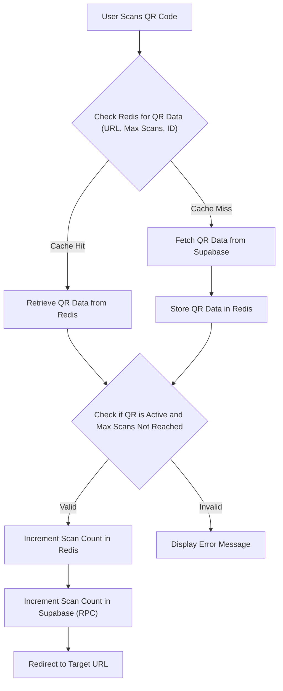

# Pages and Routing

This document outlines the page structure and routing implementation within the QRly application, which is built using Next.js and its app router. We will explore how different routes are defined, how dynamic routing is handled, and the role of middleware in protecting routes.

## Key Files and Their Roles

*   `qrly/src/app/[camid]/page.jsx`: Displays QR codes associated with a specific campaign ID.
*   `qrly/src/app/page.js`: The application's homepage, providing an introduction and a call to action.
*   `qrly/src/app/r/[slug]/page.jsx`: Handles redirects for scanned QR codes based on their unique slugs.
*   `qrly/src/middleware.js`: Implements authentication checks and route protection using Clerk middleware.

## Dynamic Routing for Campaigns (`[camid]`)

The `qrly/src/app/[camid]/page.jsx` file demonstrates dynamic routing in Next.js. The `[camid]` segment in the file path indicates that this route will handle requests where `camid` is a dynamic parameter, representing a campaign ID.

```javascript
// qrly/src/app/[camid]/page.jsx
import { currentUser } from '@clerk/nextjs/server';
import { QRList } from '@/components/QR/QRList';
import { supabaseServer } from '@/lib/supabase';

export default async function CamQR({ params }) {
  const user = await currentUser();
  const { camid } = await params;

  if (!user) {
    return (
      <div className="min-h-screen bg-[#E5E5CB] flex items-center justify-center">
        <div className="bg-[#1A120B] text-[#E5E5CB] p-6 rounded-lg shadow-lg">
          <p className="text-lg">Please sign in to view campaign QR codes</p>
        </div>
      </div>
    );
  }

  const s=supabaseServer();
  const{data:qrs,error}=await s.from("qranalytics").select("id, url, qr_id, total_scans, expire_at, campaign_id, target_url, title, user_id, max_scans").eq("campaign_id",camid)


  if(error) return <div>Error In fecthing from supabase</div>
  return (
    <div className="min-h-screen bg-[#E5E5CB] p-6 max-w-7xl mx-auto">
      <h1 className="text-3xl text-center font-bold text-[#1A120B] mb-6">QR Codes for Campaign</h1>
      <QRList camid={camid} userid={user.id} initaildata={qrs} />
    </div>
  );
}
```

This code fetches the `camid` from the `params` object, retrieves QR code data from Supabase based on this ID, and displays it using the `QRList` component.  The `currentUser` function from `@clerk/nextjs/server` ensures only authenticated users can view campaign QR codes.

[View on GitHub](https://github.com/kalpm1110/QRly/blob/main/qrly/src/app/[camid]/page.jsx)

## Homepage (`/`)

The `qrly/src/app/page.js` file defines the application's homepage. It presents a welcome message and a call-to-action button that links to the dashboard.

```javascript
// qrly/src/app/page.js
"use client";
import { Button } from "@/components/ui/button";
import Link from "next/link";

export default function Home() {
  return (
    <div className="min-h-screen  flex flex-col items-center justify-center text-center px-4">
      <h1 className="text-5xl md:text-6xl font-bold text-[#1A120B] mb-6 tracking-tight">
        Welcome to QRly
      </h1>
      <p className="text-xl md:text-2xl text-[#3C2A21] mb-8 max-w-2xl">
        Create and manage QR codes with real-time analytics. Simple, fast, and powerful.
      </p>
      <Link href="/dashboard">
        <Button className="bg-[#1A120B] text-[#E5E5CB] hover:bg-[#3C2A21] transition-colors duration-300 text-lg py-6 px-8 rounded-lg">
          Get Started
        </Button>
      </Link>
    </div>
  );
}
```

This component uses `next/link` for client-side navigation to the `/dashboard` route, enhancing the user experience with faster transitions.

[View on GitHub](https://github.com/kalpm1110/QRly/blob/main/qrly/src/app/page.js)

## QR Code Redirection (`/r/[slug]`)

The `qrly/src/app/r/[slug]/page.jsx` file handles the redirection of scanned QR codes. The `[slug]` parameter represents the unique identifier of a QR code.

```javascript
// qrly/src/app/r/[slug]/page.jsx
import { scanRateLimiter } from "@/lib/rateLimit";
import redis from "@/lib/redis";
import { supabaseServer } from "@/lib/supabase";
import { headers } from "next/headers";
import { redirect } from "next/navigation";


async function getQR(slug, supabase) {
  let [url, maxScans, qrId] = await redis.mget(
    `qr:${slug}:url`,
    `qr:${slug}:max_scans`,
    `qr:${slug}:id`
  );

  if (!url || !maxScans || !qrId) {
    const { data: qr, error } = await supabase
      .from("qrs")
      .select("*")
      .eq("slug", slug)
      .single();

    if (error || !qr) throw new Error("QR not found");

    url = qr.url;
    maxScans = qr.max_scans;
    qrId = qr.id;

    await redis.set(`qr:${slug}:url`, url);
    await redis.set(`qr:${slug}:max_scans`, maxScans);
    await redis.set(`qr:${slug}:id`, qrId);

    console.log("Fetched QR from Supabase");
  } else {
    console.log("Using Redis cache");
  }

  return {
    url,
    maxScans: Number(maxScans),
    qrId,
  };
}

export default async function QRpage({ params }) {
  const headerList= await headers();
  // console.log("Request Headers:", Object.fromEntries(headerList.entries()));
  const ip=headerList.get("x-forwarded-for") || "unkown";
  console.log("Client IP:", ip);
  // const {success,limit,remaining,reset}= await scanRateLimiter.limit(ip);
  // console.log(`Rate Limit - Success: ${success}, Limit: ${limit}, Remaining: ${remaining}, Reset: ${reset}`);
  try {
  const { success } = await scanRateLimiter.limit(ip);
  console.log("Rate limit success:", success);
} catch (err) {
  console.error("Rate limiter error:", err);
}

  if(!success){
    return new Response("Rate Limit for scan Exceeded",{status:429});
  }
  const { slug } = await params;

  const keyActive = `qr:${slug}:aval`;
  const isActive = await redis.get(keyActive);
  console.log(isActive);
  if (isActive === null) return <div>Scanned QR is Expired!</div>;

  const supabase = supabaseServer();
  let qrData;
  try {
    qrData = await getQR(slug, supabase);
  } catch (err) {
    return new Response("QR not found", { status: 404 });
  }

  const keyScans = `qr:${slug}:scans`;
  const scansRaw = await redis.get(keyScans);
  const scans = scansRaw ? Number(scansRaw) : 0;
  const maxScans = Number(qrData.maxScans);
  console.log(maxScans,scans)
  if (maxScans !== -1 && scans >= maxScans) {
    return <div>Max Scans has reached</div>;
  }


  await redis.incr(keyScans);
  supabase.rpc("increment_scan", { qr_id: qrData.qrId })
    .then(() => console.log("Supabase scans updated"))
    .catch(err => console.error("Supabase RPC failed", err));

  redirect(qrData.url);
  // console.log("Redirecting to:", qrData.url);
}
```

This route performs the following actions:

1.  Retrieves QR code information (URL, max scans) from Redis cache or Supabase if not cached.
2.  Checks if the QR code is active and has not exceeded its maximum scan limit.
3.  Increments the scan count in Redis and Supabase.
4.  Redirects the user to the target URL associated with the QR code using `next/navigation`'s `redirect` function.
5.  Implements rate limiting to prevent abuse.

[View on GitHub](https://github.com/kalpm1110/QRly/blob/main/qrly/src/app/r/[slug]/page.jsx)

## Middleware for Route Protection

The `qrly/src/middleware.js` file implements authentication checks using Clerk middleware to protect specific routes.

```javascript
// qrly/src/middleware.js
import { clerkMiddleware, createRouteMatcher } from '@clerk/nextjs/server';

const isPublicRoute = createRouteMatcher(['/sign-in(.*)', '/sign-up(.*)', '/','/r(.*)','/about(.*)']);

export default clerkMiddleware(async (auth, req) => {
  if (!isPublicRoute(req)) {
    await auth.protect();
  }
});

export const config = {
  matcher: [
    '/((?!_next|[^?]*\\.(?:html?|css|js(?!on)|jpe?g|webp|png|gif|svg|ttf|woff2?|ico|csv|docx?|xlsx?|zip|webmanifest)).*)',
    '/(api|trpc)(.*)',"/:camid"
  ],
};
```

The `clerkMiddleware` function is used to protect routes. The `isPublicRoute` matcher defines routes that do not require authentication (e.g., sign-in, sign-up, and the root route).  All other routes are protected, requiring users to be authenticated. The `config.matcher` array defines the paths that the middleware will run on.

[View on GitHub](https://github.com/kalpm1110/QRly/blob/main/qrly/src/middleware.js)

## Rate Limiting
The `qrly/src/app/r/[slug]/page.jsx` file includes Rate Limiting logic using redis
```javascript
import { scanRateLimiter } from "@/lib/rateLimit";
import { headers } from "next/headers";

export default async function QRpage({ params }) {
  const headerList= await headers();
  const ip=headerList.get("x-forwarded-for") || "unkown";

  try {
  const { success } = await scanRateLimiter.limit(ip);
  console.log("Rate limit success:", success);
} catch (err) {
  console.error("Rate limiter error:", err);
}

  if(!success){
    return new Response("Rate Limit for scan Exceeded",{status:429});
  }
  // ... rest of the code
}
```
This implementation uses the `scanRateLimiter` to limit the number of scans from a specific IP address, which uses Redis to store and check the limits.  The `headers()` function is used to retrieve the `x-forwarded-for` header to obtain the client's IP address, although it defaults to "unknown" if the header is not present. A 429 error is returned to the client in case of rate limit exceeded.

## Data Flow for QR Code Redirection





## Key Integration Points

*   **Next.js App Router:**  QRly leverages the Next.js app router for defining routes and handling dynamic segments. The app router simplifies routing and allows server components.
*   **Clerk Authentication:** Clerk middleware provides authentication and route protection, ensuring that only authorized users can access specific parts of the application.
*   **Supabase:** Supabase is used as the primary database for storing QR code data and user information.  The application interacts with Supabase through server-side functions.
*   **Redis:** Redis is used for caching QR code data and managing scan counts, improving performance and reducing database load. It also used for rate limiting scan requests based on IP address to prevent abuse.

## Best Practices

*   **Caching:**  Utilize caching strategies (e.g., Redis) to store frequently accessed data and reduce database queries.
*   **Route Protection:**  Implement middleware to protect routes and ensure that only authenticated users can access sensitive data.
*   **Error Handling:**  Properly handle errors and display informative messages to the user.  For example, the `qrly/src/app/r/[slug]/page.jsx` file handles cases where a QR code is not found or has expired.
*   **Rate Limiting:** Implement rate limiting to protect services.

By following these best practices and utilizing the features of Next.js, Clerk, Supabase, and Redis, QRly provides a robust and efficient platform for creating and managing QR codes.
```