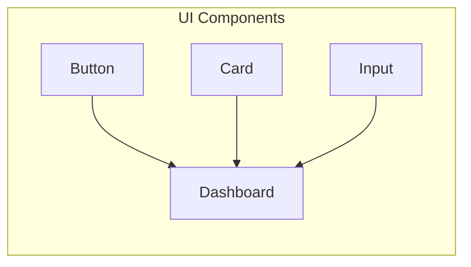

# UI Components

This section documents the reusable UI components built for the QRly application. These components are designed to be modular and customizable, promoting consistency and efficiency throughout the user interface.

## Core Components

This application uses several key UI components, including buttons, cards, and input fields, each with its own specific purpose and styling. These components are built using React and styled with Tailwind CSS, leveraging the `class-variance-authority` (cva) library for managing component variants.

### Button

The `Button` component (defined in `qrly/src/components/ui/button.jsx`) provides a consistent and customizable button element. It uses `class-variance-authority` to define different variants (e.g., `default`, `destructive`, `outline`) and sizes.

**Key Features:**

-   **Variants:** `default`, `destructive`, `outline`, `secondary`, `ghost`, `link`.
-   **Sizes:** `default`, `sm`, `lg`, `icon`.
-   **Accessibility:** Includes `disabled` state handling and focus styling.
-   **Flexibility:** Can be used as a regular button or a link using the `asChild` prop and the `Slot` component from `@radix-ui/react-slot`.

```javascript
import * as React from "react"
import { Slot } from "@radix-ui/react-slot"
import { cva } from "class-variance-authority";

import { cn } from "@/lib/utils"

const buttonVariants = cva(
  "inline-flex items-center justify-center gap-2 whitespace-nowrap rounded-md text-sm font-medium transition-all disabled:pointer-events-none disabled:opacity-50 [&_svg]:pointer-events-none [&_svg:not([class*='size-'])]:size-4 shrink-0 [&_svg]:shrink-0 outline-none focus-visible:border-ring focus-visible:ring-ring/50 focus-visible:ring-[3px] aria-invalid:ring-destructive/20 dark:aria-invalid:ring-destructive/40 aria-invalid:border-destructive",
  {
    variants: {
      variant: {
        default:
          "bg-primary text-primary-foreground shadow-xs hover:bg-primary/90",
        destructive:
          "bg-destructive text-white shadow-xs hover:bg-destructive/90 focus-visible:ring-destructive/20 dark:focus-visible:ring-destructive/40 dark:bg-destructive/60",
        outline:
          "border bg-background shadow-xs hover:bg-accent hover:text-accent-foreground dark:bg-input/30 dark:border-input dark:hover:bg-input/50",
        secondary:
          "bg-secondary text-secondary-foreground shadow-xs hover:bg-secondary/80",
        ghost:
          "hover:bg-accent hover:text-accent-foreground dark:hover:bg-accent/50",
        link: "text-primary underline-offset-4 hover:underline",
      },
      size: {
        default: "h-9 px-4 py-2 has-[>svg]:px-3",
        sm: "h-8 rounded-md gap-1.5 px-3 has-[>svg]:px-2.5",
        lg: "h-10 rounded-md px-6 has-[>svg]:px-4",
        icon: "size-9",
      },
    },
    defaultVariants: {
      variant: "default",
      size: "default",
    },
  }
)

function Button({
  className,
  variant,
  size,
  asChild = false,
  ...props
}) {
  const Comp = asChild ? Slot : "button"

  return (
    <Comp
      data-slot="button"
      className={cn(buttonVariants({ variant, size, className }))}
      {...props} />
  );
}

export { Button, buttonVariants }
```

[View on GitHub](https://github.com/kalpm1110/QRly/blob/main/qrly/src/components/ui/button.jsx)

### Card

The `Card` component (defined in `qrly/src/components/ui/card.jsx`) provides a container for grouping related content. It includes several sub-components for structuring the card, such as `CardHeader`, `CardTitle`, `CardDescription`, `CardContent`, and `CardFooter`.

**Key Features:**

-   **Structure:** Provides a consistent structure for displaying information.
-   **Customization:**  The sub-components allow for flexible content arrangement.
-   **Styling:** Uses Tailwind CSS classes for styling.

```javascript
import * as React from "react"

import { cn } from "@/lib/utils"

function Card({
  className,
  ...props
}) {
  return (
    <div
      data-slot="card"
      className={cn(
        "bg-card text-card-foreground flex flex-col gap-6 rounded-xl border py-6 shadow-sm",
        className
      )}
      {...props} />
  );
}

function CardHeader({
  className,
  ...props
}) {
  return (
    <div
      data-slot="card-header"
      className={cn(
        "@container/card-header grid auto-rows-min grid-rows-[auto_auto] items-start gap-1.5 px-6 has-data-[slot=card-action]:grid-cols-[1fr_auto] [.border-b]:pb-6",
        className
      )}
      {...props} />
  );
}

function CardTitle({
  className,
  ...props
}) {
  return (
    <div
      data-slot="card-title"
      className={cn("leading-none font-semibold", className)}
      {...props} />
  );
}

function CardDescription({
  className,
  ...props
}) {
  return (
    <div
      data-slot="card-description"
      className={cn("text-muted-foreground text-sm", className)}
      {...props} />
  );
}

function CardAction({
  className,
  ...props
}) {
  return (
    <div
      data-slot="card-action"
      className={cn(
        "col-start-2 row-span-2 row-start-1 self-start justify-self-end",
        className
      )}
      {...props} />
  );
}

function CardContent({
  className,
  ...props
}) {
  return (<div data-slot="card-content" className={cn("px-6", className)} {...props} />);
}

function CardFooter({
  className,
  ...props
}) {
  return (
    <div
      data-slot="card-footer"
      className={cn("flex items-center px-6 [.border-t]:pt-6", className)}
      {...props} />
  );
}

export {
  Card,
  CardHeader,
  CardFooter,
  CardTitle,
  CardAction,
  CardDescription,
  CardContent,
}
```

[View on GitHub](https://github.com/kalpm1110/QRly/blob/main/qrly/src/components/ui/card.jsx)

### Input

The `Input` component (defined in `qrly/src/components/ui/input.jsx`) provides a styled input field for collecting user input.

**Key Features:**

-   **Styling:** Uses Tailwind CSS classes for styling, including focus and error states.
-   **Accessibility:** Includes `disabled` state handling.
-   **Types:**  Supports various input types.

```javascript
import * as React from "react"

import { cn } from "@/lib/utils"

function Input({
  className,
  type,
  ...props
}) {
  return (
    <input
      type={type}
      data-slot="input"
      className={cn(
        "file:text-foreground placeholder:text-muted-foreground selection:bg-primary selection:text-primary-foreground dark:bg-input/30 border-input flex h-9 w-full min-w-0 rounded-md border bg-transparent px-3 py-1 text-base shadow-xs transition-[color,box-shadow] outline-none file:inline-flex file:h-7 file:border-0 file:bg-transparent file:text-sm file:font-medium disabled:pointer-events-none disabled:cursor-not-allowed disabled:opacity-50 md:text-sm",
        "focus-visible:border-ring focus-visible:ring-ring/50 focus-visible:ring-[3px]",
        "aria-invalid:ring-destructive/20 dark:aria-invalid:ring-destructive/40 aria-invalid:border-destructive",
        className
      )}
      {...props} />
  );
}

export { Input }
```

[View on GitHub](https://github.com/kalpm1110/QRly/blob/main/qrly/src/components/ui/input.jsx)

## Dashboard Component

The `Dashboard` component (`qrly/src/components/Dashboard.jsx`) integrates these UI components to create the main dashboard view. It displays user information, key statistics, quick actions, and campaign summaries.

**Key Features:**

-   **Data Display:** Shows campaign and QR code statistics.
-   **Quick Actions:** Provides links to create new QR codes or campaigns.
-   **Campaign Management:**  Lists existing campaigns with options to view or delete them.
-   **Empty State Handling:** Displays appropriate messages and actions when no campaigns or QR codes exist.

```javascript
const QuickActionCard = ({ icon: Icon, title, subtitle, href, primary = false }) => (
    <Link href={href || '#'}>
      <div className={`p-6 rounded-xl border hover:shadow-lg transition-all duration-200 text-left w-full cursor-pointer ${
        primary 
          ? 'bg-[#1A120B] text-[#E5E5CB] hover:bg-[#3C2A21]' 
          : 'bg-white border-[#3C2A21]/20 hover:bg-gray-50'
      }`}>
        <Icon className={`w-8 h-8 mb-3 ${primary ? 'text-[#E5E5CB]' : 'text-[#1A120B]'}`} />
        <h3 className={`font-semibold text-lg mb-1 ${primary ? 'text-[#E5E5CB]' : 'text-[#1A120B]'}`}>
          {title}
        </h3>
        <p className={`text-sm ${primary ? 'text-[#E5E5CB]/80' : 'text-[#3C2A21]'}`}>
          {subtitle}
        </p>
      </div>
    </Link>
  );
```

This snippet shows the `QuickActionCard` component, which is a reusable card used on the dashboard to provide quick access to key actions.  It uses conditional styling based on the `primary` prop.

[View on GitHub](https://github.com/kalpm1110/QRly/blob/main/qrly/src/components/Dashboard.jsx)

```javascript
 const CampaignCard = ({ campaign, onDelete }) => (
    <div className="relative bg-white border border-[#3C2A21]/20 rounded-xl p-6 shadow-md hover:shadow-lg transition-shadow duration-300">
      <button
        onClick={() => onDelete?.(campaign.id)}
        className="absolute top-3 right-3 p-1.5 rounded-full hover:bg-red-100 transition-colors duration-200"
        aria-label="Delete Campaign"
      >
        <Trash2 className="h-4 w-4 text-red-500" />
      </button>
      
      <h3 className="text-xl font-semibold text-[#1A120B] mb-3 pr-8">
        {campaign.name}
      </h3>
      
      <p className="text-sm text-[#3C2A21] mb-4 flex items-center gap-2">
        <Calendar className="w-4 h-4" />
        Created {campaign?.created_at
          ? new Date(campaign.created_at).toLocaleDateString("en-IN", {
              year: "numeric",
              month: "short",
              day: "numeric",
            })
          : "N/A"}
      </p>
      
      <div className="flex gap-3">
        <Link href={`/${campaign.id}`}>
          <button className="bg-[#1A120B] text-[#E5E5CB] hover:bg-[#3C2A21] transition-colors duration-300 rounded-lg px-4 py-2 text-sm font-medium">
            View QRs
          </button>
        </Link>
        <button className="border border-[#3C2A21]/30 text-[#1A120B] hover:bg-[#1A120B] hover:text-[#E5E5CB] transition-colors duration-300 rounded-lg px-4 py-2 text-sm font-medium">
          Add QR
        </button>
      </div>
    </div>
  );
```

This snippet shows the `CampaignCard` component, responsible for displaying individual campaign information on the dashboard. It includes the campaign name, creation date, and actions like viewing QRs or adding new ones. It also features a delete button.

[View on GitHub](https://github.com/kalpm1110/QRly/blob/main/qrly/src/components/Dashboard.jsx)

```javascript
{campaigns.length === 0 ? (
    // Empty State for Campaigns
    <div className="text-center py-16 bg-white/50 rounded-xl border border-[#3C2A21]/20">
        <QrCode className="w-16 h-16 text-[#3C2A21]/50 mx-auto mb-6" />
        <h3 className="text-xl font-semibold text-[#1A120B] mb-3">
        No campaigns yet
        </h3>
        <p className="text-[#3C2A21] mb-6 max-w-md mx-auto">
        Create your first campaign to organize and manage multiple QR codes together.
        </p>
        <button className="px-8 py-3 bg-[#1A120B] text-[#E5E5CB] rounded-xl hover:bg-[#3C2A21] transition-colors font-medium">
        Create Your First Campaign
        </button>
    </div>
) : (
    // Campaigns Grid
    <div className="grid grid-cols-1 md:grid-cols-2 lg:grid-cols-3 gap-6">
        {campaigns.slice(0, 6).map((campaign) => (
        <CampaignCard 
            key={campaign.id} 
            campaign={campaign}
            onDelete={(id) => {
                // Handle delete - you'll need to implement this
                console.log('Delete campaign:', id);
            }}
        />
        ))}
    </div>
)}
```

This snippet illustrates the conditional rendering for handling the empty state of campaigns. When no campaigns are available, a specific message and call to action are displayed; otherwise, the existing campaigns are rendered in a grid.

[View on GitHub](https://github.com/kalpm1110/QRly/blob/main/qrly/src/components/Dashboard.jsx)

```javascript
{individualQRs.length > 0 && (
    <div className="bg-white/50 rounded-xl border border-[#3C2A21]/20 p-6 text-center">
        <h3 className="text-lg font-semibold text-[#1A120B] mb-2">
        Individual QR Codes
        </h3>
        <p className="text-[#3C2A21] mb-4">
        You have {individualQRs.length} individual QR codes outside of campaigns
        </p>
        <Link href="/yourqrs">
        <button className="px-6 py-2 bg-[#1A120B] text-[#E5E5CB] rounded-lg hover:bg-[#3C2A21] transition-colors font-medium">
            View All QRs
        </button>
        </Link>
    </div>
)}
```

This snippet handles the display of individual QR codes outside of campaigns. It shows a summary of the number of individual QR codes and provides a link to view all QR codes.

[View on GitHub](https://github.com/kalpm1110/QRly/blob/main/qrly/src/components/Dashboard.jsx)

### UI Component Diagram

Here is a simple diagram showing the relationship between the UI components:





## Key Integration Points

The UI components are integrated throughout the QRly application. Here are some key integration points:

-   **Button:** Used for actions like creating QR codes, creating campaigns, and submitting forms.
-   **Card:** Used to display campaign summaries, quick actions, and other information.
-   **Input:** Used for collecting user input in forms, such as creating QR codes or campaigns.

These components are designed to be reusable and customizable, allowing for a consistent and efficient user interface.
```