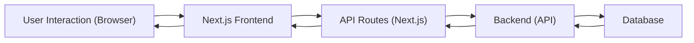
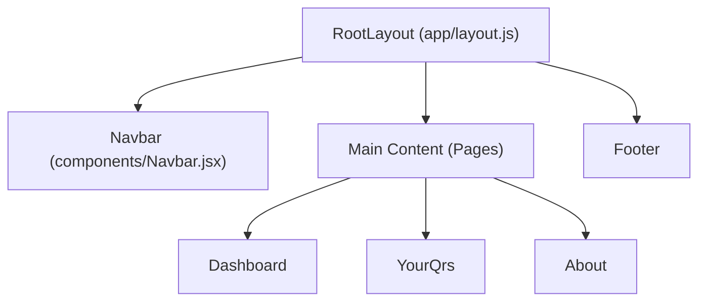

# Frontend Architecture

This document details the frontend architecture of QRly, a QR code creation and tracking application. The frontend is built using Next.js, a React framework known for its server-side rendering capabilities and developer-friendly features.

## Overview

The frontend is structured around the following key aspects:

*   **Next.js:** Provides the foundation for building a performant and SEO-friendly web application.
*   **React Components:** Reusable UI elements organized for maintainability and scalability.
*   **Clerk Authentication:** Secure user authentication and management.
*   **Tailwind CSS:** A utility-first CSS framework for rapid UI development.

## Key Components and Structure

The core of the frontend resides in the `src` directory. Let's examine some key files:

### `jsconfig.json`

This file configures the JavaScript language service, enabling absolute imports using the `@` alias.

```json title="qrly/jsconfig.json"
{
  "compilerOptions": {
    "paths": {
      "@/*": ["./src/*"]
    }
  }
}
```

This configuration simplifies importing modules from different parts of the application. For example, instead of writing `../../components/Navbar`, you can use `@/components/Navbar`.

[View on GitHub](https://github.com/kalpm1110/QRly/blob/main/qrly/jsconfig.json)

### `src/app/layout.js`

This file defines the root layout of the application. It includes global styles, font configurations, and the main structure of each page. It wraps the entire application with `ClerkProvider` for authentication.

```javascript title="qrly/src/app/layout.js"
import { Geist, Geist_Mono } from "next/font/google";
import '@/styles/globals.css'
import { ClerkProvider } from '@clerk/nextjs'
import Navbar from "@/components/Navbar";

const geistSans = Geist({
  variable: "--font-geist-sans",
  subsets: ["latin"],
});

const geistMono = Geist_Mono({
  variable: "--font-geist-mono",
  subsets: ["latin"],
});

export const metadata = {
  title: "QRly",
  description: "Create and track QR codes with real-time analytics",
};

export default function RootLayout({ children }) {
  return (
    <ClerkProvider>
      <html lang="en">
        <body
          className={`${geistSans.variable} ${geistMono.variable} bg-[#E5E5CB] text-[#1A120B] antialiased`}
        >
          <Navbar />
          <main className="min-h-screen">
            {children}
          </main>
          <footer className="bg-[#1A120B] text-[#E5E5CB] py-6">
            <div className="max-w-7xl mx-auto px-4 sm:px-6 lg:px-8 text-center">
              <p>&copy; {new Date().getFullYear()} QRly. All rights reserved.</p>
            </div>
          </footer>
        </body>
      </html>
    </ClerkProvider>
  );
}
```

The code snippet shows how custom fonts are imported using `next/font/google` and how the `ClerkProvider` wraps the entire application for managing authentication.  The `Navbar` component is also included here, ensuring it's present on every page. The `children` prop represents the content of individual pages, which are rendered within the `<main>` tag.

[View on GitHub](https://github.com/kalpm1110/QRly/blob/main/qrly/src/app/layout.js)

### `src/components/Navbar.jsx`

This component implements the navigation bar, providing links to different sections of the application. It uses `next/link` for client-side navigation and includes a mobile-friendly menu. It also contains the `UserButton` from `@clerk/nextjs` so that users can manage their accounts.

```javascript title="qrly/src/components/Navbar.jsx"
"use client";
import { useState } from "react";
import Link from "next/link";
import { LogOut, Menu, X } from "lucide-react";
import { UserButton } from "@clerk/nextjs";

export default function Navbar() {
    const [isOpen, setIsOpen] = useState(false);

    return (
        <nav className="bg-[#1A120B] text-[#E5E5CB] shadow-lg sticky top-0 z-50">
            <div className="max-w-7xl mx-auto px-4 sm:px-6 lg:px-8">
                <div className="flex items-center justify-between h-16">
                    {/* Logo */}
                    <div className="flex-shrink-0">
                        <Link href="/" className="text-3xl font-bold tracking-tight hover:text-[#D5CEA3] transition-colors">
                            QRly
                        </Link>
                    </div>

                    {/* Desktop Menu */}
                    <div className="hidden md:flex items-center space-x-8 text-lg">
                        <Link href="/dashboard" className="hover:text-[#D5CEA3] transition-colors duration-200">
                            Home
                        </Link>
                        <Link href="/yourqrs" className="hover:text-[#D5CEA3] transition-colors duration-200">
                            YourQrs
                        </Link>
                        <Link href="/about" className="hover:text-[#D5CEA3] transition-colors duration-200">
                            About
                        </Link>
                        <UserButton />
                       
                    </div>

                    {/* Mobile Hamburger */}
                    <div className="md:hidden flex items-center space-x-8 text-lg ">
                        <button
                            onClick={() => setIsOpen(!isOpen)}
                            className="focus:outline-none text-[#E5E5CB] hover:text-[#D5CEA3] transition-colors"
                        >
                            {isOpen ? <X size={28} /> : <Menu size={28} />}
                        </button>
                        <UserButton className="mr-3"></UserButton>
                    </div>
                </div>
            </div>

            {/* Mobile Menu */}
            {isOpen && (
                <div className="md:hidden bg-[#3C2A21] px-4 py-4 space-y-4">
                    <Link
                        href="/dashboard"
                        className="block text-[#E5E5CB] hover:text-[#D5CEA3] transition-colors text-lg"
                        onClick={() => setIsOpen(false)}
                    >
                        Home
                    </Link>
                    <Link 
                        href="/yourqrs" 
                        className="block text-[#E5E5CB] hover:text-[#D5CEA3] transition-colors text-lg"
                        onClick={() => setIsOpen(false)}
                    >
                        YourQrs
                    </Link>
                    <Link 
                        href="/about" 
                        className="block text-[#E5E5CB] hover:text-[#D5CEA3] transition-colors text-lg"
                        onClick={() => setIsOpen(false)}
                    >
                        About
                    </Link>
      
                </div>
            )}
        </nav>
    );
}
```

This code implements a responsive navigation bar with a mobile menu.  It uses `useState` to manage the open/close state of the mobile menu.  The `UserButton` component from `@clerk/nextjs` is used to display user authentication options.

[View on GitHub](https://github.com/kalpm1110/QRly/blob/main/qrly/src/components/Navbar.jsx)

### `src/styles/globals.css`

This file contains global CSS styles, including Tailwind CSS directives and custom styles for the application.

```css title="qrly/src/styles/globals.css"
@import "tailwindcss";
@import "tw-animate-css";

@custom-variant dark (&:is(.dark *));

@theme inline {
  --color-background: var(--background);
  --color-foreground: var(--foreground);
  --font-sans: var(--font-geist-sans);
  --font-mono: var(--font-geist-mono);
  --color-sidebar-ring: var(--sidebar-ring);
  --color-sidebar-border: var(--sidebar-border);
  --color-sidebar-accent-foreground: var(--sidebar-accent-foreground);
  --color-sidebar-accent: var(--sidebar-accent);
  --color-sidebar-primary-foreground: var(--sidebar-primary-foreground);
  --color-sidebar-primary: var(--sidebar-primary);
  --color-sidebar-foreground: var(--sidebar-foreground);
  --color-sidebar: var(--sidebar);
  --color-chart-5: var(--chart-5);
  --color-chart-4: var(--chart-4);
  --color-chart-3: var(--chart-3);
  --color-chart-2: var(--chart-2);
  --color-chart-1: var(--chart-1);
  --color-ring: var(--ring);
  --color-input: var(--input);
  --color-border: var(--border);
  --color-destructive: var(--destructive);
  --color-accent-foreground: var(--accent-foreground);
  --color-accent: var(--accent);
  --color-muted-foreground: var(--muted-foreground);
  --color-muted: var(--muted);
  --color-secondary-foreground: var(--secondary-foreground);
  --color-secondary: var(--secondary);
  --color-primary-foreground: var(--primary-foreground);
  --color-primary: var(--primary);
  --color-popover-foreground: var(--popover-foreground);
  --color-popover: var(--popover);
  --color-card-foreground: var(--card-foreground);
  --color-card: var(--card);
  --radius-sm: calc(var(--radius) - 4px);
  --radius-md: calc(var(--radius) - 2px);
  --radius-lg: var(--radius);
  --radius-xl: calc(var(--radius) + 4px);
}

:root {
  --radius: 0.625rem;
  --background: oklch(1 0 0);
  --foreground: oklch(0.145 0 0);
  --card: oklch(1 0 0);
  --card-foreground: oklch(0.145 0 0);
  --popover: oklch(1 0 0);
  --popover-foreground: oklch(0.145 0 0);
  --primary: oklch(0.205 0 0);
  --primary-foreground: oklch(0.985 0 0);
  --secondary: oklch(0.97 0 0);
  --secondary-foreground: oklch(0.205 0 0);
  --muted: oklch(0.97 0 0);
  --muted-foreground: oklch(0.556 0 0);
  --accent: oklch(0.97 0 0);
  --accent-foreground: oklch(0.205 0 0);
  --destructive: oklch(0.577 0.245 27.325);
  --border: oklch(0.922 0 0);
  --input: oklch(0.922 0 0);
  --ring: oklch(0.708 0 0);
  --chart-1: oklch(0.646 0.222 41.116);
  --chart-2: oklch(0.6 0.118 184.704);
  --chart-3: oklch(0.398 0.07 227.392);
  --chart-4: oklch(0.828 0.189 84.429);
  --chart-5: oklch(0.769 0.188 70.08);
  --sidebar: oklch(0.985 0 0);
  --sidebar-foreground: oklch(0.145 0 0);
  --sidebar-primary: oklch(0.205 0 0);
  --sidebar-primary-foreground: oklch(0.985 0 0);
  --sidebar-accent: oklch(0.97 0 0);
  --sidebar-accent-foreground: oklch(0.205 0 0);
  --sidebar-border: oklch(0.922 0 0);
  --sidebar-ring: oklch(0.708 0 0);
}

.dark {
  --background: oklch(0.145 0 0);
  --foreground: oklch(0.985 0 0);
  --card: oklch(0.205 0 0);
  --card-foreground: oklch(0.985 0 0);
  --popover: oklch(0.205 0 0);
  --popover-foreground: oklch(0.985 0 0);
  --primary: oklch(0.922 0 0);
  --primary-foreground: oklch(0.205 0 0);
  --secondary: oklch(0.269 0 0);
  --secondary-foreground: oklch(0.985 0 0);
  --muted: oklch(0.269 0 0);
  --muted-foreground: oklch(0.708 0 0);
  --accent: oklch(0.269 0 0);
  --accent-foreground: oklch(0.985 0 0);
  --destructive: oklch(0.704 0.191 22.216);
  --border: oklch(1 0 0 / 10%);
  --input: oklch(1 0 0 / 15%);
  --ring: oklch(0.556 0 0);
  --chart-1: oklch(0.488 0.243 264.376);
  --chart-2: oklch(0.696 0.17 162.48);
  --chart-3: oklch(0.769 0.188 70.08);
  --chart-4: oklch(0.627 0.265 303.9);
  --chart-5: oklch(0.645 0.246 16.439);
  --sidebar: oklch(0.205 0 0);
  --sidebar-foreground: oklch(0.985 0 0);
  --sidebar-primary: oklch(0.488 0.243 264.376);
  --sidebar-primary-foreground: oklch(0.985 0 0);
  --sidebar-accent: oklch(0.269 0 0);
  --sidebar-accent-foreground: oklch(0.985 0 0);
  --sidebar-border: oklch(1 0 0 / 10%);
  --sidebar-ring: oklch(0.556 0 0);
}

@layer base {
  * {
    @apply border-border outline-ring/50;
  }
  body {
    @apply bg-background text-foreground;
  }
}

body {
  @apply bg-[#E5E5CB] text-[#1A120B];
}

button {
  @apply transition-colors duration-300;
}

a {
  @apply transition-colors duration-200;
}

/* Custom styles for Clerk components */
.clerk-button {
  @apply bg-[#1A120B] text-[#E5E5CB] hover:bg-[#3C2A21] rounded-lg px-4 py-2;
}
```

This file sets up the color scheme using `oklch` color space and configures Tailwind CSS. It also contains custom styles for Clerk components to align with the application's design.

[View on GitHub](https://github.com/kalpm1110/QRly/blob/main/qrly/src/styles/globals.css)

## Frontend Workflow

The following diagram illustrates the basic workflow of the frontend:





This diagram illustrates the flow of data from user interaction to the backend and back.

## Component Hierarchy





## Key Integration Points

*   **Clerk Authentication:** Clerk is integrated into the `_app.js` file to provide authentication across the entire application. The `UserButton` component is used in the `Navbar` to display user information and authentication options.
*   **API Routes:** Next.js API routes are used to communicate with the backend. These routes handle data fetching and manipulation.
*   **Data Fetching:** The `useEffect` hook is used to fetch data from the API routes and update the component state.
*   **Form Handling:** React's form handling capabilities are used to manage user input and submit data to the API routes.

## Best Practices

*   **Component-Based Architecture:**  Divide the UI into reusable components to promote code maintainability and reusability.
*   **State Management:**  Use React's `useState` hook for local component state management. For more complex state management, consider using Context API or a third-party library like Redux or Zustand.
*   **Data Fetching:** Use `useEffect` hook for data fetching. Consider using `swr` or `react-query` for more advanced data fetching capabilities such as caching and revalidation.
*   **Error Handling:** Implement proper error handling to gracefully handle errors and provide informative messages to the user.
*   **Accessibility:**  Ensure that the application is accessible to all users by following accessibility guidelines such as WCAG.
```