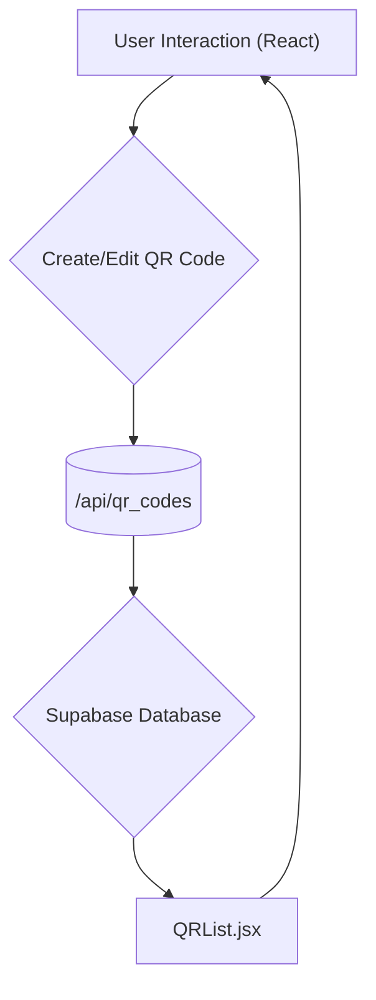

# QR Code Management

This section details how QR codes are created, edited, and displayed within the QRly application. QR codes are a central feature, allowing users to generate dynamic links and track their usage.

## Key Components

*   **QRList.jsx:** Displays a list of QR codes, providing real-time analytics and filtering options.
*   **QRModal.jsx:**  A modal for displaying and sharing QR codes, including options to copy the link or download the QR code as a PNG.
*   **CreateQR.jsx:**  A form for creating new QR codes, allowing users to specify the destination URL, title, expiration date, and maximum scan count.
*   **EditQR.jsx:**  A form for editing existing QR codes, providing similar functionality to the creation form.

## QR Code Listing (QRList.jsx)

The `QRList` component fetches and displays a list of QR codes associated with a user or campaign. It uses Supabase for real-time updates and provides filtering based on active/inactive status.

```javascript
"use client";
import { supabaseBrowser } from "@/lib/supabase";
import { useEffect, useState } from "react";
import QRcard from "./QRcard";
import CreateQrbtn from "../buttons/CreateQrbtn";
import { Activity } from "lucide-react";

export function QRList({ userid, camid, initialData = null }) {
  const [analytics, setanalytics] = useState(initialData || []);
  const [loading, setLoading] = useState(!initialData);
  const supabase = supabaseBrowser();

  useEffect(() => {
    if (!userid && !camid) {
      setLoading(false);
      return;
    }

    if (!initialData) {
      const fetchInitial = async () => {
        setLoading(true);
        let query = supabase
          .from("qranalytics")
          .select("id, url, qr_id, total_scans, expire_at, campaign_id, target_url, title, user_id, max_scans");
        if (camid) query = query.eq("campaign_id", camid);
        else query = query.eq("user_id", userid);

        const { data, error } = await query;
        if (!error) setanalytics(data || []);
        setLoading(false);
      };
      fetchInitial();
    }

    const channel = supabase
      .channel("realtime:analytics")
      .on(
        "postgres_changes",
        {
          event: "*",
          schema: "public",
          table: "qranalytics",
          filter: camid ? `campaign_id=eq.${camid}` : `user_id=eq.${userid}`,
        },
        (payload) => {
          setanalytics((prev) => {
            if (payload.eventType === "INSERT") return [...prev, payload.new];
            if (payload.eventType === "UPDATE")
              return prev.map((a) => (a.id === payload.new.id ? payload.new : a));
            if (payload.eventType === "DELETE")
              return prev.filter((a) => a.id !== payload.old.id);
            return prev;
          });
        }
      )
      .subscribe();

    return () => {
      supabase.removeChannel(channel);
    };
  }, [userid, camid, initialData]);

  const filterdata = (id) => {
    setanalytics(analytics.filter((q) => q.qr_id !== id));
    console.log("filtered");
  };

  const handleUpdate = (updatedQR) => {
    setanalytics((prev) =>
      prev.map((qr) =>
        qr.qr_id === updatedQR.id
          ? {
              ...qr,
              title: updatedQR.title,
              target_url: updatedQR.url,
              expire_at: updatedQR.expires_at,
              campaign_id: updatedQR.campaign_id,
            }
          : qr
      )
    );
  };

  return (
    <div>
      <h1 className="text-2xl font-bold text-[#1A120B] mb-6 flex items-center gap-2">
        <Activity className="w-6 h-6 text-[#3C2A21]" />
        Live QR Insights
      </h1>
      {loading ? (
        <div className="flex justify-center items-center py-12">
          <div className="animate-spin rounded-full h-12 w-12 border-4 border-[#D5CEA3] border-t-[#1A120B]"></div>
        </div>
      ) : analytics.length === 0 ? (
        <div className="bg-[#D5CEA3] border border-[#3C2A21]/20 rounded-xl p-6 text-center">
          <p className="text-[#3C2A21] text-lg">
            No QR codes found. Create a new QR code to start tracking analytics!
            <CreateQrbtn defaultcamid={camid} />
          </p>
        </div>
      ) : (
        <div className="grid grid-cols-1 sm:grid-cols-2 lg:grid-cols-3 xl:grid-cols-4 gap-6">
          {analytics.map((a) => (
            <QRcard key={a.id} a={a} onDelete={filterdata} onUpdate={handleUpdate} />
          ))}
        </div>
      )}
    </div>
  );
}
```

[View on GitHub](https://github.com/kalpm1110/QRly/blob/main/qrly/src/components/QR/QRList.jsx)

This snippet demonstrates how the component:

1.  Uses `useEffect` to fetch initial data and set up a real-time listener using Supabase channels.
2.  Manages loading state to display a spinner while data is being fetched.
3.  Conditionally renders a message if no QR codes are found.
4.  Maps over the `analytics` array to display individual `QRcard` components.

### Real-time Updates with Supabase

The component leverages Supabase real-time channels to listen for changes to the `qranalytics` table. This ensures that the QR code list is updated automatically whenever a new QR code is created, an existing one is updated, or a QR code is deleted.

```javascript
 const channel = supabase
      .channel("realtime:analytics")
      .on(
        "postgres_changes",
        {
          event: "*",
          schema: "public",
          table: "qranalytics",
          filter: camid ? `campaign_id=eq.${camid}` : `user_id=eq.${userid}`,
        },
        (payload) => {
          setanalytics((prev) => {
            if (payload.eventType === "INSERT") return [...prev, payload.new];
            if (payload.eventType === "UPDATE")
              return prev.map((a) => (a.id === payload.new.id ? payload.new : a));
            if (payload.eventType === "DELETE")
              return prev.filter((a) => a.id !== payload.old.id);
            return prev;
          });
        }
      )
      .subscribe();
```

[View on GitHub](https://github.com/kalpm1110/QRly/blob/main/qrly/src/components/QR/QRList.jsx)

### Filtering Logic

Although not shown in the abridged version, the original `QRList` component included more complex filtering logic to differentiate between active and inactive QR codes based on expiration dates and scan limits. This has been removed for brevity.

## QR Code Modal (QRModal.jsx)

The `QRModal` component displays a QR code and provides options to copy the link or download the QR code as a PNG image.

```javascript
"use client";
import React, { useRef } from 'react';
import { Dialog, DialogHeader, DialogContent } from '../ui/dialog';
import { DialogTitle } from '@radix-ui/react-dialog';
import QRCode from 'react-qr-code';
import { Copy, Download, QrCode } from 'lucide-react';
import { Button } from '../ui/button';
import { Label } from '../ui/label';

function QRModal({ open, onClose, link }) {
  const qrref = useRef();

  const handleCopy = () => {
    navigator.clipboard.writeText(link);
  };

  const handleDownload = () => {
    if (!qrref.current) return;
    const svg = qrref.current.querySelector("svg");
    if (!svg) return;

    const serializer = new XMLSerializer();
    const source = serializer.serializeToString(svg);

    const img = new Image();
    img.src = "data:image/svg+xml;base64," + btoa(source);

    img.onload = () => {
      const qrSize = 160;
      const padding = 16;
      const totalSize = qrSize + padding * 2;

      const canvas = document.createElement("canvas");
      canvas.width = totalSize;
      canvas.height = totalSize;
      const ctx = canvas.getContext("2d");

      ctx.fillStyle = "#E5E5CB";
      ctx.fillRect(0, 0, totalSize, totalSize);

      ctx.drawImage(img, padding, padding, qrSize, qrSize);

      const pnguri = canvas.toDataURL("image/png");
      const a = document.createElement("a");
      a.href = pnguri;
      a.download = "QR-Code.png";
      a.click();
    };
  };

  return (
    <Dialog open={open} onOpenChange={onClose}>
      <DialogContent className="p-4 rounded-xl shadow-xl max-w-[90%] sm:max-w-sm bg-[#E5E5CB] transition-all duration-300">
        <DialogHeader>
          <DialogTitle className="text-lg font-medium text-[#1A120B] text-center flex items-center justify-center gap-1">
            Scan or Share QR <QrCode size={16} className="inline-block text-[#3C2A21] animate-pulse" />
          </DialogTitle>
        </DialogHeader>
        <div className="flex justify-center p-4 bg-[#D5CEA3] rounded-lg mt-3 shadow-inner" ref={qrref}>
          <QRCode 
            value={link} 
            size={160} 
            fgColor="#1A120B" 
            bgColor="transparent" 
            className="rounded-lg transform hover:scale-105 transition-transform duration-200" 
          />
        </div>
        <div className="flex items-center align-middle gap-2 mt-3">
          <div className="flex-1">
            <Label className="text-[#1A120B] font-medium text-xs mb-1 block">Shareable Link</Label>
            <input
              className="w-full px-3 py-1.5 border border-[#3C2A21]/30 rounded-lg bg-[#E5E5CB] text-[#1A120B] text-md focus:border-[#3C2A21] focus:ring-2 focus:ring-[#D5CEA3] focus:outline-none transition-all duration-200"
              type="text"
              value={link}
              readOnly
            />
          </div>
          <Button
            variant="outline"
            onClick={handleCopy}
            className="border-[#3C2A21]/30 text-[#E5E5CB] bg-[#1A120B] hover:bg-[#3C2A21] hover:text-[#E5E5CB] transition-colors duration-300 p-2.5"
            aria-label="Copy link"
          >
            <Copy className="h-4 w-4" />
          </Button>
        </div>
        <div className="flex justify-between mt-4 gap-3">
          <Button
            onClick={handleDownload}
            className="flex-1 bg-[#1A120B] text-[#E5E5CB] hover:bg-[#3C2A21] transition-colors duration-300 rounded-lg py-1.5 text-sm flex items-center justify-center gap-1"
            aria-label="Download QR code"
          >
            <Download className="h-4 w-4" />
            Download
          </Button>
          <Button
            variant="secondary"
            onClick={onClose}
            className="flex-1 bg-[#D5CEA3] text-[#1A120B] hover:bg-[#3C2A21] hover:text-[#E5E5CB] transition-colors duration-300 rounded-lg py-1.5 text-sm"
            aria-label="Close modal"
          >
            Close
          </Button>
        </div>
      </DialogContent>
    </Dialog>
  );
}

export default QRModal;
```

[View on GitHub](https://github.com/kalpm1110/QRly/blob/main/qrly/src/components/QR/QRModal.jsx)

The component utilizes the `react-qr-code` library to generate the QR code and provides functions to copy the link to the clipboard and download the QR code as a PNG image.

### Downloading the QR Code as PNG

The `handleDownload` function converts the QR code SVG to a PNG image and triggers a download.

```javascript
 const handleDownload = () => {
    if (!qrref.current) return;
    const svg = qrref.current.querySelector("svg");
    if (!svg) return;

    const serializer = new XMLSerializer();
    const source = serializer.serializeToString(svg);

    const img = new Image();
    img.src = "data:image/svg+xml;base64," + btoa(source);

    img.onload = () => {
      const qrSize = 160;
      const padding = 16;
      const totalSize = qrSize + padding * 2;

      const canvas = document.createElement("canvas");
      canvas.width = totalSize;
      canvas.height = totalSize;
      const ctx = canvas.getContext("2d");

      ctx.fillStyle = "#E5E5CB";
      ctx.fillRect(0, 0, totalSize, totalSize);

      ctx.drawImage(img, padding, padding, qrSize, qrSize);

      const pnguri = canvas.toDataURL("image/png");
      const a = document.createElement("a");
      a.href = pnguri;
      a.download = "QR-Code.png";
      a.click();
    };
  };
```

[View on GitHub](https://github.com/kalpm1110/QRly/blob/main/qrly/src/components/QR/QRModal.jsx)

## Creating QR Codes (CreateQR.jsx)

The `CreateQR` component provides a form for creating new QR codes.

```javascript
"use client";
import React, { useState } from 'react';
import { Input } from "@/components/ui/input";
import { Button } from "@/components/ui/button";
import { Label } from "@/components/ui/label";
import { Checkbox } from "@/components/ui/checkbox";
import { useUser } from '@clerk/nextjs';
import QRModal from '../QR/QRModal';

export default function CreateQR({ defaultCampaignId = null }) {
  const { user } = useUser();
  const [title, setTitle] = useState("");
  const [targetUrl, setTargetUrl] = useState("");
  const [campaignId, setCampaignId] = useState(defaultCampaignId);
  const [expiresAt, setExpiresAt] = useState("");
  const [maxScans, setMaxScans] = useState(-1);
  const [shortUrl, setShortUrl] = useState(null);
  const [loading, setLoading] = useState(false);
  const [modalopn, setmodalopn] = useState(false);

  const handleSubmit = async (e) => {
    e.preventDefault();
    setLoading(true);
    const payload = {
      title,
      owner_id: user.id,
      campaign_id: defaultCampaignId || null,
      max_scans: maxScans || 0,
      url: targetUrl,
      expires_at: expiresAt ? new Date(expiresAt).toISOString() : undefined,
    };
    const res = await fetch("/api/qr_codes", {
      method: "POST",
      headers: { "Content-type": "application/json" },
      body: JSON.stringify(payload),
    });
    const result = await res.json();
    setLoading(false);
    if (!res.ok) {
      console.log("Error!!!");
      return alert(result.error || "Failed");
    }
    setmodalopn(true);
    setShortUrl(result.short_url);
  };

  return (
    <div className="space-y-5">
      <form onSubmit={handleSubmit} className="space-y-4">
        <div>
          <Label className="text-[#1A120B] font-medium">Title</Label>
          <Input
            value={title}
            onChange={(e) => setTitle(e.target.value)}
            required
            className="bg-[#E5E5CB] border-[#3C2A21]/20 focus:border-[#3C2A21] focus:ring-[#D5CEA3]"
          />
        </div>
        <div>
          <Label className="text-[#1A120B] font-medium">Destination URL</Label>
          <Input
            type="url"
            value={targetUrl}
            onChange={(e) => setTargetUrl(e.target.value)}
            required
            placeholder="https://example.com"
            className="bg-[#E5E5CB] border-[#3C2A21]/20 focus:border-[#3C2A21] focus:ring-[#D5CEA3]"
          />
        </div>

        <div className="grid grid-cols-1 sm:grid-cols-2 gap-4">
          <div>
            <Label className="text-[#1A120B] font-medium">Expires at (optional)</Label>
            <Input
              type="datetime-local"
              value={expiresAt}
              onChange={(e) => setExpiresAt(e.target.value)}
              min={new Date().toISOString().slice(0, 16)}
              className="bg-[#E5E5CB] border-[#3C2A21]/20 focus:border-[#3C2A21] focus:ring-[#D5CEA3]"
            />
          </div>
          <div>
            <Label className="text-[#1A120B] font-medium">Max scans</Label>
            <Input
              type="number"
              placeholder="-1 for No Limit"
              value={maxScans}
              onChange={(e) => setMaxScans(e.target.value)}
              className="bg-[#E5E5CB] border-[#3C2A21]/20 focus:border-[#3C2A21] focus:ring-[#D5CEA3]"
            />
          </div>
          <p className="font-bold col-span-1 sm:col-span-2 text-center text-[#1A120B] text-xs opacity-80 mt-1">* -1 for No Scans Limit</p>

        </div>
        <Button
          type="submit"
          disabled={loading}
          className="w-full bg-[#1A120B] text-[#E5E5CB] hover:bg-[#3C2A21] transition-colors duration-300"
        >
          {loading ? "Creating..." : "Create Dynamic QR"}
        </Button>
      </form>
      {shortUrl && (
        <QRModal open={modalopn} onClose={() => setmodalopn(false)} link={shortUrl} />
      )}
    </div>
  );
}
```

[View on GitHub](https://github.com/kalpm1110/QRly/blob/main/qrly/src/components/forms/CreateQR.jsx)

Upon successful creation, a modal is opened to display the QR code.

### Form Submission

The `handleSubmit` function sends a POST request to the `/api/qr_codes` endpoint with the form data.

```javascript
 const handleSubmit = async (e) => {
    e.preventDefault();
    setLoading(true);
    const payload = {
      title,
      owner_id: user.id,
      campaign_id: defaultCampaignId || null,
      max_scans: maxScans || 0,
      url: targetUrl,
      expires_at: expiresAt ? new Date(expiresAt).toISOString() : undefined,
    };
    const res = await fetch("/api/qr_codes", {
      method: "POST",
      headers: { "Content-type": "application/json" },
      body: JSON.stringify(payload),
    });
    const result = await res.json();
    setLoading(false);
    if (!res.ok) {
      console.log("Error!!!");
      return alert(result.error || "Failed");
    }
    setmodalopn(true);
    setShortUrl(result.short_url);
  };
```

[View on GitHub](https://github.com/kalpm1110/QRly/blob/main/qrly/src/components/forms/CreateQR.jsx)

## Editing QR Codes (EditQR.jsx)

The `EditQR` component provides a form for editing existing QR codes. It fetches the QR code data and populates the form with the existing values.

```javascript
"use client";
import React, { useState, useEffect } from 'react';
import { Input } from "@/components/ui/input";
import { Button } from "@/components/ui/button";
import { Label } from "@/components/ui/label";
import { useUser } from '@clerk/nextjs';

export default function EditQR({ qrData, onUpdate, onClose }) {
  const { user } = useUser();
  const [title, setTitle] = useState("");
  const [targetUrl, setTargetUrl] = useState("");
  const [expiresAt, setExpiresAt] = useState("");
  const [maxScans, setMaxScans] = useState(qrData.max_scans);
  const [loading, setLoading] = useState(false);
  useEffect(() => {
    if (qrData) {
      setTitle(qrData.title || "");
      setTargetUrl(qrData.target_url || "");
      setMaxScans(qrData.max_scans || -1);

      if (qrData.expire_at) {
        const date = new Date(qrData.expire_at);
        const localDateTime = new Date(date.getTime() - date.getTimezoneOffset() * 60000);
        setExpiresAt(localDateTime.toISOString().slice(0, 16));
      } else {
        setExpiresAt("");
      }
    }
  }, [qrData]);

  const handleSubmit = async (e) => {
    e.preventDefault();
    setLoading(true);
    
    const payload = {
      qrId: qrData.qr_id,
      title,
      max_scans: maxScans || 0,
      total_scans:qrData.total_scans,
      campaign_id:qrData.campaign_id,
      url: targetUrl,
      expires_at: expiresAt ? new Date(expiresAt).toISOString() : null,
    };
    console.log(payload);

    try {
      const res = await fetch("/api/qr_codes", {
        method: "PUT",
        headers: { "Content-type": "application/json" },
        body: JSON.stringify(payload),
      });
      
      const result = await res.json();
      
      if (!res.ok) {
        alert(result.error || "Failed to update QR");
        return;
      }

      onUpdate(result.updatedQR);
      
      setTitle(qrData.title || "");
      setTargetUrl(qrData.target_url || "");
      setMaxScans(qrData.max_scans || -1);
      if (qrData.expire_at) {
        const date = new Date(qrData.expire_at);
        const localDateTime = new Date(date.getTime() - date.getTimezoneOffset() * 60000);
        setExpiresAt(localDateTime.toISOString().slice(0, 16));
      } else {
        setExpiresAt("");
      }
    } catch (error) {
      console.error("Error updating QR:", error);
      alert("Failed to update QR");
    } finally {
      setLoading(false);
    }
  };

  return (
    <div className="space-y-5">
      <form onSubmit={handleSubmit} className="space-y-4">
        <div>
          <Label className="text-[#1A120B] font-medium">Title</Label>
          <Input
            value={title}
            onChange={(e) => setTitle(e.target.value)}
            required
            className="bg-[#E5E5CB] border-[#3C2A21]/20 focus:border-[#3C2A21] focus:ring-[#D5CEA3]"
          />
        </div>
        <div>
          <Label className="text-[#1A120B] font-medium">Destination URL</Label>
          <Input
            type="url"
            value={targetUrl}
            onChange={(e) => setTargetUrl(e.target.value)}
            required
            placeholder="https://example.com"
            className="bg-[#E5E5CB] border-[#3C2A21]/20 focus:border-[#3C2A21] focus:ring-[#D5CEA3]"
          />
        </div>

        <div className="grid grid-cols-1 sm:grid-cols-2 gap-4">
          <div>
            <Label className="text-[#1A120B] font-medium">Expires at (optional)</Label>
            <Input
              type="datetime-local"
              value={expiresAt}
              min={new Date().toISOString().slice(0, 16)}
              onChange={(e) => setExpiresAt(e.target.value)}
              className="bg-[#E5E5CB] border-[#3C2A21]/20 focus:border-[#3C2A21] focus:ring-[#D5CEA3]"
            />
          </div>
          <div>
            <Label className="text-[#1A120B] font-medium">Max scans</Label>
            <Input
              type="number"
              placeholder="-1 for No Limit"
              value={maxScans}
              onChange={(e) => setMaxScans(e.target.value)}
              className="bg-[#E5E5CB] border-[#3C2A21]/20 focus:border-[#3C2A21] focus:ring-[#D5CEA3]"
            />
          </div>
          <p className="font-bold col-span-1 sm:col-span-2 text-center text-[#1A120B] text-xs opacity-80 mt-1">* -1 for No Scans Limit</p>
        </div>
        
        <div className="flex gap-3 pt-2">
          <Button
            type="button"
            onClick={onClose}
            variant="outline"
            disabled={loading}
            className="flex-1 bg-[#D5CEA3] text-[#1A120B] hover:bg-[#3C2A21] hover:text-[#E5E5CB] transition-colors duration-300 border-[#3C2A21]/30"
          >
            Cancel
          </Button>
          <Button
            type="submit"
            disabled={loading}
            className="flex-1 bg-[#1A120B] text-[#E5E5CB] hover:bg-[#3C2A21] transition-colors duration-300 disabled:opacity-50"
          >
            {loading ? (
              <div className="flex items-center gap-2">
                <div className="w-4 h-4 border-2 border-[#E5E5CB] border-t-transparent rounded-full animate-spin"></div>
                Updating...
              </div>
            ) : (
              "Update QR"
            )}
          </Button>
        </div>
      </form>
    </div>
  );
}
```

[View on GitHub](https://github.com/kalpm1110/QRly/blob/main/qrly/src/components/forms/EditQR.jsx)

### Data Fetching and Form Population

The `useEffect` hook fetches the QR code data when the component mounts and populates the form fields.

```javascript
 useEffect(() => {
    if (qrData) {
      setTitle(qrData.title || "");
      setTargetUrl(qrData.target_url || "");
      setMaxScans(qrData.max_scans || -1);

      if (qrData.expire_at) {
        const date = new Date(qrData.expire_at);
        const localDateTime = new Date(date.getTime() - date.getTimezoneOffset() * 60000);
        setExpiresAt(localDateTime.toISOString().slice(0, 16));
      } else {
        setExpiresAt("");
      }
    }
  }, [qrData]);
```

[View on GitHub](https://github.com/kalpm1110/QRly/blob/main/qrly/src/components/forms/EditQR.jsx)

### Form Submission
The `handleSubmit` function sends a PUT request to the `/api/qr_codes` endpoint with the updated form data.
```javascript
 const handleSubmit = async (e) => {
    e.preventDefault();
    setLoading(true);
    
    const payload = {
      qrId: qrData.qr_id,
      title,
      max_scans: maxScans || 0,
      total_scans:qrData.total_scans,
      campaign_id:qrData.campaign_id,
      url: targetUrl,
      expires_at: expiresAt ? new Date(expiresAt).toISOString() : null,
    };
    console.log(payload);

    try {
      const res = await fetch("/api/qr_codes", {
        method: "PUT",
        headers: { "Content-type": "application/json" },
        body: JSON.stringify(payload),
      });
      
      const result = await res.json();
      
      if (!res.ok) {
        alert(result.error || "Failed to update QR");
        return;
      }

      onUpdate(result.updatedQR);
      
      setTitle(qrData.title || "");
      setTargetUrl(qrData.target_url || "");
      setMaxScans(qrData.max_scans || -1);
      if (qrData.expire_at) {
        const date = new Date(qrData.expire_at);
        const localDateTime = new Date(date.getTime() - date.getTimezoneOffset() * 60000);
        setExpiresAt(localDateTime.toISOString().slice(0, 16));
      } else {
        setExpiresAt("");
      }
    } catch (error) {
      console.error("Error updating QR:", error);
      alert("Failed to update QR");
    } finally {
      setLoading(false);
    }
  };
```
[View on GitHub](https://github.com/kalpm1110/QRly/blob/main/qrly/src/components/forms/EditQR.jsx)

## Data Flow





## Key Integration Points

*   **Supabase:**  Real-time updates and data storage are handled by Supabase. The application uses Supabase channels to listen for changes to the `qranalytics` table and update the QR code list accordingly.
*   **Clerk:** User authentication uses clerk.
*   **React QR Code:** Uses the `react-qr-code` component to generate the QR Code.

## Best Practices

*   **Error Handling:** Implement robust error handling to catch potential issues during API calls and data processing.
*   **Input Validation:** Validate user input to prevent invalid data from being stored in the database.
*   **Performance Optimization:** Optimize data fetching and rendering to ensure a smooth user experience, especially when dealing with large lists of QR codes.
```