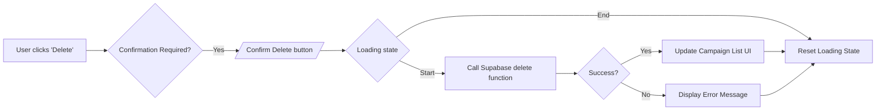
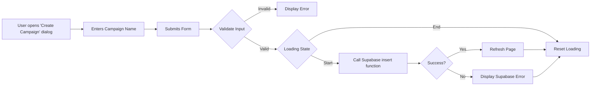

# Campaign Management

This section details the functionality for creating and managing campaigns within the QRly application. Campaigns are used to group and organize QR codes, allowing users to track and manage their QR code activities more effectively.

## Features

*   **Campaign Creation:** Users can create new campaigns with a unique name.
*   **Campaign Listing:**  Displays a list of existing campaigns with details such as creation date and associated QR codes.
*   **Campaign Deletion:** Users can delete campaigns that are no longer needed. Deleting a campaign does *not* delete the associated QR codes, offering flexibility.
*   **QR Code Association:**  Users can associate QR codes with specific campaigns, providing a clear organizational structure.

## Key Components

| Component           | Description                                                                                                               |
| ------------------- | ------------------------------------------------------------------------------------------------------------------------- |
| `CampaignList.jsx`  | Displays the list of campaigns and provides functionality for deleting campaigns and navigating to associated QR codes.  |
| `CreateCambtn.jsx` |  A button component that triggers a dialog for creating new campaigns.                                                |
| `CreateCam.jsx`     |  A form component used to create new campaigns, handling user input and interacting with the Supabase database.         |

## Code Snippets and Explanations

### Campaign List (`CampaignList.jsx`)

This component fetches and displays a list of campaigns. It also handles the deletion of campaigns.

```javascript
"use client";
import React, { useState } from 'react';
import Link from 'next/link';
import { Trash2 } from 'lucide-react';
import { supabaseBrowser } from '@/lib/supabase';
import { Button } from '../ui/button';
import CreateQrbtn from '../buttons/CreateQrbtn';
import CreateCambtn from './CreateCambtn';

function CampaignList({ cam }) {
  const [camp, setCamp] = useState(cam);
  const [loading, setLoading] = useState(false);

  const handleDelete = async (id) => {
    try {
      setLoading(true);
      const s = supabaseBrowser();
      const { error } = await s.from("campaigns").delete().eq("id", id);
      if (error) {
        console.log("Error", error);
        return;
      }
      setCamp((prev) => prev.filter((c) => c.id !== id));
      console.log("Deleted", id);
    } catch (error) {
      console.log(error);
    } finally {
      setLoading(false);
    }
  };

  return (
    <div className="p-4">
      <div className="grid grid-cols-1 sm:grid-cols-2 lg:grid-cols-3 gap-6">
        {camp.map((campaign) => (
          <div
            key={campaign.id}
            className="relative bg-[#E5E5CB] border border-[#3C2A21]/20 rounded-xl p-6 shadow-md hover:shadow-lg transition-shadow duration-300 max-w-sm"
          >
            <button
              onClick={() => handleDelete(campaign.id)}
              disabled={loading}
              className="absolute top-3 right-3 p-1.5 rounded-full hover:bg-red-100 transition-colors duration-200"
              aria-label="Delete Campaign"
            >
              <Trash2 className={`h-5 w-5 ${loading ? "text-red-300" : "text-red-500"}`} />
            </button>
            <h2 className="text-xl font-semibold text-[#1A120B] mb-3">{campaign.name}</h2>
            <p className="text-sm text-[#3C2A21] mb-4">
              Created: {campaign?.created_at
                ? new Date(campaign.created_at).toLocaleDateString("en-IN", {
                    year: "numeric",
                    month: "short",
                    day: "numeric",
                  })
                : "N/A"}
            </p>
            <div className="flex gap-3">
              <Link href={`/${campaign.id}`}>
                <Button className="bg-[#1A120B] text-[#E5E5CB] hover:bg-[#3C2A21] hover:text-[#E5E5CB] transition-colors duration-300 rounded-md px-4 py-2">
                  View QR's
                </Button>
              </Link>
              <CreateQrbtn defaultcamid={campaign.id} />
            </div>
          </div>
        ))}
      </div>
      <div className="flex flex-col sm:flex-row justify-center items-center gap-4 mt-8 w-full max-w-md mx-auto">
        <CreateCambtn />
        <CreateQrbtn defaultcamid={null} />
      </div>
    </div>
  );
}

export default CampaignList;
```

This snippet demonstrates the `handleDelete` function, which uses `supabaseBrowser()` to interact with the Supabase database, deleting a campaign based on its `id`.  The `setCamp` function updates the state to re-render the list without the deleted campaign.

[View on GitHub](https://github.com/kalpm1110/QRly/blob/main/qrly/src/components/campaign/CampaignList.jsx)

### Campaign Deletion Flow





### Create Campaign Button (`CreateCambtn.jsx`)

This component renders a button that, when clicked, opens a dialog for creating a new campaign.  It utilizes Radix UI for the dialog implementation.

```javascript
import React from 'react';
import * as Dialog from "@radix-ui/react-dialog";
import { Button } from '../ui/button';
import CreateCam from '../forms/CreateCam';

function CreateCambtn() {
  return (
    <Dialog.Root>
      <Dialog.Trigger asChild>
        <Button className="bg-[#1A120B] text-[#E5E5CB] hover:bg-[#3C2A21] transition-colors duration-300">
          Create New Campaign
        </Button>
      </Dialog.Trigger>
      <Dialog.Portal>
        <Dialog.Overlay className="fixed inset-0 bg-[#1A120B]/50 backdrop-blur-sm" />
        <Dialog.Content className="fixed top-1/2 left-1/2 w-[90%] max-w-md -translate-x-1/2 -translate-y-1/2 bg-[#E5E5CB] p-6 rounded-xl shadow-lg">
          <Dialog.Title className="text-xl font-semibold text-[#1A120B] mb-4">New Campaign</Dialog.Title>
          <CreateCam />
        </Dialog.Content>
      </Dialog.Portal>
    </Dialog.Root>
  );
}

export default CreateCambtn;
```

This snippet shows how `Dialog.Root`, `Dialog.Trigger`, `Dialog.Portal`, `Dialog.Overlay`, and `Dialog.Content` are used from Radix UI to create a modal dialog.  The `CreateCam` component (the form) is rendered inside the dialog.

[View on GitHub](https://github.com/kalpm1110/QRly/blob/main/qrly/src/components/campaign/CreateCambtn.jsx)

### Create Campaign Form (`CreateCam.jsx`)

This component provides a form for creating a new campaign. It handles user input, validates the input, and interacts with the Supabase database to create the campaign.

```javascript
"use client";
import React, { useState } from 'react';
import { Input } from '../ui/input';
import { Button } from '../ui/button';
import { useUser } from '@clerk/nextjs';
import { supabaseBrowser } from '@/lib/supabase';

function CreateCam() {
  const { user } = useUser();
  const [name, setname] = useState("");
  const [loading, setloading] = useState(false);
  const [error, setError] = useState("");

  const handleSubmit = async (e) => {
    e.preventDefault();
    if (!user) return;
    if (!name.trim()) {
      setError("Campaign name is required");
      return;
    }
    setloading(true);
    setError("");
    try {
      const supabase = supabaseBrowser();
      const { data, error: supabaseError } = await supabase
        .from("campaigns")
        .insert({ owner_id: user.id, name: name.trim() })
        .select()
        .single();
      if (supabaseError) {
        console.error("Supabase error:", supabaseError);
        setError(supabaseError.message || "Failed to create campaign");
      } else {
        console.log("Campaign created:", data);
        setname("");
        window.location.reload();
      }
    } catch (err) {
      console.error("Unexpected error:", err);
      setError("An unexpected error occurred. Please try again.");
    } finally {
      setloading(false);
    }
  };

  return (
    <form onSubmit={handleSubmit} className="space-y-4">
      <div>
        <Input
          placeholder="Campaign Name"
          value={name}
          onChange={(e) => setname(e.target.value)}
          className={`bg-[#E5E5CB] border-[#3C2A21]/20 focus:border-[#3C2A21] focus:ring-[#D5CEA3] ${error ? "border-[#3C2A21] border-2" : ""}`}
        />
        {error && (
          <p className="text-[#3C2A21] text-sm mt-1">{error}</p>
        )}
      </div>
      <Button
        type="submit"
        disabled={loading}
        className="w-full bg-[#1A120B] text-[#E5E5CB] hover:bg-[#3C2A21] transition-colors duration-300"
      >
        {loading ? "Creating..." : "Create Campaign"}
      </Button>
    </form>
  );
}

export default CreateCam;
```

The `handleSubmit` function is crucial.  It retrieves the user information using `useUser()`, validates the campaign name, and then uses `supabaseBrowser()` to insert the new campaign into the "campaigns" table.  Error handling is also implemented.  `window.location.reload()` refreshes the page after successful campaign creation.

[View on GitHub](https://github.com/kalpm1110/QRly/blob/main/qrly/src/components/forms/CreateCam.jsx)

### Supabase Interaction

```javascript
const supabase = supabaseBrowser();
const { data, error: supabaseError } = await supabase
  .from("campaigns")
  .insert({ owner_id: user.id, name: name.trim() })
  .select()
  .single();
```

This snippet shows the core Supabase interaction for inserting a new campaign.  `owner_id` is set to the current user's ID, and `name` is set to the campaign name entered by the user. `.select().single()` retrieves the newly inserted row.

### Campaign Creation Flow





### State Management

```javascript
const [name, setname] = useState("");
const [loading, setloading] = useState(false);
const [error, setError] = useState("");
```

This snippet demonstrates the use of `useState` hooks to manage the form's state, including the campaign name, loading state, and any error messages.

## Key Integration Points

*   **Supabase:** The campaign management functionality relies heavily on Supabase for data storage and retrieval. Ensure that the Supabase client is properly initialized and configured.
*   **Clerk:** User authentication is handled by Clerk. The `useUser` hook is used to retrieve the current user's ID, which is then associated with the created campaign.
*   **Radix UI:** Radix UI is used for creating the dialog for campaign creation.

## Best Practices

*   **Input Validation:**  Always validate user input to prevent errors and security vulnerabilities.
*   **Error Handling:** Implement proper error handling to gracefully handle unexpected errors and provide informative feedback to the user.
*   **Loading States:**  Use loading states to provide visual feedback to the user during asynchronous operations.
*   **Database Interactions:**  Minimize the number of database interactions to improve performance.
```