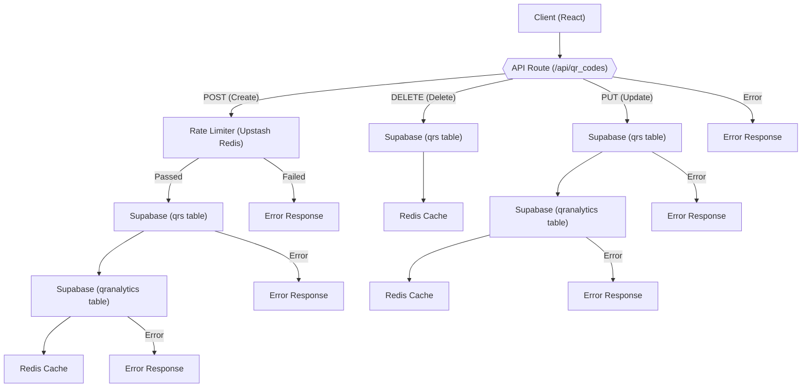

# API and Backend Logic

This section describes the API endpoints and backend services powering the QRly application. We'll delve into the logic behind QR code creation, retrieval, modification, and deletion, as well as the rate limiting and database interactions that ensure a smooth and reliable user experience.

## API Endpoints

The primary API endpoint for managing QR codes is located at `qrly/src/app/api/qr_codes/route.js`. This route handles `POST`, `DELETE`, and `PUT` requests, corresponding to QR code creation, deletion, and updating respectively.

### QR Code Creation (POST)

The `POST` method handles the creation of new QR codes. Let's examine the core logic:

```javascript title="qrly/src/app/api/qr_codes/route.js"
import { createQrRateLimiter } from "@/lib/rateLimit";
import redis from "@/lib/redis";
import { genslug } from "@/lib/slug";
import { supabaseServer } from "@/lib/supabase";

export async function POST(req) {
  try {
    const body = await req.json();
    const {success,limit,remaining,reset}=await createQrRateLimiter.limit(body.owner_id);
    if(!success){
      return Response.json({error:"Rate Limit Exceeded for Qr Creation"}, {status:429});
    }
    const s = supabaseServer();
    let slug = genslug(7);
    for (let i = 0; i < 5; i++) {
      const { data: existing } = await s.from("qrs").select("id").eq("slug", slug).maybeSingle();
      if (!existing) break;
      slug = genslug(7);
    }

    const insertLoad = {
      title: body.title,
      owner_id: body.owner_id,
      slug,
      campaign_id: body.campaign_id || null,
      url: body.url,
      max_scans: body.max_scans,
      expires_at: body.expires_at,
    };
    const { data, error } = await s.from("qrs").insert(insertLoad).select("*").single();
    if (error) return Response.json({ error: error.message }, { status: 400 });
    const shortUrl = `${process.env.NEXT_PUBLIC_APP_URL}/r/${slug}`;
    // ... analytics insertion and redis caching
    return Response.json({ qr: data, short_url: shortUrl });
  } catch (err) {
    console.error("Error creating QR:", err);
    return Response.json({ error: err.message }, { status: 500 });
  }
}
```

[View on GitHub](https://github.com/kalpm1110/QRly/blob/main/qrly/src/app/api/qr_codes/route.js)

This code snippet demonstrates the following:

1.  **Rate Limiting:**  The `createQrRateLimiter` is used to prevent abuse by limiting the number of QR codes a user can create within a given timeframe.
2.  **Slug Generation:** A unique slug (short identifier) is generated for each QR code using the `genslug` function and verified against existing slugs in the database to ensure uniqueness.
3.  **Database Insertion:**  The QR code data is inserted into the `qrs` table using Supabase.
4.  **Analytics Tracking:** Inserts a record into the `qranalytics` table for tracking QR code usage.
5.  **Redis Caching:** Caches QR code data in Redis for faster retrieval.

### QR Code Deletion (DELETE)

The `DELETE` method handles the deletion of existing QR codes.

```javascript title="qrly/src/app/api/qr_codes/route.js"
export async function DELETE(req) {
  try {
    const body = await req.json();
    const s = supabaseServer();
    const { data: qr, error: findErr } = await s
      .from("qrs")
      .select("id, slug")
      .eq("id", body.qrId)
      .maybeSingle();

    if (findErr) {
      return Response.json({ error: findErr.message }, { status: 400 });
    }
    if (!qr) {
      return Response.json({ error: "QR not found" }, { status: 404 });
    }

    const { error: delErr } = await s.from("qrs").delete().eq("id", qr.id);
    if (delErr) {
      return Response.json({ error: delErr.message }, { status: 400 });
    }
    await redis.del(
      `qr:${qr.slug}:aval`,
      `qr:${qr.slug}:scans`,
      `qr:${qr.slug}:url`,
      `qr:${qr.slug}:max_scans`,
      `qr:${qr.slug}:id`
    );

    return Response.json({ msg: "QR deleted successfully" });
  } catch (err) {
    console.error("Error deleting QR:", err);
    return Response.json({ error: err.message }, { status: 500 });
  }
}
```

[View on GitHub](https://github.com/kalpm1110/QRly/blob/main/qrly/src/app/api/qr_codes/route.js)

This code snippet performs the following actions:

1.  **QR Code Retrieval:** Retrieves the QR code from the database based on its ID.
2.  **Database Deletion:** Deletes the QR code from the `qrs` table.
3.  **Cache Invalidation:** Removes the QR code data from the Redis cache.

### QR Code Update (PUT)

The `PUT` method allows updating existing QR codes.

```javascript title="qrly/src/app/api/qr_codes/route.js"
export async function PUT(req) {
  try {
    const body = await req.json();
    const s = supabaseServer();
    const { data, error } = await s
      .from("qrs")
      .update({
        title: body.title,
        url: body.url,
        max_scans: body.max_scans,
        expires_at: body.expires_at,
        campaign_id: body.campaign_id ?? null,
      })
      .eq("id", body.qrId)
      .select("*")
      .single();

    if (error) {
      return Response.json({ error: error.message }, { status: 400 });
    }

    await s
      .from("qranalytics")
      .update({
        title: data.title,
        campaign_id: data.campaign_id ?? null,
        target_url: data.url,
        expire_at: data.expires_at,
        max_scans: body.max_scans,
      })
      .eq("qr_id", data.id);
    // ...redis cache update

    return Response.json({ updatedQR: data });
  } catch (err) {
    console.error("Error updating QR:", err);
    return Response.json({ error: err.message }, { status: 500 });
  }
}
```

[View on GitHub](https://github.com/kalpm1110/QRly/blob/main/qrly/src/app/api/qr_codes/route.js)

The update process involves:

1.  **Database Update:** Updates the QR code details in the `qrs` table.
2.  **Analytics Update:** Updates the corresponding record in the `qranalytics` table.
3.  **Cache Update:** Updates the cached values in Redis to reflect the changes.

## Rate Limiting

To prevent abuse and ensure fair usage, the application employs rate limiting using Upstash Redis. The rate limiting logic is defined in `qrly/src/lib/rateLimit.js`.

```javascript title="qrly/src/lib/rateLimit.js"
import { Ratelimit } from "@upstash/ratelimit";
import redis from "@/lib/redis";
export const scanRateLimiter = new Ratelimit({
    redis,
    limiter:Ratelimit.slidingWindow(6,"1 m"),
    analytics:true,
})
export const createQrRateLimiter = new Ratelimit({
    redis,
    limiter:Ratelimit.fixedWindow(100,'1 h'),
    analytics:true,
});
```

[View on GitHub](https://github.com/kalpm1110/QRly/blob/main/qrly/src/lib/rateLimit.js)

Two rate limiters are defined:

*   **`scanRateLimiter`**: Limits the number of scans from a single IP address to 6 per minute using a sliding window algorithm.
*   **`createQrRateLimiter`**: Limits the number of QR codes a user can create to 100 per hour using a fixed window algorithm.

## Supabase Integration

Supabase is used as the primary database for storing QR code data and analytics.  The `supabaseServer` function in `qrly/src/lib/supabase.js` provides a server-side Supabase client with elevated privileges (using the service role key).

```javascript title="qrly/src/lib/supabase.js"
import { createClient } from "@supabase/supabase-js";

export const supabaseBrowser = () =>
  createClient(
    process.env.NEXT_PUBLIC_SUPABASE_URL,
    process.env.NEXT_PUBLIC_SUPABASE_ANON_KEY
  );

export const supabaseServer = () =>
  createClient(
    process.env.NEXT_PUBLIC_SUPABASE_URL,
    process.env.SUPABASE_SERVICE_ROLE_KEY
  );
```

[View on GitHub](https://github.com/kalpm1110/QRly/blob/main/qrly/src/lib/supabase.js)

This setup allows secure database interactions from the backend, bypassing row level security(RLS) policies, when needed, for administrative operations.

## Redis Caching

Redis is used for caching QR code data to improve performance and reduce database load.  The following snippet shows how Redis is used to store if the QR is available, the number of scans, original URL, maximum scans allowed and the id of the QR code.

```javascript title="qrly/src/app/api/qr_codes/route.js"
    const ttlSec = data.expires_at
      ? Math.floor((new Date(data.expires_at).getTime() - Date.now()) / 1000)
      : null;
    if (ttlSec && ttlSec > 0) {
      await redis.set(`qr:${data.slug}:aval`, 1, { ex: ttlSec });
      await redis.set(`qr:${data.slug}:scans`, 0, { ex: ttlSec });
      await redis.set(`qr:${data.slug}:url`, data.url, { ex: ttlSec });
      await redis.set(`qr:${data.slug}:max_scans`, Number(data.max_scans), { ex: ttlSec });
      await redis.set(`qr:${data.slug}:id`, data.id, { ex: ttlSec });
    } else {
      await redis.set(`qr:${data.slug}:aval`, 1);
      await redis.set(`qr:${data.slug}:scans`, 0);
      await redis.set(`qr:${data.slug}:url`, data.url);
      await redis.set(`qr:${data.slug}:max_scans`, Number(data.max_scans));
      await redis.set(`qr:${data.slug}:id`, data.id);
    }

```

[View on GitHub](https://github.com/kalpm1110/QRly/blob/main/qrly/src/app/api/qr_codes/route.js)

Data is cached using the QR code's slug as part of the key (`qr:${data.slug}:*`).  The cache entries are configured with a Time-To-Live (TTL) based on the QR code's expiration date, if one is set.

## Workflow Diagram





## Key Integration Points

*   **Rate Limiting and Security**:  The rate limiting mechanism is crucial for preventing abuse and ensuring the stability of the application. Using different rate limiters for different operations (scanning vs. creation) allows for fine-grained control.

*   **Database Interactions and Data Consistency**: Supabase provides a robust and scalable database solution.  The application ensures data consistency by updating both the `qrs` and `qranalytics` tables whenever a QR code is created or updated.

*   **Caching Strategy**: Redis significantly improves performance by caching frequently accessed QR code data. The TTL-based caching strategy ensures that the cache remains consistent with the database, especially regarding expiring QR codes. Proper cache invalidation on updates and deletes is essential for preventing stale data.

*   **Error Handling**: The API routes include comprehensive error handling to gracefully manage potential issues and provide informative error messages to the client.

By carefully integrating these components, QRly provides a reliable and efficient QR code management service.
```