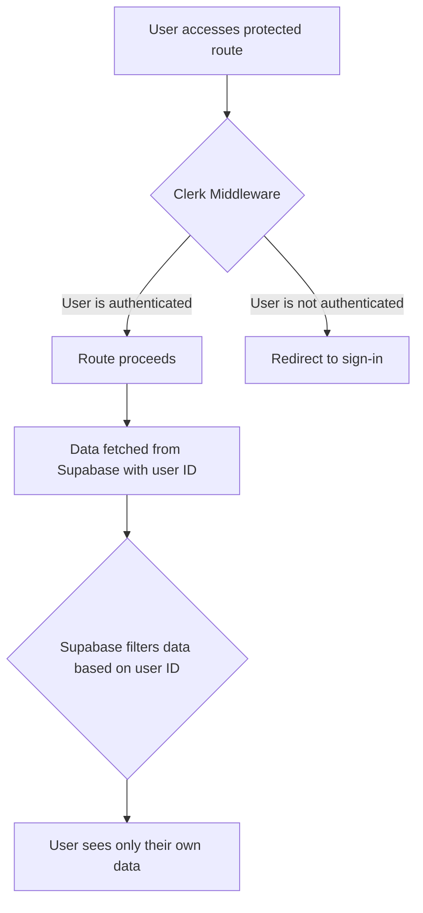

# Authentication and Authorization

This document outlines the authentication and authorization mechanisms employed in QRly to secure user data and ensure that only authorized users can access specific resources. QRly leverages Clerk for authentication and manages user roles and permissions within its Supabase database.

## Authentication with Clerk

QRly uses Clerk, a popular authentication and user management platform, to handle user registration, login, and session management. Clerk provides a seamless authentication experience and simplifies the process of integrating authentication into a Next.js application.

### Clerk Middleware

The `src/middleware.js` file configures Clerk's middleware to protect routes that require authentication.

```javascript title="src/middleware.js"
import { clerkMiddleware, createRouteMatcher } from '@clerk/nextjs/server';

const isPublicRoute = createRouteMatcher(['/sign-in(.*)', '/sign-up(.*)', '/', '/r(.*)','/about(.*)']);

export default clerkMiddleware(async (auth, req) => {
  if (!isPublicRoute(req)) {
    await auth.protect();
  }
});

export const config = {
  matcher: [
    '/((?!_next|[^?]*\\.(?:html?|css|js(?!on)|jpe?g|webp|png|gif|svg|ttf|woff2?|ico|csv|docx?|xlsx?|zip|webmanifest)).*)',
    '/(api|trpc)(.*)',"/:camid"
  ],
};
```

[View on GitHub](https://github.com/kalpm1110/QRly/blob/main/qrly/src/middleware.js)

The `clerkMiddleware` function is the core of the authentication process.  It intercepts incoming requests and checks if the route is public.  If the route is not public, `auth.protect()` is called, which verifies the user's authentication status. If the user is not authenticated, they are redirected to the sign-in page.  The `config` object specifies the routes that the middleware should apply to, effectively protecting all routes except those explicitly defined as public.

### Protected Pages

The `dashboard/page.jsx` and `yourqrs/page.jsx` files demonstrate how to protect specific pages by checking the user's authentication status using `currentUser()` from `@clerk/nextjs/server`.

```javascript title="src/app/dashboard/page.jsx"
import { currentUser } from "@clerk/nextjs/server";
import CampaignList from "@/components/campaign/CampaignList";
import { supabaseServer } from "@/lib/supabase";
import Dashboard from "@/components/Dashboard";

export default async function DashBoard() {
  const user = await currentUser();
  if (!user) {
    return (
      <div className="min-h-screen bg-[#E5E5CB] flex items-center justify-center">
        <div className="bg-[#1A120B] text-[#E5E5CB] p-6 rounded-lg shadow-lg">
          <p className="text-lg">Please sign in to access the dashboard</p>
        </div>
      </div>
    );
  }

  const supabase = supabaseServer();

  const { data: cam } = await supabase
    .from("campaigns")
    .select("*")
    .eq("owner_id", user.id)
    .order("created_at", { ascending: false });

  const { data: onlyqrs } = await supabase
    .from("qrs")
    .select("*")
    .eq("owner_id", user.id)
    .is("campaign_id", null)
    .order("created_at", { ascending: false });
  console.log(user.id);

  return (
    <div className="min-h-screen  p-6 max-w-7xl mx-auto">
      <h1 className="text-3xl font-bold text-[#1A120B] mb-6">
        Welcome, {user.firstName}!
      </h1>
      <CampaignList cam={cam || []} onlyqrs={onlyqrs || []} />
      {/* <Dashboard user={user} campaigns={cam || []} individualQRs={onlyqrs || []} ></Dashboard> */}
    </div>
  );
}
```

[View on GitHub](https://github.com/kalpm1110/QRly/blob/main/qrly/src/app/dashboard/page.jsx)

```javascript title="src/app/yourqrs/page.jsx"
import { currentUser } from "@clerk/nextjs/server";
import { QRList } from "@/components/QR/QRList";
import { supabaseServer } from "@/lib/supabase";

export default async function AllQrs() {
  const user = await currentUser();

  if (!user) {
    return (
      <div className="min-h-screen bg-[#E5E5CB] flex items-center justify-center">
        <div className="bg-[#1A120B] text-[#E5E5CB] p-6 rounded-lg shadow-lg">
          <p className="text-lg">Please sign in to view your QR codes</p>
        </div>
      </div>
    );
  }
  const s = supabaseServer();
  const { data: qrs, error } = await s
    .from("qranalytics")
    .select("id, url, qr_id, total_scans, expire_at, campaign_id, target_url, title, user_id, max_scans")
    .eq("user_id", user.id);

  if (error) return <div>Error in fetching from DB</div>
  return (
    <div className="min-h-screen  p-6 max-w-7xl mx-auto">
      {/* <h1 className="text-3xl text-center font-bold text-[#1A120B] mb-6">Your QR Codes</h1> */}
      <QRList userid={user.id} initailData={qrs} />
    </div>
  );
}
```

[View on GitHub](https://github.com/kalpm1110/QRly/blob/main/qrly/src/app/yourqrs/page.jsx)

These pages fetch the current user using `currentUser()`. If no user is found, a message is displayed prompting the user to sign in. This ensures that only authenticated users can access the dashboard and their QR code data.

## Authorization with Supabase

Once a user is authenticated via Clerk, QRly uses Supabase to manage access control. User IDs obtained from Clerk are used to filter data and ensure that users can only access resources they own.

### Data Filtering

In `dashboard/page.jsx` and `yourqrs/page.jsx`, the `user.id` obtained from Clerk is used to filter data fetched from Supabase.

```javascript title="src/app/dashboard/page.jsx (Data Fetching)"
  const { data: cam } = await supabase
    .from("campaigns")
    .select("*")
    .eq("owner_id", user.id)
    .order("created_at", { ascending: false });

  const { data: onlyqrs } = await supabase
    .from("qrs")
    .select("*")
    .eq("owner_id", user.id)
    .is("campaign_id", null)
    .order("created_at", { ascending: false });
```

```javascript title="src/app/yourqrs/page.jsx (Data Fetching)"
  const { data: qrs, error } = await s
    .from("qranalytics")
    .select("id, url, qr_id, total_scans, expire_at, campaign_id, target_url, title, user_id, max_scans")
    .eq("user_id", user.id);
```

These snippets demonstrate how the `user.id` is used in Supabase queries to retrieve only the campaigns, QR codes, and analytics data associated with the logged-in user. The `.eq("owner_id", user.id)` and `.eq("user_id", user.id)` clauses in the Supabase queries ensure that users only have access to their own data.

### Authentication Flow





## Auth0 configuration (Not in use)

The `src/lib/auth0.js` file attempts to configure Auth0, however based on analysis of the project code, Clerk is used instead of Auth0.

```javascript title="src/lib/auth0.js"
import { initAuth0 } from '@auth0/nextjs-auth0';

export const auth0 = initAuth0({
  secret: process.env.AUTH0_SECRET,
  baseURL: process.env.NEXT_PUBLIC_APP_URl,
  clientID: process.env.AUTH0_CLIENT_ID,
  issuerBaseURL: process.env.AUTH0_ISSUER_BASE_URL,
  clientSecret: process.env.AUTH0_CLIENT_SECRET,
});
```

[View on GitHub](https://github.com/kalpm1110/QRly/blob/main/qrly/src/lib/auth0.js)

## Key Integration Points

- **Clerk for Authentication:** Clerk handles the complexities of user authentication, providing a secure and user-friendly experience.
- **Supabase for Authorization:** Supabase enforces authorization rules by filtering data based on the user ID, ensuring data privacy and security.
- **Middleware Protection:** The Clerk middleware protects routes by verifying the user's authentication status before granting access.

By combining Clerk and Supabase, QRly implements a robust authentication and authorization system that effectively protects user data and ensures that only authorized users can access specific resources. This approach simplifies development and provides a scalable and secure foundation for the application.