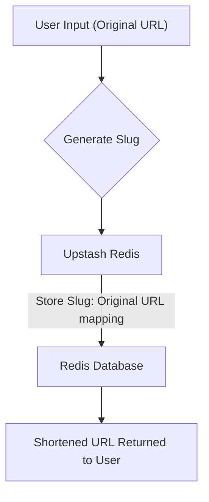
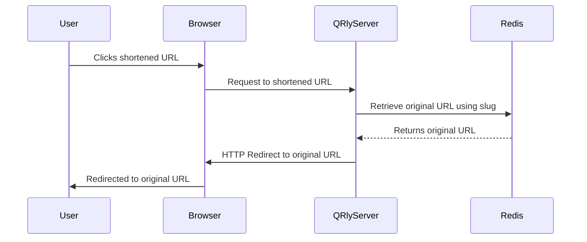

# Utilities and Libraries

This section provides an overview of the utility functions and libraries used in the QRly project. These components facilitate various tasks such as class name management, slug generation, and interaction with the Redis database.

## Utility Functions

### `cn` - Class Name Utility

The `cn` function, defined in `qrly/src/lib/utils.js`, simplifies the process of conditionally applying CSS classes using `clsx` and `tailwind-merge`.

```javascript
import { clsx } from "clsx";
import { twMerge } from "tailwind-merge"

export function cn(...inputs) {
  return twMerge(clsx(inputs));
}
```

*   **`clsx`**: A utility for constructing `className` strings conditionally.
*   **`tailwind-merge`**: A utility to merge Tailwind CSS classes, resolving conflicts and ensuring the final class names are optimized.

The function accepts a variable number of arguments, which are passed to both `clsx` and `tailwind-merge`. This allows for a concise way to define and apply CSS classes based on different conditions.

[View on GitHub](https://github.com/kalpm1110/QRly/blob/main/qrly/src/lib/utils.js)

**Usage Example:**

```javascript
import { cn } from "@/lib/utils";

function Button({ children, className, ...props }) {
  return (
    <button className={cn("px-4 py-2 rounded-md", className)} {...props}>
      {children}
    </button>
  );
}

export default Button;
```

In this example, `cn` merges the base classes `"px-4 py-2 rounded-md"` with any additional classes provided through the `className` prop.

### `genslug` - Slug Generation

The `genslug` function, located in `qrly/src/lib/slug.js`, generates a random alphanumeric string of a specified length. This is used for creating unique slugs for shortened URLs.

```javascript
export function genslug(len=7) {
    const alphabet = "abcdefghijklmnopqrstuvwxyzABCDEFGHIJKLMNOPQRSTUVWXYZ0123456789";
    let s="";
    for(let i=0;i<len;i++) s+=alphabet[Math.floor(Math.random()*alphabet.length)];
    return s;
    
}
```

*   **`len`**: The desired length of the slug (default is 7).
*   **`alphabet`**: A string containing all possible characters for the slug.

The function iterates `len` times, randomly selecting a character from the `alphabet` and appending it to the resulting string `s`.

[View on GitHub](https://github.com/kalpm1110/QRly/blob/main/qrly/src/lib/slug.js)

**Usage Example:**

```javascript
import { genslug } from "@/lib/slug";

const newSlug = genslug();
console.log(newSlug); // Output: A random 7-character string, e.g., "aBcDeFg"
```

## Redis Integration

### `redis` - Upstash Redis Client

The `redis` object, defined in `qrly/src/lib/redis.js`, is an instance of the Upstash Redis client. It is used to interact with the Redis database for storing and retrieving data related to shortened URLs.

```javascript
import { Redis } from "@upstash/redis";

const redis = new Redis({
  url: process.env.UPSTASH_REDIS_REST_URL,
  token: process.env.UPSTASH_REDIS_REST_TOKEN,
});

export default redis;
```

*   **`@upstash/redis`**: The Upstash Redis client library.
*   **`UPSTASH_REDIS_REST_URL`**: Environment variable containing the URL of the Upstash Redis instance.
*   **`UPSTASH_REDIS_REST_TOKEN`**: Environment variable containing the authentication token for the Upstash Redis instance.

The `redis` object is configured with the URL and token obtained from environment variables. This allows the application to securely connect to the Redis database.

[View on GitHub](https://github.com/kalpm1110/QRly/blob/main/qrly/src/lib/redis.js)

**Configuration:**
To use the Redis client, you must configure environment variables for your Upstash Redis instance. Here's an example of setting these variables (typically in a `.env` or similar configuration file):

```plaintext
UPSTASH_REDIS_REST_URL=YOUR_UPSTASH_REDIS_REST_URL
UPSTASH_REDIS_REST_TOKEN=YOUR_UPSTASH_REDIS_REST_TOKEN
```

**Usage Example:**

```javascript
import redis from "@/lib/redis";

async function getOriginalUrl(slug) {
  const originalUrl = await redis.get(slug);
  return originalUrl;
}
```

This example demonstrates how to retrieve the original URL associated with a given slug from the Redis database.

## Data Flow Diagram

Here's a diagram illustrating the data flow when a user shortens a URL:





## Key Integration Points

### Short URL Creation Flow

The `genslug` function and the `redis` client are crucial components in the process of creating a shortened URL. The flow typically involves:

1.  User provides a long URL.
2.  The `genslug` function generates a unique slug.
3.  The `redis` client stores the mapping between the slug and the original URL in the Redis database.
4.  The shortened URL (e.g., `https://qrly.com/{slug}`) is returned to the user.

### Redirection Flow

When a user accesses a shortened URL, the application retrieves the original URL from the Redis database using the slug, and then redirects the user to the original URL.





### Best Practices

*   **Environment Variables**: Always use environment variables to store sensitive information such as API keys and database credentials.
*   **Error Handling**: Implement robust error handling to gracefully handle potential issues such as Redis connection errors or slug generation conflicts.
*   **Slug Uniqueness**: Implement a mechanism to ensure slug uniqueness, such as checking if a slug already exists in the database before using it.
*   **Rate Limiting**: Implement rate limiting to prevent abuse of the URL shortening service.
*   **Validation**: Validate user input to prevent malicious URLs from being shortened.
```