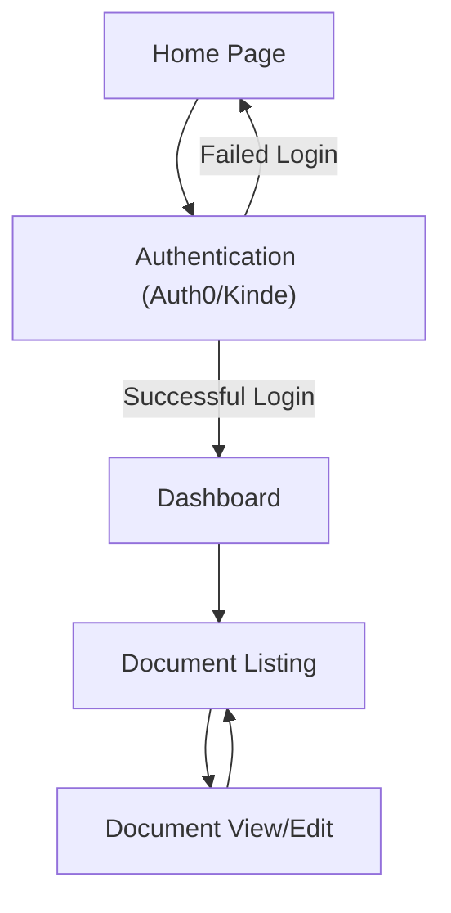
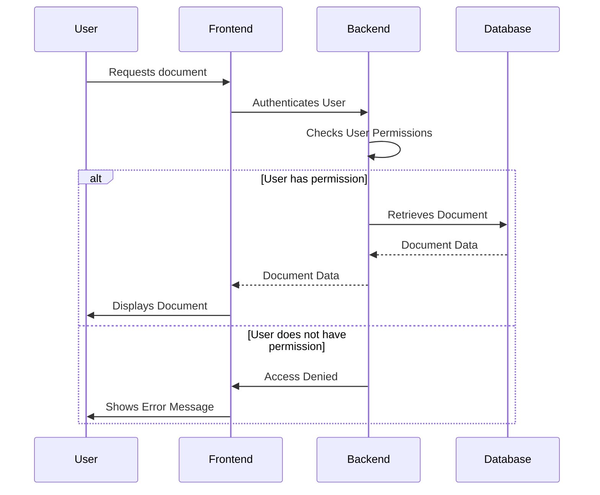

---
title: Project Setup and Configuration
description: Instructions for setting up the development environment and configuring essential settings for SafeDocs.
---

# Project Setup and Configuration

This document provides instructions for setting up the development environment and configuring essential settings for the `kalpm1110/SafeDocs` project. This project is a Next.js application leveraging various modern web development tools and libraries.

## Development Environment Setup

To get started with `SafeDocs`, you'll need to set up your local development environment. Ensure you have the following prerequisites installed:

-   Node.js (version >= 18)
-   npm or yarn package manager

### Initial Steps

1.  **Clone the repository:**

    ```bash
    git clone https://github.com/kalpm1110/SafeDocs.git
    cd SafeDocs
    ```

    [View on GitHub](https://github.com/kalpm1110/SafeDocs/blob/main/)

2.  **Install dependencies:**

    Using npm:

    ```bash
    npm install
    ```

    or using yarn:

    ```bash
    yarn install
    ```

### Configuration Files

Several configuration files are crucial for the proper functioning of the `SafeDocs` project.

#### `package.json`

This file contains metadata about the project, including dependencies and scripts for running the application.

```json
{
  "name": "safedocs",
  "type": "module",
  "version": "0.1.0",
  "private": true,
  "scripts": {
    "dev": "next dev",
    "build": "next build",
    "start": "next start",
    "lint": "next lint",
    "dev:s": "node src/server.mjs",
    "build:s": "next build",
    "start:s": "cross-env NODE_ENV=production node src/server.mjs"
  },
  "dependencies": {
    "@auth0/nextjs-auth0": "^4.9.0",
    "@chakra-ui/react": "^3.24.2",
    "@emotion/react": "^11.14.0",
    "@emotion/styled": "^11.14.1",
    "@kinde-oss/kinde-auth-nextjs": "^2.8.6",
    "@radix-ui/react-dialog": "^1.1.15",
    // ... other dependencies
  },
  "devDependencies": {
    "@eslint/eslintrc": "^3",
    "@tailwindcss/postcss": "^4",
    "@types/react": "19.1.10",
    // ... other dev dependencies
  }
}
```

[View on GitHub](https://github.com/kalpm1110/SafeDocs/blob/main/package.json)

The `scripts` section defines commands for common development tasks such as starting the development server (`dev`), building the application for production (`build`), running the linter (`lint`), and starting the server in production mode (`start:s`). Note the use of `cross-env` to set the `NODE_ENV` environment variable for production.

#### `jsconfig.json`

This file is used by VS Code and other IDEs to provide better code completion and navigation.

```json
{
  "compilerOptions": {
    "paths": {
      "@/*": ["./src/*"]
    }
  }
}
```

[View on GitHub](https://github.com/kalpm1110/SafeDocs/blob/main/jsconfig.json)

The `"paths"` property defines a path alias, allowing you to import modules from the `src` directory using the `@` prefix, making imports cleaner and more maintainable. For example:

```javascript
import MyComponent from "@/components/MyComponent";
```

#### `.env` Files

Environment variables are essential for configuring various aspects of the application, such as API keys, database connections, and authentication settings. While the repository doesn't directly contain `.env` files (for security reasons), you'll need to create your own `.env.local` file in the root directory.

**Example `.env.local`:**

```plaintext
NEXT_PUBLIC_SUPABASE_URL=your_supabase_url
NEXT_PUBLIC_SUPABASE_ANON_KEY=your_supabase_anon_key
NEXT_PUBLIC_AUTH0_DOMAIN=your_auth0_domain
NEXT_PUBLIC_AUTH0_CLIENT_ID=your_auth0_client_id
AUTH0_CLIENT_SECRET=your_auth0_client_secret
AUTH0_ISSUER_BASE_URL=your_auth0_issuer_base_url
AUTH0_SECRET=a_very_long_and_random_string
NEXT_PUBLIC_KIND_CLIENT_ID=your_kinde_client_id
KINDE_CLIENT_SECRET=your_kinde_client_secret
```

These environment variables are used to configure:

*   Supabase: Database URL and key
*   Auth0: Authentication domain, client ID, client secret and issuer base URL
*   Kinde: Authentication client ID and secret

Ensure you replace these placeholder values with your actual credentials.

**Note:** Store this file in your computers and remember to add it to `.gitignore` to prevent sensitive information from being committed to your repository.

### Running the Application

1.  **Start the development server:**

    ```bash
    npm run dev
    ```

    This command starts the Next.js development server, typically on `http://localhost:3000`.

2.  **Access the application:**

    Open your web browser and navigate to the address provided by the development server.

## Key Integration Points

The `SafeDocs` project integrates several key services and libraries to provide a secure and functional documentation platform.

### Authentication

The project supports multiple authentication providers, including Auth0 and Kinde, handled by NextAuth.js.

```javascript
// Example integration
import { useUser } from '@auth0/nextjs-auth0';

function Profile() {
  const { user, error, isLoading } = useUser();

  if (isLoading) return <div>Loading...</div>;
  if (error) return <div>Error: {error.message}</div>;

  if (user) {
    return (
      <div>
        Hello {user.name}
      </div>
    );
  }

  return <a href="/api/auth/login">Login</a>;
}
```

This snippet demonstrates how to use the `@auth0/nextjs-auth0` library to fetch user information and conditionally render content based on the authentication state.

### Database Integration

Supabase is used as the primary database for storing and managing documentation content.

```javascript
// Example Supabase client initialization
import { createClient } from '@supabase/supabase-js';

const supabaseUrl = process.env.NEXT_PUBLIC_SUPABASE_URL;
const supabaseKey = process.env.NEXT_PUBLIC_SUPABASE_ANON_KEY;
const supabase = createClient(supabaseUrl, supabaseKey);

export default supabase;
```

This code initializes the Supabase client using environment variables.

### Socket.IO for Real-time Updates

Socket.IO is utilized for real-time communication, enabling features like collaborative editing and live updates.

```javascript
// Example Socket.IO client setup
import { io } from 'socket.io-client';

const socket = io(process.env.NEXT_PUBLIC_SOCKET_IO_URL);

socket.on('connect', () => {
  console.log('Connected to Socket.IO server');
});
```

This snippet shows how to establish a connection to the Socket.IO server.

### Tailwind CSS and Chakra UI for Styling

The project uses a combination of Tailwind CSS and Chakra UI for styling. Tailwind provides low-level utility classes for fine-grained control, while Chakra UI offers pre-built, accessible components.

```typescript
// Example using Tailwind CSS
<div className="bg-gray-100 p-4 rounded-md shadow-md">
  <h2 className="text-lg font-semibold text-gray-800">Document Title</h2>
  <p className="text-gray-700">This is a sample document.</p>
</div>

//Example using Chakra UI
import { Box, Heading, Text } from "@chakra-ui/react"

function SampleComponent() {
  return (
    <Box bg="gray.100" p={4} borderRadius="md" boxShadow="md">
      <Heading fontSize="lg" fontWeight="semibold" color="gray.800">Document Title</Heading>
      <Text color="gray.700">This is a sample document.</Text>
    </Box>
  )
}

export default SampleComponent
```

This example demonstrates basic styling using both Tailwind CSS and Chakra UI components.

### Navigation Flow

The following Mermaid diagram illustrates the basic navigation flow of the application:





This diagram shows how users navigate from the home page, through the authentication process, to the dashboard and document management pages.

### Dependency Injection using Tsyringe
```typescript
import 'reflect-metadata'; // Required for Tsyringe

import { container, injectable } from 'tsyringe';

@injectable()
class Logger {
  log(message: string) {
    console.log(`[LOG]: ${message}`);
  }
}

class MyService {
  constructor(private logger: Logger) {}

  doSomething() {
    this.logger.log('Doing something important!');
  }
}

container.register(Logger, { useClass: Logger });
const myService = container.resolve(MyService);

myService.doSomething();
```

This example uses Tsyringe for dependency injection.  `Logger` is registered with the `container`, and `MyService` depends on it.  Tsyringe resolves and injects the dependencies automatically.  This is good practice for managing dependencies and promoting testability.

[View on GitHub](https://github.com/kalpm1110/SafeDocs/blob/main/package.json)

### Secure Storage and Management

SafeDocs aims to provide a secure environment for managing and storing documentation. This involves considerations for data encryption, access control, and auditing. The specific implementation details for these security measures would be located within the backend services and authentication layers of the application.





This sequence diagram illustrates the process of a user requesting a document, the authentication and permission checks performed by the backend, and the retrieval of the document from the database, ensuring that only authorized users can access the content.

## Best Practices

*   **Follow Next.js conventions:** Adhere to the Next.js file structure and best practices for routing, data fetching, and API endpoints.
*   **Use environment variables:** Store sensitive information and configuration settings in environment variables, and avoid committing them to the repository.
*   **Implement robust authentication and authorization:** Use a reliable authentication provider like Auth0 or Kinde, and implement fine-grained access control to protect documentation content.
*   **Write modular and reusable code:** Break down the application into smaller, independent components to improve maintainability and testability.
*   **Write unit and integration tests:** Ensure the reliability and correctness of the application by writing comprehensive tests.

By following these guidelines, you can set up a robust and secure development environment for SafeDocs.
```