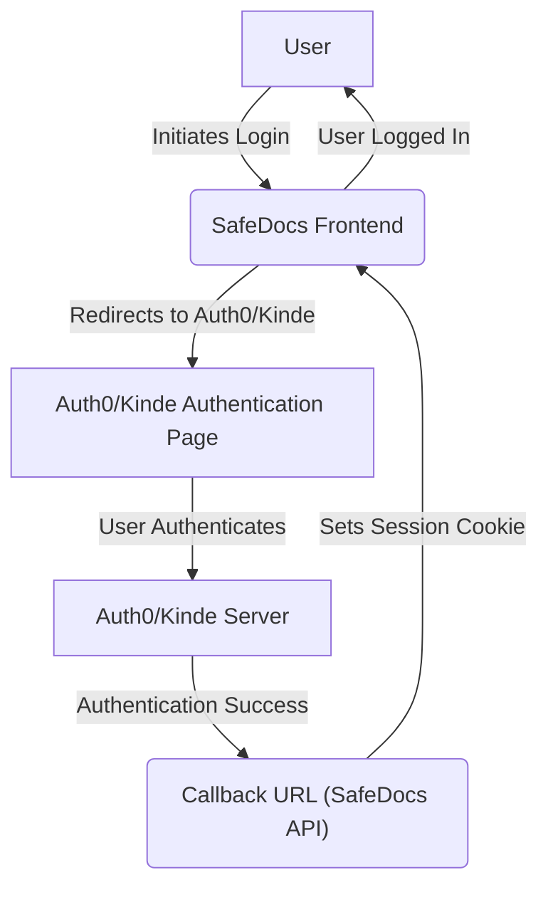
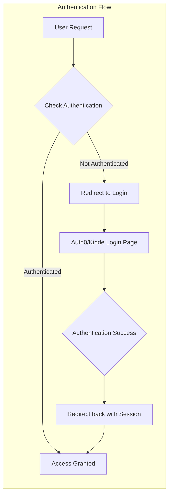

# API Authentication Routes

This document describes the API routes responsible for handling authentication within the SafeDocs application. SafeDocs utilizes both Auth0 and Kinde for authentication, providing flexible options for user management and security.

## Authentication Providers

SafeDocs currently supports two authentication providers:

*   **Auth0:** A widely-used identity management platform that provides features like social login, multi-factor authentication, and user management.
*   **Kinde:** A modern authentication solution designed for SaaS applications, offering features like organization management, roles, and permissions.

## Route Definitions

The authentication routes are defined within the `src/app/api/auth/` directory of the SafeDocs project.

*   `src/app/api/auth/[auth0].js`: Handles Auth0 authentication callbacks and user sessions.
*   `src/app/api/auth/[kindeAuth]/route.js`: Handles Kinde authentication callbacks and user sessions.

### Auth0 Route (`src/app/api/auth/[auth0].js`)

This route leverages the `@auth0/nextjs-auth0` library to simplify the integration with Auth0.  It exposes a single endpoint (`/api/auth/[auth0]`) that handles various authentication-related actions, such as login, logout, and callback handling.

```javascript title="src/app/api/auth/[auth0].js"
// app/api/auth/[auth0]/route.js
import { handleAuth } from "@auth0/nextjs-auth0";

export const GET = handleAuth();
```

[View on GitHub](https://github.com/kalpm1110/SafeDocs/blob/main/src/app/api/auth/%5Bauth0%5D.js)

**Explanation:**

*   `import { handleAuth } from "@auth0/nextjs-auth0";`: This line imports the `handleAuth` function from the `@auth0/nextjs-auth0` library.  This function handles the underlying authentication logic.
*   `export const GET = handleAuth();`: This line defines a `GET` request handler that utilizes the `handleAuth` function. This handler automatically manages the authentication flow, including handling callbacks from Auth0 after a user logs in or signs up.

### Kinde Route (`src/app/api/auth/[kindeAuth]/route.js`)

This route integrates Kinde authentication into the SafeDocs API. It uses the `@kinde-oss/kinde-auth-nextjs/server` library. Similar to the Auth0 route, it provides a single endpoint (`/api/auth/[kindeAuth]`) to manage authentication flows.

```javascript title="src/app/api/auth/[kindeAuth]/route.js"
import {handleAuth} from "@kinde-oss/kinde-auth-nextjs/server";

export const GET = handleAuth();
```

[View on GitHub](https://github.com/kalpm1110/SafeDocs/blob/main/src/app/api/auth/%5BkindeAuth%5D/route.js)

**Explanation:**

*   `import { handleAuth } from "@kinde-oss/kinde-auth-nextjs/server";`: This line imports the `handleAuth` function from the `@kinde-oss/kinde-auth-nextjs/server` library.
*   `export const GET = handleAuth();`: This line defines a `GET` request handler that utilizes the `handleAuth` function.  It handles the Kinde authentication flow.

## Authentication Flow Diagram





## Integrating Authentication into your React Components

To protect routes and access user information within your React components, you can use the respective client-side libraries provided by Auth0 and Kinde.

### Auth0 Example

```javascript title="React Component with Auth0"
import { useUser } from "@auth0/nextjs-auth0/client";

function Profile() {
  const { user, error, isLoading } = useUser();

  if (isLoading) return <div>Loading...</div>;
  if (error) return <div>Error: {error.message}</div>;

  return (
    user && (
      <div>
        <h2>{user.name}</h2>
        <p>{user.email}</p>
        
      </div>
    )
  );
}

export default Profile;
```

[View on GitHub](https://github.com/kalpm1110/SafeDocs/blob/main/example/auth0-profile.js)

**Explanation:**

*   `useUser` hook: This hook provides access to the current user's information, loading state, and any potential errors.
*   Conditional Rendering: The component conditionally renders based on the loading state and the presence of a user.

### Kinde Example

```javascript title="React Component with Kinde"
import { useKindeAuth } from "@kinde-oss/kinde-auth-nextjs";

function Dashboard() {
  const { user, isLoading } = useKindeAuth();

  if (isLoading) {
    return <div>Loading...</div>;
  }

  return (
    <div>
      <h1>Welcome, {user?.given_name}!</h1>
      <p>Your email: {user?.email}</p>
    </div>
  );
}

export default Dashboard;
```

[View on GitHub](https://github.com/kalpm1110/SafeDocs/blob/main/example/kinde-dashboard.js)

**Explanation:**

*   `useKindeAuth` hook:  This hook provides access to the user object and the loading state.
*   Optional Chaining: The `user?.given_name` and `user?.email` use optional chaining to gracefully handle cases where the user object might be null or undefined.

## Protecting API Routes

Both Auth0 and Kinde provide mechanisms for protecting API routes. You can use middleware or specific functions to verify the user's authentication status before allowing access to protected resources.

### Auth0 API Route Protection

```javascript title="Protected API Route with Auth0"
import { getSession, withApiAuthRequired } from '@auth0/nextjs-auth0';

async function handler(req, res) {
  const session = await getSession(req, res);
  if (session) {
    res.status(200).json({ message: `Hello, ${session.user.name}!` });
  } else {
    res.status(401).json({ message: 'Unauthorized' });
  }
}

export default withApiAuthRequired(handler);
```

[View on GitHub](https://github.com/kalpm1110/SafeDocs/blob/main/example/auth0-protected-api.js)

**Explanation:**

*   `getSession`: This function retrieves the user's session from the request.
*   `withApiAuthRequired`: This higher-order function wraps the API handler and ensures that only authenticated users can access it.

### Kinde API Route Protection
```javascript title="Protected API Route with Kinde"
import { handleGetKindeServerSession } from '@kinde-oss/kinde-auth-nextjs/server';

export default async function handler(req, res) {
  try {
    const {isAuthenticated, getUser, getAccessToken} = await handleGetKindeServerSession(req, res);

    if (!isAuthenticated()) {
      return res.status(401).json({ error: 'Unauthorized' });
    }

    const user = getUser();
    const accessToken = await getAccessToken();
    return res.status(200).json({ message: `Hello, ${user.given_name}!`, accessToken });

  } catch (error) {
    console.error('Authentication error:', error);
    return res.status(500).json({ error: 'Internal Server Error' });
  }
}
```

[View on GitHub](https://github.com/kalpm1110/SafeDocs/blob/main/example/kinde-protected-api.js)

**Explanation:**

*   `handleGetKindeServerSession`: This function retrieves the Kinde server session, which includes authentication status, user information, and access token.
*   `isAuthenticated()`: A method to check if the user is authenticated.
*   `getUser()`: Returns the user profile.
*   `getAccessToken()`: Returns the access token.

## Key Integration Points

*   **Configuration:** Ensure that you have correctly configured your Auth0 and Kinde applications with the appropriate callback URLs and API credentials.  This is usually done through environment variables (example below).

```plaintext title=".env.local"
AUTH0_SECRET='YOUR_AUTH0_SECRET'
AUTH0_BASE_URL='http://localhost:3000'
AUTH0_ISSUER_BASE_URL='YOUR_AUTH0_ISSUER_BASE_URL'
AUTH0_CLIENT_ID='YOUR_AUTH0_CLIENT_ID'
AUTH0_CLIENT_SECRET='YOUR_AUTH0_CLIENT_SECRET'

KINDE_CLIENT_ID="YOUR_KINDE_CLIENT_ID"
KINDE_CLIENT_SECRET="YOUR_KINDE_CLIENT_SECRET"
KINDE_SITE_URL="YOUR_KINDE_SITE_URL"
KINDE_POST_LOGOUT_REDIRECT_URL="YOUR_POST_LOGOUT_REDIRECT_URL"
KINDE_POST_LOGIN_REDIRECT_URL="YOUR_POST_LOGIN_REDIRECT_URL"
```
[View on GitHub](https://github.com/kalpm1110/SafeDocs/blob/main/.env.example)
*   **Callback URLs:** The callback URLs in your Auth0/Kinde applications must match the routes defined in your `src/app/api/auth/` directory (e.g., `http://localhost:3000/api/auth/auth0` or `http://localhost:3000/api/auth/kindeAuth`).
*   **Session Management:** Both `@auth0/nextjs-auth0` and `@kinde-oss/kinde-auth-nextjs` handle session management automatically, using cookies to store user authentication information.
*   **Error Handling:** Implement proper error handling to gracefully handle authentication failures and provide informative messages to the user.

## Best Practices

*   **Secure Environment Variables:** Store your Auth0 and Kinde credentials securely using environment variables.  Never commit these credentials directly to your code repository.
*   **Regularly Update Libraries:** Keep your authentication libraries up-to-date to benefit from security patches and new features.
*   **Implement Role-Based Access Control (RBAC):** Use Auth0's or Kinde's RBAC features to control access to specific resources based on user roles and permissions.
*   **Consider a Unified Authentication Layer:** For more complex applications, consider abstracting the authentication logic into a unified layer to simplify integration and maintainability, rather than directly calling Auth0 or Kinde specific functions throughout your codebase.




