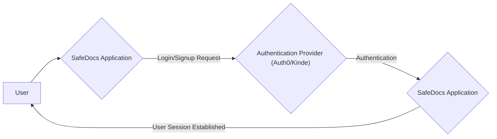
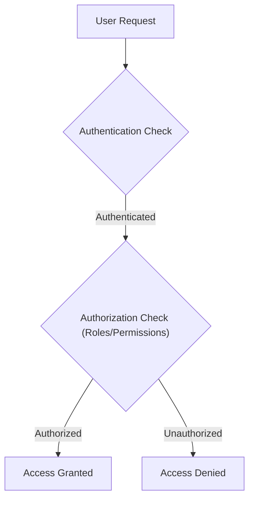

# Authentication and Authorization

This section details the authentication and authorization mechanisms implemented within the SafeDocs application. SafeDocs currently supports authentication using Auth0 and Kinde, offering flexible options for user management and access control.

## Authentication Providers

SafeDocs leverages two primary authentication providers:

*   **Auth0:** A widely used identity platform that provides features such as single sign-on, multi-factor authentication, and social login.
*   **Kinde:** An authentication and user management platform designed for SaaS applications, offering features like organization management and subscription handling.

## Authentication Flow

The authentication flow generally involves the following steps:

1.  The user initiates a login or signup request.
2.  The request is redirected to the chosen authentication provider (Auth0 or Kinde).
3.  The user authenticates with the provider (e.g., by entering credentials or using a social login).
4.  The provider redirects the user back to the SafeDocs application with an authentication token or code.
5.  SafeDocs verifies the token or code and establishes a user session.





## Relevant Files and Code Snippets

### Auth0 Integration

The `src/app/api/auth/[auth0].js` file handles authentication routes when using Auth0.

```javascript
// app/api/auth/[auth0]/route.js
import { handleAuth } from "@auth0/nextjs-auth0";

export const GET = handleAuth();
```

[View on GitHub](https://github.com/kalpm1110/SafeDocs/blob/main/src/app/api/auth/%5Bauth0%5D.js)

This snippet imports the `handleAuth` function from the `@auth0/nextjs-auth0` library and exports it as the `GET` handler for the `/api/auth/[auth0]` route.  This route acts as the entry point for Auth0's authentication endpoints (e.g., `/api/auth/login`, `/api/auth/logout`).

### Kinde Integration

The `src/app/api/auth/[kindeAuth]/route.js` file handles authentication routes when using Kinde.

```javascript
import {handleAuth} from "@kinde-oss/kinde-auth-nextjs/server";

export const GET = handleAuth();
```

[View on GitHub](https://github.com/kalpm1110/SafeDocs/blob/main/src/app/api/auth/%5BkindeAuth%5D/route.js)

Similar to the Auth0 integration, this snippet imports the `handleAuth` function from the `@kinde-oss/kinde-auth-nextjs/server` library and exports it as the `GET` handler for the `/api/auth/[kindeAuth]` route. This sets up Kinde's authentication endpoints within the application.

### Authentication Buttons

The `src/components/AuthButtons.jsx` component provides the user interface elements for login, signup, and logout.

```javascript
"use client"

import { LoginLink, LogoutLink, RegisterLink } from "@kinde-oss/kinde-auth-nextjs"

function AuthButtons({isAuthenticated}) {
  return (
    <div>
        {isAuthenticated?(
            <LogoutLink>Logout</LogoutLink>
        ):(
            <>
            <LoginLink>Login</LoginLink>
            <RegisterLink>SignUp</RegisterLink>
            </>
        )}
    </div>
  )
}

export default AuthButtons;
```

[View on GitHub](https://github.com/kalpm1110/SafeDocs/blob/main/src/components/AuthButtons.jsx)

This React component uses the `LoginLink`, `LogoutLink`, and `RegisterLink` components from the `@kinde-oss/kinde-auth-nextjs` library.  It conditionally renders these links based on the `isAuthenticated` prop, which indicates whether the user is currently logged in. If authenticated, a logout button is shown; otherwise, login and signup buttons are displayed.

## Authorization

While the provided code focuses on authentication, authorization (determining what a user is allowed to do) would typically involve checking the user's roles or permissions after they have been authenticated. This logic would be implemented within the application's backend or API routes.

For example, you might have middleware that checks if a user has the `admin` role before allowing them to access certain API endpoints. With Kinde, you can manage permissions and organizations, integrating them with your authorization logic.

```javascript
// Example authorization middleware (Conceptual)
function requireAdmin(req, res, next) {
  if (req.user && req.user.roles.includes('admin')) {
    next(); // User is authorized, proceed to the next middleware/route handler
  } else {
    res.status(403).json({ message: 'Unauthorized' }); // User is not authorized
  }
}
```

This is a conceptual snippet. The actual implementation would depend on how user roles are managed and stored (e.g., in a database or as part of the user's authentication token).





## Integrating Auth0 and Kinde

The choice between Auth0 and Kinde depends on your specific requirements.

*   **Auth0** is a mature and versatile platform suitable for a wide range of applications, offering extensive customization options.
*   **Kinde** is designed specifically for SaaS applications and provides features tailored to SaaS needs, such as organization management and subscription handling.

SafeDocs provides the flexibility to choose either one of these providers for authentication.

## Key Integration Points

*   **API Routes:**  The `/api/auth/[auth0]` and `/api/auth/[kindeAuth]` routes are the central points for integrating with the authentication providers. These routes handle the authentication handshake and establish user sessions.
*   **Client-Side Components:** The `AuthButtons.jsx` component demonstrates how to use the authentication provider's client-side SDK to display login, signup, and logout links.
*   **Middleware:** To implement authorization, you will need to create middleware functions that check user roles or permissions before allowing access to protected resources.

```javascript
// Example usage in a Next.js API route
import { getSession } from '@kinde-oss/kinde-auth-nextjs/server';

export async function GET(request) {
  const { getUser, isAuthenticated } = getSession();
  const user = await getUser();

  if (await isAuthenticated()) {
    return new Response(`Hello, ${user?.given_name}!`);
  } else {
    return new Response('Hello, stranger!');
  }
}
```

[View on GitHub](https://github.com/kalpm1110/SafeDocs/blob/main/src/app/api/auth/%5BkindeAuth%5D/route.js)

This code snippet demonstrates how to retrieve user information and authentication status within a Next.js API route using Kinde. The `getSession` function provides methods for checking authentication status and retrieving user details.

## Best Practices

*   **Securely Store Credentials:** Never hardcode API keys or secrets directly in your code. Use environment variables to store sensitive information.
*   **Validate User Input:** Always validate user input to prevent security vulnerabilities such as cross-site scripting (XSS) and SQL injection.
*   **Implement Role-Based Access Control (RBAC):** Define clear roles and permissions to control user access to resources.
*   **Use HTTPS:** Ensure that your application uses HTTPS to protect user data in transit.
*   **Regularly Update Dependencies:** Keep your dependencies up to date to patch security vulnerabilities.
```