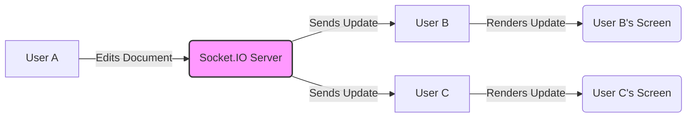

# Document Collaboration

This section describes the collaborative aspects of the SafeDocs application, focusing on how multiple users can simultaneously edit a document and see each other's changes in real-time. The collaboration is facilitated through Socket.IO, enabling bidirectional communication between the server and clients.

## Real-time Updates with Socket.IO

SafeDocs utilizes Socket.IO to provide real-time updates to all connected users. When one user makes a change to the document content, the change is immediately broadcast to all other users currently viewing the same document.

```javascript title="src/app/doc/[docid]/page.jsx"
  const handleContentChange = (e) => {
    const newContent = e.target.value;
    setContent(newContent);
    socketRef.current.emit('doc-update', { docid, content: newContent });
  };
```

This code snippet shows the `handleContentChange` function, which is triggered whenever the content of the textarea changes.  It updates the local state (`setContent`) and emits a `doc-update` event to the server, including the document ID and the new content. This event is then broadcast to all other connected clients. [View on GitHub](https://github.com/kalpm1110/SafeDocs/blob/main/src/app/doc/[docid]/page.jsx)

## Joining a Document

When a user opens a document, the client emits a `join-doc` event to the server, providing the document ID and the user's name. This allows the server to track which users are currently viewing each document and to notify them when other users join or leave.

```javascript title="src/app/doc/[docid]/page.jsx"
    socketRef.current.emit('join-doc', { docid, username: userName });

    socketRef.current.on('user-joined', ({ username }) => {
      if (username) {
        setUsers((prev) => [...new Set([...prev, username])]);
      }
    });
```

The code above shows that the client emits the `join-doc` event on initial load.  It also listens for `user-joined` events from the server, adding the new user's name to the list of connected users displayed in the UI. [View on GitHub](https://github.com/kalpm1110/SafeDocs/blob/main/src/app/doc/[docid]/page.jsx)

## Displaying Connected Users

The application displays a list of all users currently connected to the document. This provides a visual indication of who is collaborating on the document in real-time.

```javascript title="src/app/doc/[docid]/page.jsx"
 <div className="flex flex-wrap gap-2">
    {users.length > 0 ? (
        users.map((user, index) => (
        <Badge
            key={index}
            className="bg-blue-600 hover:bg-blue-700 text-white px-3 py-1"
        >
            {user}
        </Badge>
        ))
    ) : (
        <p className="text-gray-500 text-sm">
        {isLoading ? 'Loading users...' : 'No other users connected'}
        </p>
    )}
</div>
```

This snippet renders a list of badges, each displaying the name of a connected user.  It handles the case where there are no other connected users, displaying a message indicating that. [View on GitHub](https://github.com/kalpm1110/SafeDocs/blob/main/src/app/doc/[docid]/page.jsx)

## Socket.IO Client Initialization

The Socket.IO client is initialized within the `useEffect` hook in the `DocPage` component. It connects to the server using the URL specified in the environment variables.

```javascript title="src/app/doc/[docid]/page.jsx"
  useEffect(() => {
    if (isLoading) return;

    const userName = user?.given_name || `Guest_${Math.random().toString(36).slice(2, 7)}`;
    setUsername(userName);

    socketRef.current = io(process.env.NEXT_PUBLIC_CLIENT_URL || 'http://localhost:8080', {
      withCredentials: true,
    });

    // ... rest of the code
  }, [docid, user, isLoading]);
```

This code ensures that the Socket.IO connection is established only after the user authentication status is loaded. It also generates a guest username if the user is not authenticated via Kinde.  The `withCredentials: true` option is important for sending cookies (e.g., session cookies) with the Socket.IO connection. [View on GitHub](https://github.com/kalpm1110/SafeDocs/blob/main/src/app/doc/[docid]/page.jsx)

## Document Context Provider

The `ClientDocLayout` component provides the `DocContext` to its children. This context holds the document data, making it accessible to all components within the document editing page.

```javascript title="src/components/docs/ClientDocLayout.jsx"
"use client";
import { DocContext } from "@/app/hooks/DocContext";
import DocNavbar from "@/components/DocNavbar";

export default function ClientDocLayout({ data, children }) {
  return (
    <DocContext.Provider value={data}>
      <div className="flex flex-col h-screen">
        <DocNavbar />
        <main className="flex-1">{children}</main>
        <footer />
      </div>
    </DocContext.Provider>
  );
}
```

This snippet demonstrates how the `DocContext` is used to wrap the content of the document editing page, providing access to document-related data. [View on GitHub](https://github.com/kalpm1110/SafeDocs/blob/main/src/components/docs/ClientDocLayout.jsx)

## Socket Instance
```javascript title="src/lib/socket.js"
"use client"

import { io } from "socket.io-client"

export const socket=io("http://localhost:8080");
```
This initializes the socket.io client and exports it, making it available for use across the application to establish real-time communication with the server.

## Mermaid Diagram: Real-time Collaboration Flow

This diagram illustrates the flow of real-time updates between users through the Socket.IO server.





## Key Integration Points

*   **`src/app/doc/[docid]/page.jsx`**: This file contains the main logic for the document editing page, including handling user input, managing the Socket.IO connection, and displaying the document content and connected users.
*   **`src/lib/socket.js`**: This file initializes the Socket.IO client and exports it for use in other parts of the application.
*   **`src/components/docs/ClientDocLayout.jsx`**: This file sets up the layout for the document editing page and provides the `DocContext`, making document data available to its children.

## Best Practices

*   **Efficient State Management**: Use state management techniques to minimize unnecessary re-renders and optimize performance.
*   **Error Handling**: Implement robust error handling to gracefully handle connection errors, server errors, and other potential issues.
*   **Security**:  Sanitize user input to prevent cross-site scripting (XSS) attacks. Implement authentication and authorization to ensure that only authorized users can access and modify documents.
```