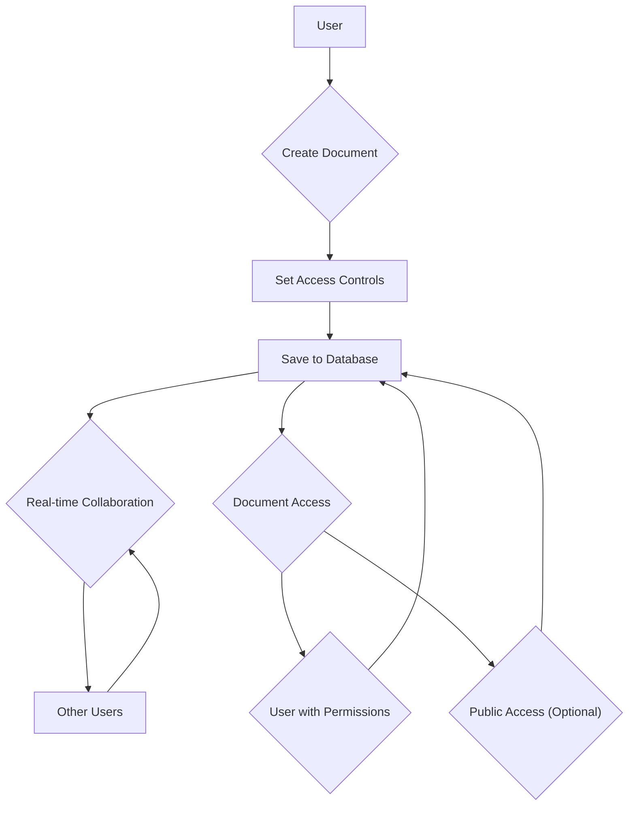

# Document Management

This section provides an overview of the document management features in SafeDocs, covering document creation, access control, and collaborative editing. SafeDocs allows users to create, store, and share documents securely with fine-grained access controls and real-time collaborative capabilities.

## Document Creation

Users can create new documents with customizable titles and content. The platform supports rich text editing and allows setting access permissions, expiry dates, and collaboration settings.

```javascript title="src/app/createDoc/page.jsx"
const handleSubmit = async (e) => {
  e.preventDefault();

  try {
    const docData = {
      ownerId: user?.id,
      title: e.target.title.value,
      content: e.target.content.value,
      allowedEmails: allowedEmails.split(",").map((email) => email.trim()),
      publicAccess,
      expiry: expiry ? expiry.toISOString() : null,
      accessType
    };

    const res = await fetch('/api/documents', {
      method: 'POST',
      headers: { 'Content-Type': 'application/json' },
      body: JSON.stringify(docData),
    });

    if (!res.ok) throw new Error(await res.json()).error || "Failed";
    const result = await res.json();
    router.push(`/doc/${result.id}`);
    resetForm(e);
  } catch (error) {
    console.error(error);
  }
};
```

This snippet from `src/app/createDoc/page.jsx` demonstrates the `handleSubmit` function, which gathers document data from the form, sends it to the API endpoint (`/api/documents`), and handles the response. Upon successful document creation, the user is redirected to the document's page. [View on GitHub](https://github.com/kalpm1110/SafeDocs/blob/main/src/app/createDoc/page.jsx)

## Access Control

SafeDocs offers granular access control features, including:

*   **Public Access:** Documents can be made publicly accessible via a shareable link.
*   **Allowed Emails:** Access can be restricted to specific email addresses.
*   **Expiry Dates:** Documents can be set to expire after a certain date, revoking access automatically.
*   **Access Type:** Permissions can be set to "view" or "edit," controlling the level of collaboration.

```javascript title="src/app/api/documents/route.js"
export async function POST(request) {
  try {
    const docData = await request.json();

    const { data, error } = await supabaseServer.from('documents').insert({
      ownerId: docData.ownerId,
      title: docData.title,
      content: docData.content,
      allowed_emails: docData.allowedEmails,
      public_access: docData.publicAccess,
      expiry: docData.expiry ? new Date(docData.expiry).toISOString() : null,
      access_type: docData.accessType,
    }).select('id').single();

    if (error) throw new Error(error.message);

    return new Response(JSON.stringify({ id: data.id, message: 'Document created' }), {
      status: 200,
      headers: { 'Content-Type': 'application/json' },
    });
  } catch (error) {
    console.error("Error", error);
    return new Response(JSON.stringify({ error: error.message }), {
      status: 500,
      headers: { 'Content-Type': 'application/json' },
    });
  }
}
```

The `POST` function in `src/app/api/documents/route.js` handles the creation of new documents in the database. It extracts document metadata from the request body, including access control settings, and inserts it into the `documents` table using Supabase. [View on GitHub](https://github.com/kalpm1110/SafeDocs/blob/main/src/app/api/documents/route.js)

## Real-time Collaboration

SafeDocs supports real-time collaborative editing, allowing multiple users to work on the same document simultaneously. Changes are synchronized using WebSockets.

```javascript title="src/app/doc/[docid]/page.jsx"
useEffect(() => {
  if (isLoading) return;

  const userName = user?.given_name || `Guest_${Math.random().toString(36).slice(2, 7)}`;
  setUsername(userName);

  socketRef.current = io(process.env.NEXT_PUBLIC_CLIENT_URL || 'http://localhost:8080', {
    withCredentials: true,
  });

  socketRef.current.emit('join-doc', { docid, username: userName });

  socketRef.current.on('user-joined', ({ username }) => {
    if (username) {
      setUsers((prev) => [...new Set([...prev, username])]);
    }
  });

  socketRef.current.on('receive-update', (newContent) => {
    setContent(newContent);
  });

  return () => {
    socketRef.current.disconnect();
  };
}, [docid, user, isLoading]);
```

This snippet from `src/app/doc/[docid]/page.jsx` demonstrates the `useEffect` hook, which initializes a WebSocket connection when the component mounts. It handles user joining, receiving document updates, and updating the local state. [View on GitHub](https://github.com/kalpm1110/SafeDocs/blob/main/src/app/doc/[docid]/page.jsx)

```javascript title="src/app/doc/[docid]/page.jsx"
const handleContentChange = (e) => {
  const newContent = e.target.value;
  setContent(newContent);
  socketRef.current.emit('doc-update', { docid, content: newContent });
};
```

The `handleContentChange` function in `src/app/doc/[docid]/page.jsx` is triggered when the document content changes. It updates the local state with the new content and emits a `doc-update` event to the server, which broadcasts the changes to all connected clients. [View on GitHub](https://github.com/kalpm1110/SafeDocs/blob/main/src/app/doc/[docid]/page.jsx)

## Document Context

The `DocContext` provides a way to share document-related data across components.

```javascript title="src/app/hooks/DocContext.jsx"
"use client"
import { createContext, useContext } from "react";

export const DocContext=createContext(null);
export const useDoc=()=>useContext(DocContext);
```

This code from `src/app/hooks/DocContext.jsx` creates a simple context for sharing the document object. The `useDoc` hook allows components to easily access the current document's data. [View on GitHub](https://github.com/kalpm1110/SafeDocs/blob/main/src/app/hooks/DocContext.jsx)

## Document Workflow





This diagram illustrates the basic workflow of document creation, access control, and collaboration within SafeDocs.

## Caching Strategy

SafeDocs employs a Redis cache to optimize document access and reduce database load. Documents are cached upon creation and updated whenever changes are made. Expiry times are used to automatically remove old documents from the cache.

```javascript title="src/app/api/documents/route.js"
        const cache = {
            content: encrpteddata,
            allowed_emails: docData.allowedEmails,
            publicAccess: docData.publicAccess,
            accessType: docData.accessType,
        }
        const cacheKey = `doc:${docId}`;
        const cacheVal = JSON.stringify(cache);

        let ttlsec = null;
        if (docData.expiry) {
            const expiryData = new Date(docData.expiry);
            ttlsec = Math.max(0, Math.floor((expiryData.getTime() - Date.now()) / 1000));
        } else ttlsec = 86400;

        if (ttlsec > 0) {
            await redis.set(cacheKey, cacheVal, { EX: ttlsec });
        } else {
            await redis.set(cacheKey, cacheVal); // No TTL if expired
        }
```

This code snippet from `src/app/api/documents/route.js` shows how document data is cached in Redis after creation. The cache includes the document content, access control settings, and access type. An expiry time is calculated based on the document's expiry date, and the cache entry is set with the appropriate TTL. [View on GitHub](https://github.com/kalpm1110/SafeDocs/blob/main/src/app/api/documents/route.js)

## Key Integration Points

*   **API Endpoints:** The `/api/documents` endpoint handles document creation and retrieval.
*   **Supabase:** Supabase is used as the primary database for storing documents and user data.
*   **Redis:** Redis is used for caching documents to improve performance and reduce database load.
*   **WebSockets:** WebSockets are used for real-time collaborative editing.
*   **Kinde Authentication:** Kinde is used for user authentication and authorization.

## Best Practices

*   **Secure Access Controls:** Always configure appropriate access controls to protect sensitive documents.
*   **Cache Management:** Monitor Redis cache performance and adjust expiry times as needed.
*   **Error Handling:** Implement robust error handling to gracefully handle unexpected errors.
*   **User Experience:** Provide clear feedback to users during document creation and collaboration.
```