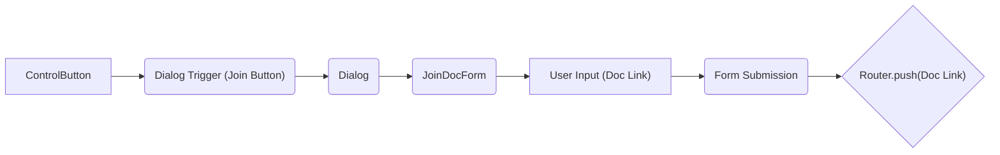
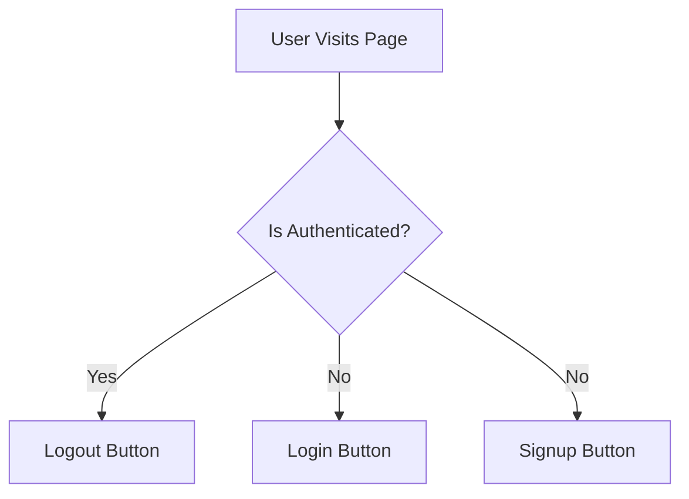

# Custom UI Components

This document details the custom UI components created for the SafeDocs project. These components are designed to provide a user-friendly and efficient experience for document creation, authentication, and navigation.

## Authentication Buttons (`AuthButtons.jsx`)

The `AuthButtons` component handles user authentication. It dynamically renders login, logout, and signup buttons based on the user's authentication state.

**Code Snippet:**

```javascript
// src/components/AuthButtons.jsx
"use client"

import { LoginLink, LogoutLink, RegisterLink } from "@kinde-oss/kinde-auth-nextjs"

function AuthButtons({isAuthenticated}) {
  return (
    <div>
        {isAuthenticated?(
            <LogoutLink>Logout</LogoutLink>
        ):(
            <>
            <LoginLink>Login</LoginLink>
            <RegisterLink>SignUp</RegisterLink>
            </>
        )}
    </div>
  )
}

export default AuthButtons;
```

This component leverages the Kinde authentication library to manage user sessions. If the `isAuthenticated` prop is true, it displays a "Logout" button; otherwise, it shows "Login" and "SignUp" buttons.

[View on GitHub](https://github.com/kalpm1110/SafeDocs/blob/main/src/components/AuthButtons.jsx)

## Control Buttons (`ControlButton.jsx`)

The `ControlButton` component provides buttons for creating and joining documents.  It utilizes React's `useState` hook to manage the visibility of a dialog for joining documents.

**Code Snippet:**

```javascript
// src/components/Buttons/ControlButton.jsx
"use client"

import { useState } from "react"
import { Button } from "@/components/ui/button"

import JoinDocForm from "../docs/JoinDocForm"
import {
  Dialog,
  DialogContent,
  DialogHeader,
  DialogTitle,
  DialogTrigger,
} from "@/components/ui/dialog"
import { useRouter } from "next/navigation"

function ControlButton() {
  const router=useRouter()
  const [openCreate, setOpenCreate] = useState(false)
  const [openJoin, setOpenJoin] = useState(false)

  return (
    <div className="flex gap-4">

      <Button onClick={()=>router.push("/createDoc")}>Create</Button>

      <Dialog open={openJoin} onOpenChange={setOpenJoin}>
        <DialogTrigger asChild>
          <Button>Join</Button>
        </DialogTrigger>
        <DialogContent className="max-w-3xl">
          <DialogHeader>
            <DialogTitle>Join New Document</DialogTitle>
          </DialogHeader>
          <JoinDocForm onclose={() => setOpenJoin(false)} />
        </DialogContent>
      </Dialog>
    </div>
  )
}

export default ControlButton;
```

The "Create" button navigates the user to the `/createDoc` route using the `next/navigation` router. The "Join" button opens a dialog containing the `JoinDocForm` component.

[View on GitHub](https://github.com/kalpm1110/SafeDocs/blob/main/src/components/Buttons/ControlButton.jsx)

## Join Document Form (`JoinDocForm.jsx`)

The `JoinDocForm` component allows users to enter a document link and join an existing document. It uses a form with an input field and a submit button.

**Code Snippet:**

```javascript
// src/components/docs/JoinDocForm.jsx
"use client"

import { useState } from "react"
import { Label } from "../ui/label"
import { Input } from "@/components/ui/input"
import { Button } from "@/components/ui/button"
import { useRouter } from "next/navigation"


function JoinDocForm() {
  const router=useRouter();
  const [doclink, setdoclink] = useState("")
  const handleSubmit = (e) => {
    e.preventDefault();
    console.log(e.target.doclink.value);
    setdoclink(e.target.doclink.value);
    router.push(e.target.doclink.value);

  }
  return (
    <div>
      <form onSubmit={handleSubmit}>
        <Label className="text-sm font-medium text-gray-700">DocLink</Label>
        <Input
          className="mt-1.5 border-gray-300 focus:border-blue-500 focus:ring-blue-500 rounded-md"
          name="doclink"
          placeholder="Enter Link"
          required
        ></Input>
        <Button type="submit" className="w-full mt-6 bg-blue-600 hover:bg-blue-700 text-white rounded-md py-2.5 font-semibold">Join</Button>
      </form>
    </div>
  )
}

export default JoinDocForm
```

On form submission, the `handleSubmit` function prevents the default form action, retrieves the document link from the input field, and navigates the user to the specified link using `router.push()`.

[View on GitHub](https://github.com/kalpm1110/SafeDocs/blob/main/src/components/docs/JoinDocForm.jsx)

## Navbar Controller (`NavBarController.jsx`)

The `NavbarController` component conditionally renders the `Navbar` component based on the current route.  It prevents the navbar from rendering on document pages (routes starting with `/doc/`).

**Code Snippet:**

```javascript
// src/components/NavBarController.jsx
"use client"

import { usePathname } from "next/navigation"
import Navbar from "./Navbar";

export default function NavbarController({user}){
    const pathname=usePathname();
    if(pathname.startsWith("/doc/")) return null;
    return <Navbar user={user}></Navbar>
}
```

It uses the `usePathname` hook from `next/navigation` to determine the current route. If the route starts with `/doc/`, the component returns `null`, effectively hiding the navbar. Otherwise, it renders the `Navbar` component, passing the `user` prop.

[View on GitHub](https://github.com/kalpm1110/SafeDocs/blob/main/src/components/NavBarController.jsx)

## Component Interaction Flow

Here's a simplified diagram illustrating the interaction between the `ControlButton` and `JoinDocForm` components:





## Authentication Flow Diagram

This diagram illustrates the flow of the `AuthButtons` component based on user authentication.





**Code Snippet:**

```javascript
// Example usage of AuthButtons in a page component
import AuthButtons from "./components/AuthButtons";
import { useKindeUser } from "@kinde-oss/kinde-auth-nextjs";

function HomePage() {
  const { isAuthenticated } = useKindeUser();

  return (
    <div>
      <h1>Welcome to SafeDocs</h1>
      <AuthButtons isAuthenticated={isAuthenticated} />
    </div>
  );
}

export default HomePage;
```

This snippet shows how the `AuthButtons` component can be used in a page component. The `useKindeUser` hook provides the authentication status, which is then passed to `AuthButtons`.

[View on GitHub](https://github.com/kalpm1110/SafeDocs/blob/main/src/app/page.jsx)

## Key Integration Points

- **Authentication:** The `AuthButtons` component is tightly integrated with the Kinde authentication library, providing a seamless authentication experience. Ensure proper configuration of the Kinde provider for optimal functionality.
- **Routing:**  The `next/navigation` router is used extensively for navigating between pages and documents. Ensure that all routes are correctly defined and that the router is used appropriately in event handlers.
- **UI Library:** The project utilizes a UI library (`@/components/ui/*`) for consistent styling and pre-built components like buttons and dialogs.  Leverage these components to maintain a uniform look and feel throughout the application.
```