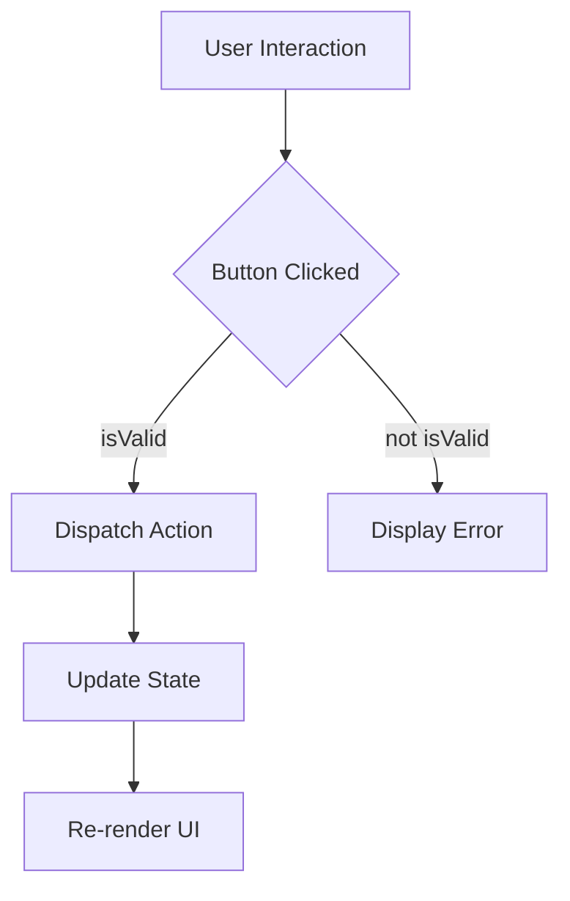
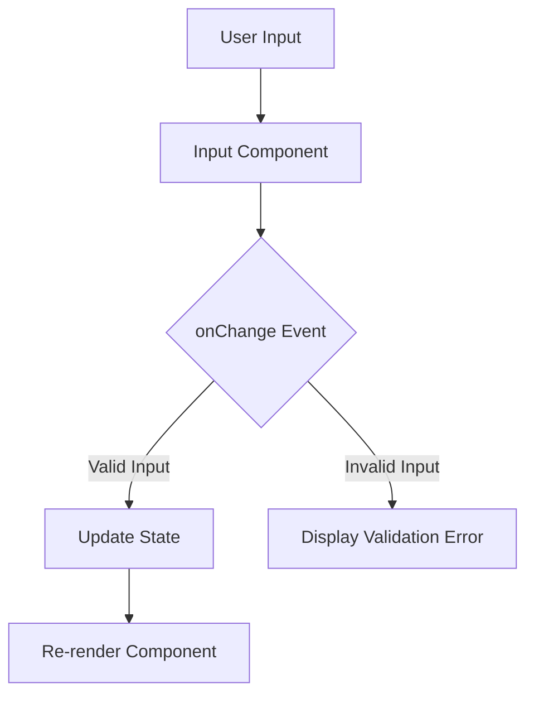

---
title: UI Components
description: Documentation of reusable UI components used throughout the application.
---

# UI Components

This section documents the reusable UI components used throughout the SafeDocs application. These components are designed to be modular and easily configurable, promoting consistency and maintainability across the application.

## Navbar Components

### Navbar

The `Navbar` component provides the main navigation for the application. It displays the application title, user information, and authentication buttons.

```javascript title="src/components/Navbar.jsx"
import Link from "next/link";
import AuthButtons from "./AuthButtons";
export default  function Navbar({user}) {
    return (
        <nav className="flex justify-between items-center p-4 border-b">
            <Link href="/"  className="font-bold text-xl">SafeDocs</Link>
            <div className="flex gap-3 items-center">
                {user ? <span className="text-sm text">Hey {user?.given_name}</span> :<span className="text-sm">Hey User!</span>}
                <AuthButtons isAuthenticated={!!user} ></AuthButtons>
            </div>
        </nav>
    )

}
```

The `Navbar` component accepts a `user` prop which contains the user's authentication information.  If a user is logged in, their name is displayed; otherwise, a generic greeting is shown. It utilizes the `Link` component from `next/link` for navigation and the `AuthButtons` component for handling authentication actions.

[View on GitHub](https://github.com/kalpm1110/SafeDocs/blob/main/src/components/Navbar.jsx)

### DocNavbar

The `DocNavbar` component is a placeholder for a documentation-specific navigation bar.  Currently, it's a simple container.

```javascript title="src/components/DocNavbar.jsx"
"use client"
function DocNavbar() {
  return (
    <div>
      
      
    </div>
  )
}

export default DocNavbar
```

This component could be extended to include links to different sections of the documentation or a table of contents.

[View on GitHub](https://github.com/kalpm1110/SafeDocs/blob/main/src/components/DocNavbar.jsx)

## UI Primitives

### Button

The `Button` component is a customizable button component built using Radix UI's `Slot` and `class-variance-authority` for styling.

```javascript title="src/components/ui/button.jsx"
import * as React from "react"
import { Slot } from "@radix-ui/react-slot"
import { cva } from "class-variance-authority";

import { cn } from "@/lib/utils"

const buttonVariants = cva(
  "inline-flex items-center justify-center gap-2 whitespace-nowrap rounded-md text-sm font-medium transition-all disabled:pointer-events-none disabled:opacity-50 [&_svg]:pointer-events-none [&_svg:not([class*='size-'])]:size-4 shrink-0 [&_svg]:shrink-0 outline-none focus-visible:border-ring focus-visible:ring-ring/50 focus-visible:ring-[3px] aria-invalid:ring-destructive/20 dark:aria-invalid:ring-destructive/40 aria-invalid:border-destructive",
  {
    variants: {
      variant: {
        default:
          "bg-primary text-primary-foreground shadow-xs hover:bg-primary/90",
        destructive:
          "bg-destructive text-white shadow-xs hover:bg-destructive/90 focus-visible:ring-destructive/20 dark:focus-visible:ring-destructive/40 dark:bg-destructive/60",
        outline:
          "border bg-background shadow-xs hover:bg-accent hover:text-accent-foreground dark:bg-input/30 dark:border-input dark:hover:bg-input/50",
        secondary:
          "bg-secondary text-secondary-foreground shadow-xs hover:bg-secondary/80",
        ghost:
          "hover:bg-accent hover:text-accent-foreground dark:hover:bg-accent/50",
        link: "text-primary underline-offset-4 hover:underline",
      },
      size: {
        default: "h-9 px-4 py-2 has-[>svg]:px-3",
        sm: "h-8 rounded-md gap-1.5 px-3 has-[>svg]:px-2.5",
        lg: "h-10 rounded-md px-6 has-[>svg]:px-4",
        icon: "size-9",
      },
    },
    defaultVariants: {
      variant: "default",
      size: "default",
    },
  }
)

function Button({
  className,
  variant,
  size,
  asChild = false,
  ...props
}) {
  const Comp = asChild ? Slot : "button"

  return (
    <Comp
      data-slot="button"
      className={cn(buttonVariants({ variant, size, className }))}
      {...props} />
  );
}

export { Button, buttonVariants }
```

The `buttonVariants` object defines the different styles that can be applied to the button.  It supports various `variant` (e.g., `default`, `destructive`, `outline`) and `size` options.  The `cn` function is used to conditionally apply CSS classes.  The `asChild` prop allows the `Button` component to be used as a wrapper for other elements, leveraging Radix UI's `Slot` component.

[View on GitHub](https://github.com/kalpm1110/SafeDocs/blob/main/src/components/ui/button.jsx)





### Input

The `Input` component is a styled input field.

```javascript title="src/components/ui/input.jsx"
import * as React from "react"

import { cn } from "@/lib/utils"

function Input({
  className,
  type,
  ...props
}) {
  return (
    <input
      type={type}
      data-slot="input"
      className={cn(
        "file:text-foreground placeholder:text-muted-foreground selection:bg-primary selection:text-primary-foreground dark:bg-input/30 border-input flex h-9 w-full min-w-0 rounded-md border bg-transparent px-3 py-1 text-base shadow-xs transition-[color,box-shadow] outline-none file:inline-flex file:h-7 file:border-0 file:bg-transparent file:text-sm file:font-medium disabled:pointer-events-none disabled:cursor-not-allowed disabled:opacity-50 md:text-sm",
        "focus-visible:border-ring focus-visible:ring-ring/50 focus-visible:ring-[3px]",
        "aria-invalid:ring-destructive/20 dark:aria-invalid:ring-destructive/40 aria-invalid:border-destructive",
        className
      )}
      {...props} />
  );
}

export { Input }
```

The `Input` component accepts standard input props, including `type` and `className`. It uses the `cn` function to apply a set of default styles along with any additional classes provided through the `className` prop. The styling includes considerations for focus states, disabled states, and invalid input.

[View on GitHub](https://github.com/kalpm1110/SafeDocs/blob/main/src/components/ui/input.jsx)





## Key Integration Points

These UI components are integrated throughout the application to provide a consistent user experience.  For example, the `Button` component is used in authentication forms, confirmation dialogs, and other interactive elements.  The `Input` component is used in forms for creating and editing documents. The `Navbar` provides site-wide navigation and authentication management.

### Best Practices

*   **Component Composition:**  Favor composition over inheritance when building more complex UI elements. Combine smaller, reusable components to create larger features.
*   **Consistent Styling:**  Utilize the provided `Button` and `Input` components to ensure a consistent visual style across the application.
*   **Accessibility:** Ensure that all UI components are accessible by following accessibility best practices (e.g., providing labels for input fields, using appropriate ARIA attributes).
```