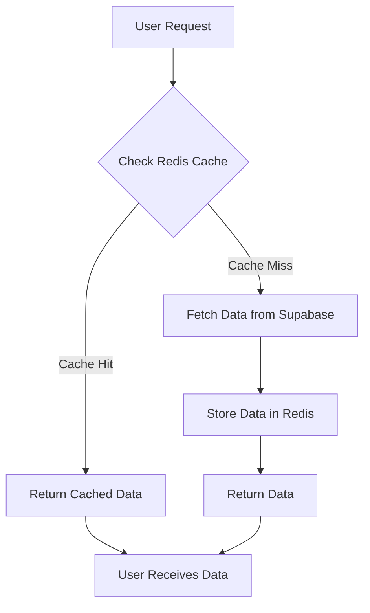
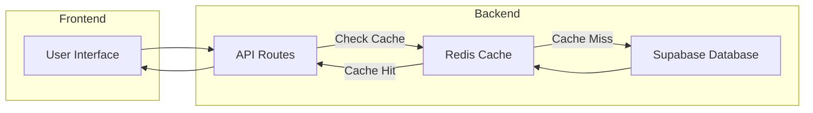

# Data Management and Persistence

This document outlines the data management and persistence strategies employed in SafeDocs. We utilize both Supabase and Redis to ensure data integrity, performance, and efficient access. Supabase serves as our primary database, while Redis acts as a caching layer to reduce latency for frequently accessed data.

## Supabase: Primary Data Storage

Supabase is a powerful open-source alternative to Firebase, providing a comprehensive suite of tools, including a PostgreSQL database, authentication, real-time subscriptions, and storage.  In SafeDocs, Supabase is used as the main persistent data store.

### Supabase Client Initialization

The `src/lib/supabase.js` file demonstrates how Supabase clients are initialized for both frontend and backend environments. This separation is crucial for security and access control.

```javascript
// src/lib/supabase.js
import { createClient } from "@supabase/supabase-js";

//Frontend
export const supabaseBrowser=createClient(
    process.env.NEXT_PUBLIC_SUPABASE_URL,
    process.env.NEXT_PUBLIC_SUPABASE_ANON_KEY
)

//Backend
export const supabaseServer=createClient(
    process.env.NEXT_PUBLIC_SUPABASE_URL,
    process.env.SUPABASE_SERVICE_ROLE_KEY
)
```

[View on GitHub](https://github.com/kalpm1110/SafeDocs/blob/main/src/lib/supabase.js)

**Explanation:**

*   Two Supabase clients are created: `supabaseBrowser` and `supabaseServer`.
*   `supabaseBrowser` is intended for use in the client-side code (e.g., React components).  It uses the `NEXT_PUBLIC_SUPABASE_URL` and `NEXT_PUBLIC_SUPABASE_ANON_KEY` environment variables. The `NEXT_PUBLIC_` prefix makes these variables accessible in the browser.
*   `supabaseServer` is designed for backend operations (e.g., API routes) and uses the `SUPABASE_SERVICE_ROLE_KEY`, which grants elevated privileges for tasks like data seeding or administrative functions.  **Important:** This key should *never* be exposed to the client-side code.

### Environment Variables for Supabase

Configuration is done via environment variables for security and flexibility. Here's an example of the necessary environment variables:

```plaintext
NEXT_PUBLIC_SUPABASE_URL=your_supabase_url
NEXT_PUBLIC_SUPABASE_ANON_KEY=your_supabase_anon_key
SUPABASE_SERVICE_ROLE_KEY=your_supabase_service_role_key
```

[View on GitHub](https://github.com/kalpm1110/SafeDocs/blob/main/src/lib/supabase.js)

**Explanation:**

* `NEXT_PUBLIC_SUPABASE_URL`:  The URL of your Supabase project.  This is needed by both the client and server.
* `NEXT_PUBLIC_SUPABASE_ANON_KEY`: The "anon" (anonymous) key for your Supabase project.  This allows read-only access to your database and should be used carefully.
* `SUPABASE_SERVICE_ROLE_KEY`: A sensitive key that grants full access to your Supabase project. Use this key only in server-side environments.

## Redis: Caching Layer

Redis is an in-memory data store that offers extremely fast read and write operations.  In SafeDocs, Redis is used as a caching layer to improve the performance of frequently accessed data, reducing the load on the Supabase database.

### Redis Client Initialization

The `src/lib/redis.js` file initializes the Redis client and ensures a single connection is maintained throughout the application lifecycle.

```javascript
// lib/redis.js
import { createClient } from "redis";

let redis;

if (!global.redisClient) {
  global.redisClient = createClient({
    username: "default",
    password: process.env.REDIS_PW,
    socket: {
      host: process.env.REDIS_HOST,
      port: Number(process.env.REDIS_PORT),
    },
  });

  global.redisClient.on("error", (err) => console.log("Redis Client Error", err));

  // Connect once
  global.redisClient.connect().catch(console.error);
}

redis = global.redisClient;

export default redis;
```

[View on GitHub](https://github.com/kalpm1110/SafeDocs/blob/main/src/lib/redis.js)

**Explanation:**

*   The code uses a global variable (`global.redisClient`) to ensure that only one Redis client is created and connected.  This prevents resource exhaustion.
*   The Redis client is configured using environment variables (`REDIS_HOST`, `REDIS_PORT`, `REDIS_PW`).
*   An error handler is attached to the client to log any connection errors.
*   The `connect()` method is called to establish the connection with the Redis server.

### Redis Configuration via Environment Variables

The following environment variables are used to configure the Redis client:

```plaintext
REDIS_HOST=your_redis_host
REDIS_PORT=your_redis_port
REDIS_PW=your_redis_password
```

[View on GitHub](https://github.com/kalpm1110/SafeDocs/blob/main/src/lib/redis.js)

**Explanation:**

*   `REDIS_HOST`: The hostname or IP address of your Redis server.
*   `REDIS_PORT`: The port number on which your Redis server is listening (typically 6379).
*   `REDIS_PW`: The password required to authenticate with your Redis server.

### Example Usage of Redis for Caching

```javascript
// Example: Caching user data
import redis from "@/lib/redis";

async function getUserData(userId) {
  const cacheKey = `user:${userId}`;
  const cachedData = await redis.get(cacheKey);

  if (cachedData) {
    console.log("Data retrieved from cache");
    return JSON.parse(cachedData);
  }

  // Fetch data from Supabase
  const { data, error } = await supabaseServer
    .from('users')
    .select('*')
    .eq('id', userId)
    .single();

  if (error) {
    console.error("Error fetching user data from Supabase:", error);
    return null;
  }

  // Store data in Redis cache
  await redis.set(cacheKey, JSON.stringify(data), 'EX', 3600); // Expire after 1 hour
  console.log("Data fetched from Supabase and cached");
  return data;
}
```

[View on GitHub](https://github.com/kalpm1110/SafeDocs/blob/main/src/lib/redis.js)

**Explanation:**

1.  A cache key is constructed based on the user ID.
2.  The code attempts to retrieve the user data from the Redis cache using `redis.get(cacheKey)`.
3.  If the data is found in the cache (a "cache hit"), it's parsed and returned.
4.  If the data is not found in the cache (a "cache miss"), the code fetches it from Supabase.
5.  After fetching the data from Supabase, it's stored in the Redis cache using `redis.set(cacheKey, JSON.stringify(data), 'EX', 3600)`.  The `'EX', 3600` option sets an expiration time of 3600 seconds (1 hour) for the cached data.





## Data Flow Diagram

The following diagram illustrates the flow of data between the frontend, backend, Redis cache, and Supabase database.





## Key Integration Points

*   **Authentication:** User authentication is handled by Supabase Auth.  The frontend uses `supabaseBrowser` to interact with the authentication API. The backend can also use `supabaseServer` for tasks like user management.
*   **Data Fetching:**  API routes in the backend use `supabaseServer` to query and update data in the Supabase database. Data can then be cached in Redis to improve performance.
*   **Real-time Updates:** Supabase Realtime allows the frontend to subscribe to changes in the database and receive updates in real-time. This is useful for features like live document collaboration or activity feeds.
*   **Caching Strategy:**  Choose a caching strategy that aligns with your application's needs.  Consider factors like data volatility, access patterns, and cache expiration times. Implement cache invalidation strategies when data changes in Supabase to keep the cache consistent.

## Best Practices

*   **Secure Environment Variables:** Store sensitive credentials (e.g., Supabase service role key, Redis password) in environment variables and never commit them to your codebase.
*   **Client-Side vs. Server-Side:**  Use `supabaseBrowser` for client-side operations and `supabaseServer` for server-side operations.  Never expose the service role key to the client.
*   **Cache Invalidation:** Implement a robust cache invalidation strategy to ensure that the data in your Redis cache remains consistent with the data in your Supabase database.
*   **Error Handling:**  Implement proper error handling to gracefully handle database connection errors, cache misses, and other potential issues.
*   **Monitoring:** Monitor the performance of your Supabase database and Redis cache to identify potential bottlenecks and optimize your data management strategy.
*   **Data Validation:** Always validate data on both the client-side and server-side to prevent data integrity issues.
```