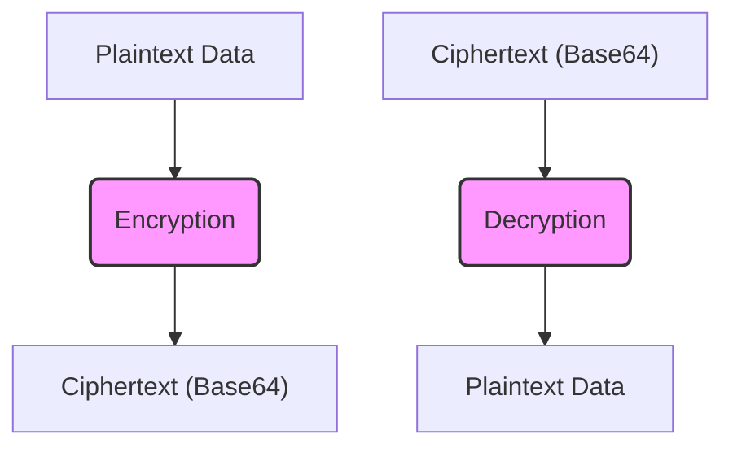
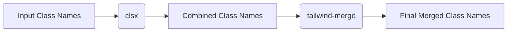

# Core Libraries and Utilities

This section details the core libraries and utilities within the SafeDocs project. These components provide reusable functions for encryption, socket communication, and utility functions, contributing to the overall functionality and maintainability of the application.

## Cryptographic Functions (src/lib/crypto.js)

This module provides functions for encrypting and decrypting text using AES-256-GCM. This ensures that sensitive data is protected both in transit and at rest.

```javascript
import { randomBytes, createDecipheriv, createCipheriv } from "crypto";

const ENCRYPTION_KEY = Buffer.from(process.env.ENCRYPTION_KEY, "base64"); // 32 bytes for AES-256

export async function encryptText(data) {
    const iv = randomBytes(12); // 96-bit nonce for GCM
    const cipher = createCipheriv("aes-256-gcm", ENCRYPTION_KEY, iv);

    let encrypted = cipher.update(data, "utf8", "base64");
    encrypted += cipher.final("base64");

    const authTag = cipher.getAuthTag();

    // final format = iv + encrypted + authTag
    return Buffer.concat([
        iv,
        Buffer.from(encrypted, "base64"),
        authTag,
    ]).toString("base64");
}


export async function decryptText(encryptedData) {
    const encryptedBuffer = Buffer.from(encryptedData, "base64");

    // split into parts: [iv | ciphertext | authTag]
    const iv = encryptedBuffer.subarray(0, 12);
    const authTag = encryptedBuffer.subarray(encryptedBuffer.length - 16);
    const ciphertext = encryptedBuffer.subarray(12, encryptedBuffer.length - 16);

    const decipher = createDecipheriv("aes-256-gcm", ENCRYPTION_KEY, iv);
    decipher.setAuthTag(authTag);

    let decrypted = decipher.update(ciphertext, "base64", "utf8");
    decrypted += decipher.final("utf8");

    return decrypted;
}
```

The `encryptText` function encrypts the provided data using AES-256-GCM. It generates a random initialization vector (IV), creates a cipher object, updates the cipher with the data, and retrieves the authentication tag. The IV, encrypted data, and authentication tag are concatenated and encoded in base64 for storage or transmission.  [View on GitHub](https://github.com/kalpm1110/SafeDocs/blob/main/src/lib/crypto.js)

```javascript
// Example usage of encryptText
async function exampleEncrypt(textToEncrypt) {
  try {
    const encrypted = await encryptText(textToEncrypt);
    console.log("Encrypted:", encrypted);
    return encrypted;
  } catch (error) {
    console.error("Encryption failed:", error);
    return null;
  }
}
```

The `decryptText` function decrypts the encrypted data.  It extracts the IV, authentication tag, and ciphertext from the input. It then creates a decipher object, sets the authentication tag, updates the decipher with the ciphertext, and returns the decrypted data. [View on GitHub](https://github.com/kalpm1110/SafeDocs/blob/main/src/lib/crypto.js)

```javascript
// Example usage of decryptText
async function exampleDecrypt(encryptedText) {
  try {
    const decrypted = await decryptText(encryptedText);
    console.log("Decrypted:", decrypted);
    return decrypted;
  } catch (error) {
    console.error("Decryption failed:", error);
    return null;
  }
}
```

**Environment Variable:**

```plaintext
ENCRYPTION_KEY=base64encoded32bytekey
```

The `ENCRYPTION_KEY` environment variable must be a 32-byte key, base64 encoded.  This key is crucial for both encryption and decryption, and its compromise would compromise the security of the encrypted data.  Store securely and rotate periodically.





## Socket Communication (src/lib/socket.js)

This module initializes a Socket.IO client connection to the server.

```javascript
"use client"

import { io } from "socket.io-client"

export const socket=io("http://localhost:8080");
```

The `socket` variable is initialized using `io` from the `socket.io-client` library, connecting to the specified server URL (http://localhost:8080). This client-side socket instance enables real-time communication with the server. [View on GitHub](https://github.com/kalpm1110/SafeDocs/blob/main/src/lib/socket.js)

```javascript
// Example usage (in a React component):
import { useEffect } from 'react';
import { socket } from './socket';

function MyComponent() {
  useEffect(() => {
    socket.on('connect', () => {
      console.log('Connected to server');
    });

    socket.on('message', (data) => {
      console.log('Received message:', data);
    });

    socket.emit('clientEvent', {data: 'Hello from client!'});

    return () => {
      socket.off('connect');
      socket.off('message');
    };
  }, []);

  return (
    <div>
      {/* Component content */}
    </div>
  );
}

export default MyComponent;
```

This example demonstrates how to use the socket within a React component to listen for 'connect' and 'message' events, and how to emit a custom event to the server.  It's important to clean up the event listeners in the `useEffect` cleanup function to prevent memory leaks.

## Utility Functions (src/lib/utils.js)

This module provides utility functions for various tasks, such as class name merging.

```javascript
import { clsx } from "clsx";
import { twMerge } from "tailwind-merge"

export function cn(...inputs) {
  return twMerge(clsx(inputs));
}
```

The `cn` function combines class names using `clsx` and then merges them using `tailwind-merge`.  This ensures that Tailwind CSS classes are applied correctly, resolving conflicts based on Tailwind's precedence rules.  This function is commonly used to conditionally apply styles in React components. [View on GitHub](https://github.com/kalpm1110/SafeDocs/blob/main/src/lib/utils.js)

```javascript
// Example usage:
function MyComponent({ isHighlighted, isDisabled }) {
  return (
    <button className={cn(
      "px-4 py-2 rounded",
      "bg-blue-500 text-white",
      isHighlighted && "bg-blue-700",
      isDisabled && "opacity-50 cursor-not-allowed"
    )}>
      Click me
    </button>
  );
}
```

In this example, the `cn` function is used to combine base class names with conditional class names based on the `isHighlighted` and `isDisabled` props. `tailwind-merge` ensures that if there are conflicting Tailwind classes, the ones defined later in the list take precedence.





## Key Integration Points

- **Encryption/Decryption Flow:** The encryption and decryption functions are primarily used to secure the transmission and storage of sensitive documents. Before a document is sent over the socket, it is encrypted using `encryptText`. Upon receiving a document, it's decrypted using `decryptText`. This ensures data confidentiality throughout the application's workflow.
- **Socket Event Handling:** The socket connection allows for real-time updates and notifications. Implement robust error handling and reconnection logic. Server-side components should validate all incoming data to prevent vulnerabilities.
- **Class Name Management:**  Consistently utilize the `cn` utility across all React components.  This promotes a unified styling approach and reduces the risk of style conflicts.

**Best Practices:**

- Always handle encryption keys securely. Avoid hardcoding keys directly into the code. Use environment variables or a secure key management system.
- Validate all data received through the socket to prevent injection attacks.
- Implement proper error handling and logging for all critical operations.
- Regularly audit and update dependencies to address security vulnerabilities.
```