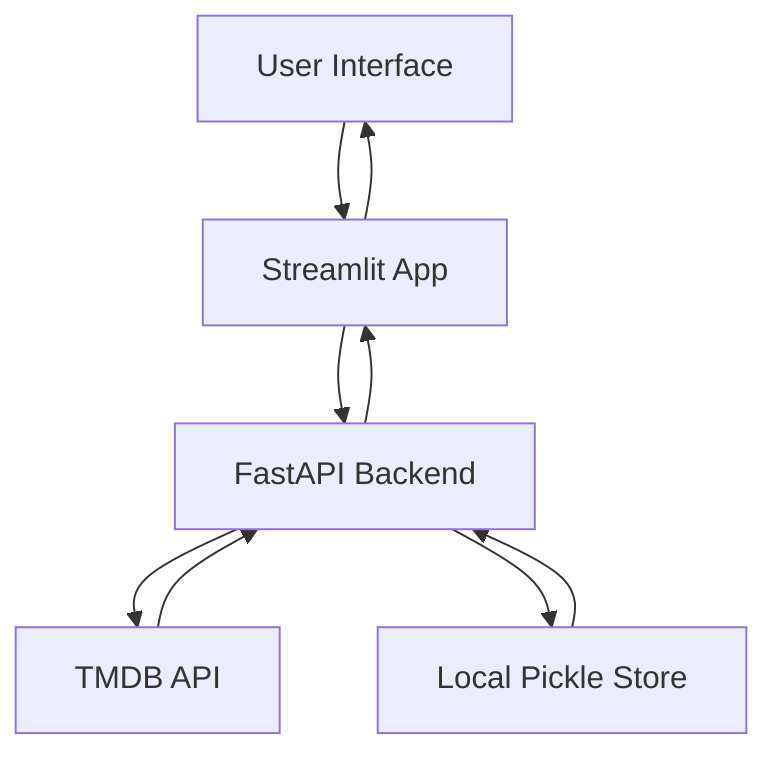

# Application Infrastructure

## System Role & Architectural Position

The application infrastructure follows a decoupled client-server architecture, separating the presentation logic from the data processing and recommendation engine. The system consists of a **Streamlit** frontend providing a reactive user interface and a **FastAPI** backend serving as the orchestration layer between local ML artifacts (TF-IDF matrices) and the external TMDB (The Movie Database) API.

The infrastructure is designed for stateless horizontal scalability of the API layer, while the frontend maintains minimal client-side state via session variables and URL query parameters to ensure deep-linkability of movie details.

### Infrastructure Specification & Dependencies

| Component | Technology | Primary Responsibility | Key Dependency/Config |
| :--- | :--- | :--- | :--- |
| **Frontend** | Streamlit | State management, UI rendering, API consumption | `API_BASE` (Env/Config) |
| **API Gateway** | FastAPI | Route orchestration, Pydantic validation, CORS | `TMDB_API_KEY` (Env) |
| **Async Client** | httpx | Non-blocking external API requests to TMDB | `timeout=20s` |
| **ML Storage** | Pickle (.pkl) | Persistence of TF-IDF matrix and dataframe | `df.pkl`, `tfidf_matrix.pkl` |
| **Data Science** | NumPy/Pandas | Vectorized similarity computation | `scipy.sparse` (via pickle) |

---

## Core Execution & Data Flow Mechanics

The system operates on a request-response cycle where the frontend delegates all business logic and data retrieval to the FastAPI backend. The backend further bifurcates requests into **Local Computations** (TF-IDF similarity) and **Remote Fetching** (TMDB API).

### Orchestration Workflow



### Execution Sequence: Recommendation Bundle
1. **Request Trigger**: The user selects a movie in Streamlit, triggering a call to `/movie/search` with a `query` parameter.
2. **Entity Resolution**: The backend calls `tmdb_search_first` to resolve the query into a unique `tmdb_id`.
3. **Parallel Data Acquisition**:
    - **Remote**: Fetches comprehensive movie details via `/movie/{tmdb_id}`.
    - **Local**: Retrieves the integer index of the movie from `TITLE_TO_IDX` and performs a dot product between the query vector and the `tfidf_matrix`.
    - **Remote**: Queries `/discover/movie` using the primary genre ID of the resolved movie.
4. **Hydration**: Local TF-IDF results (which only contain titles) are "hydrated" with posters and IDs by calling the TMDB search API for each candidate.
5. **Aggregation**: All data is encapsulated into a `SearchBundleResponse` Pydantic model and returned as JSON.

---

## Implementation Deep Dive & Code Snippets

### Backend Resource Initialization
The system utilizes the `@app.on_event("startup")` hook to load heavy ML artifacts into global memory, avoiding per-request I/O overhead.

```python title="main.py"
@app.on_event("startup")
def load_pickles():
    global df, indices_obj, tfidf_matrix, tfidf_obj, TITLE_TO_IDX

    with open(DF_PATH, "rb") as f:
        df = pickle.load(f)
    with open(INDICES_PATH, "rb") as f:
        indices_obj = pickle.load(f)
    with open(TFIDF_MATRIX_PATH, "rb") as f:
        tfidf_matrix = pickle.load(f)
    with open(TFIDF_PATH, "rb") as f:
        tfidf_obj = pickle.load(f)

    TITLE_TO_IDX = build_title_to_idx_map(indices_obj)
```
- **Global State**: `df` and `tfidf_matrix` are held in RAM to allow $O(1)$ access during similarity calculations.
- **Normalization**: `build_title_to_idx_map` ensures that lookup keys are case-insensitive and stripped of whitespace to prevent lookup misses.

### Vectorized Similarity Computation
The core recommendation logic leverages NumPy's matrix multiplication for high-performance similarity scoring.

```python title="main.py"
def tfidf_recommend_titles(query_title: str, top_n: int = 10) -> List[Tuple[str, float]]:
    # ... (index lookup)
    idx = get_local_idx_by_title(query_title)

    # query vector
    qv = tfidf_matrix[idx]
    # Matrix multiplication for Cosine Similarity (vectors are L2 normalized)
    scores = (tfidf_matrix @ qv.T).toarray().ravel()

    # sort descending
    order = np.argsort(-scores)
    # ... (filtering and result extraction)
```
- **Dot Product**: The `@` operator performs the dot product between the TF-IDF matrix and the query vector. Since TF-IDF vectors are typically L2-normalized, this is equivalent to cosine similarity.
- **Complexity**: Time complexity is $O(N \cdot D)$ where $N$ is the number of movies and $D$ is the vocabulary dimension.

### Frontend State & Routing
Streamlit handles navigation through a combination of `st.session_state` and `st.query_params`, mimicking a multi-page application within a single file.

```python title="app.py"
if "view" not in st.session_state:
    st.session_state.view = "home"
if "selected_tmdb_id" not in st.session_state:
    st.session_state.selected_tmdb_id = None

qp_view = st.query_params.get("view")
qp_id = st.query_params.get("id")
if qp_view in ("home", "details"):
    st.session_state.view = qp_view
if qp_id:
    st.session_state.selected_tmdb_id = int(qp_id)
    st.session_state.view = "details"
```
- **Synchronized State**: The code synchronizes the internal `session_state` with the URL query parameters, enabling users to share specific movie detail pages via URL.
- **Reruns**: `st.rerun()` is invoked after state transitions to force the UI to re-evaluate the conditional rendering logic.

---

## Method / State Reference & Error Recovery

### API Endpoint Contract

| Endpoint | Method | Primary Param | Response Model | Failure Mode |
| :--- | :--- | :--- | :--- | :--- |
| `/home` | GET | `category` | `List[TMDBMovieCard]` | 400 (Invalid Category) |
| `/tmdb/search` | GET | `query` | Raw TMDB JSON | 502 (TMDB Gateway Error) |
| `/movie/id/{id}` | GET | `tmdb_id` | `TMDBMovieDetails` | 404 (Not Found) |
| `/movie/search` | GET | `query` | `SearchBundleResponse` | 404 (Entity Resolution Failure) |
| `/recommend/genre`| GET | `tmdb_id` | `List[TMDBMovieCard]` | 500 (Internal Logic Error) |

### Error Recovery Matrix

| Error Scenario | Detection Mechanism | Recovery Strategy |
| :--- | :--- | :--- |
| **TMDB API Timeout** | `httpx.RequestError` | Catch in `tmdb_get`, raise `HTTPException(502)`, frontend displays `st.error`. |
| **Missing Local Title** | `TITLE_TO_IDX` lookup | `get_local_idx_by_title` raises 404; `/movie/search` falls back to query-based search or returns empty TF-IDF list. |
| **Pickle Corruption** | `pickle.load` failure | `RuntimeError` raised during startup, preventing the API from starting in an inconsistent state. |
| **API Key Missing** | `os.getenv("TMDB_API_KEY")` | Immediate `RuntimeError` on import to prevent null-pointer exceptions during request signing. |