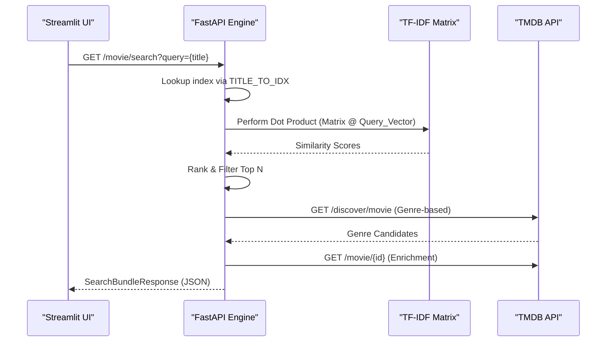

# Recommendation Logic Engine

The Recommendation Logic Engine serves as the computationally intensive backend of the system, responsible for transforming qualitative movie data into a high-dimensional vector space to enable mathematical similarity computations. It utilizes a hybrid retrieval strategy, combining local content-based filtering via TF-IDF (Term Frequency-Inverse Document Frequency) with external collaborative/discovery signals via the TMDB API.

## Section A: System Role & Architectural Position

The engine sits at the center of the **Core Processing Pipeline**. It consumes serialized feature matrices and dataframes loaded into memory at runtime and exposes high-level recommendation "bundles" through an asynchronous FastAPI interface.

### Component Specifications & Dependencies

| Specification | Detail | Purpose |
| :--- | :--- | :--- |
| **Primary Algorithm** | TF-IDF Cosine Similarity | Computes semantic closeness in vector space. |
| **Data Structures** | Scipy Sparse Matrix (`tfidf_matrix.pkl`) | Memory-efficient storage of high-dimensional vectors. |
| **State Management** | `TITLE_TO_IDX` (In-memory Dict) | $O(1)$ mapping from string titles to matrix row indices. |
| **External Integration** | TMDB REST API | Enrichment of local results with real-time metadata (posters, genres). |
| **Compute Libraries** | NumPy, Pandas, Scipy | Linear algebra and data manipulation. |
| **Concurrency Model** | Asynchronous (FastAPI/httpx) | Non-blocking I/O during external API enrichment. |

## Section B: Core Execution & Data Flow Mechanics

The engine operates via two primary logic paths: **Local Content Similarity** (driven by the local corpus) and **Metadata-Driven Discovery** (driven by TMDB genres).



### Algorithmic Execution Steps

1.  **Normalization & Indexing**: The input query string is normalized (`_norm_title`) and mapped to its integer index within the `tfidf_matrix`.
2.  **Vector Extraction**: The specific row vector $\vec{q}$ is extracted from the pre-computed sparse matrix.
3.  **Similarity Computation**: The engine performs a batch dot product between the entire `tfidf_matrix` ($\mathbf{M}$) and the transpose of the query vector ($\vec{q}^T$).
    $$\text{scores} = \mathbf{M} \cdot \vec{q}^T$$
    Since the matrix is L2-normalized, this dot product is mathematically equivalent to **Cosine Similarity**.
4.  **Local Ranking**: Results are sorted in descending order, excluding the query movie itself.
5.  **Hybrid Enrichment**:
    *   **TF-IDF Path**: Local titles are passed to `attach_tmdb_card_by_title` to fetch poster URLs and TMDB IDs.
    *   **Genre Path**: The engine extracts the primary genre ID from the target movie and queries the TMDB `/discover` endpoint to find popular movies within that specific taxonomic branch.
6.  **Serialization**: Data is aggregated into a `SearchBundleResponse` Pydantic model for type-safe transmission.

## Section C: Implementation Deep Dive

### Vector Similarity Computation

The core mathematical operation is implemented using NumPy's optimized BLAS routines via Scipy sparse matrix multiplication.

```python title="main.py"
def tfidf_recommend_titles(
    query_title: str, top_n: int = 10
) -> List[Tuple[str, float]]:
    global df, tfidf_matrix
    if df is None or tfidf_matrix is None:
        raise HTTPException(status_code=500, detail="TF-IDF resources not loaded")

    # O(1) index retrieval
    idx = get_local_idx_by_title(query_title)

    # Vectorized cosine similarity via dot product
    qv = tfidf_matrix[idx]
    scores = (tfidf_matrix @ qv.T).toarray().ravel()

    # Descending sort: argsort returns indices of elements in ascending order; 
    # negation facilitates descending order.
    order = np.argsort(-scores)

    out: List[Tuple[str, float]] = []
    for i in order:
        if int(i) == int(idx): # Avoid self-recommendation
            continue
        # ... extraction and boundary checks ...
        out.append((title_i, float(scores[int(i)])))
        if len(out) >= top_n:
            break
    return out
```
**Mechanics:**
*   `tfidf_matrix @ qv.T`: Executes a highly optimized sparse-dense matrix multiplication.
*   `ravel()`: Flattens the resulting $(N, 1)$ matrix into a 1D array for efficient sorting.
*   `np.argsort(-scores)`: Returns the permutation of indices that would sort the array in descending order.

### Hybrid Orchestration (The Bundle Pattern)

The `search_bundle` function implements the logic that merges local statistical similarity with external metadata discovery.

```python title="main.py"
@app.get("/movie/search", response_model=SearchBundleResponse)
async def search_bundle(
    query: str = Query(...),
    tfidf_top_n: int = Query(12),
    genre_limit: int = Query(12),
):
    # 1. Resolve identity via TMDB
    best = await tmdb_search_first(query)
    details = await tmdb_movie_details(best["id"])

    # 2. Compute Local Similarity (TF-IDF)
    # Fallback logic ensures robustness if title lookup fails
    recs = []
    try:
        recs = tfidf_recommend_titles(details.title, top_n=tfidf_top_n)
    except Exception:
        recs = []

    # 3. Enrich TF-IDF results with remote metadata
    tfidf_items = []
    for title, score in recs:
        card = await attach_tmdb_card_by_title(title)
        tfidf_items.append(TFIDFRecItem(title=title, score=score, tmdb=card))

    # 4. Compute External Similarity (Genre Discovery)
    genre_recs = []
    if details.genres:
        genre_id = details.genres[0]["id"]
        # ... async call to TMDB /discover endpoint ...
        
    return SearchBundleResponse(...)
```
**Mechanics:**
*   **Graceful Degradation**: The engine uses `try-except` blocks around `tfidf_recommend_titles` to prevent a local dataset mismatch from crashing the entire request.
*   **Asynchronous Enrichment**: The use of `await` allows the engine to handle multiple I/O-bound requests (TMDB API) concurrently, significantly reducing total latency.

## Section D: Method / State Reference & Error Recovery

### API Endpoint Contracts

| Endpoint | Method | Key Parameters | Return Type | Complexity |
| :--- | :--- | :--- | :--- | :--- |
| `/movie/search` | `GET` | `query` (str), `tfidf_top_n` (int) | `SearchBundleResponse` | $O(N \cdot D)$ where $D$ is dimensionality |
| `/recommend/genre`| `GET` | `tmdb_id` (int), `limit` (int) | `List[TMDBMovieCard]` | $O(1)$ + Network I/O |
| `/recommend/tfidf` | `GET` | `title` (str), `top_n` (int) | `List[Dict]` | $O(N \cdot D)$ |

### Error Recovery & Failure Modes

| Failure Scenario | Detection Mechanism | Recovery Strategy |
| :--- | :--- | :--- |
| **Index Miss** | `KeyError` in `TITLE_TO_IDX` | Raises `404 Not Found`; fallback to raw TMDB search in UI. |
| **TMDB API Downtime** | `httpx.RequestError` | Catch in `tmdb_get`; return `502 Bad Gateway` with error detail. |
| **Matrix Unavailability** | `NoneType` check on `tfidf_matrix` | Raises `500 Internal Server Error`. |
| **Empty Recommendation Set** | Length check on `recs` | Return empty list in bundle; UI displays "No recommendations available." |