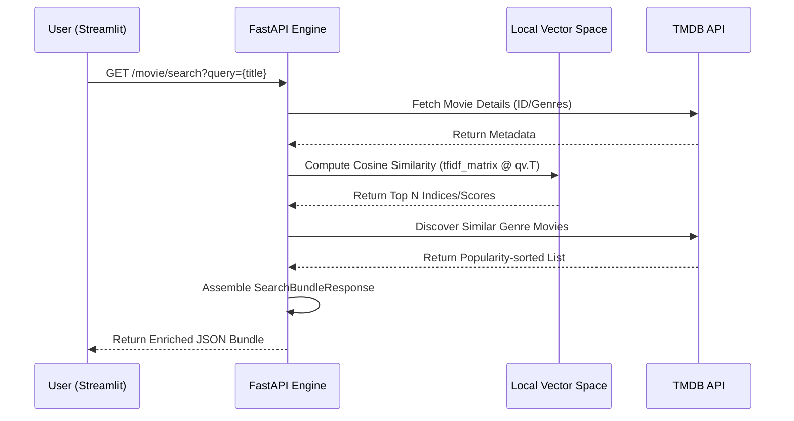

# Core Processing Pipeline

The Core Processing Pipeline is the centralized engine responsible for synchronizing pre-computed vector space artifacts with real-time external metadata. It facilitates the transition from high-dimensional TF-IDF similarity computations to user-facing, enriched movie recommendations by orchestrating data flow between the local serialized dataset and the The Movie Database (TMDB) REST API.

## Section A: System Role & Architectural Position

The pipeline operates as a hybrid retrieval system. It does not perform real-time NLP preprocessing; instead, it ingests high-fidelity, pre-processed computational artifacts into the application's memory space during the bootstrap phase. The architecture bifurcates the recommendation logic into two distinct domains: **Local Vector Space Similarity** (content-based filtering) and **Remote Metadata Discovery** (genre-based popularity).

### Data Artifact Specifications

| Artifact | Data Type | System Role | Description |
| :--- | :--- | :--- | :--- |
| `df.pkl` | `pandas.DataFrame` | Primary Index | Contains the ground-truth movie titles and metadata. |
| `indices.pkl` | `dict` \| `pd.Series` | Mapping Layer | Provides $O(1)$ lookups between normalized titles and matrix indices. |
| `tfidf_matrix.pkl` | `scipy.sparse.csr_matrix` | Feature Space | The compressed sparse row matrix representing the TF-IDF weighted term frequencies. |
| `tfidf.pkl` | `sklearn.feature_extraction.text.TfidfVectorizer` | Model State | The fitted vectorizer used to maintain consistent feature dimensionality. |

## Section B: Core Execution & Data Flow Mechanics

The pipeline follows a strict request-response lifecycle that integrates local mathematical operations with asynchronous network I/O. When a user selects a movie, the system executes a multi-stage orchestration to "bundle" the response.



### Execution Lifecycle

1.  **Artifact Hydration**: Upon `startup`, the `load_pickles` function populates the global singleton objects (`df`, `tfidf_matrix`, `TITLE_TO_IDX`). This ensures zero-latency access to the vector space during request handling.
2.  **Query Normalization**: Input strings are processed via `_norm_title` to ensure whitespace and casing consistency, preventing mismatches between the user's intent and the `TITLE_TO_IDX` map.
3.  **Similarity Computation**: The system performs a dot product between the query vector (retrieved via the index) and the transposed sparse TF-IDF matrix to calculate cosine similarity scores across the entire corpus.
4.  **Asynchronous Enrichment**: To prevent blocking the event loop during the similarity calculation, the pipeline utilizes `httpx.AsyncClient` to concurrently fetch external assets (posters, backdrops) and genre-based discovery sets.

## Section C: Implementation Deep Dive

### Vectorized Similarity Engine

The core mathematical operation relies on optimized matrix multiplication via `numpy` and `scipy` to identify neighbors in the high-dimensional text space.

```python title="main.py - tfidf_recommend_titles"
def tfidf_recommend_titles(
    query_title: str, top_n: int = 10
) -> List[Tuple[str, float]]:
    global df, tfidf_matrix
    if df is None or tfidf_matrix is None:
        raise HTTPException(status_code=500, detail="TF-IDF resources not loaded")

    # O(1) Index Retrieval
    idx = get_local_idx_by_title(query_title)

    # Dot product for cosine similarity (assuming unit vectors)
    qv = tfidf_matrix[idx]
    scores = (tfidf_matrix @ qv.T).toarray().ravel()

    # Sort indices by descending similarity score
    order = np.argsort(-scores)

    out: List[Tuple[str, float]] = []
    for i in order:
        if int(i) == int(idx): continue # Filter self
        try:
            title_i = str(df.iloc[int(i)]["title"])
            out.append((title_i, float(scores[int(i)])))
            if len(out) >= top_n: break
        except Exception:
            continue
    return out
```
**Mechanics:**
*   `tfidf_matrix @ qv.T`: Executes the sparse matrix-vector multiplication, yielding a dense array of similarity scores.
*   `np.argsort(-scores)`: Performs an indirect sort to retrieve indices of the highest scores in $O(N \log N)$ time.
*   **Complexity**: The operation is $O(N \cdot K)$ where $N$ is the number of movies and $K$ is the number of non-zero features in the query vector.

### Orchestration Bundle Logic

The `search_bundle` endpoint acts as the controller, aggregating heterogeneous data sources into a single Pydantic-validated response.

```python title="main.py - search_bundle"
@app.get("/movie/search", response_model=SearchBundleResponse)
async def search_bundle(
    query: str = Query(...),
    tfidf_top_n: int = Query(12),
    genre_limit: int = Query(12),
):
    # 1. Metadata Acquisition
    best = await tmdb_search_first(query)
    if not best:
        raise HTTPException(status_code=404, detail="Movie not found")
    
    details = await tmdb_movie_details(int(best["id"]))

    # 2. Local Similarity Branch (TF-IDF)
    tfidf_items = []
    try:
        recs = tfidf_recommend_titles(details.title, top_n=tfidf_top_n)
        for title, score in recs:
            card = await attach_tmdb_card_by_title(title)
            tfidf_items.append(TFIDFRecItem(title=title, score=score, tmdb=card))
    except Exception:
        pass # Fallback handled by empty list

    # 3. Remote Discovery Branch (Genre)
    genre_recs = []
    if details.genres:
        genre_id = details.genres[0]["id"]
        discover = await tmdb_get("/discover/movie", {"with_genres": genre_id, "sort_by": "popularity.desc"})
        genre_recs = await tmdb_cards_from_results(discover.get("results", []), limit=genre_limit)

    return SearchBundleResponse(
        query=query,
        movie_details=details,
        tfidf_recommendations=tfidf_items,
        genre_recommendations=genre_recs
    )
```
**Mechanics:**
*   **Error Silencing**: The TF-IDF branch is wrapped in a `try-except` block to ensure that a failure in the local vector lookup (e.g., title mismatch) does not crash the entire response, allowing the "Genre" fallback to function.
*   **Pydantic Validation**: The `SearchBundleResponse` enforces a strict schema, ensuring the UI receives a predictable JSON structure.

## Section D: Method / State Reference & Error Recovery

### API Interface Contract

| Endpoint | Method | Primary Parameters | Logic Type |
| :--- | :--- | :--- | :--- |
| `/home` | `GET` | `category`, `limit` | Remote (TMDB) |
| `/tmdb/search` | `GET` | `query`, `page` | Remote (TMDB) |
| `/movie/id/{id}` | `GET` | `tmdb_id` | Remote (TMDB) |
| `/recommend/genre`| `GET` | `tmdb_id`, `limit` | Remote (TMDB) |
| `/movie/search` | `GET` | `query`, `tfidf_top_n`| **Hybrid (Local + Remote)** |

### Failure Mode Analysis

| Failure Scenario | Error Code | Mitigation Strategy |
| :--- | :--- | :--- |
| **TMDB API Downtime** | `502 Bad Gateway` | Raised via `httpx.RequestError`; UI displays error toast and stops execution. |
| **Vector Space Mismatch** | `404 Not Found` | Occurs if `get_local_idx_by_title` fails; system falls back to raw TMDB search results. |
| **Corrupt Pickle Artifacts**| `500 Internal Error`| Caught during `@app.on_event("startup")`; prevents server from entering an inconsistent state. |
| **Empty Search Results** | `200 OK (Empty)` | Returned when `tmdb_search_first` finds no matches; UI renders "No suggestions found". |