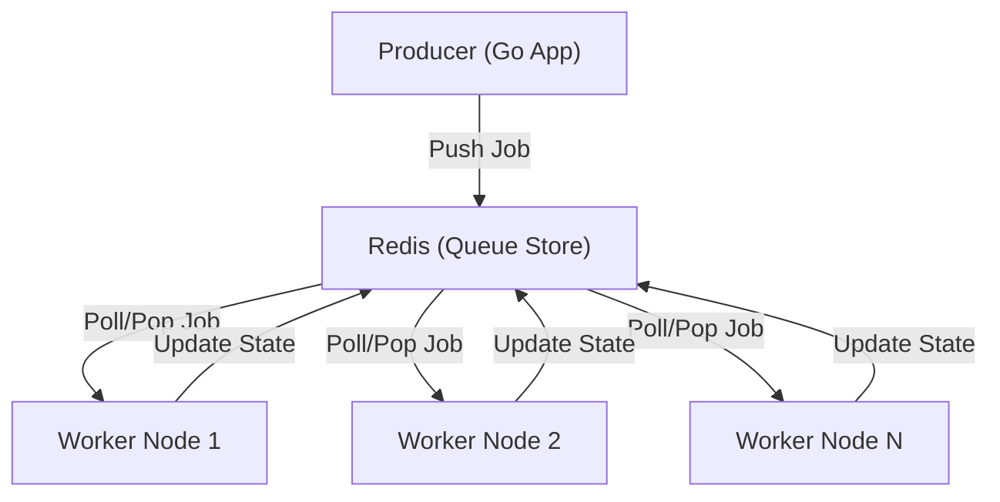

# Introduction

ForgeQueue is a high-performance, fault-tolerant distributed job queue engineered in Go and powered by Redis. It is designed to decouple time-consuming background tasks from the main application flow, ensuring that your primary services remain responsive while heavy workloads are processed asynchronously across a scalable cluster of workers.

## Core Purpose

The primary objective of ForgeQueue is to provide a reliable mechanism for scheduling and executing tasks in a distributed environment. By utilizing Redis as a centralized state store, ForgeQueue ensures that tasks are tracked, persisted, and distributed efficiently among available worker nodes, preventing task loss and ensuring eventual execution even in the event of worker failure.

## Distributed Task Queue Philosophy

ForgeQueue adheres to the core tenets of distributed systems to achieve maximum resilience and scalability:

1.  **Decoupling**: Producers (clients) do not need to know who will execute the task or when. They simply push a job definition to the queue.
2.  **Horizontal Scalability**: As the volume of tasks increases, you can scale the processing power linearly by adding more worker instances without modifying the producer logic.
3.  **Fault Tolerance**: By leveraging Redis for state management, ForgeQueue prevents "lost jobs." If a worker crashes while processing a task, the system is designed to ensure the job can be recovered or retried.
4.  **Asynchronous Execution**: It removes blocking operations from the critical path of the user experience, shifting the workload to a background layer optimized for throughput.

## High-Level Architecture

The following diagram illustrates the lifecycle of a task within the ForgeQueue ecosystem:

## Key Technical Advantages

*   **Go Runtime**: Leverages Go's lightweight concurrency primitives (goroutines) for high-efficiency job polling and execution.
*   **Redis Backend**: Utilizes Redis's atomic operations to ensure that jobs are distributed to exactly one worker at a time, eliminating race conditions.
*   **Reliability**: Built-in mechanisms to handle distributed state, ensuring that the system remains consistent across multiple worker nodes.