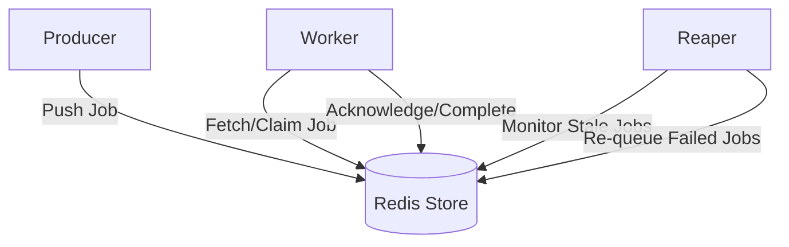

# System Architecture

ForgeQueue is designed as a decoupled, distributed job queue system that leverages Redis as a centralized state store and message broker. The architecture follows a producer-consumer pattern enhanced by a dedicated recovery mechanism to ensure fault tolerance.

## High-Level Design

The system is split into three primary autonomous components that interact asynchronously via Redis. This separation allows for independent scaling based on workload: increasing workers for higher throughput or adjusting the reaper frequency for stricter reliability guarantees.

## Component Breakdown

### Producer
The Producer serves as the entry point for the system. Its primary responsibility is to encapsulate job data and push it into the Redis-backed queue. It ensures that jobs are formatted correctly and persisted before returning a success response to the client.

### Worker
Workers are the execution engines of ForgeQueue. They operate in a continuous loop:
1. **Polling**: Fetching available jobs from Redis.
2. **Processing**: Executing the business logic associated with the job.
3. **Acknowledgment**: Marking the job as completed in Redis to prevent duplicate processing.

### Reaper
The Reaper is the fault-tolerance layer. In a distributed system, workers can crash or network partitions can occur after a job is claimed but before it is completed. The Reaper periodically scans the state store for "orphaned" or timed-out jobs and returns them to the primary queue, ensuring no task is permanently lost.

## Data Lifecycle

1. **Submission**: The **Producer** pushes a job payload into the Redis queue.
2. **Acquisition**: An available **Worker** claims the job, moving it from a "pending" state to a "processing" state.
3. **Execution**: The **Worker** processes the job.
4. **Resolution**:
   - **Success**: The **Worker** deletes the job or marks it as finished.
   - **Failure/Timeout**: If the **Worker** crashes, the **Reaper** identifies the stale job via a timeout threshold and re-inserts it into the pending queue for another worker to attempt.