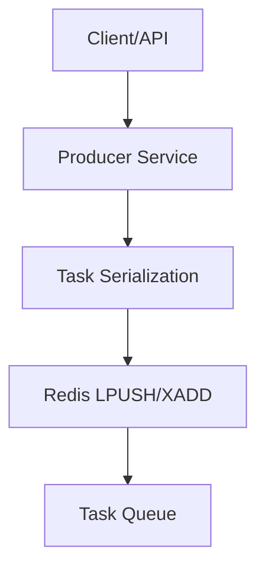

# Task Production

The Producer component serves as the entry point for the ForgeQueue ecosystem. Its primary responsibility is to encapsulate work units into tasks and inject them into the distributed Redis backend, ensuring that the system remains decoupled and scalable.

## Architectural Workflow

The production process follows a unidirectional pipeline where the producer acts as a bridge between the external request source and the internal queue.




## Producer Analysis

The producer is implemented as a standalone service located in `cmd/producer/main.go`. In a production environment, this service handles the transformation of raw data into a queue-compatible format.

### Task Injection Process

1.  **Task Definition**: The producer defines the task payload, which typically includes a `TaskType`, `Payload` (JSON), and `Priority`.
2.  **Serialization**: Before injection, the Go struct is serialized (usually via `encoding/json`) to ensure compatibility with Redis's string-based storage.
3.  **Queue Dispatch**: The producer utilizes Redis atomic operations (such as `LPUSH` for simple lists or `XADD` for streams) to ensure that tasks are added without race conditions.
4.  **Persistence**: Once the task reaches Redis, it is considered "Produced" and awaits a worker to claim it.

## Implementation Detail

The current entry point in `cmd/producer/main.go` initializes the producer lifecycle. 

```go
func main() {
	fmt.Println("Producer service started")
	for {
		time.Sleep(1 * time.Second)
	}
}
```

While the current implementation provides the service heartbeat, the production logic is designed to integrate with an API or a message bus to trigger task creation dynamically.

## Production Constraints

To maintain fault tolerance and system stability, the producer adheres to the following constraints:

| Constraint | Implementation | Purpose |
| :--- | :--- | :--- |
| **Atomicity** | Redis Atomic Pushes | Prevents partial task writes. |
| **Decoupling** | Asynchronous Injection | Ensures the producer does not block on worker availability. |
| **Durability** | Redis Persistence | Ensures tasks survive producer crashes. |