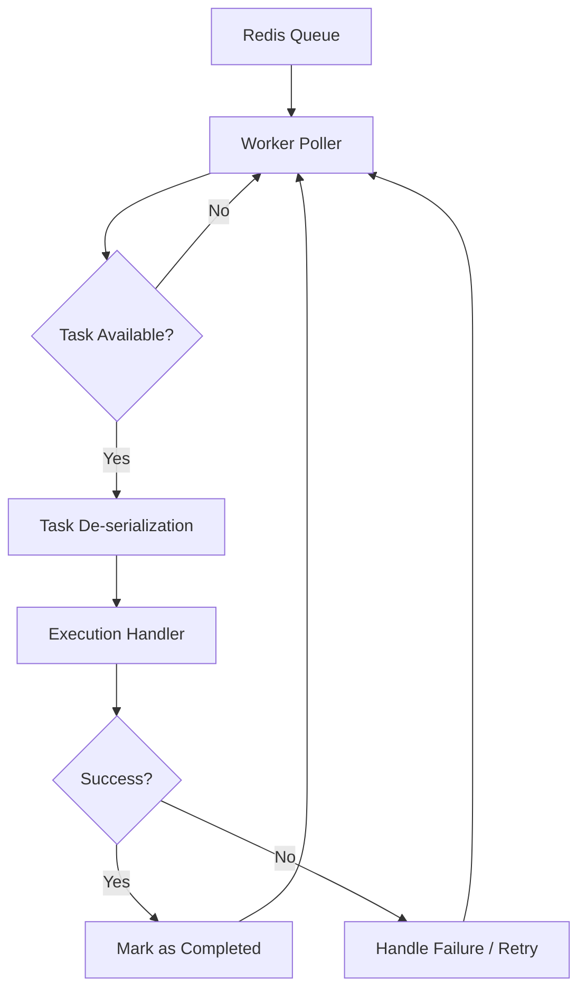

# Task Execution

The worker service in ForgeQueue is the execution engine of the distributed system. Its primary responsibility is to monitor the Redis-backed queue, consume pending tasks, and execute them according to their defined logic.

## Worker Lifecycle

The worker operates on a continuous polling loop. Upon initialization, the worker establishes a connection to the Redis instance and enters a listening state.

## Consumption Logic

The worker employs a "Pull" model to ensure that tasks are distributed evenly across multiple worker instances.

### 1. Polling and Fetching
The worker utilizes blocking operations (such as `BLPOP` or Redis Stream reads) to minimize CPU overhead while ensuring near-instantaneous task pickup. This prevents the "thundering herd" problem and reduces latency between task submission and execution.

### 2. Task De-serialization
Once a raw payload is retrieved from Redis, the worker:
- Validates the payload integrity.
- Deserializes the JSON/Binary data into a Go internal `Task` structure.
- Maps the `TaskType` to a registered handler function.

### 3. Execution and Fault Tolerance
To maintain fault tolerance, ForgeQueue implements a processing wrapper around the handler:

- **Timeout Management:** Each task is executed within a context with a defined timeout to prevent "zombie tasks" from hanging the worker.
- **Panic Recovery:** The worker employs a `recover()` mechanism to ensure that a single crashing task does not terminate the entire worker process.
- **Acknowledgement:** Tasks are only marked as complete after the handler returns successfully. If a worker disconnects mid-process, the task is reclaimed by the system based on the visibility timeout.

## Processing Flow

The internal execution flow follows these strict stages:

| Stage | Action | Outcome |
| :--- | :--- | :--- |
| **Fetch** | `RPOP` / `XREAD` | Task is moved from Pending to Processing state. |
| **Dispatch** | Handler Lookup | The task is routed to the specific business logic function. |
| **Execute** | Function Call | The business logic is performed. |
| **Settle** | ACK / NACK | Task is deleted from Redis or moved to a Dead Letter Queue (DLQ). |

## Configuration

Workers can be scaled horizontally by deploying additional instances of the `cmd/worker` binary. Since the state is managed in Redis, workers are stateless and can be terminated or restarted without data loss.