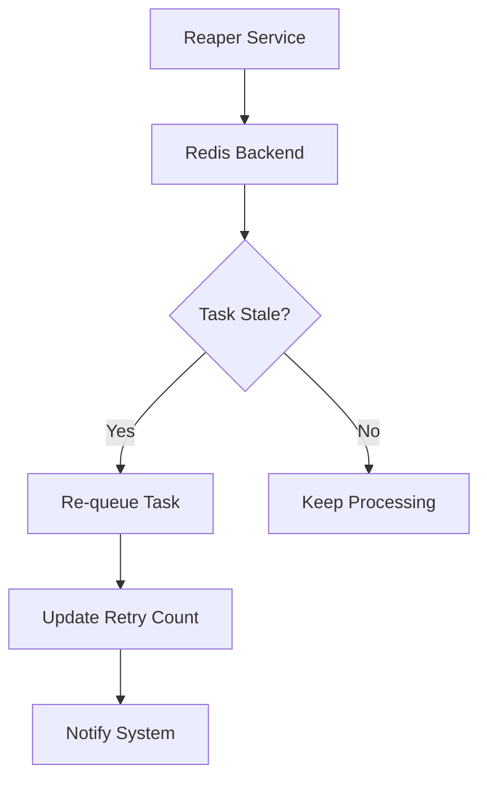

# Queue Maintenance

To ensure high availability and fault tolerance, ForgeQueue employs a maintenance pattern centered around the **Reaper** service. In a distributed system, worker nodes can fail unexpectedly or experience network partitions, leaving tasks in a "processing" state indefinitely. The Reaper acts as the system's garbage collector, preventing these "zombie tasks" from permanently blocking the pipeline.

## The Reaper Component

The Reaper is a standalone service located in `cmd/reaper`. Its primary objective is to monitor the state of the Redis backend and reconcile tasks that have stalled or failed to report completion.

### Core Responsibilities

- **Stale Task Detection**: Periodically scanning the active task set for jobs that have exceeded their defined Time-to-Live (TTL).
- **Task Recovery**: Moving timed-out tasks back into the pending queue to be picked up by available workers, ensuring "at-least-once" delivery guarantees.
- **Retry Management**: Tracking failure counts and moving tasks to a Dead Letter Queue (DLQ) if they exceed the maximum allowed retry attempts.
- **Memory Optimization**: Pruning expired job metadata from Redis to maintain optimal performance.

## Maintenance Workflow

The Reaper operates on a continuous loop, polling the Redis store to validate the health of in-flight tasks.




## Deployment and Operation

The Reaper is designed to run as a background daemon. While it can be scaled, it is typically deployed as a singleton or via leader election to avoid redundant processing of the same stale tasks.

### Running the Service

To start the maintenance process, build and execute the reaper binary:

```bash
# Build the reaper service
go build -o reaper ./cmd/reaper/main.go

# Execute the service
./reaper
```

### Configuration
The Reaper service interacts with the same Redis configuration used by the main ForgeQueue workers. Ensure the service has sufficient permissions to read and write to the task keyspaces and the retry counters.