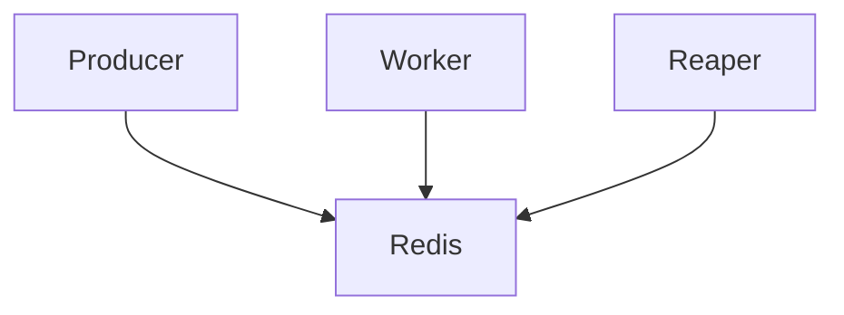

# Deployment and Orchestration

ForgeQueue is designed for containerized deployment, utilizing a distributed architecture where multiple specialized components coordinate through a centralized Redis instance.

## System Architecture

The following diagram illustrates the relationship between the various ForgeQueue components and the data store.




## Quick Start with Docker Compose

The fastest way to deploy the full ForgeQueue stack is using the provided `docker-compose.yml` file. This orchestrates the Redis backend and the three core Go binaries.

### 1. Launch the Stack

Run the following command from the root directory to build the images and start the services in detached mode:

```bash
docker compose up -d
```

### 2. Verify Service Status

Ensure all containers are running and healthy:

```bash
docker compose ps
```

## Component Breakdown

The deployment consists of four primary services:

| Service | Role | Description |
| :--- | :--- | :--- |
| `redis` | **Message Broker** | The source of truth for the job queue and state management. |
| `producer` | **Ingress** | Handles the submission of new jobs into the system. |
| `worker` | **Executor** | Consumes jobs from Redis and executes the business logic. |
| `reaper` | **Fault Tolerance** | Monitors timed-out or orphaned jobs and re-queues them for processing. |

## Configuration

ForgeQueue is configured via environment variables passed to the containers. While the default `docker-compose.yml` uses internal DNS for service discovery, you can override these settings.

### Environment Variables

| Variable | Default | Description |
| :--- | :--- | :--- |
| `REDIS_ADDR` | `redis:6379` | The network address of the Redis instance. |
| `REDIS_PASSWORD` | `""` | Authentication password for Redis (if applicable). |
| `LOG_LEVEL` | `info` | Verbosity of the logs (`debug`, `info`, `warn`, `error`). |

To apply custom configuration, create a `.env` file in the root directory:

```env
REDIS_ADDR=redis:6379
LOG_LEVEL=debug
```

## Scaling the Infrastructure

One of the primary advantages of the ForgeQueue architecture is the ability to scale the consumer layer independently of the producer.

### Scaling Workers

To increase the processing throughput of your system, scale the `worker` service:

```bash
docker compose up -d --scale worker=5
```

This command deploys five identical worker instances, all competing for jobs from the same Redis queue, effectively distributing the load.

## Maintenance

### Viewing Logs

To monitor the orchestration and job processing in real-time:

```bash
docker compose logs -f
```

### Shutting Down

To stop and remove the containers, networks, and images defined in the compose file:

```bash
docker compose down
```