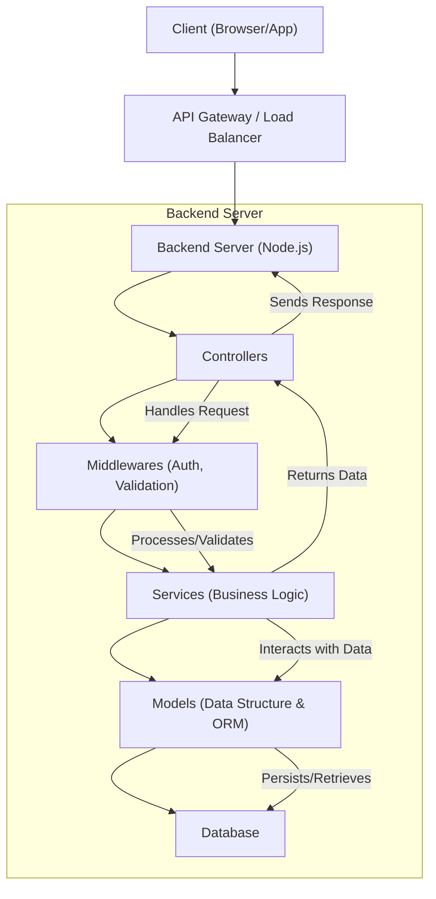

# Backend Structure

This section details the backend directory organization and core components of the Job Portal application. A well-defined structure ensures maintainability, scalability, and ease of development.

## Directory Organization

The backend is organized into logical directories, each serving a specific purpose:

*   **`controllers`**: Handles incoming requests, interacts with services, and sends responses to the client.
*   **`models`**: Defines the data structures and business logic for entities like `User` and `Job`.
*   **`middlewares`**: Contains reusable functions that execute before or after route handlers, such as authentication and validation.
*   **`services`**: Encapsulates the business logic, interacting with models and external resources.

```plaintext
Backend/
├── controllers/
│   ├── authController.js
│   ├── jobController.js
│   └── userController.js
├── models/
│   ├── User.js
│   └── Job.js
├── middlewares/
│   ├── authMiddleware.js
│   └── validationMiddleware.js
└── services/
    ├── authService.js
    ├── jobService.js
    └── userService.js
```

## Core Components

### Controllers

Controllers act as the entry point for API requests. They delegate the actual processing to services and format the response.

**Example: `jobController.js`**

```javascript
// Backend/controllers/jobController.js
const jobService = require('../services/jobService');

exports.getAllJobs = async (req, res) => {
  try {
    const jobs = await jobService.findAllJobs();
    res.status(200).json(jobs);
  } catch (error) {
    res.status(500).json({ message: 'Error fetching jobs', error: error.message });
  }
};

exports.createJob = async (req, res) => {
  try {
    const newJob = await jobService.createJob(req.body);
    res.status(201).json(newJob);
  } catch (error) {
    res.status(500).json({ message: 'Error creating job', error: error.message });
  }
};
```

### Models

Models represent the data entities and their associated logic, often interacting directly with the database.

**Example: `Job.js`**

```javascript
// Backend/models/Job.js
class Job {
  constructor({ id, title, description, company, location, salary, created_at }) {
    this.id = id;
    this.title = title;
    this.description = description;
    this.company = company;
    this.location = location;
    this.salary = salary;
    this.created_at = created_at || new Date();
  }

  // Placeholder for database interaction methods
  static async findAll() {
    // Logic to fetch all jobs from DB
    return [];
  }

  async save() {
    // Logic to save this job to DB
  }
}

module.exports = Job;
```

### Middlewares

Middlewares are functions that have access to the request object, response object, and the `next` middleware function in the application's request-response cycle. They are commonly used for authentication, authorization, logging, and input validation.

**Example: `authMiddleware.js`**

```javascript
// Backend/middlewares/authMiddleware.js
const jwt = require('jsonwebtoken');

const authenticateToken = (req, res, next) => {
  const authHeader = req.headers['authorization'];
  const token = authHeader && authHeader.split(' ')[1];

  if (token == null) return res.sendStatus(401); // if there isn't any token

  jwt.verify(token, process.env.ACCESS_TOKEN_SECRET, (err, user) => {
    if (err) return res.sendStatus(403); // if token is invalid
    req.user = user;
    next(); // proceed to the next middleware or controller
  });
};

module.exports = { authenticateToken };
```

### Services

Services contain the core business logic. They are called by controllers and interact with models to perform operations. This separation of concerns makes the code cleaner and easier to test.

**Example: `jobService.js`**

```javascript
// Backend/services/jobService.js
const Job = require('../models/Job');
// Assume a database connector is available and imported here
// const db = require('../config/database');

exports.findAllJobs = async () => {
  // In a real application, this would query the database
  // const [rows] = await db.execute('SELECT * FROM jobs');
  // return rows.map(row => new Job(row));
  console.log('Fetching all jobs from service...');
  // Mock data for demonstration
  return [
    new Job({ id: 1, title: 'Software Engineer', company: 'TechCorp', location: 'Remote', salary: '$120k' }),
    new Job({ id: 2, title: 'Data Scientist', company: 'DataSolutions', location: 'New York', salary: '$130k' }),
  ];
};

exports.createJob = async (jobData) => {
  // In a real application, this would insert into the database
  // const [result] = await db.execute('INSERT INTO jobs SET ?', jobData);
  // const newJob = new Job({ id: result.insertId, ...jobData });
  // return newJob;
  console.log('Creating new job via service...', jobData);
  // Mock job creation
  return new Job({ id: Math.floor(Math.random() * 1000) + 3, ...jobData });
};
```

## Architecture Overview

The backend follows a layered architecture pattern, promoting separation of concerns and maintainability.





## Key Takeaways

*   **Modularity**: The structure is designed for modularity, with clear responsibilities for controllers, services, and models.
*   **Testability**: Each layer can be tested independently, simplifying the testing process.
*   **Scalability**: The separation of concerns allows for easier scaling of specific components as needed.
*   **Maintainability**: A well-organized codebase reduces the complexity of understanding and modifying the application.