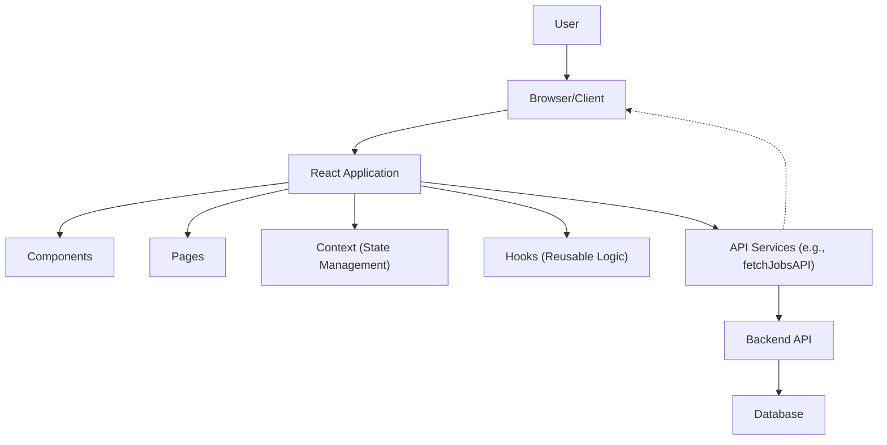

# Frontend Structure

This section details the directory organization and core components of the Job Portal frontend. Understanding this structure is crucial for navigating the codebase, contributing effectively, and extending its functionality.

## Directory Organization

The frontend codebase follows a standard, organized structure to promote maintainability and scalability.

-   `src/components`: Contains reusable UI components used across the application.
-   `src/pages`: Houses the top-level components that represent distinct application views or routes.
-   `src/context`: Manages application-wide state using React Context API.
-   `src/hooks`: Includes custom React hooks for encapsulating reusable logic.

## Core Components

### `src/components`

This directory is the heart of our UI. It's organized to house presentational and container components that can be easily reused.

*   **`Button`**: A versatile button component with customizable styles and click handlers.
*   **`Card`**: Used for displaying job listings, user profiles, and other information blocks.
*   **`Input`**: A generic input field component supporting various input types.
*   **`Modal`**: A reusable modal dialog for alerts, forms, and confirmations.

```tsx
// Frontend/src/components/Button/Button.tsx
import React, { ButtonHTMLAttributes } from 'react';

interface ButtonProps extends ButtonHTMLAttributes<HTMLButtonElement> {
  children: React.ReactNode;
  variant?: 'primary' | 'secondary' | 'danger';
}

const Button: React.FC<ButtonProps> = ({ children, variant = 'primary', ...props }) => {
  const baseStyle = 'px-4 py-2 rounded-md font-semibold';
  const variantStyle = {
    primary: 'bg-blue-500 text-white hover:bg-blue-600',
    secondary: 'bg-gray-200 text-gray-800 hover:bg-gray-300',
    danger: 'bg-red-500 text-white hover:bg-red-600',
  };

  return (
    <button className={`${baseStyle} ${variantStyle[variant]}`} {...props}>
      {children}
    </button>
  );
};

export default Button;
```

### `src/pages`

Each file in this directory maps to a specific route within the application.

*   **`HomePage`**: The main landing page displaying featured job listings.
*   **`JobDetailsPage`**: Shows detailed information for a selected job.
*   **`LoginPage`**: User authentication interface.
*   **`RegisterPage`**: New user registration form.
*   **`NotFoundPage`**: A fallback for undefined routes.

```tsx
// Frontend/src/pages/HomePage.tsx
import React from 'react';
import JobCardList from '../components/JobCardList';
import Header from '../components/Header';

const HomePage: React.FC = () => {
  return (
    <div>
      <Header />
      <main className="container mx-auto p-4">
        <h1 className="text-3xl font-bold mb-4">Featured Jobs</h1>
        <JobCardList />
      </main>
    </div>
  );
};

export default HomePage;
```

### `src/context`

This directory is dedicated to managing global application state using React's Context API.

*   **`AuthContext`**: Manages user authentication status, tokens, and user information.
*   **`JobContext`**: Provides access to job-related data, such as fetching, filtering, and posting jobs.

```tsx
// Frontend/src/context/AuthContext.tsx
import React, { createContext, useState, useContext, ReactNode } from 'react';

interface AuthState {
  isAuthenticated: boolean;
  user: any | null; // Consider defining a User interface
  token: string | null;
}

interface AuthContextType extends AuthState {
  login: (token: string, user: any) => void;
  logout: () => void;
}

const AuthContext = createContext<AuthContextType | undefined>(undefined);

export const AuthProvider: React.FC<{ children: ReactNode }> = ({ children }) => {
  const [authState, setAuthState] = useState<AuthState>({
    isAuthenticated: false,
    user: null,
    token: null,
  });

  const login = (token: string, user: any) => {
    setAuthState({ isAuthenticated: true, user, token });
    localStorage.setItem('token', token);
    localStorage.setItem('user', JSON.stringify(user));
  };

  const logout = () => {
    setAuthState({ isAuthenticated: false, user: null, token: null });
    localStorage.removeItem('token');
    localStorage.removeItem('user');
  };

  return (
    <AuthContext.Provider value={{ ...authState, login, logout }}>
      {children}
    </AuthContext.Provider>
  );
};

export const useAuth = () => {
  const context = useContext(AuthContext);
  if (context === undefined) {
    throw new Error('useAuth must be used within an AuthProvider');
  }
  return context;
};
```

### `src/hooks`

Custom hooks are implemented here to abstract complex logic and promote code reuse.

*   **`useFetchJobs`**: A hook for fetching job listings, including pagination and filtering.
*   **`useForm`**: A generic form handling hook for managing form state and submissions.

```tsx
// Frontend/src/hooks/useFetchJobs.ts
import { useState, useEffect } from 'react';
import { fetchJobsAPI } from '../services/api'; // Assuming an api service

interface Job {
  id: string;
  title: string;
  company: string;
  location: string;
  // ... other job properties
}

interface UseFetchJobsResult {
  jobs: Job[];
  loading: boolean;
  error: string | null;
  fetchJobs: () => void;
}

const useFetchJobs = (): UseFetchJobsResult => {
  const [jobs, setJobs] = useState<Job[]>([]);
  const [loading, setLoading] = useState<boolean>(true);
  const [error, setError] = useState<string | null>(null);

  const fetchJobs = async () => {
    setLoading(true);
    setError(null);
    try {
      const data = await fetchJobsAPI(); // Call your API service
      setJobs(data);
    } catch (err) {
      setError('Failed to fetch jobs.');
      console.error(err);
    } finally {
      setLoading(false);
    }
  };

  useEffect(() => {
    fetchJobs();
  }, []);

  return { jobs, loading, error, fetchJobs };
};

export default useFetchJobs;
```

## Frontend Architecture Overview

The frontend follows a component-based architecture, leveraging React hooks and context for state management. API interactions are abstracted into service functions.





## Key Takeaways

*   The frontend is structured for modularity and reusability, with distinct directories for components, pages, context, and hooks.
*   `src/components` contains presentational UI elements.
*   `src/pages` maps directly to application routes.
*   `src/context` handles global application state (e.g., authentication).
*   `src/hooks` abstracts complex logic into reusable custom hooks.
*   The architecture promotes separation of concerns, making the codebase easier to understand and maintain.