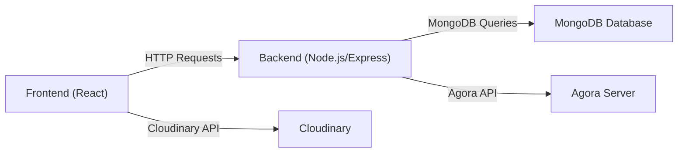
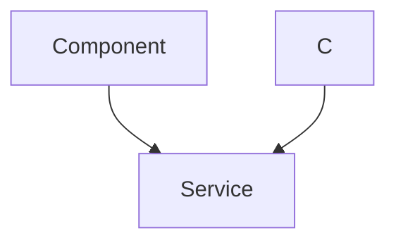

# Project Overview

The Job Portal project is a web application designed to connect job seekers and employers, streamlining the recruitment process. It offers features for job listing, application tracking, and profile management, aiming to simplify the complexities of job searching and recruitment. The platform leverages modern web technologies like React, Node.js, Express.js, and MongoDB to provide a user-centric experience.

## Key Features

- **User Authentication:** Secure registration and login for both job seekers and employers.
- **Job Listing and Search:** Employers can post jobs, and job seekers can search and filter listings.
- **Job Application Tracking:** Users can track the status of their job applications.
- **Profile Management:** Users can create and manage their professional profiles.
- **Video Interview Integration:** Integration with Agora for conducting video interviews.
- **Real-time Notifications:** Notifications for job updates and application status.

## Tech Stack

The project utilizes a comprehensive tech stack for both the frontend and backend:

**Frontend:**

- React: A JavaScript library for building user interfaces.
- JavaScript: The primary programming language for frontend logic.
- HTML5 and CSS3: For structuring and styling the user interface.
- Tailwind CSS: A utility-first CSS framework for rapid UI development.
- Lucide React: A library of icons.
- Axios: For making HTTP requests to the backend.

**Backend:**

- Node.js: A JavaScript runtime for building the server-side application.
- Express.js: A web application framework for Node.js.
- MongoDB: A NoSQL database for storing application data.

**Additional Technologies:**

- Socket.IO: For real-time communication features.
- Agora: For video interview functionality.
- Cloudinary: For image management.

Here's a simplified Mermaid diagram representing the project's architecture:





## Project Setup and Installation

To set up the project locally, follow these steps:

1.  Clone the GitHub repository:

    ```bash
    git clone https://github.com/lande26/Job-Portal.git
    ```

2.  Navigate to the frontend directory and install dependencies:

    ```bash
    cd Frontend
    npm install
    npm start
    ```

    This command installs the necessary npm packages for the frontend application and starts the development server.

    [View on GitHub](https://github.com/lande26/Job-Portal/blob/main/Frontend/package.json)

3.  Navigate to the backend directory and install dependencies:

    ```bash
    cd Backend
    npm install
    nodemon server.js
    ```

    This command installs the necessary npm packages for the backend application and starts the server using nodemon.

    [View on GitHub](https://github.com/lande26/Job-Portal/blob/main/Backend/package.json)

## Backend Structure and Key Components

The backend is built using Node.js and Express.js. Key dependencies include:

- `express`: For creating the web server and handling routes.
- `mongoose`: For interacting with the MongoDB database.
- `bcrypt`: For password hashing and security.
- `jsonwebtoken`: For creating and verifying JSON Web Tokens (JWT) for authentication.
- `cors`: For enabling Cross-Origin Resource Sharing.

Here’s an example of how JWT authentication is implemented in the backend:

```javascript
// Backend/server.js
const jwt = require('jsonwebtoken');

// Function to generate a JWT token
function generateToken(user) {
  const payload = {
    userId: user._id,
    email: user.email,
  };
  const secretKey = process.env.JWT_SECRET || 'defaultSecretKey';
  const options = {
    expiresIn: '1h', // Token expires in 1 hour
  };
  return jwt.sign(payload, secretKey, options);
}

// Example route to login and generate a token
app.post('/login', async (req, res) => {
  // Verify user credentials
  const user = await User.findOne({ email: req.body.email });
  if (!user || !(await bcrypt.compare(req.body.password, user.password))) {
    return res.status(401).send('Invalid credentials');
  }

  // Generate a token
  const token = generateToken(user);
  res.send({ token });
});

```

This snippet demonstrates how a JWT token is generated upon successful login. The token contains the user ID and email and is signed with a secret key. This token is then sent to the client, which can use it to authenticate subsequent requests.

[View on GitHub](https://github.com/lande26/Job-Portal/blob/main/Backend/server.js)

## Frontend Structure and Key Components

The frontend is built using React. Key dependencies include:

- `react`: The core React library.
- `react-router-dom`: For handling navigation and routing.
- `axios`: For making HTTP requests to the backend.
- `react-bootstrap`: For pre-built UI components.

Here's an example of how Axios is used to make API requests from the frontend:

```javascript
// Frontend/src/components/JobList.jsx
import axios from 'axios';
import { useState, useEffect } from 'react';

function JobList() {
  const [jobs, setJobs] = useState([]);

  useEffect(() => {
    async function fetchJobs() {
      try {
        const response = await axios.get('/api/jobs');
        setJobs(response.data);
      } catch (error) {
        console.error('Error fetching jobs:', error);
      }
    }

    fetchJobs();
  }, []);

  return (
    <ul>
      {jobs.map(job => (
        <li key={job._id}>{job.title} - {job.company}</li>
      ))}
    </ul>
  );
}

export default JobList;

```

This snippet demonstrates fetching job listings from the backend using Axios. The `useEffect` hook is used to make the API request when the component mounts, and the job data is stored in the `jobs` state variable.

[View on GitHub](https://github.com/lande26/Job-Portal/blob/main/Frontend/src/components/JobList.jsx)

## Cloudinary Integration

The project integrates with Cloudinary for image management. This allows users to upload and store images, such as profile pictures and company logos, in the cloud.

Here’s a basic example of how Cloudinary is used in the backend:

```javascript
// Backend/server.js
const cloudinary = require('cloudinary').v2;
const multer = require('multer');
const { CloudinaryStorage } = require('multer-storage-cloudinary');

cloudinary.config({
  cloud_name: process.env.CLOUDINARY_CLOUD_NAME,
  api_key: process.env.CLOUDINARY_API_KEY,
  api_secret: process.env.CLOUDINARY_API_SECRET
});

const storage = new CloudinaryStorage({
  cloudinary: cloudinary,
  folder: 'job-portal', // Optional: Folder to store images
  allowedFormats: ['jpg', 'png'],
  filename: (req, file, cb) => {
    cb(null, file.originalname);
  }
});

const upload = multer({ storage: storage });

app.post('/upload', upload.single('image'), (req, res) => {
  res.json({ message: 'Image uploaded successfully', url: req.file.path });
});
```

This code configures Cloudinary and sets up a Multer middleware for handling file uploads. The uploaded images are stored in Cloudinary, and the URL of the uploaded image is returned to the client.

[View on GitHub](https://github.com/lande26/Job-Portal/blob/main/Backend/server.js)

## Agora Integration

The project aims to integrate Agora for video interview functionality. Agora provides APIs for real-time video and voice communication.

Here’s a simplified sequence diagram illustrating the Agora integration:





## Key Integration Points

The key integration points in the Job Portal project include:

- **Frontend and Backend Communication:** The frontend communicates with the backend using HTTP requests (Axios).
- **Backend and Database Interaction:** The backend interacts with the MongoDB database using Mongoose.
- **Cloudinary Integration:** The backend integrates with Cloudinary for image storage and management.
- **Agora Integration:** The frontend and backend integrate with Agora for video interview functionality.
```javascript
//Backend/server.js
require('dotenv').config();
const { RtcTokenBuilder, RtcRole } = require('agora-access-token');

const generateAgoraToken = (req, res) => {
  // set response header
  res.header('Access-Control-Allow-Origin', '*');
  const channelName = req.query.channelName;
  if (!channelName) {
    return res.status(400).json({ 'error': 'channel is required' });
  }
  // get uid
  let uid = req.query.uid;
  if (!uid || uid === '') {
    uid = 0;
  }
  // get role
  let role = RtcRole.SUBSCRIBER;
  if (req.query.role === 'publisher') {
    role = RtcRole.PUBLISHER;
  }
  // get the expire time
  let expireTime = req.query.expireTime;
  if (!expireTime || expireTime === '') {
    expireTime = 3600;
  } else {
    expireTime = parseInt(expireTime, 10);
  }
  // calculate privilege expire time
  const currentTime = Math.floor(Date.now() / 1000);
  const privilegeExpireTime = currentTime + expireTime;
  // get your app ID
  const appId = process.env.APP_ID;
  // get your app certificate
  const appCertificate = process.env.APP_CERTIFICATE;
  // build the token
  const token = RtcTokenBuilder.buildTokenWithUid(appId, appCertificate, channelName, uid, role, privilegeExpireTime);
  // return the token
  return res.json({ 'rtcToken': token });
}

app.get('/access_token', generateAgoraToken);
```
This code snippet generates an Agora token using the provided channel name, UID, role, and expiration time. The token is then returned to the frontend, allowing the user to join the video call.

[View on GitHub](https://github.com/lande26/Job-Portal/blob/main/Backend/server.js)
```