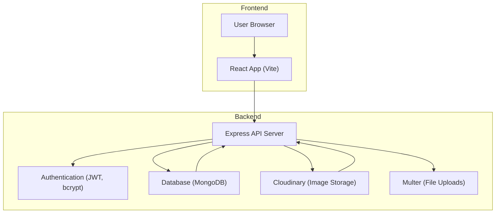

# System Architecture

This document outlines the system architecture of the Job Portal, detailing the structure of both the backend and frontend components.

## Backend Structure

The backend is an Express.js application responsible for handling API requests, managing data persistence, and implementing business logic. It leverages various npm packages to achieve its functionality.

### Core Components:

*   **Server Initialization**: The `server.js` file sets up the Express application, configures middleware, and defines API routes. It also handles database connection.
*   **Database Interaction**: Mongoose is used to interact with a MongoDB database, managing user data, job postings, and applications.
*   **Authentication and Authorization**: JSON Web Tokens (JWT) are employed for user authentication, and `bcrypt` is used for secure password hashing.
*   **API Endpoints**: A comprehensive set of API routes are defined for user registration, login, profile management, job posting, job searching, and application handling.
*   **Middleware**: Custom middleware is used for authentication (`requireauth`) and file uploads (`multer`).

### Backend Dependencies:

The `Backend/package.json` file lists the project's dependencies, highlighting key libraries:

```json
{
  "name": "backend",
  "version": "1.0.0",
  "main": "server.js",
  "scripts": {
    "test": "echo \"Error: no test specified\" && exit 1",
    "start": "node server.js"
  },
  "dependencies": {
    "agora-access-token": "^2.0.4",
    "bcrypt": "^5.1.1",
    "cloudinary": "^2.5.1",
    "cors": "^2.8.5",
    "dotenv": "^16.4.7",
    "express": "^4.21.2",
    "jsonwebtoken": "^9.0.2",
    "mongoose": "^8.9.3",
    "multer": "^1.4.5-lts.1",
    "nodemon": "^3.1.9"
  }
}
```

### Backend Server Logic (`Backend/server.js`):

The `server.js` file orchestrates the backend services, including connecting to the database and defining API routes.

```javascript
require("dotenv").config();
const express = require("express");
const app = express();
const PORT = process.env.PORT || 8080;
const requireAuth = require("./middlewares/requireauth");
const { connectDB } = require("./models/db");
const bodyParser = require("body-parser");
const cors = require("cors");
// ... other imports and route definitions ...

const startServer = async () => {
  try {
    console.log("⏳ Connecting to MongoDB...");
    await connectDB();
    console.log("✅ MongoDB Connected!");
  } catch (error) {
    console.error("❌ Error starting server:", error);
    process.exit(1);
  }
};
startServer();

// ... API routes setup ...

app.listen(PORT, () => {
  console.log(`🚀 Server running on port ${PORT}`);
});
```

## Frontend Structure

The frontend is a React application built with Vite, responsible for the user interface and user experience. It interacts with the backend API to fetch and display data, and to submit user inputs.

### Core Components:

*   **Routing**: `react-router-dom` is used to manage navigation between different pages and components of the application.
*   **State Management**: Context API (`AuthContextProvider`) is utilized for managing authentication state.
*   **UI Components**: `react-bootstrap` and `react-icons` are used for building the user interface, providing pre-styled components and icons.
*   **API Communication**: `axios` is employed for making HTTP requests to the backend API.
*   **Styling**: `tailwindcss` and plain CSS are used for styling the application.

### Frontend Dependencies:

The `Frontend/package.json` file lists the project's frontend dependencies.

```json
{
  "name": "inheritance",
  "private": true,
  "version": "0.0.0",
  "type": "module",
  "scripts": {
    "dev": "vite",
    "build": "vite build",
    "lint": "eslint .",
    "preview": "vite preview"
  },
  "dependencies": {
    "aos": "^2.3.4",
    "axios": "^1.7.9",
    "bootstrap": "^5.3.3",
    "jwt-decode": "^4.0.0",
    "react": "^18.3.1",
    "react-bootstrap": "^2.10.7",
    "react-dom": "^18.3.1",
    "react-hot-toast": "^2.5.1",
    "react-router-dom": "^7.1.3"
  }
}
```

### Frontend Entry Point (`Frontend/src/main.jsx`):

The `main.jsx` file is the entry point for the React application, setting up the router and context providers.

```javascript
import { StrictMode } from 'react';
import { createRoot } from 'react-dom/client';
import './index.css';
import { RouterProvider, createBrowserRouter } from 'react-router-dom';
import 'bootstrap/dist/css/bootstrap.min.css';
import Layout from './components/Layout/Layout.jsx';
import LoginUser from './components/Pages/Login/LoginJs.jsx';
import Edashboard from './components/DashBoards/Edashboard.jsx';
import { AuthContextProvider } from './context/authcontext.jsx';
import { Toaster } from 'react-hot-toast';

const router = createBrowserRouter([
  {
    path: '/',
    element: <Layout />,
    children: [
      // ... other children routes
    ],
  },
  {
    path: '/login/jobseeker',
    element: <LoginUser />,
  },
  {
    path: '/EDashboard',
    element: <Edashboard></Edashboard>,
    children: [
      // ... edashboard children routes
    ]
  }
  // ... other top-level routes
]);

// Render the app
createRoot(document.getElementById('root')).render(
  <StrictMode>
    <AuthContextProvider>
      <RouterProvider router={router} />
      <Toaster />
    </AuthContextProvider>
  </StrictMode>
);
```

## System Architecture Diagram

The following diagram illustrates the high-level interaction between the frontend, backend, and database.





## Key Takeaways

*   The system follows a standard client-server architecture with a RESTful API.
*   The backend is responsible for business logic, data persistence, and security.
*   The frontend provides a user-friendly interface and communicates with the backend via API calls.
*   Key technologies include Node.js, Express.js, React, MongoDB, JWT, and Multer.