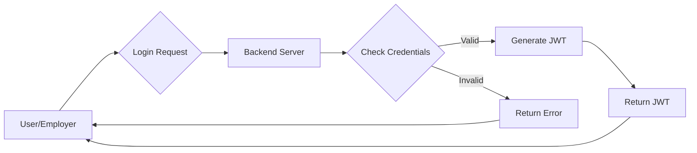
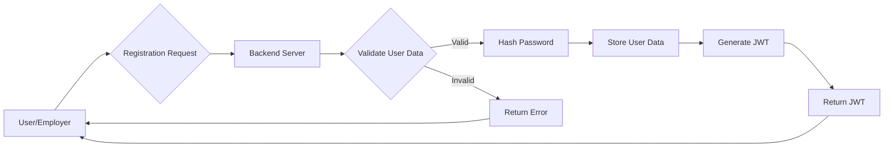

# Authentication and Authorization

This document outlines the authentication and authorization mechanisms implemented in the backend of the Job-Portal application. It covers user login, registration, and access control. The backend utilizes JWT (JSON Web Tokens) for secure authentication and bcrypt for password hashing.

## Features

*   **User Registration:** Allows new users and employers to create accounts.
*   **User Login:** Authenticates existing users and employers.
*   **Password Hashing:** Uses bcrypt to securely store passwords.
*   **JWT Authentication:** Employs JWTs for managing user sessions and access control.
*   **Role-Based Access Control (Implicit):**  Different models (UserModel, EModel) and controllers manage user and employer data, effectively providing role-based access.

## Stack

| Technology | Purpose                               |
|------------|---------------------------------------|
| Node.js    | Backend runtime environment           |
| Express.js | Web application framework             |
| MongoDB    | Database for storing user information |
| Mongoose   | MongoDB object modeling tool          |
| bcrypt     | Password hashing                      |
| JWT        | JSON Web Tokens for authentication  |
| Joi        | Validation of user input              |

## User Registration

New users can register via the `/registeruser` endpoint. The registration process includes validation of user input using Joi, hashing the password with bcrypt, and storing the user's information in the MongoDB database. A JWT is generated upon successful registration and sent back to the user.

```javascript title="Backend/controllers/registeruser.js"
const { UserModel } = require('../models/user');
const UserProfile = require('../models/userprofile');
const bcrypt = require('bcrypt');
const joi = require('joi');
const jwt = require('jsonwebtoken');
const UserAssets = require('../models/userassets');

const registeruser = async (req, res, next) => {
    const { error: validationError } = validateUser(req.body);

    if (validationError) {
        return res.status(400).json({ message: validationError.details[0].message });
    }

    const { username, email, password } = req.body;

    try {
        const formattedName = username.toLowerCase();
        const formattedEmail = email.toLowerCase();

        const existingUser = await UserModel.findOne({ email: formattedEmail });
        if (existingUser) {
            return res.status(400).json({ message: 'This user already exists' });
        }

        const hashedPassword = await bcrypt.hash(password, 10);

        const newUser = new UserModel({
            username: formattedName,
            email: formattedEmail,
            password: hashedPassword,
        });
        await newUser.save();
        const accessToken = jwt.sign(
            {
                username: formattedName,
                empId: newUser._id,
            },
            process.env.JWT_SECRET,
            { expiresIn: '7d' }
        );
        const newUserProfile = new UserProfile({
            username: formattedName,
            email:formattedEmail,
        });
        await newUserProfile.save();

        const newUserAssets = new UserAssets({
            username: formattedName,
            profilepicurl: "",
            savedjobs: []
             
        });
        await newUserAssets.save();
        await newUserProfile.save();

        res.status(200).json({ message: 'User registered successfully', token: accessToken,username:formattedName });
    } catch (err) {
        next(err);
    }
};

module.exports = registeruser;

// User validation function
function validateUser(data) {
    const userSchema = joi.object({
        username: joi.string().min(2).required(),
        email: joi.string().email().required(),
        password: joi.string().min(5).max(12).required(),
    });
    return userSchema.validate(data);
}
```

[View on GitHub](https://github.com/lande26/Job-Portal/blob/main/Backend/controllers/registeruser.js)

### Employer Registration

Similar to user registration, employers can register via the `/registeremp` endpoint. The same validation, hashing, and JWT generation process is applied.

```javascript title="Backend/controllers/registeremp.js"
const { EModel } = require("../models/user");
const bcrypt = require("bcrypt");
const joi = require("joi");
const jwt = require("jsonwebtoken");
const companyprofile = require("../models/companyprofile");
// Register function
const registeremp = async (req, res, next) => {
  const { error: validationError } = validateEmployer(req.body);

  if (validationError) {
    return res
      .status(400)
      .json({ message: validationError.details[0].message });
  }

  const { username, email, password } = req.body;

  try {
    const formattedName = username.toLowerCase();
    const formattedEmail = email.toLowerCase();

    // Check if the user already exists
    const existingEmployer = await EModel.findOne({ email: formattedEmail });
    if (existingEmployer) {
      return res.status(400).json({ message: "This user already exists" });
    }

    // Hash the password
    const hashedPassword = await bcrypt.hash(password, 10);
    const newEmployer = new EModel({
      username: formattedName,
      email: formattedEmail,
      password: hashedPassword,
    });

    await newEmployer.save();
    const accessToken = jwt.sign(
      {
        username: newEmployer.formattedName,
        empId: newEmployer._id,
      },
      process.env.JWT_SECRET,
      { expiresIn: "7d" }
    );
    const newcomapany=new companyprofile({
      username:formattedName,
      email:formattedEmail,
    })
    await newcomapany.save();
    
    console.log(newcomapany)
    res.status(200).json({
      message: "Employer registered successfully",
      token: accessToken,
      username:newEmployer.username
    });
  } catch (err) {
    next(err); // Pass error to the error-handling middleware
  }
};

module.exports = registeremp;

// Validation function
function validateEmployer(data) {
  const EModel = joi.object({
    username: joi.string().min(2).required(),
    email: joi.string().email().required(),
    password: joi.string().min(5).max(12).required(),
  });
  return EModel.validate(data);
}
```

[View on GitHub](https://github.com/lande26/Job-Portal/blob/main/Backend/controllers/registeremp.js)

## User Login

Existing users can log in via the `/loginuser` endpoint. The login process involves verifying the user's credentials against the stored information in the database and generating a JWT upon successful authentication.

```javascript title="Backend/controllers/loginuser.js"
const {UserModel} = require('../models/user');
const bcrypt = require('bcrypt');
const joi = require('joi');
const jwt=require('jsonwebtoken')

const loginuser=async (req,res,next)=>{
    const{email,password}=req.body;
    try{
        const formattedEmail=email.toLowerCase()


        const existingEmployer = await UserModel.findOne({ email: formattedEmail });
        console.log("dslkfn",existingEmployer)
        if (!existingEmployer) {
            return res.status(400).json({ message: "This user does not exist" });
        }

        const isPassmatch= await bcrypt.compare(password,existingEmployer.password);
        if(!isPassmatch){
            return res.status(400).json({ message: "Incorrect password " });
        }
        const accessToken = jwt.sign(
            {
                name:existingEmployer.username,
                empId: existingEmployer._id,
            },
            process.env.JWT_SECRET, // Add a secret key here
            { expiresIn: "7d" } 
        );
        console.log(existingEmployer.username)
        res.status(200).json({ message: 'Login successfull',status:true,token:accessToken,username:existingEmployer.username});
   
    }
    catch(error){
          next(error)
    }
}

module.exports=loginuser;
```

[View on GitHub](https://github.com/lande26/Job-Portal/blob/main/Backend/controllers/loginuser.js)

### Employer Login

Similar to user login, employers can log in via the `/loginemp` endpoint.

```javascript title="Backend/controllers/loginemp.js"
const { EModel } = require('../models/user');
const bcrypt = require('bcrypt');
const joi = require('joi');
const jwt = require('jsonwebtoken')

const loginemp = async (req, res, next) => {
    const { email, password } = req.body;
    try {
        const formattedEmail = email.toLowerCase()


        const existingUser = await EModel.findOne({ email: formattedEmail });
        if (!existingUser) {
            return res.status(400).json({ message: "This user does not exist" });
        }

        const isPassmatch = await bcrypt.compare(password, existingUser.password);
        if (!isPassmatch) {
            return res.status(400).json({ message: "Incorrect password " });
        }
        const accessToken = jwt.sign(
            {
                username: existingUser.username,
                empId: existingUser._id,
            },
            process.env.JWT_SECRET,
            { expiresIn: "7d" }
        );

        res.status(200).json({ message: 'Login successfull', status: true, token: accessToken,username:existingUser.username });

    }
    catch (error) {
        next(error)
    }
}

module.exports = loginemp;
```

[View on GitHub](https://github.com/lande26/Job-Portal/blob/main/Backend/controllers/loginemp.js)

## Password Hashing

bcrypt is used to hash passwords before storing them in the database. This ensures that even if the database is compromised, the passwords will not be easily deciphered.

```javascript title="Password Hashing with bcrypt"
const bcrypt = require('bcrypt');

async function hashPassword(password) {
  const hashedPassword = await bcrypt.hash(password, 10);
  return hashedPassword;
}
```

## JWT Authentication

JWTs are used to authenticate users and authorize access to protected resources. When a user logs in, a JWT is generated and sent back to the client. The client then includes the JWT in the headers of subsequent requests. The backend verifies the JWT to ensure that the user is authenticated and authorized to access the requested resource.

```javascript title="JWT Generation"
const jwt = require('jsonwebtoken');

function generateToken(user) {
  const token = jwt.sign({ userId: user._id, username: user.username }, process.env.JWT_SECRET, { expiresIn: '1h' });
  return token;
}
```

## Data validation
Joi is used for validation to avoid common attacks and vulnerabilities by ensuring user-provided data matches your rules.

```javascript title="User Validation with Joi"
const joi = require('joi');

function validateUser(data) {
    const userSchema = joi.object({
        username: joi.string().min(2).required(),
        email: joi.string().email().required(),
        password: joi.string().min(5).max(12).required(),
    });
    return userSchema.validate(data);
}
```

## Authentication Flow Diagram





## Registration Flow Diagram





## Key Integration Points

The authentication and authorization mechanisms are integrated into the backend using middleware functions. These middleware functions are used to protect specific routes and ensure that only authenticated users can access them. The `JWT_SECRET` environment variable is critical for signing and verifying JWTs. It's crucial to keep this secret secure.

Best practices include:

*   **Input Validation:** Always validate user input to prevent injection attacks.
*   **Password Hashing:** Use a strong password hashing algorithm like bcrypt.
*   **JWT Security:** Keep the JWT secret secure and use a reasonable expiration time.
*   **HTTPS:** Always use HTTPS to protect against eavesdropping.
```