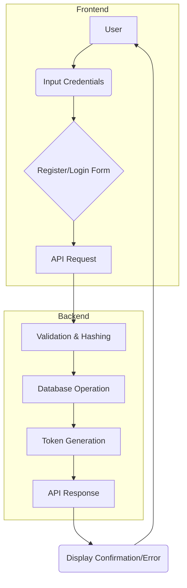

# User Registration and Login

This section details the user registration and login flows for both job seekers (users) and employers within the Job Portal. It covers the backend API endpoints and frontend component implementations that facilitate these crucial authentication processes.

## User Registration

The user registration process allows new individuals to create an account on the platform. This involves submitting their username, email, and password, which are then validated, hashed, and stored in the database.

### Backend Implementation

The `registeruser.js` controller handles incoming registration requests. It validates the input, checks for existing users with the same email, hashes the password using bcrypt, and creates new entries in the `UserModel`, `UserProfile`, and `UserAssets` collections. A JWT token is generated upon successful registration.

```javascript
// Backend/controllers/registeruser.js
const { UserModel } = require('../models/user');
const UserProfile = require('../models/userprofile');
const bcrypt = require('bcrypt');
const joi = require('joi');
const jwt = require('jsonwebtoken');
const UserAssets = require('../models/userassets');

const registeruser = async (req, res, next) => {
    const { error: validationError } = validateUser(req.body);

    if (validationError) {
        return res.status(400).json({ message: validationError.details[0].message });
    }

    const { username, email, password } = req.body;

    try {
        const formattedName = username.toLowerCase();
        const formattedEmail = email.toLowerCase();

        const existingUser = await UserModel.findOne({ email: formattedEmail });
        if (existingUser) {
            return res.status(400).json({ message: 'This user already exists' });
        }

        const hashedPassword = await bcrypt.hash(password, 10);

        const newUser = new UserModel({
            username: formattedName,
            email: formattedEmail,
            password: hashedPassword,
        });
        await newUser.save();
        const accessToken = jwt.sign(
            {
                username: formattedName,
                empId: newUser._id,
            },
            process.env.JWT_SECRET,
            { expiresIn: '7d' }
        );
        const newUserProfile = new UserProfile({
            username: formattedName,
            email:formattedEmail,
        });
        await newUserProfile.save();

        const newUserAssets = new UserAssets({
            username: formattedName,
            profilepicurl: "",
            savedjobs: []
             
        });
        await newUserAssets.save();
        await newUserProfile.save();

        res.status(200).json({ message: 'User registered successfully', token: accessToken,username:formattedName });
    } catch (err) {
        next(err);
    }
};

// User validation function
function validateUser(data) {
    const userSchema = joi.object({
        username: joi.string().min(2).required(),
        email: joi.string().email().required(),
        password: joi.string().min(5).max(12).required(),
    });
    return userSchema.validate(data);
}

module.exports = registeruser;
```

### Frontend Implementation

The `SignupJs.jsx` component provides the user interface for registration. It captures user input for username, email, and password, and upon submission, sends a POST request to the backend API. Successful registration is met with a success toast notification and redirection to the login page.

```tsx
// Frontend/src/components/Pages/SignUp/SignupJs.jsx
import { React, useState } from "react";
import "./auth.css";
import axios from "axios";
import { useNavigate } from "react-router-dom";
import { toast, Toaster } from "react-hot-toast";
import { useAuthContext } from "../../../hooks/useAuthContext";
import AuthNav from "../Navbars/AuthNav";

const Registeruser = () => {
  const navigate = useNavigate();
  const [username, setName] = useState("");
  const [email, setEmail] = useState("");
  const [password, setPassword] = useState("");
  const { dispatch } = useAuthContext();

  const nameChange = (event) => {
    setName(event.target.value);
  };
  const emailChange = (event) => {
    setEmail(event.target.value);
  };
  const passwordChange = (event) => {
    setPassword(event.target.value);
  };
  const submitHandler = async (event) => {
    event.preventDefault();
    try {
      const response = await axios.post(
        "https://inheritance-project-4kr9.onrender.com/register/user",
        {
          username,
          email,
          password,
        },
        {
          headers: {
            "Content-Type": "application/json",
          },
        }
      );

      if (response.data && response.data.token) {
        localStorage.setItem("accessToken", response.data.token);
        localStorage.setItem("username", response.data.username);
        localStorage.setItem("User", "Candidate");

        dispatch({ type: "LOGIN", payload: response.data });
        toast.success("User registered successfully!");
      } else {
        toast.error("Invalid response from server");
        console.error("Invalid response structure:", response.data);
      }

      navigate("/login/jobseeker");

      navigate("/login/jobseeker");
    } catch (error) {
      if (error.response) {
        console.error("Error Response Data:", error.response.data.message); // Log error message
        toast.error(error.response.data.message);
      } else if (error.request) {
        console.error("No Response Received:", error.request);
        toast.error("No response from the server.");
      } else {
        console.error("Unexpected Error:", error.message);
        toast.error("An unexpected error occurred. Please try again.");
      }
    }
  };

  return (
    <div className="min-h-screen bg-gradient-to-br from-gray-50 to-gray-100">
      <div
        className="min-h-screen"
        style={{
          backgroundImage: `
          linear-gradient(to right, #e5e7eb 1px, transparent 1px),
          linear-gradient(to bottom, #e5e7eb 1px, transparent 1px)
        `,
          backgroundSize: "4rem 4rem",
        }}
      >
        <AuthNav />
        <div className="auth_main">
          <form onSubmit={submitHandler}>
            <div className="auth_container">
              <div className="auth_header">
                <h1>Register</h1>
              </div>
              <div className="auth_item">
                <label htmlFor="username">Username*</label>
                <input
                  onChange={nameChange}
                  id="name"
                  type="text"
                  placeholder="Enter your name"
                  required
                />
              </div>
              <div className="auth_item">
                <label htmlFor="email">Email*</label>
                <input
                  onChange={emailChange}
                  id="email"
                  type="email"
                  placeholder="Enter your email"
                  required
                />
              </div>
              <div className="auth_item">
                <label htmlFor="password">Password*</label>
                <input
                  onChange={passwordChange}
                  id="password"
                  type="password"
                  placeholder="Enter your password"
                  required
                />
              </div>
              <button type="submit" className="auth-button">
                Register
              </button>
            </div>
          </form>
        </div>
      </div>
    </div>
  );
};

export default Registeruser;
```

## User Login

The login process enables existing users to access their accounts by providing their credentials. This flow involves sending the email and password to the backend for verification.

### Backend Implementation

The `loginuser.js` controller handles login requests. It retrieves user data based on the provided email, compares the submitted password with the stored hashed password using bcrypt, and upon successful authentication, generates a JWT.

```javascript
// Backend/controllers/loginuser.js
const { UserModel } = require('../models/user');
const bcrypt = require('bcrypt');
const joi = require('joi');
const jwt=require('jsonwebtoken')

const loginuser=async (req,res,next)=>{
    const{email,password}=req.body;
    try{
        const formattedEmail=email.toLowerCase()


        const existingEmployer = await UserModel.findOne({ email: formattedEmail });
        console.log("dslkfn",existingEmployer)
        if (!existingEmployer) {
            return res.status(400).json({ message: "This user does not exist" });
        }

        const isPassmatch= await bcrypt.compare(password,existingEmployer.password);
        if(!isPassmatch){
            return res.status(400).json({ message: "Incorrect password " });
        }
        const accessToken = jwt.sign(
            {
                name:existingEmployer.username,
                empId: existingEmployer._id,
            },
            process.env.JWT_SECRET, // Add a secret key here
            { expiresIn: "7d" } 
        );
        console.log(existingEmployer.username)
        res.status(200).json({ message: 'Login successfull',status:true,token:accessToken,username:existingEmployer.username});
   
    }
    catch(error){
          next(error)
    }
}

module.exports=loginuser;
```

### Frontend Implementation

The `LoginJs.jsx` component provides the UI for user login. Users input their email and password, and on submission, the component sends an API request. Successful login stores the token and username in local storage, dispatches a login action, and redirects the user to their dashboard.

```tsx
// Frontend/src/components/Pages/Login/LoginJs.jsx
import { React, useState } from "react";
import "./auth.css";
import { Link, useNavigate } from "react-router-dom";
import axios from "axios";
import { toast, Toaster } from "react-hot-toast";
import { useAuthContext } from "../../../hooks/useAuthContext";
import AuthNav from "../Navbars/AuthNav";

const Loginuser = () => {
  const navigate = useNavigate();
  const [email, setEmail] = useState("");
  const [password, setPassword] = useState("");
  const { dispatch } = useAuthContext();
  //  const {user}=useAuthContext()
  const emailChange = (event) => {
    setEmail(event.target.value);
  };

  const passwordChange = (event) => {
    setPassword(event.target.value);
  };

  const submitHandler = async (event) => {
    event.preventDefault();

    try {
      const response = await axios.post(
        "https://inheritance-project-4kr9.onrender.com/login/user",
        { email, password },
        {
          headers: {
            "Content-Type": "application/json",
            //  'authorization':`Bearer ${user.token}`
          },
        }
      );

      // Check if response.data exists and contains the token
      if (response.data && response.data.token) {
        console.log(response);
        localStorage.setItem("username", response.data.username);
        localStorage.setItem("accessToken", response.data.token);
        localStorage.setItem("User", "Candidate");

        dispatch({ type: "LOGIN", payload: response.data.token });
        toast.success("Login successful!");

        navigate("/user");
        console.log("hello job");
      } else {
        toast.error("Invalid response from server");
        console.error("Invalid response structure:", response.data);
      }
    } catch (error) {
      if (error.response) {
        console.error("Error Response Data:", error.response.data);
        toast.error(error.response.data.message || "Login failed");
      } else if (error.request) {
        console.error("No Response Received:", error.request);
        toast.error(
          "No response from the server. Please check your connection."
        );
      } else {
        console.error("Unexpected Error:", error.message);
        toast.error("An unexpected error occurred. Please try again.");
      }
    }
  };

  return (
    <div className="min-h-screen bg-gradient-to-br from-gray-50 to-gray-100">
      <div
        className="min-h-screen"
        style={{
          backgroundImage: `
          linear-gradient(to right, #e5e7eb 1px, transparent 1px),
          linear-gradient(to bottom, #e5e7eb 1px, transparent 1px)
        `,
          backgroundSize: "4rem 4rem",
        }}
      >
        <AuthNav />
        <div className="auth_main">
          <form onSubmit={submitHandler}>
            <div className="auth_container">
              <div className="auth_header">
                <h1>Login</h1>
              </div>
              <div className="auth_item">
                <label htmlFor="email">Email*</label>
                <input
                  onChange={emailChange}
                  id="email"
                  type="email"
                  placeholder="Enter your email"
                  required
                  value={email}
                />
              </div>
              <div className="auth_item">
                <label htmlFor="password">Password*</label>
                <input
                  onChange={passwordChange}
                  id="password"
                  type="password"
                  placeholder="Enter your password"
                  required
                  value={password}
                />
              </div>
              <button type="submit" className="auth-button">
                Login
              </button>
              <div className="auth_footer">
                <Link to="/register/jobseeker" className="auth-link">
                  Don't have an account? Register
                </Link>
              </div>
            </div>
          </form>
        </div>
      </div>
    </div>
  );
};

export default Loginuser;
```

## Authentication Flow Diagram

The following diagram illustrates the typical flow for user registration and login.





## Key Takeaways

*   User registration involves input validation, secure password hashing, and the creation of associated user profiles and assets.
*   User login verifies credentials against stored data and issues a JSON Web Token (JWT) for subsequent authenticated requests.
*   Error handling is implemented on both the backend and frontend to provide informative feedback to the user.
*   Frontend components utilize state management and routing to provide a seamless user experience.