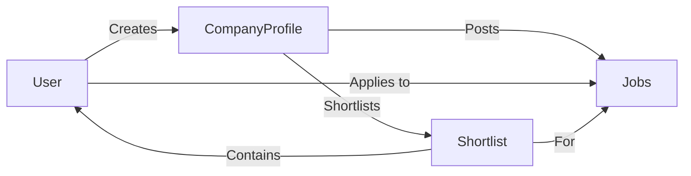

# Data Models and Schemas

This document outlines the data models and schemas used in the Job-Portal application. Understanding these structures is crucial for contributing to the backend development and comprehending the application's data flow. The models are defined using Mongoose, an Object Data Modeling (ODM) library for MongoDB and include schemas for users, jobs, company profiles, and shortlisted candidates.

## User Model

The User model, defined in `Backend/models/user.js`, represents user accounts within the application. It includes fields for username, email, and password. Two models are defined: `UserModel` for regular users and `EModel` for employers.

```javascript title="Backend/models/user.js"
const mongoose=require("mongoose")
const Schema=mongoose.Schema;

const UserSchema=new Schema({
    username:{
        type:String,
        required:true,
        unique:true
    },
    email:{
        type:String,
        required:true,
        unique:true
    },
    password:{
        type:String,
        required:true,
        unique:true
    },
    createdAt : {
        type :Date,
        deafult:Date.now
    }
})

const ESchema=new Schema({
    username:{
        type:String,
        required:true,
        unique:true
    },
    email:{
        type:String,
        required:true,
        unique:true
    },
    password:{
        type:String,
        required:true,
        unique:true
    },
    createdAt : {
        type :Date,
        deafult:Date.now
    }
})

const UserModel=mongoose.model('users',UserSchema);
const EModel=mongoose.model('employeers',ESchema);
module.exports = { UserModel, EModel };
```

[View on GitHub](https://github.com/lande26/Job-Portal/blob/main/Backend/models/user.js)

*   **username:** User's unique username (String, required, unique).
*   **email:** User's email address (String, required, unique).
*   **password:** User's password (String, required).
*   **createdAt:** Timestamp of when the user was created (Date, default: Date.now).

## Company Profile Model

The Company Profile model, found in `Backend/models/companyprofile.js`, stores information about companies using the platform.

```javascript title="Backend/models/companyprofile.js"
const mongoose = require("mongoose");

const companySchema = new mongoose.Schema(
  {
    username: { type: String , required: true,default:""},
    companyName: { type: String,default:""},
    industry: { type: String,default:""},
    description: { type: String,default:"" },
    website: { type: String ,default:""},
    email: { type: String, required: true, unique: true,default:"" },
    phone: { type: String,default:"" },
    location: { type: String ,default:""},
    foundedYear: { type: Number,default:"" },
    revenue: { type: String,default:"" },
    linkedin: { type: String ,default:""},
    services: { type: String,default:"" },
    technologies: { type: String,default:"" },
    companypicurl: { type: String ,default:""}
  }
);

const CompanyProfile= mongoose.model("CompanyProfile", companySchema);
module.exports = CompanyProfile
```

[View on GitHub](https://github.com/lande26/Job-Portal/blob/main/Backend/models/companyprofile.js)

*   **username:** Company's username (String, required, default: "").
*   **companyName:** Name of the company (String, default: "").
*   **industry:** Industry the company belongs to (String, default: "").
*   **description:** Company description (String, default: "").
*   **website:** Company website URL (String, default: "").
*   **email:** Company email address (String, required, unique, default: "").
*   **phone:** Company phone number (String, default: "").
*   **location:** Company location (String, default: "").
*   **foundedYear:** Year the company was founded (Number, default: "").
*   **revenue:** Company revenue (String, default: "").
*   **linkedin:** Company LinkedIn profile URL (String, default: "").
*   **services:** Services offered by the company (String, default: "").
*   **technologies:** Technologies used by the company (String, default: "").
*   **companypicurl:** URL to the company's profile picture (String, default: "").

## Jobs Model

The Jobs model, in `Backend/models/jobs.js`, defines the structure for job postings.

```javascript title="Backend/models/jobs.js"
const mongoose = require('mongoose');

const jobSchema = new mongoose.Schema({
  jobprofile: {
    type: String,
    required: [true, "Job profile is required"],
    trim: true
  },
  companyusername: {
    type: String,
    required: [true, "Company username is required"],
    trim: true
  },
  location: {
    type: String,
    required: [true, "Location is required"],
    trim: true
  },
  salary: {
    type: Number,
    required: [true, "Salary is required"]
  },
  type: {
    type: String,
    required: [true, "Job type is required"]

  },
  description: {
    type: String,
    required: [true, "Job description is required"]
  },
  requirements: {
    type: String,
    default: "No specific requirements provided"
  },
  deadline: {
    type: Date,
    required: [true, "Application deadline is required"]
  },
  openings: {
    type: Number,
    default: 1 
  },
  experience:{
    type:String,
  },
  appliedCandidatesID:{
    type:Array,
    default:[]
  }
}, 
{
  timestamps: true 
});

const JobsModel = mongoose.model('Jobs', jobSchema);
module.exports = JobsModel;
```

[View on GitHub](https://github.com/lande26/Job-Portal/blob/main/Backend/models/jobs.js)

*   **jobprofile:** The title of the job posting (String, required).
*   **companyusername:** The username of the company posting the job (String, required).
*   **location:** The job location (String, required).
*   **salary:** The salary offered for the job (Number, required).
*   **type:** The type of job (e.g., "Full-time", "Part-time") (String, required).
*   **description:** A description of the job (String, required).
*   **requirements:** The job requirements (String, default: "No specific requirements provided").
*   **deadline:** The application deadline (Date, required).
*   **openings:** The number of job openings (Number, default: 1).
*   **experience:** Experience level required(String).
*   **appliedCandidatesID:** An array of user IDs that applied to this job(Array, default: []).
*   **timestamps:** Includes `createdAt` and `updatedAt` fields for tracking when the job was created and last updated.

## Shortlist Model

The Shortlist model, defined in `Backend/models/shortlist.js`, manages shortlisted candidates for jobs.

```javascript title="Backend/models/shortlist.js"
const mongoose = require('mongoose');
const Schema = mongoose.Schema;

const ShortlistSchema = new Schema({
  companyid: {
    type:String,
    ref: "Company",
    required: [true, "Company id is required."]
  },
  jobid: {
    type: mongoose.Schema.Types.ObjectId,
    ref: "Job",
    required: false
  },
  candidates: [
    {
      username: {
        type: String,
        required: true
      }
    }
  ]
});

const shortlisted = mongoose.model('shortlistedcandidates', ShortlistSchema);

module.exports = shortlisted;
```

[View on GitHub](https://github.com/lande26/Job-Portal/blob/main/Backend/models/shortlist.js)

*   **companyid:** The ID of the company (String, required).  It references the `Company` model.
*   **jobid:** The ID of the job (ObjectId, optional). It references the `Job` model.
*   **candidates:** An array of candidates shortlisted for the job. Each candidate object contains:
    *   **username:** The username of the shortlisted candidate (String, required).

## Data Model Relationships

The data models are related to each other in the following ways:

*   A **User** can create a **CompanyProfile** (if they are an employer).
*   A **CompanyProfile** can post multiple **Jobs**.
*   A **User** can apply to multiple **Jobs**.
*   A **CompanyProfile** can shortlist **Users** for a specific **Job**, stored in the **Shortlist** model.





## Mongoose Schema Options

Mongoose provides various schema options to configure the behavior of your models. Here's an example showing how to set timestamps and validation:

```javascript title="Example: Mongoose Schema Options"
const mongoose = require('mongoose');

const exampleSchema = new mongoose.Schema({
  name: {
    type: String,
    required: [true, 'Name is required'],
    trim: true,
    maxlength: [50, 'Name cannot exceed 50 characters']
  },
  age: {
    type: Number,
    min: [0, 'Age must be at least 0'],
    max: [120, 'Age cannot exceed 120']
  }
}, {
  timestamps: true // Adds createdAt and updatedAt fields
});

const ExampleModel = mongoose.model('Example', exampleSchema);

module.exports = ExampleModel;
```

[View on GitHub](https://github.com/lande26/Job-Portal/blob/main/Backend/models/jobs.js)

Explanation:

*   `required`:  Specifies that the field is mandatory. An error message is shown if the field is missing.
*   `trim`:  Removes whitespace from the beginning and end of the string.
*   `maxlength`:  Sets a maximum length for the string.
*   `min` and `max`: Set the minimum and maximum values for a Number field.
*   `timestamps: true`: Automatically adds `createdAt` and `updatedAt` fields to the schema, tracking when the document was created and last modified.

## Key Integration Points

*   **User Authentication:** When a user registers or logs in, the `UserModel` or `EModel` is used to store and retrieve user credentials.
*   **Company Profile Management:** Companies use the `CompanyProfile` model to create and update their profiles, which are displayed on the platform.
*   **Job Posting and Searching:** The `JobsModel` is central to job postings.  Search functionalities rely on querying this model based on criteria like job profile, location, and salary.
*   **Application Shortlisting:**  When a company shortlists candidates, the `Shortlist` model is updated to reflect these selections.

## Best Practices

*   **Data Validation:**  Use Mongoose's built-in validation features to ensure data integrity. This helps prevent invalid data from being stored in the database.
*   **Referencing:** Use Mongoose's referencing capabilities to establish relationships between models. This makes it easier to query related data.
*   **Error Handling:** Implement robust error handling to catch and handle Mongoose errors. Provide informative error messages to the user.
*   **Security:** Sanitize user inputs to prevent security vulnerabilities such as SQL injection. Use strong password hashing algorithms to protect user passwords.

By understanding these data models and schemas, developers can effectively contribute to the Job-Portal application's backend and ensure data consistency and integrity.
```