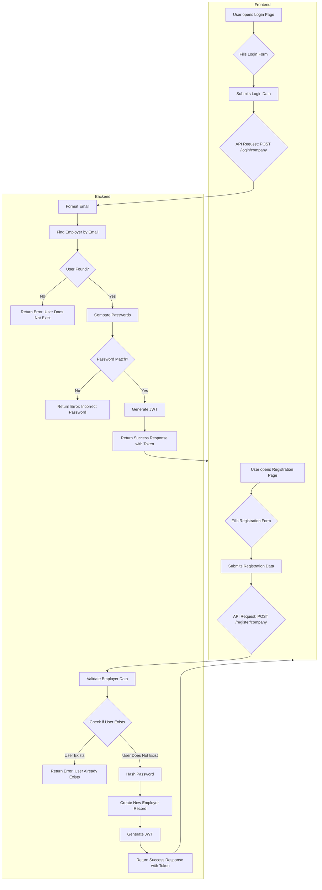

# Employer Registration and Login

This section outlines the user flows and technical implementation for employer registration and login within the Job Portal application. It covers both the backend API endpoints and the frontend user interfaces.

## Employer Registration

The employer registration process allows new companies to create an account on the platform. This involves submitting necessary details, which are then validated and securely stored in the database.

### Backend Registration (`Backend/controllers/registeremp.js`)

The backend handles the registration logic, including input validation, password hashing, and creating a new employer record. A new company profile is also initiated for the registered employer.

```javascript
// Register function
const registeremp = async (req, res, next) => {
  const { error: validationError } = validateEmployer(req.body);

  if (validationError) {
    return res
      .status(400)
      .json({ message: validationError.details[0].message });
  }

  const { username, email, password } = req.body;

  try {
    const formattedName = username.toLowerCase();
    const formattedEmail = email.toLowerCase();

    // Check if the user already exists
    const existingEmployer = await EModel.findOne({ email: formattedEmail });
    if (existingEmployer) {
      return res.status(400).json({ message: "This user already exists" });
    }

    // Hash the password
    const hashedPassword = await bcrypt.hash(password, 10);
    const newEmployer = new EModel({
      username: formattedName,
      email: formattedEmail,
      password: hashedPassword,
    });

    await newEmployer.save();
    const accessToken = jwt.sign(
      {
        username: newEmployer.formattedName,
        empId: newEmployer._id,
      },
      process.env.JWT_SECRET,
      { expiresIn: "7d" }
    );
    const newcomapany=new companyprofile({
      username:formattedName,
      email:formattedEmail,
    })
    await newcomapany.save();
    
    res.status(200).json({
      message: "Employer registered successfully",
      token: accessToken,
      username:newEmployer.username
    });
  } catch (err) {
    next(err); // Pass error to the error-handling middleware
  }
};

// Validation function
function validateEmployer(data) {
  const EModel = joi.object({
    username: joi.string().min(2).required(),
    email: joi.string().email().required(),
    password: joi.string().min(5).max(12).required(),
  });
  return EModel.validate(data);
}
```

### Frontend Registration Form (`Frontend/src/components/Pages/SignUp/SignupE.jsx`)

The frontend provides a user-friendly form for employers to register. It captures the username, email, and password, then sends this data to the backend API. Upon successful registration, it stores the authentication token and user information in local storage and navigates the user to the login page.

```jsx
import { React, useState } from "react";
import "./auth.css";
import axios from "axios";
import { useNavigate } from "react-router-dom";
import { toast, Toaster } from "react-hot-toast";
import { useAuthContext } from "../../../hooks/useAuthContext";
import AuthNav from "../Navbars/AuthNav";

const Registeremp = () => {
  const navigate = useNavigate();
  const [username, setName] = useState("");
  const [email, setEmail] = useState("");
  const [password, setPassword] = useState("");
  const { dispatch } = useAuthContext();

  const nameChange = (event) => {
    setName(event.target.value);
  };
  const emailChange = (event) => {
    setEmail(event.target.value);
  };
  const passwordChange = (event) => {
    setPassword(event.target.value);
  };
  const submitHandler = async (event) => {
    event.preventDefault();
    try {
      const response = await axios.post(
        "https://inheritance-project-4kr9.onrender.com/register/company",
        {
          username,
          email,
          password,
        },
        {
          headers: {
            "Content-Type": "application/json",
          },
        }
      );
      if (response.data && response.data.token) {
        localStorage.setItem("accessToken", response.data.token);
        localStorage.setItem("username", response.data.username);
        localStorage.setItem("User", "Company");

        dispatch({ type: "LOGIN", payload: response.data });
        toast.success("User registered successfully!");
      } else {
        toast.error("Invalid response from server");
        console.error("Invalid response structure:", response.data);
      }

      navigate("/login/employer");
    } catch (error) {
      if (error.response) {
        console.error("Error Response Data:", error.response.data.message); // Log error message
        toast.error(error.response.data.message);
      } else if (error.request) {
        console.error("No Response Received:", error.request);
        toast.error("No response from the server.");
      } else {
        console.error("Unexpected Error:", error.message);
        toast.error("An unexpected error occurred. Please try again.");
      }
    }
  };

  return (
    <div className="min-h-screen bg-gradient-to-br from-gray-50 to-gray-100">
      <div
        className="min-h-screen"
        style={{
          backgroundImage: `
          linear-gradient(to right, #e5e7eb 1px, transparent 1px),
          linear-gradient(to bottom, #e5e7eb 1px, transparent 1px)
        `,
          backgroundSize: "4rem 4rem",
        }}
      >
        <AuthNav />
        <div className="auth_main">
          <form onSubmit={submitHandler}>
            <div className="auth_container">
              <div className="auth_header">
                <h1>Register</h1>
              </div>
              <div className="auth_item">
                <label htmlFor="username">Username*</label>
                <input
                  onChange={nameChange}
                  id="name"
                  type="text"
                  placeholder="Enter your name"
                  required
                />
              </div>
              <div className="auth_item">
                <label htmlFor="email">Email*</label>
                <input
                  onChange={emailChange}
                  id="email"
                  type="email"
                  placeholder="Enter your email"
                  required
                />
              </div>
              <div className="auth_item">
                <label htmlFor="password">Password*</label>
                <input
                  onChange={passwordChange}
                  id="password"
                  type="password"
                  placeholder="Enter your password"
                  required
                />
              </div>
              <button type="submit" className="auth-button">
                Register
              </button>
            </div>
          </form>
        </div>
      </div>
    </div>
  );
};

export default Registeremp;
```

## Employer Login

The employer login process enables registered companies to access their accounts and the employer-specific features of the Job Portal.

### Backend Login (`Backend/controllers/loginemp.js`)

The backend authenticates employers by verifying their credentials against the stored user data. Upon successful authentication, it generates and returns a JSON Web Token (JWT) for session management.

```javascript
const { EModel } = require('../models/user');
const bcrypt = require('bcrypt');
const joi = require('joi');
const jwt = require('jsonwebtoken')

const loginemp = async (req, res, next) => {
    const { email, password } = req.body;
    try {
        const formattedEmail = email.toLowerCase()


        const existingUser = await EModel.findOne({ email: formattedEmail });
        if (!existingUser) {
            return res.status(400).json({ message: "This user does not exist" });
        }

        const isPassmatch = await bcrypt.compare(password, existingUser.password);
        if (!isPassmatch) {
            return res.status(400).json({ message: "Incorrect password " });
        }
        const accessToken = jwt.sign(
            {
                username: existingUser.username,
                empId: existingUser._id,
            },
            process.env.JWT_SECRET,
            { expiresIn: "7d" }
        );

        res.status(200).json({ message: 'Login successfull', status: true, token: accessToken,username:existingUser.username });

    }
    catch (error) {
        next(error)
    }
}

module.exports = loginemp;
```

### Frontend Login Form (`Frontend/src/components/Pages/Login/LoginE.jsx`)

The frontend presents a login form for employers. Users input their email and password. Upon submission, the application attempts to authenticate with the backend. Successful logins result in token storage and redirection to the employer dashboard.

```jsx
import { React, useState } from "react";
import "./auth.css";
import { Link, useNavigate } from "react-router-dom";
import axios from "axios";
import { toast, Toaster } from "react-hot-toast";
import { useAuthContext } from "../../../hooks/useAuthContext";
import AuthNav from "../Navbars/AuthNav";

const Loginemp = () => {
  const navigate = useNavigate();
  const [email, setEmail] = useState("");
  const [password, setPassword] = useState("");
  const { dispatch } = useAuthContext();

  const emailChange = (event) => {
    setEmail(event.target.value);
  };

  const passwordChange = (event) => {
    setPassword(event.target.value);
  };

  const submitHandler = async (event) => {
    event.preventDefault();

    try {
      const response = await axios.post(
        "https://inheritance-project-4kr9.onrender.com/login/company",
        { email, password },
        {
          headers: {
            "Content-Type": "application/json",
          },
        }
      );
      if (response.data && response.data.token) {
        console.log("skduf", response.data);
        localStorage.setItem("accessToken", response.data.token);
        localStorage.setItem("username", response.data.username);
        localStorage.setItem("User", "Company");

        dispatch({ type: "LOGIN", payload: response.data });
        toast.success("Login successful!");
        navigate("/Edashboard");
      } else {
        toast.error("Invalid response from server");
        console.error("Invalid response structure:", response.data);
      }
    } catch (error) {
      if (error.response) {
        console.error("Error Response Data:", error.response.data);
        toast.error(error.response.data.message || "Login failed");
      } else if (error.request) {
        console.error("No Response Received:", error.request);
        toast.error(
          "No response from the server. Please check your connection."
        );
      } else {
        console.error("Unexpected Error:", error.message);
        toast.error("An unexpected error occurred. Please try again.");
      }
    }
  };

  return (
    <div className="min-h-screen bg-gradient-to-br from-gray-50 to-gray-100">
      <div
        className="min-h-screen"
        style={{
          backgroundImage: `
          linear-gradient(to right, #e5e7eb 1px, transparent 1px),
          linear-gradient(to bottom, #e5e7eb 1px, transparent 1px)
        `,
          backgroundSize: "4rem 4rem",
        }}
      >
        <AuthNav />
        <div className="auth_main">
          <form onSubmit={submitHandler}>
            <div className="auth_container">
              <div className="auth_header">
                <h1>Login</h1>
              </div>
              <div className="auth_item">
                <label htmlFor="email">Email*</label>
                <input
                  onChange={emailChange}
                  id="email"
                  type="email"
                  placeholder="Enter your email"
                  required
                  value={email}
                />
              </div>
              <div className="auth_item">
                <label htmlFor="password">Password*</label>
                <input
                  onChange={passwordChange}
                  id="password"
                  type="password"
                  placeholder="Enter your password"
                  required
                  value={password}
                />
              </div>
              <button type="submit" className="auth-button">
                Login
              </button>
              <div className="auth_footer">
                <Link to="/register/employer" className="auth-link">
                  Don't have an account? Register
                </Link>
              </div>
            </div>
          </form>
        </div>
      </div>
    </div>
  );
};

export default Loginemp;
```

## Authentication Flow

The following diagram illustrates the typical flow for employer registration and login.





## Key Takeaways

*   **Secure Authentication**: Passwords are securely hashed using bcrypt, and JWTs are used for session management.
*   **Input Validation**: Both frontend and backend implement validation to ensure data integrity and security.
*   **User Experience**: Clear error messages and success notifications are provided to the user via `react-hot-toast`.
*   **State Management**: The `useAuthContext` hook is utilized to manage the authentication state globally within the frontend application.