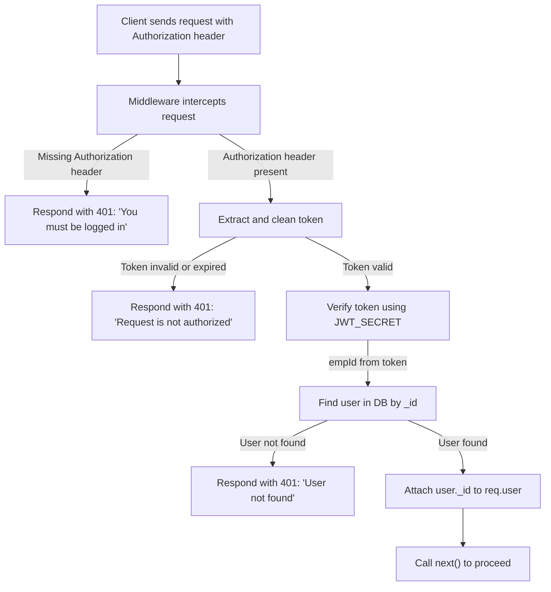

# Authentication Middleware

This middleware layer is crucial for securing backend routes by verifying user identity through JSON Web Tokens (JWT). It intercepts incoming requests, checks for a valid authorization token, and ensures the user is authenticated before allowing access to protected resources.

## Purpose

The primary goal of the `requireAuth` middleware is to:

*   **Protect Routes**: Prevent unauthenticated users from accessing sensitive API endpoints.
*   **Verify Identity**: Ensure that the user making the request is who they claim to be by validating their JWT.
*   **Attach User Information**: Make the authenticated user's identifier available to subsequent route handlers.

## Workflow

The middleware follows a structured process to authenticate requests:

1.  **Check for Authorization Header**: It first looks for the `Authorization` header in the incoming request. If it's missing, the request is denied with a `401 Unauthorized` status.
2.  **Extract Token**: The JWT is extracted from the `Authorization` header, typically in the format `Bearer <token>`. Leading/trailing quotes around the token are also handled.
3.  **Verify Token**: The extracted token is verified against a secret key stored in environment variables (`process.env.JWT_SECRET`). This step confirms the token's integrity and prevents tampering.
4.  **Find User**: If the token is valid, the middleware uses the `empId` (employee ID) from the token's payload to locate the corresponding user in the database.
5.  **Attach User to Request**: If the user is found, their `_id` is attached to the `req.user` object, making it accessible to the next middleware or route handler.
6.  **Proceed or Deny**: If all checks pass, `next()` is called to pass control to the next middleware or route handler. If any step fails (e.g., invalid token, user not found), an appropriate `401 Unauthorized` response is sent.

```javascript
const requireAuth = async (req, res, next) => {
    const { authorization } = req.headers;

    if (!authorization) {
        return res.status(401).json({ message: "You must be logged in" });
    }

    let token = authorization.split(" ")[1];

    // Remove extra quotes if present
    token = token.replace(/^"|"$/g, '');

    try {
        // ... token verification and user lookup ...
        next();
    } catch (err) {
        console.error("JWT Verification Error:", err);
        return res.status(401).json({ message: "Request is not authorized" });
    }
};
```

## Code Implementation

The `requireAuth.js` file implements the authentication logic.

```javascript
const jwt = require('jsonwebtoken');
const { UserModel } = require('../models/user');

const requireAuth = async (req, res, next) => {
    const { authorization } = req.headers;

    if (!authorization) {
        return res.status(401).json({ message: "You must be logged in" });
    }

    let token = authorization.split(" ")[1];

    // Remove extra quotes if present
    token = token.replace(/^"|"$/g, '');

    try {
        console.log("Extracted Token:", token);

        // Decode for debugging
        const decoded = jwt.decode(token, { complete: true });
        console.log("Decoded Token Payload:", decoded);

        // Verify the token
        const { empId } = jwt.verify(token, process.env.JWT_SECRET);
        console.log("Verified Token empId:", empId);

        // Find user in the database
        const user = await UserModel.findOne({ _id: empId }).select('_id');

        if (!user) {
            return res.status(401).json({ message: "User not found" });
        }

        req.user = user;
        next();
    } catch (err) {
        console.error("JWT Verification Error:", err);
        return res.status(401).json({ message: "Request is not authorized" });
    }
};

module.exports = requireAuth;
```

## Authentication Flow





## Integration

To protect a route, this middleware should be placed before the route handler in your Express.js application.

```javascript
// Example route definition
router.get('/protected-resource', requireAuth, (req, res) => {
    // Access user info via req.user
    res.json({ message: `Welcome, user ${req.user._id}!` });
});
```

## Key Takeaways

*   The `requireAuth` middleware is essential for securing your API endpoints.
*   It relies on JWTs passed in the `Authorization` header.
*   Token verification is performed using a secret key from environment variables.
*   Successful authentication attaches user information to the request object for further use.
*   Appropriate error responses are returned for unauthorized access.