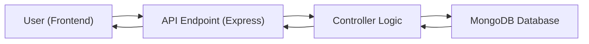
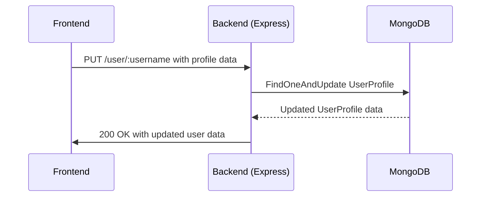

# Backend Architecture

This document details the backend architecture of the Job-Portal application, outlining the technologies used, the structure of the server-side logic, and key integration points. The backend is responsible for managing data, handling user authentication, and providing APIs for the frontend.

## Technologies Used

*   **Node.js:** The runtime environment for executing JavaScript on the server-side.
*   **Express.js:** A web application framework for Node.js, used for building APIs and handling routing.
*   **MongoDB:** A NoSQL database used for storing application data, including user profiles, job postings, and company information.
*   **Mongoose:** An Object Data Modeling (ODM) library for MongoDB and Node.js, providing a higher-level abstraction for interacting with the database.
*   **JSON Web Tokens (JWT):** A standard for securely transmitting information between parties as a JSON object. Used for authentication and authorization.
*   **bcrypt:** A library for hashing passwords, ensuring secure storage of user credentials.
*   **cors:** A node.js package for providing a Connect/Express middleware that can be used to enable CORS (Cross-Origin Resource Sharing) with various options.
*   **Cloudinary:** A cloud-based image management service used for storing and serving user profile pictures and company logos.
*    **Agora:** A real-time engagement platform, used here for generating tokens for video calls.

## Key Components

*   **`server.js`:** The main entry point of the application, responsible for setting up the Express server, connecting to the database, and defining the API routes.
*   **`models/db.js`:** Contains the database connection logic using Mongoose.
*   **`controllers/Logic.js`:** Contains the business logic for handling user profiles, job postings, company information, and other application functionalities.
*   **`models/` directory:** Contains the Mongoose models for interacting with the database.
*   **`package.json`:** Contains the project's dependencies and scripts.

## Database Connection

The `connectDB` function in `Backend/models/db.js` handles the connection to the MongoDB database.

```javascript title="Backend/models/db.js"
// const WInCO3oPxm3SnMFU
const mongoose = require('mongoose');
const mongo_url = process.env.MONGO_CONN;

  const connectDB = async () => {
    try {
        await mongoose.connect(mongo_url, {
            
        });
        console.log(" MongoDB Connected");
    } catch (error) {
        console.error(" MongoDB Connection Error:", error);
        process.exit(1);
    }
};

module.exports = {connectDB}
```

This function uses the `mongoose.connect` method to establish a connection to the MongoDB database specified by the `MONGO_CONN` environment variable. Error handling is included to catch any connection errors and exit the process if the connection fails.

[View on GitHub](https://github.com/lande26/Job-Portal/blob/main/Backend/models/db.js)

## API Routes

The `server.js` file defines the API routes using Express.js. These routes handle various functionalities, such as user authentication, profile management, job postings, and candidate search.

```javascript title="Backend/server.js"
app.post("/EDashboard/myjobs/:id", shortlistCandidate);
app.get("/EDashboard/myjobs/:id", sendjobdata);
app.get("/EDashboard/myjobs", sendjobposts);
app.get("/EDashboard/search", searchcandidates);
app.post("/EDashboard", reachoutcandidates);
app.get("/EDashboard", sendJSdata);
app.post("/EDashboard/jobposting", PostJob);
app.get("/user/:username", getUserProfile);
app.put("/user/:username", saveUserProfile);
app.get("/company/:username", getCompanyProfile);
app.put("/company/:username", saveCompanyProfile);
app.get("/jobs", getJobs);
app.get("/jobs/:jobid", getCompanyDetails);
app.put("/jobs/:companyusername", putJobApplication);
app.get("/user",getUser);
app.post("/register/user", registeruser) 
app.post("/login/company", loginemp)
app.post("/login/user" ,loginuser) 
app.post("/register/company", registeremp)  
app.put('/user',markasReadfunc)                    
app.get("/userassets/:username", getUserAssets);
```

This snippet shows a portion of the API routes defined in `server.js`. Each route is associated with a specific controller function that handles the corresponding request.

[View on GitHub](https://github.com/lande26/Job-Portal/blob/main/Backend/server.js)

## Controller Logic

The `controllers/Logic.js` file contains the business logic for handling various application functionalities. For example, the `getUserProfile` function retrieves a user's profile from the database based on the username.

```javascript title="Backend/controllers/Logic.js"
const getUserProfile = async (req, res) => {
  try {
    const username = req.params.username
    const data = await UserProfile.findOne({ username: username })
    if (!data) return res.status(404).json({ message: "User not found" });
    res.json(data);
  }
  catch (error) {
    res.status(500).json({ message: error.message, hello: "gand mara madarchod" });
  }
}
```

This function uses the `UserProfile.findOne` method to query the database for a user with the specified username. If the user is found, the function returns the user's profile in the response. Otherwise, it returns a 404 error.

[View on GitHub](https://github.com/lande26/Job-Portal/blob/main/Backend/controllers/Logic.js)

## JWT Authentication

JWTs are used for authenticating users and companies. The `loginuser` and `loginemp` functions (defined in separate controller files not fully shown but imported in server.js), generate JWTs upon successful login. These tokens are then used to authorize subsequent requests. The `requireAuth` middleware (also not shown but present in the file) is used to protect certain routes by verifying the JWT.

## Shortlisting Candidates

The `shortlistCandidate` function handles the logic for shortlisting or rejecting candidates for a specific job.

```javascript title="Backend/controllers/Logic.js"
const shortlistCandidate = async (req, res) => {
  try {
    const { username, id, action } = req.body;
    const authHeader = req.headers.authorization;
    if (!authHeader || !authHeader.startsWith("Bearer ")) {
      return res.status(401).json({ msg: "No token provided", success: false });
    }
    const jwtToken = authHeader.split(" ")[1];
    const decoded = jwt.verify(jwtToken, process.env.JWT_SECRET);
    const company = decoded.username;
    const candidate = await UserProfile.findOne({ username: username });
    const job = await JobsModel.findOne({ _id: id });
    if (!candidate) {
      return res.status(404).json({ msg: "Candidate not found", success: false });
    }
    let employer = await shortlisted.findOne({ jobid: id });
    if (!employer) {
      employer = new shortlisted({
        companyid: company,
        jobid: id,
        candidates: [],
      });
    }
    let notification = {}
    if (action === "shortlist") {
      if (!employer.candidates.some((x) => x.username === username)) {
        employer.candidates.push({ username });
        notification = {
          type: "shortlisted",
          message: `You have been shortlisted by ${company}.`,
          timestamp: new Date(),
          isRead: false,
        };

      } else {
        return res.status(400).json({ msg: "Candidate already shortlisted", success: false });
      }
    } else if (action === "reject") {
      employer.candidates = employer.candidates.filter((c) => c.username !== username);
      job.appliedCandidatesID = job.appliedCandidatesID.filter((x) => x !== username);
      notification = {
        type: "rejected",
        message: `You have been rejected by ${company}.`,
        timestamp: new Date(),
        isRead: false,
      };
    } else {
      return res.status(400).json({ msg: "Invalid action", success: false });
    }
    candidate.notifications.push(notification)
    await candidate.save();
    await employer.save();
    await job.save();
    const message =
      action === "shortlist"
        ? "Candidate successfully shortlisted"
        : "Candidate successfully rejected";
    res.status(201).json({ msg: message, success: true, updatedCandidates: employer.candidates });
  } catch (error) {
    console.error("Error in shortlistCandidate:", error);
    res.status(500).json({ msg: "Server error", success: false });
  }
};
```

This function first verifies the JWT, retrieves the candidate and job information from the database, and then updates the `shortlisted` collection based on the `action` parameter. It also sends a notification to the candidate.

[View on GitHub](https://github.com/lande26/Job-Portal/blob/main/Backend/controllers/Logic.js)

## Saving User Assets

The `saveNewProfilePic` function handles the uploading and saving of a new profile picture for a user.

```javascript title="Backend/controllers/Logic.js"
const saveNewProfilePic = async (req, res) => {
  const username = req.params.username;
  try {
    const filePath = req.file.path;
    const folder = "profile_pics";
    const result = await uploadImage(filePath, folder, username);
    await UserAssets.findOneAndUpdate(
      { username: username },
      {
        $set: {
          profilepicurl: result.secure_url,
        },
      },
      { upsert: true, new: true }
    );
    res.status(200).json({
      message: "Image uploaded successfully!",
      imageUrl: result.secure_url,
    });
  } catch (error) {
    console.error("Error uploading image:", error);
    res.status(500).json({
      message: "Failed to upload image.",
      error: error.message,
    });
  }
}
```

This function uses the `uploadImage` function (likely a utility function utilizing the Cloudinary SDK) to upload the image to Cloudinary and then updates the `UserAssets` document with the new image URL.

[View on GitHub](https://github.com/lande26/Job-Portal/blob/main/Backend/controllers/Logic.js)

## Application Flow





This diagram illustrates the basic flow of data within the backend. The frontend sends a request to an API endpoint, which is handled by a controller function. The controller function interacts with the MongoDB database to retrieve or update data, and then sends a response back to the frontend.

## User Profile Update Flow





## Key Integration Points

*   **Frontend and Backend:** The frontend communicates with the backend through RESTful APIs. The backend provides endpoints for user authentication, profile management, job postings, and candidate search.
*   **Backend and Database:** The backend uses Mongoose to interact with the MongoDB database. Mongoose provides a higher-level abstraction for querying and updating data.
*   **Authentication and Authorization:** JWTs are used to authenticate users and authorize access to protected resources. The `requireAuth` middleware verifies the JWT before allowing access to certain routes.
*   **Cloudinary:** The backend integrates with Cloudinary to store and serve user profile pictures and company logos.

## Best Practices

*   **Use environment variables for sensitive information:** Store sensitive information such as database connection strings and API keys in environment variables instead of hardcoding them in the code.
*   **Implement proper error handling:** Implement proper error handling to catch and handle errors gracefully. This includes logging errors and returning appropriate error responses to the frontend.
*   **Use a consistent code style:** Use a consistent code style to improve readability and maintainability.
*   **Write unit tests:** Write unit tests to ensure that the code is working correctly and to prevent regressions.
*   **Secure your API:** Implement security measures such as input validation, output encoding, and rate limiting to protect your API from attacks.
```