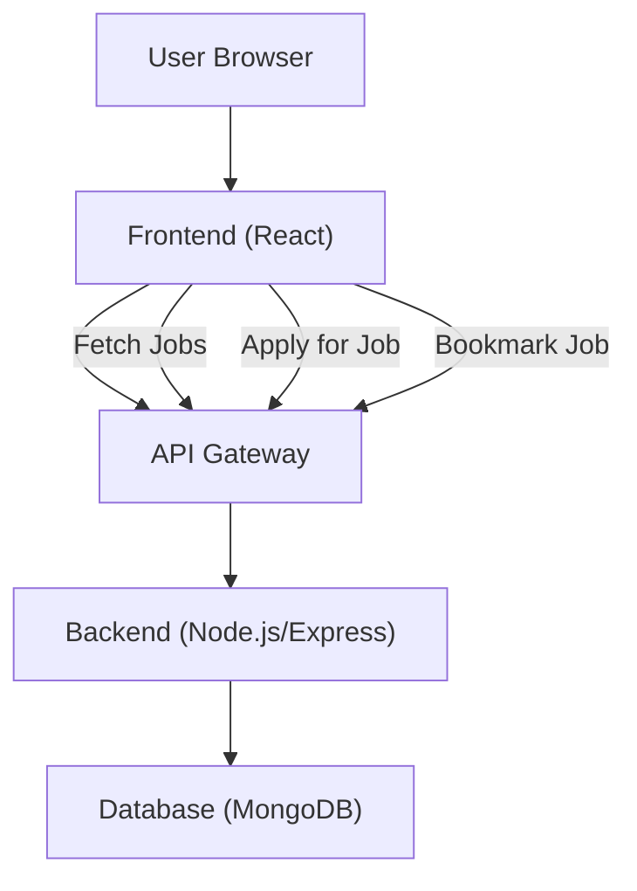

# Job Management

This section details the handling of job creation, display, and the associated data models within the Job Portal application. It covers the backend schema for job postings and the frontend components responsible for rendering and interacting with this job data.

## Job Data Model

The `Jobs` model defines the structure for job postings stored in the database. It includes fields for essential job details, company information, and application-related data.

```javascript
// Backend/models/Jobs.js
const mongoose = require('mongoose');

const jobSchema = new mongoose.Schema({
  jobprofile: {
    type: String,
    required: [true, "Job profile is required"],
    trim: true
  },
  companyusername: {
    type: String,
    required: [true, "Company username is required"],
    trim: true
  },
  location: {
    type: String,
    required: [true, "Location is required"],
    trim: true
  },
  salary: {
    type: Number,
    required: [true, "Salary is required"]
  },
  type: {
    type: String,
    required: [true, "Job type is required"]
  },
  description: {
    type: String,
    required: [true, "Job description is required"]
  },
  requirements: {
    type: String,
    default: "No specific requirements provided"
  },
  deadline: {
    type: Date,
    required: [true, "Application deadline is required"]
  },
  openings: {
    type: Number,
    default: 1 
  },
  experience:{
    type:String,
  },
  appliedCandidatesID:{
    type:Array,
    default:[]
  }
}, 
{
  timestamps: true 
});

const JobsModel = mongoose.model('Jobs', jobSchema);
module.exports = JobsModel;
```

## Job Listing and Display

The frontend components `JobList` and `JobCard` are responsible for fetching, filtering, and displaying job listings to users.

### `JobList` Component

The `JobList` component handles the overall display of jobs, including search functionality, filtering options (location, experience, salary), and rendering individual `JobCard` components.

```jsx
// Frontend/src/components/Jobs/JobList.jsx
import { useEffect, useState } from 'react';
import { useNavigate } from 'react-router-dom';
import JobCard from './JobCard';
import { 
  Search, 
  SlidersHorizontal, 
  MapPin, 
  Briefcase, 
  Wallet,
  ChevronDown,
  ChevronUp
} from 'lucide-react';

const Jobs = ({ jobs, loading }) => {
  const navigate = useNavigate();
  const [searchTerm, setSearchTerm] = useState('');
  const [appliedJobs,setAppliedJobs] = useState([]);
  const [filters, setFilters] = useState({
    salary: 'All',
    experience: 'All',
    location: 'All'
  });
  const [isFilterOpen, setIsFilterOpen] = useState(false);

  // ... (rest of the component code for filtering and rendering)

  const filteredJobs = jobs?.filter(job => {
    const matchesSearch = 
      (job.jobprofile?.toLowerCase() || '').includes(searchTerm.toLowerCase()) ||
      (job.company?.toLowerCase() || '').includes(searchTerm.toLowerCase());
    
    const matchesLocation = filters.location === 'All' || job.location === filters.location;
    const matchesExperience = matchesExperienceRange(job.experience, filters.experience);
    const matchesSalary = matchesSalaryRange(job.salary, filters.salary);

    return matchesSearch && matchesLocation && matchesExperience && matchesSalary;
  }) || [];

  // ... (JSX for rendering search bar, filters, and job cards)
};

export default Jobs;
```

### `JobCard` Component

The `JobCard` component is responsible for displaying the details of a single job posting in a visually appealing card format. It includes options to bookmark a job and apply for it.

```jsx
// Frontend/src/components/Jobs/JobCard.jsx
import {
  MapPin,
  Briefcase,
  IndianRupee,
  BriefcaseBusiness,
  ExternalLink,
  Bookmark,
} from "lucide-react";
import { useState, useEffect } from "react";
import axios from "axios";

const formatSalary = (salary) => {
  // ... (salary formatting logic)
};

const JobCard = ({ job, onApply, appliedJobs }) => {
  const [isBookmarked, setIsBookmarked] = useState(false);
  
  useEffect(() => {
    const bookmarks = JSON.parse(localStorage.getItem("jobBookmarks") || "[]");
    setIsBookmarked(bookmarks.includes(job.companyusername));
  }, [job.companyusername]);

  const handleBookmark = async (jobid) => {
    setIsBookmarked(!isBookmarked);
    console.log(jobid);
    const username = localStorage.getItem("username");
    const response = await axios.post(
      "https://inheritance-project-4kr9.onrender.com/user/jobs",
      {
        jobid,
        username,
      }
    );
  };

  return (
    <div className="bg-white shadow hover:shadow-lg transition-shadow duration-300 rounded-lg p-6">
      <div className="flex justify-between gap-4">
        <div className="flex-1">
          <h2 className="text-xl font-semibold" style={{ color: "#133E87" }}>
            {job.jobprofile}
          </h2>
          <p className="text-gray-600 mt-1 flex items-center gap-2">
            <Briefcase size={16} className="text-gray-400" />
            {job.companyusername}
          </p>
          <div className="flex flex-wrap gap-6 mt-4">
            <div className="flex items-center gap-2 text-gray-600">
              <MapPin size={16} className="text-gray-400" />
              <span>{job.location}</span>
            </div>
            <div className="flex items-center gap-2 text-gray-600">
              <IndianRupee size={16} className="text-gray-400" />
              <span>{formatSalary(job.salary)}</span>
            </div>
            <div className="flex items-center gap-2 text-gray-600">
              <BriefcaseBusiness size={16} className="text-gray-400" />
              <span>{job.experience}</span>
            </div>
          </div>
        </div>
        <div className="flex flex-col gap-3 items-end">
          <button
            onClick={() => handleBookmark(job._id)}
            className={`flex items-center gap-2 px-4 py-2 rounded-lg transition-colors ${
              isBookmarked
                ? "text-[#133E87] bg-[#CBDCEB]"
                : "text-gray-600 hover:bg-[#608BC1] hover:text-white"
            }`}
            aria-label={isBookmarked ? "Saved" : "Save"}
          >
            <Bookmark
              size={18}
              className={`${
                isBookmarked ? "fill-[#133E87] text-[#133E87]" : "text-gray-600"
              }`}
            />
            <span className="text-sm font-medium">
              {isBookmarked ? "Saved" : "Save"}
            </span>
          </button>
          <button
            onClick={() => onApply(job._id)}
            style={{ backgroundColor: "#133E87" }}
            className="px-6 py-2 rounded-lg hover:bg-[#608BC1] transition-colors text-white flex items-center gap-2"
          >
            Apply
            <ExternalLink size={16} />
          </button>
        </div>
      </div>
    </div>
  );
};

export default JobCard;
```

## Architecture Overview

The job management system follows a standard client-server architecture. The backend defines the data model and API endpoints for job operations, while the frontend handles user interaction, data display, and API calls.





## Key Takeaways

*   The `Jobs` model is comprehensive, capturing all necessary details for a job posting.
*   Frontend components are designed for a responsive and interactive user experience, allowing for easy job discovery and application.
*   Filtering and search functionalities enhance the user's ability to find relevant jobs.
*   The bookmarking feature allows users to save jobs for later.