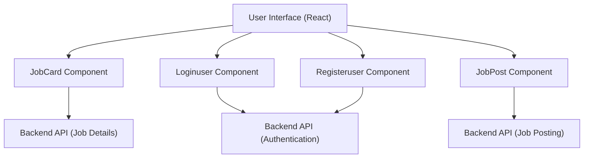

# User Interface Components

This document describes the key React components used to build the user interface for the Job Portal application. These components are responsible for displaying job listings, handling user authentication, and facilitating job postings.

## Key Components

*   **JobCard:** Displays individual job postings with relevant details.
*   **Loginuser:** Handles user login functionality.
*   **Registeruser:** Handles user registration functionality.
*   **JobPost:** Allows employers to create and post new job listings.

## JobCard Component

The `JobCard` component (`Frontend/src/components/Jobs/JobCard.jsx`) is responsible for rendering individual job postings. It displays information such as job title, company name, location, salary, and experience required. It also includes functionality for saving jobs to a user's bookmarks and applying for the job.

**Key Features:**

*   Displays job details in a visually appealing card format.
*   Allows users to bookmark jobs for later viewing.
*   Provides a button for users to apply for the job.
*   Dynamically updates the bookmark icon based on the saved state.

```javascript title="Frontend/src/components/Jobs/JobCard.jsx"
import {
  MapPin,
  Briefcase,
  IndianRupee,
  BriefcaseBusiness,
  ExternalLink,
  Bookmark,
} from "lucide-react";
import { useState, useEffect } from "react";
import axios from "axios";

const JobCard = ({ job, onApply, appliedJobs }) => {
  const [isBookmarked, setIsBookmarked] = useState(false);

  useEffect(() => {
    const bookmarks = JSON.parse(localStorage.getItem("jobBookmarks") || "[]");
    setIsBookmarked(bookmarks.includes(job.companyusername));
  }, [job.companyusername]);

  const handleBookmark = async (jobid) => {
    setIsBookmarked(!isBookmarked);
    const username = localStorage.getItem("username");
    const response = await axios.post(
      "https://inheritance-project-4kr9.onrender.com/user/jobs",
      {
        jobid,
        username,
      }
    );
  };

  return (
    <div className="bg-white shadow hover:shadow-lg transition-shadow duration-300 rounded-lg p-6">
      <div className="flex justify-between gap-4">
        <div className="flex-1">
          <h2 className="text-xl font-semibold" style={{ color: "#133E87" }}>
            {job.jobprofile}
          </h2>

          <p className="text-gray-600 mt-1 flex items-center gap-2">
            <Briefcase size={16} className="text-gray-400" />
            {job.companyusername}
          </p>

          <div className="flex flex-wrap gap-6 mt-4">
            <div className="flex items-center gap-2 text-gray-600">
              <MapPin size={16} className="text-gray-400" />
              <span>{job.location}</span>
            </div>

            <div className="flex items-center gap-2 text-gray-600">
              <IndianRupee size={16} className="text-gray-400" />
              <span>{job.salary}</span>
            </div>

            <div className="flex items-center gap-2 text-gray-600">
              <BriefcaseBusiness size={16} className="text-gray-400" />
              <span>{job.experience}</span>
            </div>
          </div>
        </div>

        <div className="flex flex-col gap-3 items-end">
          <button
            onClick={() => handleBookmark(job._id)}
            className={`flex items-center gap-2 px-4 py-2 rounded-lg transition-colors ${
              isBookmarked
                ? "text-[#133E87] bg-[#CBDCEB]"
                : "text-gray-600 hover:bg-[#608BC1] hover:text-white"
            }`}
            aria-label={isBookmarked ? "Saved" : "Save"}
          >
            <Bookmark
              size={18}
              className={`${
                isBookmarked ? "fill-[#133E87] text-[#133E87]" : "text-gray-600"
              }`}
            />
            <span className="text-sm font-medium">
              {isBookmarked ? "Saved" : "Save"}
            </span>
          </button>

          <button
            onClick={() => onApply(job._id)}
            style={{ backgroundColor: "#133E87" }}
            className="px-6 py-2 rounded-lg hover:bg-[#608BC1] transition-colors text-white flex items-center gap-2"
          >
            Apply
            <ExternalLink size={16} />
          </button>
        </div>
      </div>
    </div>
  );
};

export default JobCard;
```

This code snippet shows the main structure of the `JobCard` component. It utilizes `useState` and `useEffect` hooks to manage the bookmark state and update it based on local storage. The component also uses `axios` to make API requests to save or unsave a job in the user's bookmarks.

[View on GitHub](https://github.com/lande26/Job-Portal/blob/main/Frontend/src/components/Jobs/JobCard.jsx)

```javascript title="formatSalary function"
const formatSalary = (salary) => {
  if (!salary) return "Not Disclosed";

  const inLakhs = salary / 100000;

  if (inLakhs >= 100) {
    const inCrores = inLakhs / 100;
    return `₹${inCrores.toFixed(2)} Cr/year`;
  }

  return `₹${inLakhs.toFixed(2)} L/year`;
};
```

The `formatSalary` function formats the salary amount into a readable string, converting it to Lakhs or Crores based on the value.

[View on GitHub](https://github.com/lande26/Job-Portal/blob/main/Frontend/src/components/Jobs/JobCard.jsx)

## Loginuser Component

The `Loginuser` component (`Frontend/src/components/Pages/Login/LoginJs.jsx`) handles the user login process. It takes user credentials (email and password), sends them to the server for authentication, and stores the authentication token in local storage upon successful login.

**Key Features:**

*   Handles user input for email and password.
*   Sends a POST request to the server for authentication.
*   Stores the authentication token in local storage upon successful login.
*   Redirects the user to the user dashboard after successful login.
*   Displays error messages using `react-hot-toast` for failed login attempts.

```javascript title="Frontend/src/components/Pages/Login/LoginJs.jsx"
import { React, useState } from "react";
import { Link, useNavigate } from "react-router-dom";
import axios from "axios";
import { toast } from "react-hot-toast";
import { useAuthContext } from "../../../hooks/useAuthContext";

const Loginuser = () => {
  const navigate = useNavigate();
  const [email, setEmail] = useState("");
  const [password, setPassword] = useState("");
  const { dispatch } = useAuthContext();

  const emailChange = (event) => {
    setEmail(event.target.value);
  };

  const passwordChange = (event) => {
    setPassword(event.target.value);
  };

  const submitHandler = async (event) => {
    event.preventDefault();

    try {
      const response = await axios.post(
        "https://inheritance-project-4kr9.onrender.com/login/user",
        { email, password },
        {
          headers: {
            "Content-Type": "application/json",
          },
        }
      );

      if (response.data && response.data.token) {
        localStorage.setItem("username", response.data.username);
        localStorage.setItem("accessToken", response.data.token);
        localStorage.setItem("User", "Candidate");

        dispatch({ type: "LOGIN", payload: response.data.token });
        toast.success("Login successful!");

        navigate("/user");
      } else {
        toast.error("Invalid response from server");
        console.error("Invalid response structure:", response.data);
      }
    } catch (error) {
      if (error.response) {
        console.error("Error Response Data:", error.response.data);
        toast.error(error.response.data.message || "Login failed");
      } else if (error.request) {
        console.error("No Response Received:", error.request);
        toast.error(
          "No response from the server. Please check your connection."
        );
      } else {
        console.error("Unexpected Error:", error.message);
        toast.error("An unexpected error occurred. Please try again.");
      }
    }
  };

  return (
    <div className="min-h-screen bg-gradient-to-br from-gray-50 to-gray-100">
      <div
        className="min-h-screen"
        style={{
          backgroundImage: `
          linear-gradient(to right, #e5e7eb 1px, transparent 1px),
          linear-gradient(to bottom, #e5e7eb 1px, transparent 1px)
        `,
          backgroundSize: "4rem 4rem",
        }}
      >
        <div className="auth_main">
          <form onSubmit={submitHandler}>
            <div className="auth_container">
              <div className="auth_header">
                <h1>Login</h1>
              </div>
              <div className="auth_item">
                <label htmlFor="email">Email*</label>
                <input
                  onChange={emailChange}
                  id="email"
                  type="email"
                  placeholder="Enter your email"
                  required
                  value={email}
                />
              </div>
              <div className="auth_item">
                <label htmlFor="password">Password*</label>
                <input
                  onChange={passwordChange}
                  id="password"
                  type="password"
                  placeholder="Enter your password"
                  required
                  value={password}
                />
              </div>
              <button type="submit" className="auth-button">
                Login
              </button>
              <div className="auth_footer">
                <Link to="/register/jobseeker" className="auth-link">
                  Don't have an account? Register
                </Link>
              </div>
            </div>
          </form>
        </div>
      </div>
    </div>
  );
};

export default Loginuser;
```

This code snippet shows the `Loginuser` component. It manages the state for email and password using the `useState` hook and handles form submission. Upon successful authentication, it stores the token in local storage and redirects the user.

[View on GitHub](https://github.com/lande26/Job-Portal/blob/main/Frontend/src/components/Pages/Login/LoginJs.jsx)

## Registeruser Component

The `Registeruser` component (`Frontend/src/components/Pages/SignUp/SignupJs.jsx`) handles user registration. It collects user details (username, email, and password), sends them to the server to create a new user account, and stores the authentication token in local storage upon successful registration.

**Key Features:**

*   Collects user input for username, email, and password.
*   Sends a POST request to the server to register a new user.
*   Stores the authentication token in local storage upon successful registration.
*   Redirects the user to the login page after successful registration.
*   Displays error messages using `react-hot-toast` for failed registration attempts.

```javascript title="Frontend/src/components/Pages/SignUp/SignupJs.jsx"
import { React, useState } from "react";
import "./auth.css";
import axios from "axios";
import { useNavigate } from "react-router-dom";
import { toast } from "react-hot-toast";
import { useAuthContext } from "../../../hooks/useAuthContext";

const Registeruser = () => {
  const navigate = useNavigate();
  const [username, setName] = useState("");
  const [email, setEmail] = useState("");
  const [password, setPassword] = useState("");
  const { dispatch } = useAuthContext();

  const nameChange = (event) => {
    setName(event.target.value);
  };
  const emailChange = (event) => {
    setEmail(event.target.value);
  };
  const passwordChange = (event) => {
    setPassword(event.target.value);
  };
  const submitHandler = async (event) => {
    event.preventDefault();
    try {
      const response = await axios.post(
        "https://inheritance-project-4kr9.onrender.com/register/user",
        {
          username,
          email,
          password,
        },
        {
          headers: {
            "Content-Type": "application/json",
          },
        }
      );

      if (response.data && response.data.token) {
        localStorage.setItem("accessToken", response.data.token);
        localStorage.setItem("username", response.data.username);
        localStorage.setItem("User", "Candidate");

        dispatch({ type: "LOGIN", payload: response.data });
        toast.success("User registered successfully!");
      } else {
        toast.error("Invalid response from server");
        console.error("Invalid response structure:", response.data);
      }

      navigate("/login/jobseeker");
    } catch (error) {
      if (error.response) {
        console.error("Error Response Data:", error.response.data.message); // Log error message
        toast.error(error.response.data.message);
      } else if (error.request) {
        console.error("No Response Received:", error.request);
        toast.error("No response from the server.");
      } else {
        console.error("Unexpected Error:", error.message);
        toast.error("An unexpected error occurred. Please try again.");
      }
    }
  };

  return (
    <div className="min-h-screen bg-gradient-to-br from-gray-50 to-gray-100">
      <div
        className="min-h-screen"
        style={{
          backgroundImage: `
          linear-gradient(to right, #e5e7eb 1px, transparent 1px),
          linear-gradient(to bottom, #e5e7eb 1px, transparent 1px)
        `,
          backgroundSize: "4rem 4rem",
        }}
      >
        <div className="auth_main">
          <form onSubmit={submitHandler}>
            <div className="auth_container">
              <div className="auth_header">
                <h1>Register</h1>
              </div>
              <div className="auth_item">
                <label htmlFor="username">Username*</label>
                <input
                  onChange={nameChange}
                  id="name"
                  type="text"
                  placeholder="Enter your name"
                  required
                />
              </div>
              <div className="auth_item">
                <label htmlFor="email">Email*</label>
                <input
                  onChange={emailChange}
                  id="email"
                  type="email"
                  placeholder="Enter your email"
                  required
                />
              </div>
              <div className="auth_item">
                <label htmlFor="password">Password*</label>
                <input
                  onChange={passwordChange}
                  id="password"
                  type="password"
                  placeholder="Enter your password"
                  required
                />
              </div>
              <button type="submit" className="auth-button">
                Register
              </button>
            </div>
          </form>
        </div>
      </div>
    </div>
  );
};

export default Registeruser;
```

This code snippet shows the `Registeruser` component, which handles the registration of new users. It collects the username, email, and password, and sends them to the server.

[View on GitHub](https://github.com/lande26/Job-Portal/blob/main/Frontend/src/components/Pages/SignUp/SignupJs.jsx)

## JobPost Component

The `JobPost` component (`Frontend/src/components/Others/JobPost.jsx`) allows authenticated employers to post new job listings to the platform. It provides a form with fields for job title, location, description, requirements, salary, and other relevant details. Upon submission, the component sends the job data to the server.

**Key Features:**

*   Provides a form for entering job details.
*   Sends a POST request to the server to create a new job listing.
*   Redirects the employer to the dashboard after successful job posting.
*   Handles input validation and displays appropriate error messages.

```javascript title="Frontend/src/components/Others/JobPost.jsx"
import React from "react";
import { useState } from "react";
import axios from "axios";
import { useNavigate } from "react-router-dom";

const JobPost = () => {
  const navigate = useNavigate();
  const [details, setdetails] = useState({
    jobprofile: "",
    location: "",
    type: "",
    desc: "",
    requirements: "",
    salary: "",
    openings: 0,
    deadline: "",
    experience: "",
  });

  const handlechange = (e) => {
    setdetails({ ...details, [e.target.name]: e.target.value });
  };

  const jwtToken = localStorage.getItem("accessToken");
  const handleSubmit = async () => {
    try {
      const response = await axios.post(
        "https://inheritance-project-4kr9.onrender.com/EDashboard/jobposting",
        {
          details: details,
        },
        {
          headers: {
            Authorization: `Bearer ${jwtToken}`,
          },
        }
      );

      alert("Job has been Posted successfully");
      setdetails({
        jobprofile: "",
        location: "",
        type: "",
        desc: "",
        requirements: "",
        salary: "",
        openings: 0,
        deadline: "",
      });
      navigate("/EDashboard");
    } catch (error) {
      console.log("ERROR", error);
    }
  };
  return (
    <div>
      <div className="heading">
        <h3>Looking to Hire? Post Your Job and Get Noticed</h3>
      </div>

      <div className="max-w-3xl mx-auto p-6 bg-white rounded-lg shadow-lg">
        <form
          className="text-black  space-y-6"
          onSubmit={(e) => e.preventDefault()}
        >
          <div className="grid grid-cols-1 md:grid-cols-2 gap-6">
            <div className="col-span-1">
              <label htmlFor="jobprofile">
                Job Title
              </label>
              <input
                type="text"
                placeholder="Job Title"
                name="jobprofile"
                onChange={(e) => handlechange(e)}
                value={details.jobprofile}
                className="mt-1 p-3 border border-gray-300 rounded-lg w-full focus:ring-2 focus:ring-[#133E85]"
              />
            </div>

            <div className="col-span-1">
              <label htmlFor="location">
                Location
              </label>
              <input
                type="text"
                placeholder="Location"
                name="location"
                onChange={(e) => handlechange(e)}
                value={details.location}
                className="mt-1 p-3 border border-gray-300 rounded-lg w-full focus:ring-2 focus:ring-[#133E85]"
              />
            </div>

            <div className="col-span-1">
              <label htmlFor="type">
                Type Of Job
              </label>
              <input
                type="text"
                placeholder="Job Type"
                name="type"
                onChange={(e) => handlechange(e)}
                value={details.type}
                className="mt-1 p-3 border border-gray-300 rounded-lg w-full focus:ring-2 focus:ring-[#133E85 focus:shadow-md transition-all duration-300 ease-in-out]"
              />
            </div>

            <div className="col-span-1">
              <label htmlFor="desc">
                Job Description
              </label>
              <textarea
                placeholder="Description"
                name="desc"
                onChange={(e) => handlechange(e)}
                value={details.desc}
                className="mt-1 p-3 border border-gray-300 rounded-lg w-full focus:ring-2 focus:ring-[#133E85]"
              />
            </div>
          </div>

          <div className="space-y-6">
            <label htmlFor="requirements">
              Requirements
            </label>
            <textarea
              placeholder="Requirements"
              name="requirements"
              onChange={(e) => handlechange(e)}
              value={details.requirements}
              className="mt-1 p-3 border border-gray-300 rounded-lg w-full focus:ring-2 focus:ring-[#133E85]"
            />

            <label htmlFor="salary">
              Salary
            </label>
            <input
              type="text"
              placeholder="Salary"
              name="salary"
              onChange={(e) => handlechange(e)}
              value={details.salary}
              className="mt-1 p-3 border border-gray-300 rounded-lg w-full focus:ring-2 focus:ring-[#133E85]"
            />

            <label htmlFor="experience">
              Experience Needed
            </label>
            <input
              type="text"
              placeholder="Experience Needed"
              name="experience"
              onChange={(e) => handlechange(e)}
              value={details.experience}
              className="mt-1 p-3 border border-gray-300 rounded-lg w-full focus:ring-2 focus:ring-[#133E85]"
            />

            <label htmlFor="openings">
              Openings
            </label>
            <input
              type="text"
              placeholder="Openings"
              name="openings"
              onChange={(e) => handlechange(e)}
              value={details.openings}
              className="mt-1 p-3 border border-gray-300 rounded-lg w-full focus:ring-2 focus:ring-[#133E85]"
            />

            <label htmlFor="deadline">
              Deadline
            </label>
            <input
              type="date"
              placeholder="Deadline"
              name="deadline"
              onChange={(e) => handlechange(e)}
              value={details.deadline}
              className="mt-1 p-3 border border-gray-300 rounded-lg w-full focus:ring-2 focus:ring-[#133E85]"
            />
          </div>

          <button
            onClick={handleSubmit}
            className="w-full px-4 py-3 bg-[#133E85] rounded-lg text-white font-semibold hover:bg-emerald-700 focus:ring-2 focus:ring-[#133E85]"
          >
            Post Job
          </button>
        </form>
      </div>
    </div>
  );
};

export default JobPost;
```

This code snippet showcases the `JobPost` component, enabling employers to post new job listings. It includes form elements for various job details and handles the submission process.

[View on GitHub](https://github.com/lande26/Job-Portal/blob/main/Frontend/src/components/Others/JobPost.jsx)

```javascript title="Handling form changes"
 const handlechange = (e) => {
    setdetails({ ...details, [e.target.name]: e.target.value });
  };
```

This function is responsible for handling changes in the input fields of the job posting form. It updates the component's state (`details`) whenever a user types into an input field, ensuring that the form data is always up-to-date.

[View on GitHub](https://github.com/lande26/Job-Portal/blob/main/Frontend/src/components/Others/JobPost.jsx)

## Component Interaction Diagram





## Key Integration Points

*   **Authentication Flow:** The `Loginuser` and `Registeruser` components interact with the backend API to authenticate users and store authentication tokens in local storage. The `useAuthContext` hook provides a way to manage authentication state across the application.
*   **Job Data Fetching and Display:** The `JobCard` component fetches job data from the backend API and displays it in a user-friendly format.
*   **Job Posting Flow:** The `JobPost` component allows employers to create and post new job listings, which are then stored in the backend database via an API call.

## Best Practices

*   **Component Reusability:** Design components to be reusable across different parts of the application. The `JobCard` component, for example, can be used in various contexts, such as search results, recommended jobs, and saved jobs.
*   **State Management:** Use React's `useState` hook for local component state and consider using a state management library like Redux or Context API for managing application-wide state, especially for authentication and user data.
*   **Error Handling:** Implement proper error handling in API calls and display informative error messages to the user using libraries like `react-hot-toast`.
*   **Input Validation:** Validate user input in forms to prevent invalid data from being sent to the server.
```