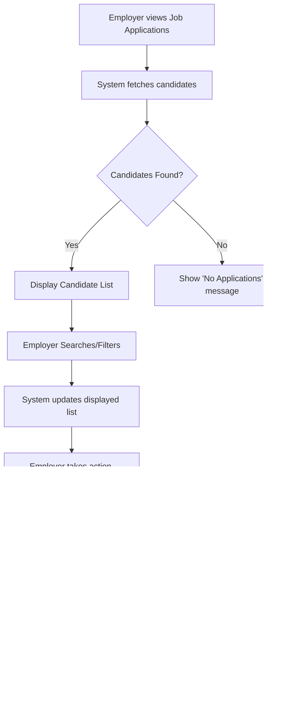

# Application Tracking

This section details the features for managing job applications, allowing users to apply for jobs and employers to track and act upon those applications. It covers the backend models for storing application data and the frontend components for displaying and interacting with applications.

## Application Management (Employer View)

The `JobApplications` component in the frontend provides employers with a dashboard to view and manage candidates who have applied for a specific job. Employers can search for candidates, view their profiles, shortlist or reject them, initiate interviews, and send formal invitations.

The component fetches application data from an API endpoint and dynamically updates the UI based on candidate status.

```jsx
import React, { useState, useEffect } from "react";
import { Link, useParams } from "react-router-dom";
import axios from "axios";
import { FaChevronLeft, FaChevronRight } from "react-icons/fa";
import { FaCheck, FaVideo, FaTimes, FaPaperPlane } from "react-icons/fa";

const JobApplications = () => {
  const [candidates, setCandidates] = useState([]);
  const [searchR, setsearchR] = useState(candidates);
  const [shortlisted, setShortlisted] = useState([]);
  const [rejected, setRejected] = useState([]);
  const [search, setsearch] = useState("");
  const [currPage, setcurrPage] = useState(1);
  const [totalPage, settotalPage] = useState(1);
  const [limit, setlimit] = useState(6);
  const { id } = useParams();
  const [showInviteForm, setShowInviteForm] = useState(false);
  const [inviteData, setInviteData] = useState({
    username: "",
    date: "",
    time: "",
    link: "",
  });

  const fetchCandidates = async () => {
    try {
      const response = await axios.get(
        `https://inheritance-project-4kr9.onrender.com/EDashboard/myjobs/${id}`
      );
      console.log(response.data.candidates);
      const result = response.data.candidates;
      settotalPage(Math.ceil(result.length / limit));
      setCandidates(result || []);
      setsearchR(result || []);
      setShortlisted(response.data.shortlistedcandidates || []);
      setRejected(response.data.rejectedcandidates || []);
    } catch (error) {
      console.error("An Error Occurred", error);
    }
  };
  // ... rest of the component
  return (
    <div className="mt-5 mx-auto w-11/12 lg:w-3/4">
      <h1 className="text-2xl font-bold text-center text-gray-700 mb-6">
        Job Applications
      </h1>
      {/* Search and Filter UI */}
      <div className="flex items-center justify-center mb-2">
        <input
          className="search"
          type="text"
          placeholder="Search Here"
          value={search}
          onChange={(e) => setsearch(e.target.value)}
        />
        <button className="JSbutton" onClick={OnSearch}>
          Search
        </button>
        <button className="JSbutton" onClick={resetSearch}>
          Reset
        </button>
      </div>
      {/* Table to display applications */}
      {searchR.length > 0 ? (
        <table className="table-auto w-full border-collapse border border-gray-300 shadow-md mt-4">
          <thead className="text-center bg-gray-200 text-black">
            <tr>
              <th className="p-4 text-center">Name</th>
              <th className="p-4 text-center">Skills</th>
              <th className="p-4 text-center">Experience</th>
              <th className="p-4 text-center">Actions</th>
              <th className="p-4 text-center">Profile</th>
              <th className="p-4">Take Interview</th>
              <th className="p-43">Send Invite</th>
            </tr>
          </thead>
          <tbody>
            {searchR
              .slice((currPage - 1) * limit, currPage * limit)
              .map((elem, idx) => (
                <tr key={idx} className="bg-white border-b hover:bg-gray-50">
                  <td className="p-3">{elem.username || "Unknown"}</td>
                  <td className="p-3">
                    {elem.skills?.join(", ") || "No skills"}
                  </td>
                  <td className="p-3">{elem.experience || "Not provided"}</td>
                  <td className="p-3">
                    <div className="flex flex-wrap justify-center gap-2">
                      <button
                        onClick={() => handleAction("shortlist", elem.username)}
                        className={`px-3 py-1 rounded ${
                          isShortlisted(elem.username)
                            ? "bg-green-500 hover:bg-green-600 text-white"
                            : "bg-blue-500 hover:bg-blue-600 text-white"
                        }`}
                        disabled={
                          isShortlisted(elem.username) ||
                          isRejected(elem.username)
                        }
                      >
                        {isShortlisted(elem.username) ? (
                          <span>
                            <FaCheck className="inline-block mr-1" />
                          </span>
                        ) : (
                          <FaCheck className="inline-block" />
                        )}
                      </button>

                      {!isShortlisted(elem.username) && (
                        <button
                          onClick={() => handleAction("reject", elem.username)}
                          className={`px-3 py-1 rounded ${
                            isRejected(elem.username)
                              ? "bg-gray-400 text-gray-700 cursor-not-allowed"
                              : "bg-red-500 hover:bg-red-600 text-white"
                          }`}
                          disabled={isRejected(elem.username)}
                        >
                          {isRejected(elem.username) ? (
                            <span>
                              <FaTimes className="inline-block mr-1" /> Rejected
                            </span>
                          ) : (
                            <FaTimes className="inline-block" />
                          )}
                        </button>
                      )}
                    </div>
                  </td>

                  <td className="p-3 text-center">
                    <Link
                      to={`/user/${elem.username}`}
                      className="text-blue-600 no-underline hover:underline"
                    >
                      View Profile
                    </Link>
                  </td>

                  <td className="p-3 text-center">
                    <button
                      onClick={() => handleCreateRoom(elem.username)}
                      className="JSbutton flex items-center justify-center mx-auto space-x-2"
                    >
                      <FaVideo /> <span>Interview</span>
                    </button>
                  </td>

                  <td className="p-3 text-center">
                    <button
                      onClick={(e) => handleSendInvite(e, elem.username)}
                      className="JSbutton flex items-center justify-center mx-auto space-x-2"
                    >
                      <FaPaperPlane /> <span>Invite</span>
                    </button>
                  </td>
                </tr>
              ))}
          </tbody>
        </table>
      ) : (
        <p className="flex justify-center items-center text-gray-600">
          No Candidates Applied for this Job Post
        </p>
      )}

      {/* Pagination */}
      <div className="pagination">
        <button onClick={handlePrevPage} disabled={currPage === 1}>
          <FaChevronLeft></FaChevronLeft>
        </button>
        Page {currPage} of {totalPage}
        <button onClick={handleNextPage} disabled={currPage === totalPage}>
          <FaChevronRight></FaChevronRight>
        </button>
      </div>

      {/* Invite Form */}
      {showInviteForm && (
        <div className="fixed inset-0 bg-gray-600 bg-opacity-50 flex items-center justify-center">
          <div className="bg-white p-6 rounded-lg shadow-lg w-1/3">
            <h2 className="text-xl font-bold mb-4">
              Send Invite to {inviteData.username}
            </h2>
            <form onSubmit={handleInviteSubmit}>
              <input
                type="date"
                className="w-full p-2 border rounded mb-2"
                required
                onChange={(e) =>
                  setInviteData({ ...inviteData, date: e.target.value })
                }
              />
              <input
                type="time"
                className="w-full p-2 border rounded mb-2"
                required
                onChange={(e) =>
                  setInviteData({ ...inviteData, time: e.target.value })
                }
              />
              <input
                type="text"
                placeholder="Meeting Link"
                className="w-full p-2 border rounded mb-2"
                required
                onChange={(e) =>
                  setInviteData({ ...inviteData, link: e.target.value })
                }
              />
              <div className="flex justify-between">
                <button
                  type="submit"
                  className="JSbutton bg-blue-500 text-white px-4 py-2 rounded"
                >
                  Send
                </button>
                <button
                  type="button"
                  onClick={handleCloseForm}
                  className="JSbutton bg-gray-500 text-white px-4 py-2 rounded"
                >
                  Cancel
                </button>
              </div>
            </form>
          </div>
        </div>
      )}
    </div>
  );
};
export default JobApplications;
```

## Backend Data Models

The backend utilizes Mongoose schemas to define the structure of data related to job applications and candidate interactions.

### `reachoutSchema.js`

This schema models candidates who have reached out for a job. It stores the candidate's username and a list of companies they are interested in.

```javascript
const mongoose = require('mongoose');

const ReachOutSchema = new mongoose.Schema({
    username: {
        type: String,
        required: true,
        unique: true
    },
    company: [{
        type: String,
    }]
},
    { timestamps: true }
)

const reachouts = mongoose.model('reachoutcandidates', ReachOutSchema);
module.exports=reachouts;
```

## Application Workflow

The following diagram illustrates a simplified flow of how an employer interacts with job applications through the system.





## Key Takeaways

*   The `JobApplications` component centralizes the management of job applications for employers, offering a comprehensive interface for candidate evaluation.
*   Backend schemas like `reachoutSchema.js` define the data structure for storing application-related information, ensuring data integrity.
*   The frontend employs state management and API calls to provide a dynamic and interactive user experience for managing job applications.
*   Features include searching, filtering, status updates (shortlisted/rejected), profile viewing, interview initiation, and invitation sending.