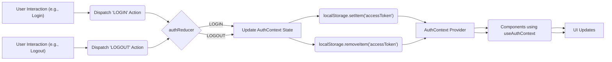
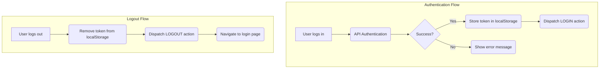

# State Management

This section details how the Job Portal application manages its state, focusing on authentication using React Context. The implementation leverages `authcontext.jsx`, `useAuthContext.jsx`, and `useLogout.jsx` to provide a centralized and accessible authentication state throughout the application.

## Authentication Context

The `AuthContext` provides a global state for managing user authentication. It uses React's `useReducer` hook for state management and stores user authentication tokens in local storage for persistence.

**Key Features:**

*   **Centralized State:** Manages user authentication status across the application.
*   **Reducer-Based:** Utilizes `useReducer` for predictable state updates.
*   **Local Storage Persistence:** Persists user sessions using local storage.

### AuthContext.jsx

```javascript filename="Frontend/src/context/authcontext.jsx"
import React, { useReducer, useEffect, createContext } from "react";

export const AuthContext = createContext();

export const authReducer = (state, action) => {
  switch (action.type) {
    case 'LOGIN':
      return {
        user: action.payload
      };
    case 'LOGOUT':
      return {
        user: null
      }
    default:
      return state
  }
}

export const AuthContextProvider = ({ children }) => {
  const [state, dispatch] = useReducer(authReducer, {
    user: null
  })

  useEffect(() => {
    const user = localStorage.getItem('accessToken')
    if (user) {
      dispatch({ type: 'LOGIN', payload: user })
    }
  }, [])

  return (
    <AuthContext.Provider value={{ ...state, dispatch }}>
      {children}
    </AuthContext.Provider>
  )
}
```

This code defines the `AuthContext` and its provider. The `authReducer` handles `LOGIN` and `LOGOUT` actions. The `AuthContextProvider` initializes the state and persists it using local storage.

[View on GitHub](https://github.com/lande26/Job-Portal/blob/main/Frontend/src/context/authcontext.jsx)

### useAuthContext.jsx

```javascript filename="Frontend/src/hooks/useAuthContext.jsx"
import { AuthContext } from "../context/authcontext";
import { useContext } from 'react'

export const useAuthContext = () => {
  const context = useContext(AuthContext)
  if (!context) {
    throw Error('useAuthContext must be used inside an AuthContextProvider')
  }
  return context
}
```

This hook provides a convenient way to access the `AuthContext` within functional components. It ensures that the component is wrapped within an `AuthContextProvider`.

[View on GitHub](https://github.com/lande26/Job-Portal/blob/main/Frontend/src/hooks/useAuthContext.jsx)

### useLogout.jsx

```javascript filename="Frontend/src/context/useLogout.jsx"
import { useAuthContext } from "../hooks/useAuthContext";
import { useNavigate } from "react-router-dom";

export const useLogout = () => {
  const navigate = useNavigate();
  const { dispatch } = useAuthContext();

  const logout = () => {
    // Remove user from storage
    localStorage.removeItem('accessToken');
    localStorage.removeItem('User');
    localStorage.removeItem('username');

    // Dispatch logout action
    dispatch({ type: 'LOGOUT' });

    // Navigate to the homepage or login page
    navigate('/');
  };

  return { logout };
};
```

The `useLogout` hook provides a `logout` function that removes the user's authentication token from local storage and dispatches a `LOGOUT` action to update the global state, then navigates the user to the home page.

[View on GitHub](https://github.com/lande26/Job-Portal/blob/main/Frontend/src/context/useLogout.jsx)

## State Management Flow

The following diagram illustrates the flow of authentication state management:





## Code Snippets and Explanations

### Reducer Function

```javascript
export const authReducer = (state, action) => {
  switch (action.type) {
    case 'LOGIN':
      return {
        user: action.payload
      };
    case 'LOGOUT':
      return {
        user: null
      }
    default:
      return state
  }
}
```

This reducer function handles the `LOGIN` and `LOGOUT` actions, updating the user state accordingly. The `LOGIN` action sets the user to the payload (typically the authentication token), while the `LOGOUT` action sets the user to `null`.
[View on GitHub](https://github.com/lande26/Job-Portal/blob/main/Frontend/src/context/authcontext.jsx)

### useEffect Hook

```javascript
useEffect(() => {
    const user = localStorage.getItem('accessToken')
    if (user) {
      dispatch({ type: 'LOGIN', payload: user })
    }
  }, [])
```

This `useEffect` hook runs once when the component mounts. It checks for an existing authentication token in local storage. If found, it dispatches a `LOGIN` action to initialize the state.

[View on GitHub](https://github.com/lande26/Job-Portal/blob/main/Frontend/src/context/authcontext.jsx)

### Logout Function
```javascript
 const logout = () => {
        // Remove user from storage
        localStorage.removeItem('accessToken');
        localStorage.removeItem('User');
        localStorage.removeItem('username');
        
        // Dispatch logout action
        dispatch({ type: 'LOGOUT' });

        // Navigate to the homepage or login page
        navigate('/');
    };
```
This `logout` function removes user information from local storage and dispatches the logout action to clear the context. It then navigates the user back to the homepage.

[View on GitHub](https://github.com/lande26/Job-Portal/blob/main/Frontend/src/context/useLogout.jsx)

### Context Hook
```javascript
export const useAuthContext=()=>{
    const context=useContext(AuthContext)
    if(!context){
        throw Error('useAuthContext must be used inside an AuthContextProvider')
    }
    return context
}
```
This code defines a custom hook, `useAuthContext`, that simplifies accessing the `AuthContext`. It uses the `useContext` hook to retrieve the context value and throws an error if used outside of an `AuthContextProvider`. This ensures that components using the hook have access to the authentication context.

[View on GitHub](https://github.com/lande26/Job-Portal/blob/main/Frontend/src/hooks/useAuthContext.jsx)

## Key Integration Points

*   **Login Flow:** Upon successful login, the authentication token is stored in local storage, and a `LOGIN` action is dispatched to update the `AuthContext` state.
*   **Logout Flow:** When the user logs out, the authentication token is removed from local storage, and a `LOGOUT` action is dispatched to clear the `AuthContext` state.
*   **Protected Routes:** Components can use the `useAuthContext` hook to check the user's authentication status and conditionally render content or redirect to a login page.

## Best Practices

*   **Context Provider:** Ensure that all components that need access to the authentication state are wrapped within the `AuthContextProvider`.
*   **Custom Hooks:** Use custom hooks like `useAuthContext` to simplify access to the context and enforce usage within the provider.
*   **Local Storage:** Use local storage for persisting authentication tokens, but be mindful of security implications and consider using more secure storage options for sensitive data.





```
```