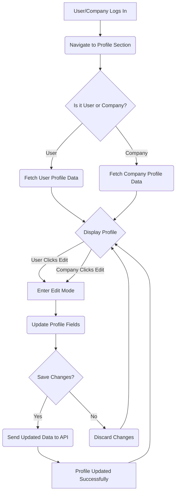

# Company and User Profiles

This section details the management of comprehensive profiles for both companies and individual users within the Job Portal. These profiles store essential information, enabling detailed representation and interaction between employers and job seekers.

## Company Profiles

Company profiles are designed to store detailed information about organizations, including their name, industry, description, contact details, and more.

### Data Model (`Backend/models/companyprofile.js`)

The `CompanyProfile` schema in the backend defines the structure for company data.

```javascript
const mongoose = require("mongoose");

const companySchema = new mongoose.Schema(
  {
    username: { type: String , required: true,default:""},
    companyName: { type: String,default:""},
    industry: { type: String,default:""},
    description: { type: String,default:"" },
    website: { type: String ,default:""},
    email: { type: String, required: true, unique: true,default:"" },
    phone: { type: String,default:"" },
    location: { type: String ,default:""},
    foundedYear: { type: Number,default:"" },
    revenue: { type: String,default:"" },
    linkedin: { type: String ,default:""},
    services: { type: String,default:"" },
    technologies: { type: String,default:"" },
    companypicurl: { type: String ,default:""}
  }
);

const CompanyProfile= mongoose.model("CompanyProfile", companySchema);
module.exports = CompanyProfile
```

### Frontend Management (`Frontend/src/components/companyProfile/Profileform.jsx`)

The `ProfileForm` component in the frontend allows companies to view and edit their profiles. It fetches data from the backend and provides an interactive form for updates.

```jsx
import React, { useState, useEffect } from "react";
import axios from "axios";
import { useParams } from "react-router-dom";

const ProfileForm = () => {
  const [isEditing, setIsEditing] = useState(false);
  const [companyProfile, setCompanyProfile] = useState(null);
  const [loading, setLoading] = useState(false);
  const [error, setError] = useState(null);
  const [saving, setSaving] = useState(false);

  const { username } = useParams();

  useEffect(() => {
    const fetchData = async () => {
      setLoading(true);
      try {
        const response = await axios.get(
          `https://inheritance-project-4kr9.onrender.com/company/${username}`
        );
        setCompanyProfile(response.data);
      } catch (error) {
        setError(error.message || "Failed to fetch data.");
      } finally {
        setLoading(false);
      }
    };

    fetchData();
  }, [username]);

  // ... (rest of the component logic)
};

export default ProfileForm;
```

## User Profiles

User profiles are designed to store detailed information about individual job seekers, including their personal details, education, work experience, skills, and more.

### Data Model (`Backend/models/userprofile.js`)

The `UserProfile` schema in the backend defines the structure for user data.

```javascript
const mongoose = require("mongoose");
const Schema = mongoose.Schema;

const Userprofile = new Schema({
  username: {
    type: String,
    default:""
  },
  name: {
    type: String,
    default:""
  },
  place: {
    type: String,
    default:""
  },
  email: {
    type: String,
    default:""
  },
  phone: {
    type: String,
    default:""
  },
  education: {
    type: String,
    default:""
  },
  workexperices: {
    type: String,
    default:""
  },
  extracirrucular: {
    type: String,
    default:""
  },
  academics: {
    type: String,
    default:""
  },
  skills: {
    type: Array,
    default:""
  },
  currentlyworking: {
    type: String,
    default:""
  },
  opentooffers: {
    type: String,
    default: "yes",
  },
  DOB: {
    type: Date,
    default:""
  },
  notifications: [
    {
      type: {
        type: String,
      },
      message: {
        type: String,
      },
      timestamp: {
        type: Date,
        default: Date.now,
      },
      isRead: {
        type: Boolean,
        default: false,
      },
    },
  ],
});

const UserProfile = mongoose.model("userProfile", Userprofile);
module.exports = UserProfile;
```

### Frontend Management (`Frontend/src/components/userProfile/Profileform.jsx`)

The `UserProfile` component in the frontend allows users to view and edit their profiles. It handles data fetching, state management for editing, and saving changes to the backend.

```jsx
import React, { useState, useEffect } from "react";
import { useParams } from "react-router-dom";
import axios from "axios";
import Button from "./Button.jsx";

const UserProfile = () => {
  const [isEditing, setIsEditing] = useState(false);
  const [userProfile, setUserProfile] = useState(null);
  const [loading, setLoading] = useState(true);
  const [saving, setSaving] = useState(false);
  const [error, setError] = useState(null);
  const { username } = useParams();
  const x=localStorage.getItem("User");

  useEffect(() => {
    const fetchData = async () => {
      setLoading(true);
      try {
        const response = await axios.get(
          `https://inheritance-project-4kr9.onrender.com/user/${username}`
        );
        setUserProfile(response.data);
      } catch (error) {
        setError(error.message || "Failed to fetch data.");
      } finally {
        setLoading(false);
      }
    };

    fetchData();
  }, [username]);

  // ... (rest of the component logic)

  const saveData = async () => {
    if (!userProfile) return;
    const newUserProfile = {
      ...userProfile,
      skills: userProfile.skills.filter((skill) => skill.trim() !== ""),
    };
    setUserProfile(newUserProfile);

    try {
      setSaving(true);
      await axios.put(
        `https://inheritance-project-4kr9.onrender.com/user/${username}`,
        JSON.stringify(newUserProfile),
        { headers: { "Content-Type": "application/json" } }
      );
      alert("Profile updated successfully!");
      setIsEditing(false);
    } catch (error) {
      if (error.response) {
        console.error("Server Error:", error.response.data);
        alert(error.response.data.message || "Failed to update profile.");
      } else if (error.request) {
        console.error("No response from server:", error.request);
        alert("Server is unreachable. Please try again later.");
      } else {
        console.error("Error:", error.message);
        alert("An unexpected error occurred.");
      }
    } finally {
      setSaving(false);
    }
  };

  // ... (rest of the component logic)
};

export default UserProfile;
```

## Profile Management Flow

The following diagram illustrates the flow for managing user and company profiles.





## Key Takeaways

*   Both company and user profiles utilize dedicated Mongoose schemas for structured data storage in the backend.
*   Frontend components are responsible for fetching, displaying, and enabling the editing of profile information.
*   An edit mode toggle allows users to modify their details, with a save functionality that communicates changes to the backend API.
*   Error handling and loading states are implemented in the frontend for a robust user experience.