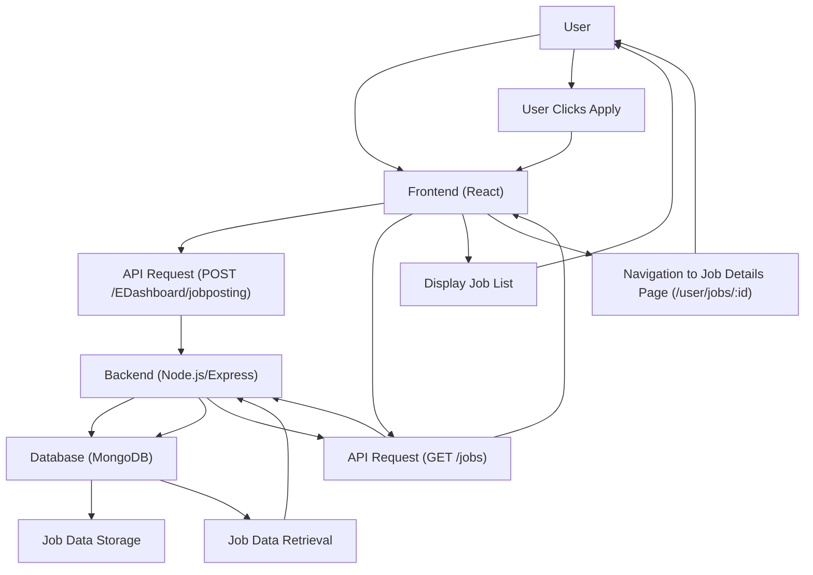

# Core Functionality

This section details the core functionalities of the Job Portal, focusing on job posting, searching, and application processes.

## Job Posting

The Job Portal allows companies to post job openings, providing detailed information about the role. The backend schema defines the structure for job postings, ensuring all necessary fields are captured.

The `JobsModel` in `Backend/models/Jobs.js` outlines the structure for job postings:

```javascript
const mongoose = require('mongoose');

const jobSchema = new mongoose.Schema({
  jobprofile: {
    type: String,
    required: [true, "Job profile is required"],
    trim: true
  },
  companyusername: {
    type: String,
    required: [true, "Company username is required"],
    trim: true
  },
  location: {
    type: String,
    required: [true, "Location is required"],
    trim: true
  },
  salary: {
    type: Number,
    required: [true, "Salary is required"]
  },
  type: {
    type: String,
    required: [true, "Job type is required"]
  },
  description: {
    type: String,
    required: [true, "Job description is required"]
  },
  requirements: {
    type: String,
    default: "No specific requirements provided"
  },
  deadline: {
    type: Date,
    required: [true, "Application deadline is required"]
  },
  openings: {
    type: Number,
    default: 1 
  },
  experience:{
    type:String,
  },
  appliedCandidatesID:{
    type:Array,
    default:[]
  }
}, 
{
  timestamps: true 
});

const JobsModel = mongoose.model('Jobs', jobSchema);
module.exports = JobsModel;
```

The frontend component `JobPost.jsx` facilitates this process by providing a form for users to input job details.

```jsx
import React from "react";
import { useState } from "react";
import axios from "axios";
import { Navigate, useNavigate } from "react-router-dom";

const JobPost = () => {
  const navigate = useNavigate();
  const [details, setdetails] = useState({
    jobprofile: "",
    location: "",
    type: "",
    desc: "",
    requirements: "",
    salary: "",
    openings: 0,
    deadline: "",
    experience: "",
  });

  const handlechange = (e) => {
    setdetails({ ...details, [e.target.name]: e.target.value });
  };

  const jwtToken = localStorage.getItem("accessToken");
  const handleSubmit = async () => {
    console.log(details);
    try {
      const response = await axios.post(
        "https://inheritance-project-4kr9.onrender.com/EDashboard/jobposting",
        {
          details: details,
        },
        {
          headers: {
            Authorization: `Bearer ${jwtToken}`,
          },
        }
      );

      alert("Job has been Posted successfully");
      setdetails({
        jobprofile: "",
        location: "",
        type: "",
        desc: "",
        requirements: "",
        salary: "",
        openings: 0,
        deadline: "",
      });
      navigate("/EDashboard");
    } catch (error) {
      console.log("ERROR", error);
    }
  };
  // ... rest of the JSX
  return (
    <div>
      <div className="heading">
        <h3>Looking to Hire? Post Your Job and Get Noticed</h3>
        <p>
          Reach out to thousands of professionals and get your job seen by the
          right candidates. Create job posts that attract the best talent with
          just a few clicks.
        </p>
      </div>

      <div className="max-w-3xl mx-auto p-6 bg-white rounded-lg shadow-lg">
        <form
          className="text-black  space-y-6"
          onSubmit={(e) => e.preventDefault()}
        >
          {/* ... form fields ... */}
          <button
            onClick={handleSubmit}
            className="w-full px-4 py-3 bg-[#133E85] rounded-lg text-white font-semibold hover:bg-emerald-700 focus:ring-2 focus:ring-[#133E85]"
          >
            Post Job
          </button>
        </form>
      </div>
    </div>
  );
};

export default JobPost;
```

## Job Searching and Filtering

Users can search for jobs and apply filters to narrow down their search results. The `Jobs.jsx` component fetches job data and passes it to `JobList.jsx` for rendering and filtering.

The `JobsPage` component in `Frontend/src/pages/Jobs.jsx` is responsible for fetching job data:

```jsx
import { useState, useEffect } from "react";
import JobList from "../components/Jobs/JobList";
import Backoption from "../components/userProfile/Backoption";
import UserNav from "../components/User/UserNav";
import Footer from "../components/Others/Footer";

const JobsPage = () => {
  const [jobs, setJobs] = useState([]);
  const [loading, setLoading] = useState(false);

  useEffect(() => {
    fetchJobs();
  }, []);

  const fetchJobs = async () => {
    try {
      setLoading(true);
      const response = await fetch(
        "https://inheritance-project-4kr9.onrender.com/jobs"
      );
      const data = await response.json();
      setJobs(data);
    } catch (error) {
      console.error("Error fetching jobs:", error);
    } finally {
      setLoading(false);
    }
  };

  return (
    <div style={{ backgroundColor: "#CBDCEB", minHeight: "100vh" }}>
      <UserNav />
      <JobList jobs={jobs} loading={loading} />
      <Footer />
    </div>
  );
};

export default JobsPage;
```

The `JobList` component in `Frontend/src/components/Jobs/JobList.jsx` handles the search and filter UI.

```jsx
import { useEffect, useState } from 'react';
import { useNavigate } from 'react-router-dom';
import JobCard from './JobCard';
import { 
  Search, 
  SlidersHorizontal, 
  MapPin, 
  Briefcase, 
  Wallet,
  ChevronDown,
  ChevronUp
} from 'lucide-react';

const Jobs = ({ jobs, loading }) => {
  const navigate = useNavigate();
  const [searchTerm, setSearchTerm] = useState('');
  const [appliedJobs,setAppliedJobs] = useState([]);
  const [filters, setFilters] = useState({
    salary: 'All',
    experience: 'All',
    location: 'All'
  });
  const [isFilterOpen, setIsFilterOpen] = useState(false);

  const locations = jobs ? [...new Set(jobs.map(job => job.location))] : [];

  const experiences = [
    'All',
    '0-1 Years',
    '1-3 Years',
    '3-5 Years',
    '5+ Years'
  ];
  
  const salaryRanges = [
    'All',
    '0-10L',
    '10L-20L',
    '20L-30L',
    '30L+'
  ];

  useEffect(() => {
    const storedAppliedJobs = JSON.parse(localStorage.getItem('appliedJobs') || '[]');
    setAppliedJobs(storedAppliedJobs || []);
  }, []);

  const handleApply = (jobid) => {
    console.log(jobid)
    navigate(`/user/jobs/${jobid}`);
  };

  const extractExperienceYears = (experienceStr) => {
    if (!experienceStr) return 0;
    const expString = String(experienceStr);
    const matches = expString.match(/\d+/g);
    if (!matches) return 0;
    return parseInt(matches[0]);
  };

  const matchesExperienceRange = (jobExperience, filterRange) => {
    if (filterRange === 'All') return true;
    if (!jobExperience) return false;
    const years = extractExperienceYears(jobExperience);
    switch(filterRange) {
      case '0-1 Years':
        return years <= 1;
      case '1-3 Years':
        return years > 1 && years <= 3;
      case '3-5 Years':
        return years > 3 && years <= 5;
      case '5+ Years':
        return years > 5;
      default:
        return true;
    }
  };

  const matchesSalaryRange = (jobSalary, filterRange) => {
    if (!jobSalary) return filterRange === 'All';
    const salary = parseInt(jobSalary);
    switch(filterRange) {
      case '0-10L':
        return salary <= 1000000;
      case '10L-20L':
        return salary > 1000000 && salary <= 2000000;
      case '20L-30L':
        return salary > 2000000 && salary <= 3000000;
      case '30L+':
        return salary > 3000000;
      default:
        return true;
    }
  };

  const filteredJobs = jobs?.filter(job => {
    const matchesSearch = 
      (job.jobprofile?.toLowerCase() || '').includes(searchTerm.toLowerCase()) ||
      (job.company?.toLowerCase() || '').includes(searchTerm.toLowerCase());
    
    const matchesLocation = filters.location === 'All' || job.location === filters.location;
    const matchesExperience = matchesExperienceRange(job.experience, filters.experience);
    const matchesSalary = matchesSalaryRange(job.salary, filters.salary);

    return matchesSearch && matchesLocation && matchesExperience && matchesSalary;
  }) || [];

  // ... rest of the JSX for rendering the job list and filters
  return (
    <div className="min-h-screen bg-gradient-to-br from-gray-50 to-gray-100">
      <div 
        className="min-h-screen"
        style={{
          backgroundImage: `
            linear-gradient(to right, #e5e7eb 1px, transparent 1px),
            linear-gradient(to bottom, #e5e7eb 1px, transparent 1px)
          `,
          backgroundSize: '4rem 4rem'
        }}
      >
        <div className="max-w-6xl mx-auto p-4">
          <div className="bg-white shadow-lg rounded-lg p-6 mb-6">
            <div className="flex flex-col md:flex-row gap-4 mb-4">
              <div className="flex-1 relative">
                <Search className="absolute left-3 top-1/2 transform -translate-y-1/2 text-gray-400" size={20} />
                <input
                  type="text"
                  value={searchTerm}
                  onChange={(e) => setSearchTerm(e.target.value)}
                  placeholder="Search jobs or companies..."
                  className="w-full pl-10 pr-4 py-2 border rounded-lg focus:outline-none focus:ring-2 focus:ring-[#133E87]"
                />
              </div>
              <button 
                onClick={() => setIsFilterOpen(!isFilterOpen)}
                className="px-6 py-2 rounded-lg border border-[#133E87] text-[#133E87] hover:bg-gray-50 transition-colors flex items-center gap-2"
              >
                <SlidersHorizontal size={20} />
                Filters 
                {isFilterOpen ? <ChevronUp size={20} /> : <ChevronDown size={20} />}
              </button>
            </div>

            {isFilterOpen && (
              <div className="grid grid-cols-1 md:grid-cols-3 gap-4 mt-4">
                {/* Location Filter */}
                <div>
                  <label className="block text-sm font-medium text-gray-700 mb-1  items-center gap-2">
                    <MapPin size={16} className="text-gray-500" />
                    Location
                  </label>
                  <select
                    value={filters.location}
                    onChange={(e) => setFilters(prev => ({ ...prev, location: e.target.value }))}
                    className="w-full px-3 py-2 border rounded-lg focus:outline-none focus:ring-2 focus:ring-[#133E87]"
                  >
                    <option value="All">All Locations</option>
                    {locations.map(location => (
                      <option key={location} value={location}>{location}</option>
                    ))}
                  </select>
                </div>

                {/* Experience Filter */}
                <div>
                  <label className="block text-sm font-medium text-gray-700 mb-1  items-center gap-2">
                    <Briefcase size={16} className="text-gray-500" />
                    Experience
                  </label>
                  <select
                    value={filters.experience}
                    onChange={(e) => setFilters(prev => ({ ...prev, experience: e.target.value }))}
                    className="w-full px-3 py-2 border rounded-lg focus:outline-none focus:ring-2 focus:ring-[#133E87]"
                  >
                    {experiences.map(exp => (
                      <option key={exp} value={exp}>{exp}</option>
                    ))}
                  </select>
                </div>

                {/* Salary Range Filter */}
                <div>
                  <label className="block text-sm font-medium text-gray-700 mb-1  items-center gap-2">
                    <Wallet size={16} className="text-gray-500" />
                    Salary Range
                  </label>  
                  <select
                    value={filters.salary}
                    onChange={(e) => setFilters(prev => ({ ...prev, salary: e.target.value }))}
                    className="w-full px-3 py-2 border rounded-lg focus:outline-none focus:ring-2 focus:ring-[#133E87]"
                  >
                    {salaryRanges.map(range => (
                      <option key={range} value={range}>{range}</option>
                    ))}
                  </select>
                </div>
              </div>
            )}
          </div>

          <div className="space-y-4">
            {filteredJobs.length === 0 ? (
              <div className="text-center py-8 bg-white rounded-lg shadow">
                <p className="text-gray-600">No jobs match your search criteria.</p>
              </div>
            ) : (
              filteredJobs.map((job) => (
                <JobCard
                  key={job._id}
                  job={job}
                  onApply={handleApply}
                  appliedJobs={appliedJobs}
                />
              ))
            )}
          </div>
        </div>
      </div>
    </div>
  );
};

export default Jobs;
```

## Job Applications

The job application process is initiated when a user clicks the "Apply" button on a job listing. This navigates the user to a specific job details page where they can proceed with their application. The `handleApply` function in `JobList.jsx` manages this navigation.

```jsx
  const handleApply = (jobid) => {
    console.log(jobid)

    navigate(`/user/jobs/${jobid}`);
  };
```

## Architecture Overview

The core functionality of the Job Portal can be visualized as a flow from user interaction on the frontend to data persistence in the backend.





## Key Takeaways

*   **Model-Driven Design**: The `Jobs.js` model provides a robust schema for job postings, ensuring data integrity.
*   **Component-Based UI**: React components like `JobPost.jsx` and `JobList.jsx` encapsulate specific functionalities, leading to a modular and maintainable frontend.
*   **State Management**: Frontend components effectively manage state for search terms, filters, and applied jobs using `useState`.
*   **API Integration**: Clear separation of concerns between frontend and backend is achieved through API calls for job posting and retrieval.
*   **User Experience**: Features like dynamic filtering and clear navigation enhance the user experience for both job seekers and employers.