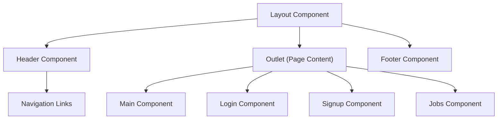

# Frontend Structure and Components

This document outlines the structure and components of the frontend for the Job-Portal application. It aims to provide a clear understanding of how the user interface is organized and the purpose of different UI elements.

## Overview

The frontend is built using React, utilizing components for modularity and reusability. Styling is primarily handled through CSS, with some components leveraging Tailwind CSS for utility-first styling. The application uses React Router for navigation between different pages and sections.

## Core Files and Their Functions

*   **`Frontend/src/App.css`**: This file contains the global CSS styles for the entire application, defining the overall look and feel.
*   **`Frontend/src/main.jsx`**: This is the entry point of the React application. It initializes the router, renders the main layout, and sets up the application context.
*   **`Frontend/src/components/Layout/Layout.jsx`**: This component defines the overall layout of the application, including the header, footer, and outlet for rendering page-specific content.
*   **`Frontend/src/index.css`**: This file imports Tailwind CSS and defines some base styles for the application.

## Global Styles (`Frontend/src/App.css`)

The `App.css` file sets the basic styling for the application, including font family and background color. It also defines styles for commonly used elements like buttons and containers.

```css
body {
  font-family:'Segoe UI', Tahoma, Geneva, Verdana, sans-serif;
  background-color: #936262;

}
.container{
  height: 100vh;
  width: 100vw;
}
```

[View on GitHub](https://github.com/lande26/Job-Portal/blob/main/Frontend/src/App.css)

This snippet sets the default font and background color for the entire application. The `.container` class is used to define the dimensions of the main content area.

### Button Styling

The `App.css` also styles the buttons for a consistent look and feel.

```css
button {
  display: inline-block;
  color: white;
  padding: 0.5rem;
  margin-top: 0.8rem;
  border-radius: 0.5rem;
  cursor: pointer;
  border: none;
  transition: background-color 0.3s ease;
}

button:hover {
  background-color: #1A1F36;
  color: white;
  box-shadow: 0 8px 16px rgba(0, 0, 0, 0.1);
  text-decoration: none;
}

button:focus {
  outline: none;
}
```

[View on GitHub](https://github.com/lande26/Job-Portal/blob/main/Frontend/src/App.css)

This CSS provides a consistent style for buttons throughout the application. The `:hover` state provides visual feedback to the user.

## Entry Point (`Frontend/src/main.jsx`)

The `main.jsx` file is the starting point for the React application. It sets up the router and renders the main layout.

```javascript
import { StrictMode } from 'react';
import { createRoot } from 'react-dom/client';
import './index.css';
import './App.css';
import { RouterProvider, createBrowserRouter } from 'react-router-dom';
import 'bootstrap/dist/css/bootstrap.min.css';
import Layout from './components/Layout/Layout.jsx';
import Main from './components/Others/Main.jsx';


const router = createBrowserRouter([
  {
    path: '/',
    element: <Layout />,
    children: [
      {
        path: '',
        element: <Main />,
      },
      {
        path: '/about',
        element: <About />,
      },
    ],
  },

  {
    path: '/login/jobseeker',
    element: <LoginUser />,
  },

  {
    path: '/login/employer',
    element: <LoginE />,
  },


]);

// Render the app
createRoot(document.getElementById('root')).render(
  <StrictMode>
    
      <RouterProvider router={router} />
   

  </StrictMode>
);
```

[View on GitHub](https://github.com/lande26/Job-Portal/blob/main/Frontend/src/main.jsx)

This code sets up the React Router and defines the routes for the application. The `<Layout>` component is used as the base layout for the main routes.

## Layout Component (`Frontend/src/components/Layout/Layout.jsx`)

The `Layout` component is responsible for rendering the overall structure of the application, including the header and footer.

```javascript
import React from 'react'
import Header from '../Others/Header'
import { Outlet } from 'react-router-dom'
import Footer from '../Others/Footer'

const Layout = () => {
  return (
    <div className=''>
      <Header></Header>
      <Outlet></Outlet>
      <footer>
        <Footer></Footer>

      </footer>
    </div>
  )
}

export default Layout
```

[View on GitHub](https://github.com/lande26/Job-Portal/blob/main/Frontend/src/components/Layout/Layout.jsx)

The `<Outlet>` component is used to render the content of the current route within the layout.

## Index CSS (`Frontend/src/index.css`)

The `index.css` file imports Tailwind CSS and defines some base styles for the application.

```css
@tailwind base;
@tailwind components;
@tailwind utilities;

@layer base{
    body{
        background-color:white;
    }
}
```

[View on GitHub](https://github.com/lande26/Job-Portal/blob/main/Frontend/src/index.css)

This CSS configures Tailwind CSS for the project and sets the default background color for the `body` element.

## Component Structure

The frontend is structured using a component-based architecture. Some key components include:

*   **Header**: The header component displays the navigation bar and logo.
*   **Footer**: The footer component displays copyright information and links.
*   **Main**: The main component displays the landing page content.
*   **Login**: The login components handle user authentication.
*   **Signup**: The signup components handle user registration.
*   **Jobs**: The Jobs components displays a list of available jobs.





## Responsiveness

The CSS includes media queries to ensure the application is responsive and adapts to different screen sizes.

```css
@media (max-width:763px) {
  .i {
    height: 30px;
  }

  .Main {
    height: auto;
    flex-direction: column;
    text-align: center;
  }

  .candidates,
  .company {
    width: 90%;
    height: 40%;
  }

  .cards-button {
    display: flex;
    justify-content: space-evenly;
    transform: scale(0.9);
  }

  .header {
    flex-direction: column;
  }
  .main-image{
    display: none;
  }
  .tagline{
    font-size: xx-large;
    padding-top: 1px;
    padding-bottom: 1px;
  }

  .heading h3{
    font-size: large;
  }
  .heading p{
    font-size: medium;
    width: 90%;
  }
  .candidatesFilterbuttons{
    flex-direction: column;
}
.search{
  width: 50%;
}

.filterbtns{
    width: 100%;
    margin: 0.5rem 0;
}
.menu-icon {
  display: block; 
}

.enavbarlinks {
  display: none;
}

.sidebar{
  display: flex;
  transform: translateX(0);
  
  
}


}
```

[View on GitHub](https://github.com/lande26/Job-Portal/blob/main/Frontend/src/App.css)

This media query adjusts the layout and styling for smaller screens, ensuring a good user experience on mobile devices.

## Key Integration Points

*   **React Router:** The application uses React Router to manage navigation between different pages. The `createBrowserRouter` function is used to define the routes.
*   **Component Communication:** Components communicate with each other using props and context. The `AuthContextProvider` provides authentication context to the application.
*   **API Integration:** The frontend interacts with the backend API to fetch and submit data. This involves making HTTP requests to the API endpoints.
*   **State Management:** The application uses React's built-in state management capabilities, along with context, to manage the application state.

## Best Practices

*   **Component Reusability:** The application is designed with reusable components to promote maintainability and reduce code duplication.
*   **CSS Styling:** CSS is used for styling, with a focus on creating a consistent look and feel across the application.
*   **Responsive Design:** Media queries are used to ensure the application is responsive and adapts to different screen sizes.
*   **Error Handling:** Error handling is implemented to gracefully handle errors and provide informative messages to the user.
```
```