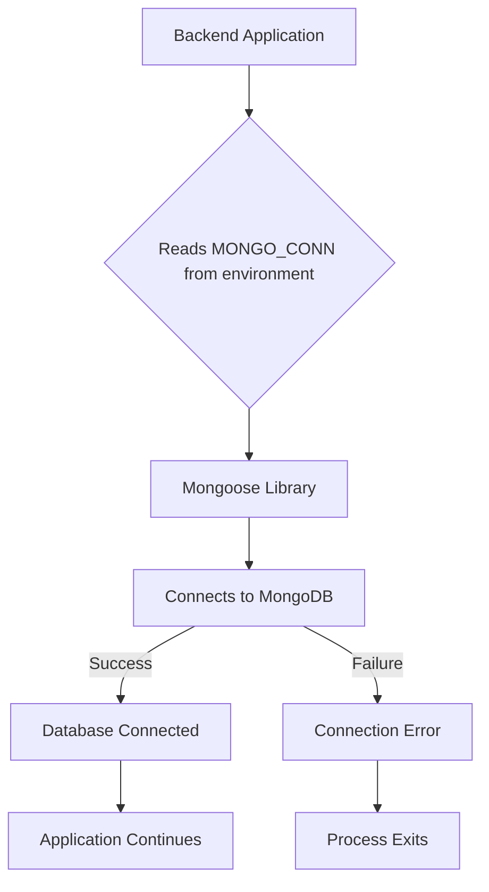

# Database Connection

This section details the configuration and setup required to establish a connection to the application's database, managed by MongoDB.

## Connection String Configuration

The application utilizes an environment variable, `MONGO_CONN`, to store the MongoDB connection string. This is a standard practice for managing sensitive credentials and connection details securely.

```javascript
const mongo_url = process.env.MONGO_CONN;
```

## Establishing the Database Connection

The `connectDB` function, implemented in `Backend/models/db.js`, handles the connection logic. It uses the Mongoose library to connect to the MongoDB instance specified by the `mongo_url`.

```javascript
const connectDB = async () => {
    try {
        await mongoose.connect(mongo_url, {
            
        });
        console.log(" MongoDB Connected");
    } catch (error) {
        console.error(" MongoDB Connection Error:", error);
        process.exit(1);
    }
};
```

This function is designed to be asynchronous and will log a success message to the console upon successful connection. In case of any connection errors, it will log the error details and terminate the process to prevent further issues.

## Exporting the Connection Function

The `connectDB` function is exported from the module, allowing other parts of the backend application to import and utilize it for database operations.

```javascript
module.exports = {connectDB}
```

## Database Connection Flow

The following diagram illustrates the process of establishing a database connection.





## Key Takeaways

*   Database connection details are managed via the `MONGO_CONN` environment variable.
*   The `connectDB` function, using Mongoose, is responsible for establishing the connection.
*   Error handling is implemented to gracefully manage connection failures.
*   The `connectDB` function is exported for use throughout the backend.